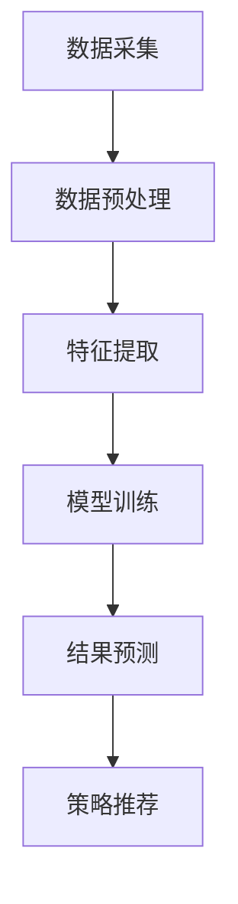
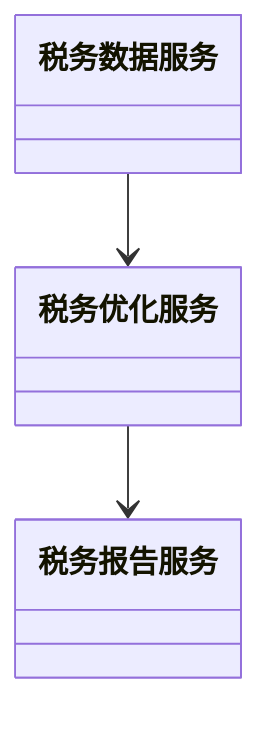
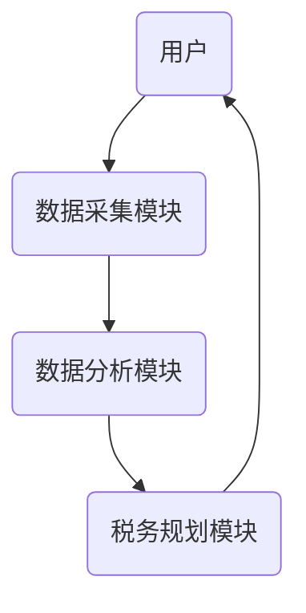

                 


# 构建智能化的个人税务筹划情景模拟助手

## 关键词
- 人工智能
- 大数据
- 税务筹划
- 智能化系统
- 情景模拟

## 摘要
本文旨在探讨如何利用人工智能和大数据技术构建智能化的个人税务筹划情景模拟助手。文章从税务筹划的背景和意义出发，详细分析了智能化税务筹划的核心概念、算法原理、系统架构以及项目实现过程。通过结合数学模型和实际案例，本文提出了一个基于AI的税务优化方案，并通过系统设计和代码实现展示了其可行性和有效性。文章最后总结了研究成果，并展望了未来的发展方向。

---

## 第一部分: 智能化个人税务筹划的背景与意义

### 第1章: 个人税务筹划的智能化需求

#### 1.1 税务筹划的背景与重要性
##### 1.1.1 税务筹划的基本概念
税务筹划是指通过合法手段，优化个人或企业的税务负担，实现税后收益最大化的过程。在个人财务管理中，税务筹划可以帮助降低税负、提高资金利用效率。

##### 1.1.2 个人税务筹划的必要性
随着经济的发展和税收政策的复杂化，个人税务筹划变得尤为重要。通过智能化手段，可以更高效地分析税务政策、优化收入结构、降低税务风险。

##### 1.1.3 智能化税务筹划的时代背景
人工智能和大数据技术的快速发展为税务筹划提供了新的工具和方法。智能化税务筹划助手能够实时分析税务政策、预测税务风险、推荐最优税务方案，从而帮助个人做出更明智的财务决策。

---

### 第2章: 个人税务筹划的核心概念与联系

#### 2.1 税务筹划的核心概念
##### 2.1.1 税收政策与法规
税务筹划需要遵守国家的税收政策和法规，确保所有操作的合法性。不同国家和地区的税收政策差异较大，因此需要对相关政策进行深入分析。

##### 2.1.2 税务优化的策略
税务优化策略包括收入优化、支出优化、税务抵扣优化等。通过合理分配收入和支出，可以有效降低税负。

##### 2.1.3 税务风险的控制
税务风险是指在税务筹划过程中可能面临的法律风险、财务风险和操作风险。通过建立风险控制机制，可以有效降低税务风险。

#### 2.2 核心概念的联系与ER实体关系图
##### 2.2.1 实体关系图（ER图）展示
```mermaid
erDiagram
    person {
        key id : integer
        name : string
        income : decimal
        taxLiability : decimal
        taxPlan : plan
    }
    plan {
        id : integer
        strategy : string
        expectedTax : decimal
        riskLevel : string
    }
    person --> plan : "制定"
    plan --> person : "实施"
```

##### 2.2.2 数据流与业务流程分析
税务筹划的核心流程包括数据采集、数据分析、策略制定和策略实施。通过ER图可以看出，个人与税务计划之间存在双向的交互关系。

##### 2.2.3 系统核心模块的功能描述
系统核心模块包括数据采集模块、数据分析模块和策略制定模块。每个模块的功能如下：
- 数据采集模块：收集个人的收入、支出和税务相关信息。
- 数据分析模块：对数据进行清洗、建模和分析。
- 策略制定模块：基于分析结果，制定最优税务策略。

---

## 第二部分: 智能化税务筹划的算法与数学模型

### 第3章: 智能化税务筹划的算法原理

#### 3.1 基于AI的税务推荐算法
##### 3.1.1 算法概述
基于AI的税务推荐算法通过机器学习模型，分析历史数据，预测未来的税务风险，并推荐最优的税务策略。

##### 3.1.2 算法实现流程


##### 3.1.3 算法的数学模型
算法的核心是基于机器学习的回归模型，公式如下：
$$
y = \beta_0 + \beta_1x_1 + \beta_2x_2 + \dots + \beta_nx_n + \epsilon
$$
其中，$y$ 是目标变量，$x_i$ 是自变量，$\beta_i$ 是回归系数，$\epsilon$ 是误差项。

#### 3.2 基于优化模型的税务规划
##### 3.2.1 线性规划模型
线性规划模型用于优化税后收益，目标函数为：
$$
\text{max} \quad z = c_1x_1 + c_2x_2 + \dots + c_nx_n
$$
约束条件为：
$$
\begin{cases}
a_{11}x_1 + a_{12}x_2 + \dots + a_{1n}x_n \leq b_1 \\
a_{21}x_1 + a_{22}x_2 + \dots + a_{2n}x_n \leq b_2 \\
\vdots \\
a_{m1}x_1 + a_{m2}x_2 + \dots + a_{mn}x_n \leq b_m \\
x_i \geq 0
\end{cases}
$$

##### 3.2.2 非线性规划模型
非线性规划模型用于更复杂的优化问题，目标函数和约束条件均为非线性。

##### 3.2.3 混合整数规划模型
混合整数规划模型结合了连续变量和整数变量，适用于需要考虑多种约束条件的税务优化问题。

---

### 第4章: 项目实战与代码实现

#### 4.1 环境搭建与工具安装
##### 4.1.1 Python环境配置
安装Python和必要的库，如NumPy、Pandas、Scikit-learn等。

##### 4.1.2 数据库安装与配置
选择合适的数据库，如MySQL或MongoDB，并配置好数据连接。

##### 4.1.3 开发工具安装
安装IDE，如PyCharm或Jupyter Notebook，用于代码开发和调试。

#### 4.2 核心代码实现
##### 4.2.1 数据采集与处理代码
```python
import pandas as pd
import numpy as np

# 数据采集
data = pd.read_csv('tax_data.csv')

# 数据预处理
data.dropna(inplace=True)
data['tax'] = data['income'] * 0.3  # 示例税率
```

##### 4.2.2 税务推荐算法代码
```python
from sklearn.linear_model import LinearRegression

model = LinearRegression()
model.fit(X_train, y_train)
y_pred = model.predict(X_test)
```

##### 4.2.3 税务优化模型代码
```python
from scipy.optimize import minimize

def tax_optimization(x):
    return -(c1*x1 + c2*x2 + ... + cn*xn)

constraints = [{'type': 'ineq', 'fun': lambda x: a1*x1 + a2*x2 - b <= 0}]
result = minimize(tax_optimization, initial_guess, constraints)
```

---

## 第三部分: 系统架构与设计方案

### 第5章: 系统架构设计

#### 5.1 系统功能模块设计
##### 5.1.1 数据采集模块
负责采集个人的收入、支出和税务相关信息。

##### 5.1.2 数据分析模块
对采集到的数据进行清洗、建模和分析，生成税务优化方案。

##### 5.1.3 税务规划模块
根据分析结果，制定最优税务策略，并输出结果。

#### 5.2 系统架构设计
##### 5.2.1 分层架构设计


##### 5.2.2 微服务架构设计


##### 5.2.3 数据流与交互设计


---

## 第四部分: 总结与展望

### 第6章: 总结与展望

#### 6.1 研究成果总结
本文提出了一种基于AI的个人税务筹划情景模拟助手，通过数据分析和优化算法，实现了税务优化方案的制定。

#### 6.2 未来发展方向
未来可以进一步研究更复杂的优化模型，探索多目标优化和动态优化问题，同时结合区块链技术，提高系统的安全性和可信度。

---

## 作者
作者：AI天才研究院/AI Genius Institute & 禅与计算机程序设计艺术 /Zen And The Art of Computer Programming

