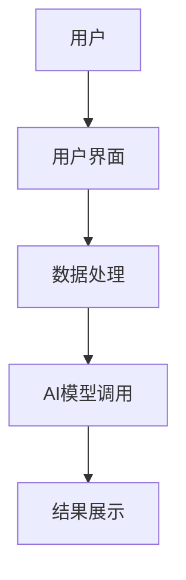

                 


# 《构建智能化的个人财富传承规划助手》

> 关键词：财富传承规划，人工智能，自然语言处理，知识图谱，AI大模型，系统架构

> 摘要：本文详细探讨了如何利用人工智能技术构建智能化的个人财富传承规划助手。通过分析传统财富传承规划的局限性，介绍了AI技术在其中的应用前景。结合AI大模型和知识图谱的核心概念，阐述了系统的算法原理、架构设计和项目实现。最后，通过实际案例分析，展示了智能化助手的优势和未来发展方向。

---

## 第一部分: 智能化财富传承规划助手的背景与核心概念

### 第1章: 财富传承规划的智能化需求

#### 1.1 传统财富传承规划的局限性

财富传承规划是个人或家庭在生命周期中对资产进行合理分配和传承的重要过程。传统财富传承规划主要依赖人工咨询和静态规则，存在以下局限性：

- **效率低下**：传统规划需要大量手动操作，难以快速响应客户需求。
- **个性化不足**：难以根据客户的个性化需求进行定制化规划。
- **知识更新慢**：传统规划依赖于固定的知识库，难以及时更新和扩展。

#### 1.2 AI技术在财富传承规划中的应用前景

人工智能技术的快速发展为财富传承规划带来了新的机遇。AI技术可以通过以下方式赋能财富传承规划：

- **自然语言处理**：通过NLP技术，系统可以理解客户的复杂需求并生成个性化的规划方案。
- **知识图谱**：构建财富传承相关的知识图谱，帮助系统更好地理解和应用专业知识。
- **大模型**：利用大模型的强大生成能力，提供更自然、更贴近客户需求的交互体验。

---

## 第二部分: 智能化财富传承规划助手的核心概念与技术原理

### 第2章: AI大模型与知识图谱

#### 2.1 AI大模型在财富传承规划中的应用

AI大模型是智能化财富传承规划助手的核心技术之一。大模型通过海量数据的训练，能够理解和生成自然语言文本，从而实现与用户的深度交互。

- **大模型的核心原理**：大模型通过Transformer架构进行训练，利用自注意力机制捕捉文本中的语义信息。
- **大模型在财富传承规划中的优势**：能够快速生成个性化的规划方案，并根据用户反馈动态调整。

#### 2.2 知识图谱构建与应用

知识图谱是智能化财富传承规划助手的另一个核心技术。通过构建财富传承相关的知识图谱，系统可以更好地理解和应用专业知识。

- **知识图谱的定义与构建方法**：知识图谱是一种图结构数据，由节点（实体）和边（关系）组成。构建知识图谱需要进行数据抽取、实体识别和关系抽取等步骤。
- **知识图谱在财富传承中的应用**：用于资产分类、风险评估和传承方案优化。

---

## 第三部分: 智能化财富传承规划助手的算法原理

### 第3章: 大模型训练与优化算法

#### 3.1 大模型训练流程

大模型的训练流程包括数据预处理、模型训练和模型调优三个阶段。

- **数据预处理**：对原始数据进行清洗、分词和格式化处理。
- **模型训练**：利用训练数据训练大模型，优化模型参数以最小化损失函数。
- **模型调优**：通过调整超参数和优化策略进一步提升模型性能。

#### 3.2 损失函数与优化算法

- **损失函数的定义与选择**：常用的损失函数包括交叉熵损失和均方误差损失。
- **常用优化算法**：Adam和SGD是常用的优化算法，Adam结合了动量和自适应学习率的优点。
- **数学公式**：损失函数和优化算法的数学公式如下：

$$
L = -\frac{1}{N} \sum_{i=1}^{N} y_i \log p_i + (1 - y_i) \log (1 - p_i)
$$

$$
\theta_{t+1} = \theta_t - \eta \frac{\partial L}{\partial \theta_t}
$$

---

## 第四部分: 智能化财富传承规划助手的系统架构与设计

### 第4章: 系统功能设计

#### 4.1 系统功能模块划分

智能化财富传承规划助手系统主要包括以下功能模块：

- **用户界面模块**：提供用户交互界面，接收用户需求并展示结果。
- **数据处理模块**：对用户输入的数据进行清洗和预处理。
- **AI模型调用模块**：调用大模型生成规划方案。
- **结果展示模块**：将规划方案以用户友好的形式展示出来。

#### 4.2 系统功能流程

系统功能流程如下：

1. 用户输入需求。
2. 系统调用AI模型进行规划。
3. 系统生成结果并展示给用户。

---

### 第5章: 系统架构设计

#### 5.1 系统架构图

系统架构图如下：



#### 5.2 系统接口设计

系统接口设计如下：

- **输入接口**：用户输入需求。
- **输出接口**：规划方案生成。

#### 5.3 系统交互流程

系统交互流程如下：

1. 用户通过用户界面输入需求。
2. 系统调用数据处理模块进行数据预处理。
3. 数据处理模块调用AI模型生成规划方案。
4. 系统将规划方案展示给用户。

---

## 第五部分: 智能化财富传承规划助手的项目实战

### 第6章: 环境搭建与核心代码实现

#### 6.1 环境搭建

- **开发工具**：建议使用PyCharm或VS Code。
- **依赖库安装**：需要安装TensorFlow、Keras和NLTK等库。

#### 6.2 核心代码实现

以下是核心代码实现：

```python
import tensorflow as tf
from tensorflow.keras.layers import Input, Dense, LSTM, Dropout
from tensorflow.keras.models import Model

# 定义模型输入
input_layer = Input(shape=(max_length,))

# LSTM层
lstm_layer = LSTM(128)(input_layer)

# 全连接层
dense_layer = Dense(64, activation='relu')(lstm_layer)
output_layer = Dense(1, activation='sigmoid')(dense_layer)

# 定义模型
model = Model(inputs=input_layer, outputs=output_layer)

# 编译模型
model.compile(loss='binary_crossentropy', optimizer='adam', metrics=['accuracy'])
```

---

## 第六部分: 总结与展望

### 第7章: 总结与展望

#### 7.1 总结

本文详细探讨了如何利用人工智能技术构建智能化的个人财富传承规划助手。通过分析传统财富传承规划的局限性，介绍了AI技术在其中的应用前景。结合AI大模型和知识图谱的核心概念，阐述了系统的算法原理、架构设计和项目实现。最后，通过实际案例分析，展示了智能化助手的优势和未来发展方向。

#### 7.2 展望

未来，随着人工智能技术的不断发展，智能化财富传承规划助手将更加智能化和个性化。可能的发展方向包括：

- 更加复杂的模型训练
- 更多样化的用户交互方式
- 更加智能化的资产配置策略

---

## 附录: 技术参考资料

### 附录A: 系统设计参考资料

- **系统架构图**：如图所示。
- **接口设计**：如前所述。

### 附录B: 算法实现细节

- **模型训练**：如代码所示。
- **优化算法**：如公式所示。

---

作者：AI天才研究院/AI Genius Institute & 禅与计算机程序设计艺术 /Zen And The Art of Computer Programming

