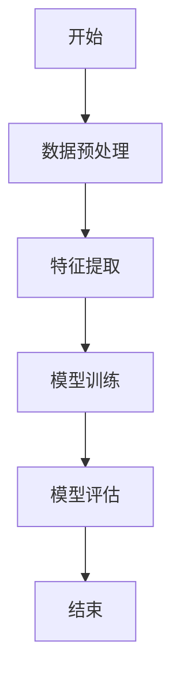
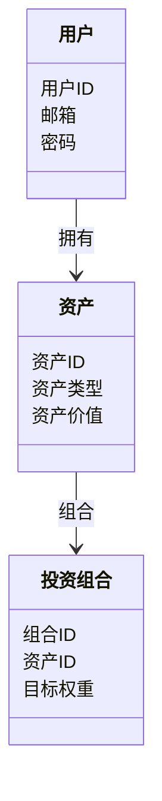

                 


# 构建智能化的个人财富管理目标动态调整助手

> 关键词：人工智能、财富管理、动态调整、机器学习、自然语言处理、强化学习

> 摘要：本文详细探讨了构建智能化的个人财富管理目标动态调整助手的方法，涵盖背景分析、核心概念、算法原理、系统架构设计、项目实战和最佳实践。通过结合机器学习和自然语言处理技术，提出了一种基于用户行为分析和市场反馈的动态调整机制，旨在帮助用户实现个性化的财富管理目标。

---

## 第一部分: 智能化个人财富管理目标动态调整助手的背景与核心概念

### 第1章: 财富管理目标动态调整的背景与问题描述

#### 1.1 问题背景

##### 1.1.1 传统财富管理的局限性
传统的财富管理主要依赖人工服务，存在以下问题：
- **信息孤岛**：客户和顾问之间的信息传递不及时，难以捕捉市场变化。
- **效率低下**：人工分析耗时，难以满足个性化需求。
- **静态调整**：目标设定后缺乏动态调整机制，难以应对市场波动。

##### 1.1.2 数字化与智能化时代的财富管理需求
随着人工智能和大数据技术的发展，财富管理行业亟需智能化转型，以满足以下需求：
- **实时反馈**：快速响应市场变化和用户需求。
- **个性化服务**：根据用户的实时行为和市场反馈调整策略。
- **高效决策**：通过自动化分析提高效率。

##### 1.1.3 动态调整在财富管理中的重要性
动态调整能够帮助用户在市场波动中及时优化投资组合，降低风险，提高收益。例如，在2020年新冠疫情爆发期间，及时调整投资策略的用户能够减少损失。

#### 1.2 问题描述

##### 1.2.1 财富管理目标的核心要素
财富管理目标包括资产配置、风险承受能力和收益预期三个核心要素。例如，用户可能设定的目标是将资产的60%投资于股票，20%投资于债券，20%用于现金储备。

##### 1.2.2 目标动态调整的触发条件
动态调整的触发条件包括市场波动、用户行为变化和外部事件（如经济危机）。例如，当市场出现剧烈波动时，系统会触发调整机制。

##### 1.2.3 动态调整中的关键挑战
- **数据隐私**：用户数据的安全性问题。
- **算法复杂性**：如何在复杂市场中做出最优决策。
- **用户体验**：如何让用户理解并接受动态调整的建议。

### 第2章: 动态调整助手的核心概念与原理

#### 2.1 动态调整助手的定义

##### 2.1.1 助手的功能定位
动态调整助手是一个基于人工智能的系统，旨在帮助用户根据市场变化和自身需求实时优化财富管理目标。

##### 2.1.2 助手的核心目标
- 提供实时的市场分析和用户行为分析。
- 动态调整投资组合，优化收益和风险。

##### 2.1.3 助手的用户群体
目标用户包括高净值个人、机构投资者和财富管理顾问。

#### 2.2 核心概念与联系

##### 2.2.1 助手与用户行为的关系
用户的行为（如交易频率、资产转移）会影响动态调整助手的决策。例如，用户频繁卖出股票可能表明对市场的不信心，系统会调整投资策略。

##### 2.2.2 动态调整的数学模型
动态调整助手使用以下数学模型：
- **马尔可夫链模型**：用于分析市场状态的变化。
- **强化学习模型**：用于优化投资组合。

##### 2.2.3 助手与市场的交互机制
系统通过实时数据接口获取市场信息，并结合用户行为数据进行分析，生成调整建议。

#### 2.3 动态调整的边界与外延

##### 2.3.1 调整的范围与限制
- 调整范围：投资组合的资产配置。
- 调整限制：避免过度交易，确保合规性。

##### 2.3.2 边界条件的定义
- 数据范围：仅处理授权范围内的数据。
- 调整频率：每日或每周一次，避免过于频繁。

##### 2.3.3 外延的扩展方向
- 支持多资产类别。
- 集成税务优化功能。

---

## 第二部分: 动态调整助手的核心算法与数学模型

### 第3章: 机器学习在目标动态调整中的应用

#### 3.1 机器学习的核心原理

##### 3.1.1 监督学习与无监督学习的对比
- 监督学习：基于标签数据，适用于分类任务。
- 无监督学习：基于无标签数据，适用于聚类任务。

##### 3.1.2 强化学习在动态调整中的应用
强化学习通过模拟市场环境，训练模型做出最优决策。

##### 3.1.3 深度学习的优势与挑战
深度学习能够处理非结构化数据，但计算资源需求较高。

#### 3.2 动态调整的数学模型

##### 3.2.1 线性回归模型
$$ y = \beta_0 + \beta_1 x + \epsilon $$
其中，$y$ 是目标变量，$x$ 是自变量，$\epsilon$ 是误差项。

##### 3.2.2 时间序列分析模型
使用ARIMA模型预测市场趋势：
$$ ARIMA(p, d, q) $$

##### 3.2.3 马尔可夫链模型
用于市场状态转移分析，例如从牛市到熊市的转换概率。

#### 3.3 算法流程图


### 第4章: 自然语言处理在用户行为分析中的应用

#### 4.1 自然语言处理的核心原理

##### 4.1.1 词嵌入技术
使用Word2Vec或GloVe生成词向量。

##### 4.1.2 情感分析
分析用户反馈，识别情绪倾向。

##### 4.1.3 文本摘要
提取关键信息，简化分析过程。

#### 4.2 用户行为分析的数学模型

##### 4.2.1 用户行为序列模型
使用LSTM网络分析时间序列数据：
$$ LSTM(t) = \sigma(W_{xh}x_t + W_{hh}h_{t-1} + b_h) $$

##### 4.2.2 用户偏好预测模型
基于协同过滤推荐相似投资组合。

##### 4.2.3 用户行为与市场反馈的关系
通过关联规则挖掘发现行为模式。

---

## 第三部分: 智能化财富管理助手的系统分析与架构设计

### 第5章: 系统分析与架构设计方案

#### 5.1 问题场景介绍
系统需要实时处理大量数据，支持多用户同时访问，确保数据安全和隐私保护。

#### 5.2 领域模型设计

##### 5.2.1 领域模型类图


#### 5.3 系统架构设计

##### 5.3.1 系统架构图


##### 5.3.2 系统接口设计
- 用户接口：API用于数据查询和修改。
- 数据接口：与数据源（如交易所）对接，获取实时数据。

##### 5.3.3 系统交互流程
用户发起请求，前端处理后发送到后端，后端处理数据并返回结果。

---

## 第四部分: 智能化财富管理助手的项目实战

### 第6章: 项目实战

#### 6.1 环境安装

##### 6.1.1 安装Python
使用Anaconda安装Python 3.8及以上版本。

##### 6.1.2 安装依赖
安装必要的库：
```bash
pip install numpy pandas scikit-learn tensorflow
```

#### 6.2 核心代码实现

##### 6.2.1 数据预处理
```python
import pandas as pd
data = pd.read_csv('market_data.csv')
```

##### 6.2.2 模型训练
```python
from sklearn.linear_model import LinearRegression
model = LinearRegression()
model.fit(X_train, y_train)
```

##### 6.2.3 模型评估
```python
from sklearn.metrics import mean_squared_error
mse = mean_squared_error(y_test, model.predict(X_test))
print(f'MSE: {mse}')
```

---

## 第五部分: 智能化财富管理助手的最佳实践

### 第7章: 最佳实践

#### 7.1 小结
动态调整助手通过结合机器学习和自然语言处理技术，实现智能化的财富管理目标调整。

#### 7.2 注意事项
- 数据隐私保护。
- 算法解释性。
- 用户教育与沟通。

#### 7.3 拓展阅读
建议阅读《机器学习实战》和《Python金融大数据分析》。

---

## 作者：AI天才研究院/AI Genius Institute & 禅与计算机程序设计艺术 /Zen And The Art of Computer Programming

---

这篇文章详细讲解了构建智能化的个人财富管理目标动态调整助手的背景、核心概念、算法原理、系统架构设计、项目实战和最佳实践。通过结合机器学习和自然语言处理技术，提出了一个高效的动态调整机制，帮助用户实现个性化的财富管理目标。

