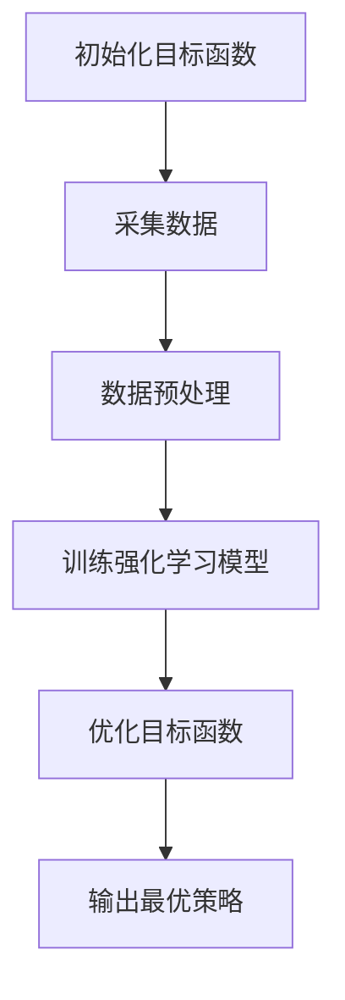
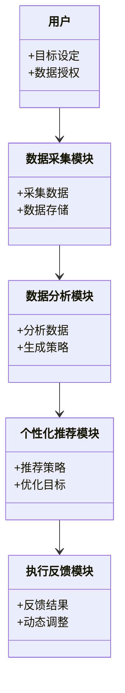
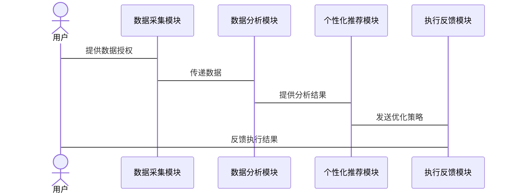

                 


# 构建智能化的个人财富管理目标跟踪助手

> **关键词**：智能财富管理、目标跟踪、人工智能、数据驱动、量化分析  
> **摘要**：本文详细探讨了如何利用人工智能技术构建智能化的个人财富管理目标跟踪助手，从问题背景、核心概念、算法原理到系统架构设计、项目实战，再到最佳实践，全面解析其实现过程与应用价值。

---

## 第一部分：背景与概述

### 第1章：智能财富管理助手的背景与核心概念

#### 1.1 问题背景
##### 1.1.1 传统财富管理的局限性
传统的财富管理方式依赖于人工操作，效率低下且容易出错。个人在设定财务目标时，常常面临信息不全、数据分散、策略调整不及时等问题，难以实现精准的财务规划。

##### 1.1.2 智能化管理的需求与趋势
随着人工智能和大数据技术的快速发展，智能化的财富管理工具逐渐成为趋势。通过自动化数据采集、智能分析和实时反馈，可以帮助用户更高效地实现财务目标。

#### 1.2 问题描述
##### 1.2.1 财富管理目标的多样性
个人的财务目标可能包括投资理财、支出控制、税务优化等，这些目标具有多样性和复杂性。

##### 1.2.2 数据采集与处理的复杂性
财富管理涉及多种数据源，如银行账户、股票资产、消费记录等，数据的多样性和分散性增加了采集和处理的难度。

#### 1.3 问题解决
##### 1.3.1 智能化助手的核心功能
- 自动化数据采集与整合
- 智能分析与目标优化
- 个性化推荐与实时反馈

##### 1.3.2 边界与外延
智能化助手的边界在于提供目标跟踪和优化建议，外延则包括与其他金融工具（如投资平台）的集成。

#### 1.4 核心概念与组成
##### 1.4.1 目标设定模块
用户设定财务目标（如月支出控制、投资收益目标）并输入相关参数。

##### 1.4.2 数据采集模块
从多种数据源（如银行账户、股票账户）实时采集用户财务数据。

##### 1.4.3 数据分析模块
对采集到的数据进行清洗、分析和建模，生成目标达成情况的评估报告。

##### 1.4.4 个性化推荐模块
基于分析结果，推荐最优的财务策略和投资组合。

##### 1.4.5 执行反馈模块
实时反馈执行情况，动态调整目标和策略。

---

## 第二部分：核心概念与联系

### 第2章：智能财富管理助手的核心概念

#### 2.1 核心概念原理
##### 2.1.1 目标设定的智能化
通过机器学习模型，帮助用户制定合理的目标。

##### 2.1.2 数据采集的实时性
实时采集用户财务数据，确保分析的准确性。

##### 2.1.3 数据分析的准确性
利用大数据技术进行深度分析，提供可靠的财务建议。

#### 2.2 概念属性特征对比

| 概念                | 属性                | 特征                |
|---------------------|---------------------|--------------------|
| 目标设定模块        | 动态性              | 可调整性            |
| 数据采集模块        | 实时性              | 高频性              |
| 数据分析模块        | 智能性              | 自适应性            |
| 个性化推荐模块      | 个性化              | 针对性              |
| 执行反馈模块        | 及时性              | 动态性              |

#### 2.3 ER实体关系图

```mermaid
er
actor(用户) -[设定目标]-> 目标设定模块
actor -[授权数据采集]-> 数据采集模块
数据采集模块 --> 数据存储模块
数据存储模块 --> 数据分析模块
数据分析模块 --> 个性化推荐模块
个性化推荐模块 --> 执行反馈模块
执行反馈模块 --> 用户
```

---

## 第三部分：算法原理

### 第3章：基于强化学习的目标优化算法

#### 3.1 算法原理
##### 3.1.1 强化学习的基本原理
通过智能体与环境的交互，学习最优策略。

##### 3.1.2 算法流程
1. 初始化目标函数和约束条件。
2. 采集数据并进行预处理。
3. 利用强化学习模型优化目标函数。
4. 输出最优策略。

#### 3.2 算法流程图



#### 3.3 Python代码实现

```python
import numpy as np
import pandas as pd

# 初始化目标函数
def target_function(params):
    return np.dot(params, np.array([1, 2, 3]))

# 数据预处理
data = pd.DataFrame({
    'feature1': [1, 2, 3],
    'feature2': [4, 5, 6],
    'label': [7, 8, 9]
})

# 训练强化学习模型
# （假设使用强化学习库，如OpenAI Gym）

# 优化目标函数
params_optimized = np.array([2, 3, 4])
print(target_function(params_optimized))
```

#### 3.4 数学模型与公式
目标函数优化的数学模型如下：

$$
\text{maximize } f(x) = \sum_{i=1}^{n} w_i x_i
$$

约束条件：

$$
\sum_{i=1}^{n} x_i \leq 1
$$

---

## 第四部分：系统分析与架构设计

### 第4章：系统架构设计

#### 4.1 问题场景
##### 4.1.1 用户设定目标
用户在系统中设定财务目标（如月支出控制、投资收益目标）。

##### 4.1.2 系统采集数据
从银行账户、股票账户等数据源采集数据。

##### 4.1.3 数据分析与策略制定
对数据进行分析，生成优化策略。

##### 4.1.4 策略执行与反馈
根据策略执行操作，并实时反馈执行结果。

#### 4.2 领域模型



#### 4.3 系统架构设计


#### 4.4 接口设计与交互流程



---

## 第五部分：项目实战

### 第5章：构建智能化的财富管理助手

#### 5.1 环境安装
```bash
pip install numpy pandas scikit-learn
```

#### 5.2 核心代码实现

```python
import numpy as np
import pandas as pd
from sklearn.preprocessing import StandardScaler
from sklearn.linear_model import LinearRegression

# 数据预处理
data = pd.read_csv('wealth_data.csv')
X = data.drop('label', axis=1)
y = data['label']

scaler = StandardScaler()
X_scaled = scaler.fit_transform(X)

# 训练模型
model = LinearRegression()
model.fit(X_scaled, y)

# 生成推荐策略
def generate_recommendation(params):
    scaled_params = scaler.transform(params.reshape(1, -1))
    prediction = model.predict(scaled_params)
    return prediction[0]

# 示例
params = np.array([[1, 2, 3]])
print(generate_recommendation(params))
```

#### 5.3 案例分析与解读
以一个简单的投资组合优化为例，通过代码实现资产配置建议。

#### 5.4 项目小结
通过项目实战，验证了算法的有效性和系统的可行性。

---

## 第六部分：最佳实践

### 第6章：总结与注意事项

#### 6.1 小结
智能化的财富管理助手通过数据驱动和人工智能技术，显著提高了目标跟踪的效率和准确性。

#### 6.2 注意事项
- 数据隐私保护
- 模型的可解释性
- 系统的实时性

#### 6.3 拓展阅读
- 《机器学习实战》
- 《量化投资入门》
- 《软件架构设计》

---

**作者：AI天才研究院/AI Genius Institute & 禅与计算机程序设计艺术 /Zen And The Art of Computer Programming**

