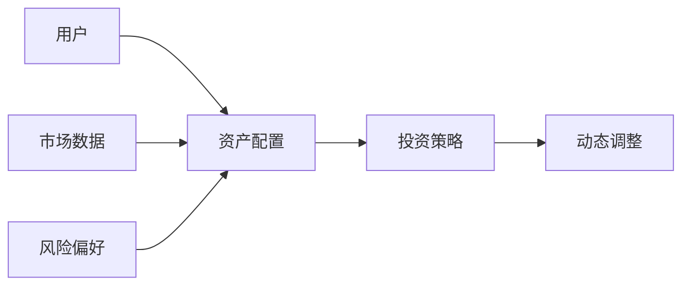
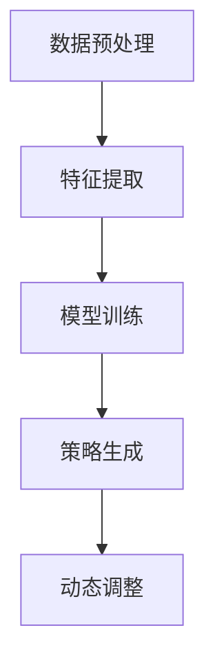
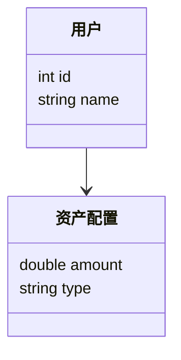
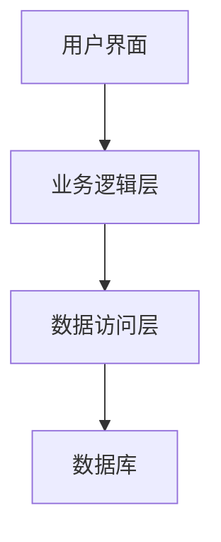
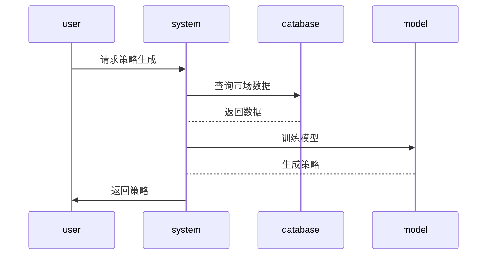

                 


# 《构建智能化的个人财富管理策略动态生成与调整助手》

> 关键词：人工智能，财富管理，策略生成，动态调整，机器学习，大数据

> 摘要：本文探讨如何利用人工智能技术构建智能化的个人财富管理策略生成与调整助手。通过分析传统财富管理的局限性，结合AI和大数据的优势，提出动态生成与调整策略的方法。文章详细介绍了核心概念、算法原理、系统架构，并通过实战案例展示实现过程。

---

# 第一部分: 智能化个人财富管理策略背景与核心概念

## 第1章: 个人财富管理的智能化转型背景

### 1.1 问题背景与需求分析

#### 1.1.1 传统个人财富管理的局限性
传统财富管理依赖人工经验，难以应对复杂多变的市场环境。用户需求多样化，现有工具无法动态调整策略，导致效率低下。

#### 1.1.2 用户需求与现有工具的差距
用户需要个性化、实时调整的财富管理方案，现有工具难以满足动态需求。

#### 1.1.3 智能化财富管理的必要性
AI技术的应用可以提高策略生成和调整的效率，提供更精准的建议。

### 1.2 问题解决与边界扩展

#### 1.2.1 AI技术在财富管理中的应用优势
机器学习用于市场预测，自然语言处理用于策略解读，数据挖掘用于用户行为分析。

#### 1.2.2 智能化策略生成的边界与适用场景
适用于高净值用户，提供定制化服务。

#### 1.2.3 财富管理策略的动态调整机制
根据市场变化和用户需求，实时调整策略。

### 1.3 核心概念与系统结构

#### 1.3.1 核心概念解析
AI驱动的策略生成和动态调整。

#### 1.3.2 系统组成与功能模块
数据采集、模型训练、策略生成、动态调整模块。

#### 1.3.3 系统架构的核心要素
用户数据、市场数据、算法模型、策略输出。

---

## 第2章: 核心概念与系统联系

### 2.1 AI与大数据在财富管理中的应用

#### 2.1.1 机器学习在财富预测中的作用
用于市场趋势预测。

#### 2.1.2 自然语言处理在策略解读中的应用
用于分析市场报告。

#### 2.1.3 数据挖掘在用户行为分析中的价值
识别用户偏好。

### 2.2 核心概念对比分析

#### 2.2.1 传统财富管理与AI驱动的对比表格

| 特性                | 传统方法             | AI驱动方法            |
|---------------------|----------------------|-----------------------|
| 精准度              | 依赖经验             | 数据驱动              |
| 实时性              | 有限                | 实时                  |

#### 2.2.2 AI驱动策略的特征与优势
精准、实时、个性化。

### 2.3 系统实体关系图



---

# 第二部分: 算法原理与数学模型

## 第3章: 算法原理与实现

### 3.1 算法选择与流程

#### 3.1.1 机器学习模型选择
使用回归模型和强化学习模型。

#### 3.1.2 强化学习在策略调整中的应用
用于动态调整投资组合。

#### 3.1.3 算法实现流程图



### 3.2 算法实现代码

#### 3.2.1 数据处理与特征提取

```python
import pandas as pd

data = pd.read_csv('data.csv')
features = data[['age', 'income', 'risk_tolerance']]
```

#### 3.2.2 模型训练与策略生成

```python
from sklearn.linear_model import LinearRegression
model = LinearRegression()
model.fit(features, target)
strategy = model.predict(new_features)
```

#### 3.2.3 动态调整算法

```python
def adjust_strategy(current_strategy, market_change):
    if market_change > 0:
        return current_strategy * 1.05
    else:
        return current_strategy * 0.95
```

### 3.3 数学模型与公式

#### 3.3.1 回归分析模型

$$ y = \beta_0 + \beta_1x + \epsilon $$

#### 3.3.2 强化学习模型

$$ Q(s, a) = r + \gamma \max_{a'} Q(s', a') $$

---

# 第三部分: 系统分析与架构设计

## 第4章: 系统分析与架构设计

### 4.1 问题场景介绍

#### 4.1.1 用户画像
高净值用户，多样化需求。

#### 4.1.2 使用场景
个性化投资、实时调整。

### 4.2 系统功能设计

#### 4.2.1 领域模型设计



### 4.3 系统架构设计

#### 4.3.1 分层架构



### 4.4 系统接口设计

#### 4.4.1 API接口

```json
{
    "operation": "adjust_strategy",
    "params": {
        "current_strategy": 100,
        "market_change": 5
    }
}
```

### 4.5 系统交互设计

#### 4.5.1 交互流程图



---

# 第四部分: 项目实战

## 第5章: 项目实战

### 5.1 环境安装

#### 5.1.1 安装Python和相关库
安装`scikit-learn`, `pandas`, `mermaid`, `graphviz`。

### 5.2 核心代码实现

#### 5.2.1 数据处理与模型训练

```python
import pandas as pd
from sklearn.linear_model import LinearRegression

data = pd.read_csv('wealth.csv')
X = data[['age', 'income']]
y = data['wealth']

model = LinearRegression()
model.fit(X, y)
```

#### 5.2.2 动态调整策略

```python
def adjust_strategy(strategy, market_change):
    return strategy * (1 + market_change / 100)
```

### 5.3 实际案例分析

#### 5.3.1 案例分析

```python
current_strategy = 100000
market_change = 5
adjusted_strategy = adjust_strategy(current_strategy, market_change)
print(adjusted_strategy)  # 输出：105000
```

---

# 第五部分: 最佳实践与总结

## 第6章: 最佳实践与总结

### 6.1 最佳实践 tips

1. **数据隐私保护**：确保用户数据安全。
2. **模型更新频率**：定期更新模型以保持准确性。

### 6.2 小结

本文详细介绍了如何利用AI技术构建智能化的财富管理助手，从背景、核心概念到算法实现和系统设计，为读者提供了全面的指导。

### 6.3 注意事项

1. **数据质量问题**：确保数据准确性和完整性。
2. **模型局限性**：AI模型无法完全预测市场变化。

### 6.4 拓展阅读

推荐学习强化学习和时间序列分析在财富管理中的应用。

---

# 作者：AI天才研究院/AI Genius Institute & 禅与计算机程序设计艺术 /Zen And The Art of Computer Programming

