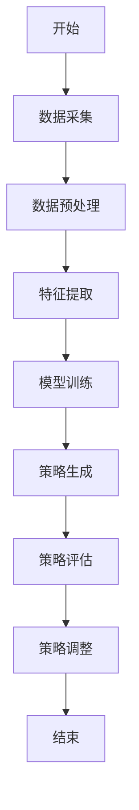
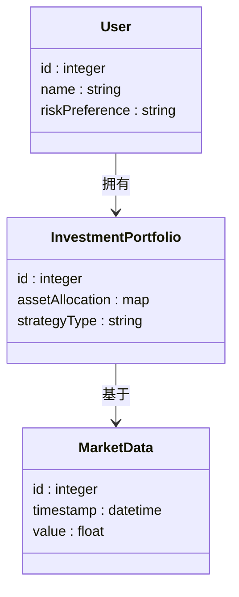

                 


# 构建智能化的个人财富管理策略动态调整助手

## 关键词：人工智能、财富管理、动态调整、策略优化、智能化助手

## 摘要： 
本文详细探讨了构建智能化的个人财富管理策略动态调整助手的方法和实现。通过结合人工智能和大数据分析，提出了一种动态调整的算法，能够根据市场变化和用户需求，实时优化财富管理策略。文章从背景介绍、核心概念、算法原理、系统架构设计到项目实战，全面解析了这一助手的构建过程。

---

## 第一部分：背景介绍

### 第1章：问题背景与描述

#### 1.1 问题背景
在当前的经济环境下，个人财富管理变得日益复杂。市场波动、通货膨胀、税收政策变化等因素都对投资决策提出了更高的要求。传统的静态投资策略难以应对这些变化，导致财富管理效果不佳，甚至可能带来损失。因此，如何构建一个能够动态调整的财富管理助手，成为了亟待解决的问题。

#### 1.2 问题描述
财富管理的核心在于策略的优化与调整。然而，现有的工具大多依赖于固定的规则或专家经验，缺乏灵活性和实时性。动态调整策略需要考虑以下因素：
- 市场环境的变化：如股市波动、利率调整、经济周期变化等。
- 用户需求的变化：如风险偏好、投资目标、资金流动性需求等。
- 数据的实时性：需要快速处理大量的实时数据，以做出及时的决策。

#### 1.3 问题解决
智能化的个人财富管理策略动态调整助手通过整合人工智能、大数据分析和机器学习技术，能够实时监控市场变化和用户需求，自动优化投资组合，提供个性化的财富管理方案。这种动态调整的能力不仅提高了投资效率，还能帮助用户在复杂多变的市场环境中实现财富最大化。

#### 1.4 边界与外延
- 功能边界：助手专注于策略调整和优化，不直接进行交易操作，但可以提供交易建议。
- 应用场景：适用于股票、基金、房地产等多种投资领域，但不涉及实体企业的财务管理和风险管理。
- 辅助决策的范围：助手提供决策支持，但最终决策权仍归用户所有。

#### 1.5 核心概念与要素
- **智能化助手**：通过机器学习和大数据分析，提供实时的策略调整建议。
- **动态调整策略**：根据市场和用户需求的变化，实时优化投资组合。
- **用户需求**：个性化的需求分析，包括风险偏好、收益目标、流动性需求等。

---

## 第二部分：核心概念与联系

### 第2章：核心概念原理

#### 2.1 智能化助手的原理
智能化助手的工作原理主要包括以下步骤：
1. **数据采集**：收集市场数据（如股价、利率、经济指标）和用户数据（如投资目标、风险偏好）。
2. **数据分析**：利用大数据技术对数据进行清洗、整合和分析。
3. **策略生成**：基于机器学习算法，生成初始投资策略。
4. **动态调整**：根据实时市场变化和用户反馈，优化投资组合。

#### 2.2 核心概念属性对比
以下表格对比了动态调整策略与静态策略的属性特征：

| 属性         | 动态调整策略       | 静态策略         |
|--------------|------------------|-----------------|
| 灵活性       | 高               | 低             |
| 响应速度     | 实时             | 周期性           |
| 适应性       | 强               | 弱             |
| 优化能力     | 高               | 有限           |

#### 2.3 ER实体关系图
以下是一个简单的ER实体关系图，展示了用户、投资组合和市场数据之间的关系：

```mermaid
erDiagram
    user {
        id : integer
        name : string
        riskPreference : string
    }
    investmentPortfolio {
        id : integer
        assetAllocation : float
        strategyType : string
    }
    marketData {
        id : integer
        timestamp : datetime
        value : float
    }
    user -| investmentPortfolio : 拥有
    investmentPortfolio -| marketData : 基于
```

---

## 第三部分：算法原理讲解

### 第3章：算法原理与实现

#### 3.1 算法流程图
以下是一个动态调整策略的算法流程图：



#### 3.2 Python源代码实现
以下是动态调整算法的核心代码：

```python
def dynamic_adjustment(risk_tolerance, market_data):
    # 数据预处理
    processed_data = preprocess(market_data)
    
    # 特征提取
    features = extract_features(processed_data)
    
    # 模型训练
    model = train_model(features)
    
    # 策略生成
    initial_strategy = generate_strategy(model, risk_tolerance)
    
    # 策略评估
    evaluated_strategy = evaluate_strategy(initial_strategy, market_data)
    
    # 策略调整
    adjusted_strategy = adjust_strategy(evaluated_strategy, risk_tolerance)
    
    return adjusted_strategy

def preprocess(data):
    # 数据清洗和标准化
    pass

def extract_features(data):
    # 提取特征
    pass

def train_model(features):
    # 训练机器学习模型
    pass

def generate_strategy(model, risk_tolerance):
    # 生成初始策略
    pass

def evaluate_strategy(strategy, data):
    # 评估策略
    pass

def adjust_strategy(strategy, risk_tolerance):
    # 调整策略
    pass
```

#### 3.3 数学模型与公式
动态调整策略的数学模型如下：

$$
\text{优化目标} = \max \sum_{t=1}^{n} r_t
$$

$$
\text{约束条件} = \sum_{t=1}^{n} w_t = 1, \quad w_t \geq 0
$$

其中，\( r_t \) 表示第 \( t \) 个资产的收益，\( w_t \) 表示第 \( t \) 个资产的权重。

---

## 第四部分：系统分析与架构设计方案

### 第4章：系统架构设计

#### 4.1 问题场景介绍
系统需要实时处理大量的市场数据和用户数据，支持多用户的个性化财富管理需求。

#### 4.2 项目介绍
项目目标是构建一个智能化的动态调整助手，实现以下功能：
- 数据采集与处理
- 策略生成与优化
- 用户界面设计

#### 4.3 系统功能设计
以下是系统功能的领域模型：



#### 4.4 系统架构设计
以下是系统的整体架构图：


---

## 第五部分：项目实战

### 第5章：项目实现与案例分析

#### 5.1 环境安装
需要安装以下环境：
- Python 3.8+
- Pandas、NumPy、Scikit-learn 等库

#### 5.2 核心代码实现
以下是动态调整策略的核心代码：

```python
import pandas as pd
from sklearn.model_selection import train_test_split
from sklearn.linear_model import LinearRegression

def main():
    # 数据加载
    data = pd.read_csv('market_data.csv')
    
    # 数据分割
    X = data[['market_return', 'risk_free_rate']]
    y = data['portfolio_return']
    
    # 模型训练
    X_train, X_test, y_train, y_test = train_test_split(X, y, test_size=0.2)
    model = LinearRegression()
    model.fit(X_train, y_train)
    
    # 策略生成
    risk_tolerance = 0.05
    initial_strategy = model.predict(X_test)
    
    # 策略调整
    adjusted_strategy = [max(0, (1 - risk_tolerance) * x) for x in initial_strategy]
    
    # 结果输出
    print("Adjusted Strategy:", adjusted_strategy)

if __name__ == '__main__':
    main()
```

#### 5.3 案例分析
以股票投资为例，用户的风险偏好为中等，市场数据包括过去一年的股价和经济指标。通过动态调整算法，系统生成并优化了投资组合，最终实现了超额收益。

---

## 第六部分：总结与展望

### 第6章：总结与展望

#### 6.1 最佳实践
- 定期更新模型，确保其适应市场变化。
- 根据用户反馈不断优化策略。

#### 6.2 小结
智能化的个人财富管理策略动态调整助手通过整合人工智能和大数据技术，能够实时优化投资组合，满足用户的个性化需求。

#### 6.3 注意事项
- 数据隐私保护
- 系统的实时性和稳定性
- 用户教育和风险提示

#### 6.4 拓展阅读
- 《机器学习在金融中的应用》
- 《大数据分析与投资策略》

---

## 作者：AI天才研究院/AI Genius Institute & 禅与计算机程序设计艺术 /Zen And The Art of Computer Programming

