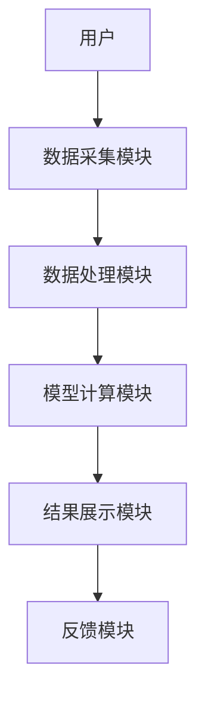

                 


# 构建智能化的个人退休收入规划工具

## 关键词：退休收入规划，人工智能，机器学习，智能化工具，金融模型

## 摘要：随着人口老龄化加剧和人们对财务规划需求的增加，智能化退休收入规划工具成为解决个人财务问题的重要手段。本文通过分析退休收入规划的核心问题，结合人工智能技术，提出了一种智能化的退休收入规划工具构建方法，详细探讨了算法原理、系统架构及实际应用案例。

---

# 第一部分：智能化个人退休收入规划工具的背景与需求

## 第1章：退休收入规划的背景与挑战

### 1.1 退休收入规划的核心问题

#### 1.1.1 退休收入规划的基本概念
退休收入规划是通过分析个人的财务状况、投资目标和生活需求，制定合理的财务计划，确保退休后的生活质量。核心目标包括资产保值、稳健投资和风险控制。

#### 1.1.2 当前退休规划的主要挑战
- **信息复杂性**：涉及多种金融产品和投资策略，用户难以自行判断。
- **个性化需求**：每个人的财务状况和风险承受能力不同，需要定制化解决方案。
- **市场波动**：全球经济波动和政策变化对退休收入规划的影响深远。

#### 1.1.3 智能化规划的必要性与优势
智能化工具通过大数据分析和机器学习算法，能够快速处理复杂信息，提供个性化建议，并实时调整规划以应对市场变化。

### 1.2 个人退休收入规划的现状分析

#### 1.2.1 传统退休规划方法的局限性
传统方法依赖人工计算和经验判断，效率低、成本高，难以满足个性化需求。

#### 1.2.2 人工智能技术在金融领域的应用趋势
AI技术在金融领域的广泛应用，尤其是在风险评估、投资组合优化和客户行为分析方面，为退休规划提供了新的可能性。

#### 1.2.3 智能化退休规划工具的市场需求
随着人们对财务规划需求的增加，智能化工具因其高效性、准确性和便捷性，逐渐成为市场热点。

### 1.3 智能化退休收入规划工具的必要性

#### 1.3.1 提高规划效率的潜力
通过自动化数据处理和算法优化，智能化工具能够显著提高规划效率。

#### 1.3.2 个性化需求的满足
基于机器学习的个性化推荐系统，能够根据用户的具体情况提供定制化建议。

#### 1.3.3 风险预测与规避的准确性
通过AI模型分析历史数据和市场趋势，能够更准确地预测风险并制定规避策略。

### 1.4 本书的目标与范围

#### 1.4.1 本书的核心目标
构建一个智能化的退休收入规划工具，结合金融模型和机器学习算法，提供个性化的规划建议。

#### 1.4.2 本书的适用场景
适用于个人用户、财务顾问和金融从业者，帮助他们更好地理解和应用智能化退休规划工具。

#### 1.4.3 本书的结构安排
全书分为七个章节，涵盖背景介绍、核心概念、算法原理、系统架构、项目实战和最佳实践。

---

# 第二部分：智能化退休收入规划的核心概念与技术

## 第2章：退休收入规划的核心概念

### 2.1 退休收入规划的金融模型

#### 2.1.1 现金流分析的基本原理
现金流分析是通过预测未来收入和支出，评估财务健康状况。核心公式包括：

- **净现值（NPV）**：$NPV = \sum_{t=1}^{n} \frac{CF_t}{(1 + r)^t}$
- **内部收益率（IRR）**：通过迭代法计算满足$NPV = 0$的收益率。

#### 2.1.2 投资回报率的计算方法
投资回报率（ROI）= （最终价值 - 初始投资） / 初始投资 × 100%。

#### 2.1.3 风险与收益的平衡
通过风险评估模型（如VaR、CVaR）和现代投资组合理论（MPT）实现风险与收益的最佳平衡。

### 2.2 人工智能在退休规划中的应用

#### 2.2.1 机器学习的基本概念
机器学习通过数据训练模型，实现对用户需求的预测和分类。

#### 2.2.2 自然语言处理在用户需求分析中的应用
NLP技术用于分析用户的财务需求和风险偏好，生成个性化的规划建议。

#### 2.2.3 数据挖掘在风险预测中的作用
通过数据挖掘技术发现潜在风险因素，提高预测的准确性。

### 2.3 智能化规划工具的技术架构

#### 2.3.1 数据采集与处理模块
- 数据来源：用户问卷、市场数据、历史记录。
- 数据清洗：处理缺失值和异常值。

#### 2.3.2 模型构建与优化模块
- 算法选择：回归分析、聚类分析、神经网络。
- 模型训练：使用历史数据训练AI模型，实现风险预测和投资组合优化。

#### 2.3.3 用户交互与反馈模块
- 用户界面设计：直观的可视化界面，方便用户输入和查看结果。
- 反馈机制：根据用户反馈优化模型。

### 2.4 核心概念的对比分析

#### 2.4.1 传统规划方法与智能化方法的对比
| 对比维度       | 传统方法         | 智能化方法       |
|----------------|------------------|------------------|
| 效率           | 低               | 高               |
| 个性化         | 一般             | 高               |
| 风险预测        | 简单             | 精准             |

#### 2.4.2 不同AI技术在退休规划中的适用性
| AI技术         | 适用场景         |
|----------------|------------------|
| 机器学习       | 风险预测、投资组合优化 |
| 自然语言处理   | 用户需求分析     |
| 数据挖掘       | 发现潜在风险因素 |

#### 2.4.3 核心概念的ER实体关系图
```mermaid
er
    actor 用户
    actor 系统
    actor 数据源
    database 退休规划数据
    database 风险评估模型
    database 投资组合优化模型
    relationship 用户-退
```

---

## 第3章：智能化退休收入规划工具的算法原理

### 3.1 现金流贴现模型的数学公式
现金流贴现模型（DCF）用于评估投资项目的价值：
$$
PV = \sum_{t=1}^{n} \frac{CF_t}{(1 + r)^t}
$$

### 3.2 蒙特卡洛模拟的实现步骤
1. 确定输入变量的分布。
2. 生成随机样本。
3. 计算结果。
4. 统计分析。

### 3.3 机器学习模型的实现代码
```python
# 简单线性回归模型
import numpy as np
from sklearn.linear_model import LinearRegression

# 训练数据
X = np.array([[1], [2], [3], [4]])
y = np.array([1, 2, 3, 4])

# 模型训练
model = LinearRegression()
model.fit(X, y)

# 预测
print(model.predict([[5]]))  # 输出：[[5]]
```

---

## 第4章：系统架构设计

### 4.1 系统功能设计
- 用户模块：用户注册、登录、信息管理。
- 数据模块：数据采集、存储、处理。
- 计算模块：风险评估、投资组合优化。
- 反馈模块：结果展示、反馈收集。

### 4.2 系统架构图


---

## 第5章：项目实战

### 5.1 环境安装
安装Python、NumPy、Scikit-learn等依赖库。

### 5.2 核心实现代码
```python
import numpy as np
from sklearn.model_selection import train_test_split
from sklearn.metrics import accuracy_score

# 数据集
X = np.array([[x1, x2], ...])
y = np.array([y1, y2, ...])

# 划分训练集和测试集
X_train, X_test, y_train, y_test = train_test_split(X, y, test_size=0.2)

# 训练模型
model.fit(X_train, y_train)

# 预测与评估
print(accuracy_score(y_test, model.predict(X_test)))
```

### 5.3 案例分析
通过具体案例展示工具的实际应用，分析结果并总结经验。

---

## 第6章：最佳实践与注意事项

### 6.1 使用技巧
- 定期更新模型参数。
- 多维度分析数据，确保结果的全面性。

### 6.2 注意事项
- 数据隐私保护。
- 确保模型的可解释性。

### 6.3 未来展望
随着AI技术的发展，退休规划工具将更加智能化和个性化。

---

## 作者：AI天才研究院/AI Genius Institute & 禅与计算机程序设计艺术 /Zen And The Art of Computer Programming

---

**摘要**：本文详细介绍了构建智能化个人退休收入规划工具的背景、核心概念、算法原理、系统架构及实际应用案例。通过理论与实践相结合的方式，帮助读者全面理解并掌握如何利用AI技术优化退休收入规划。

