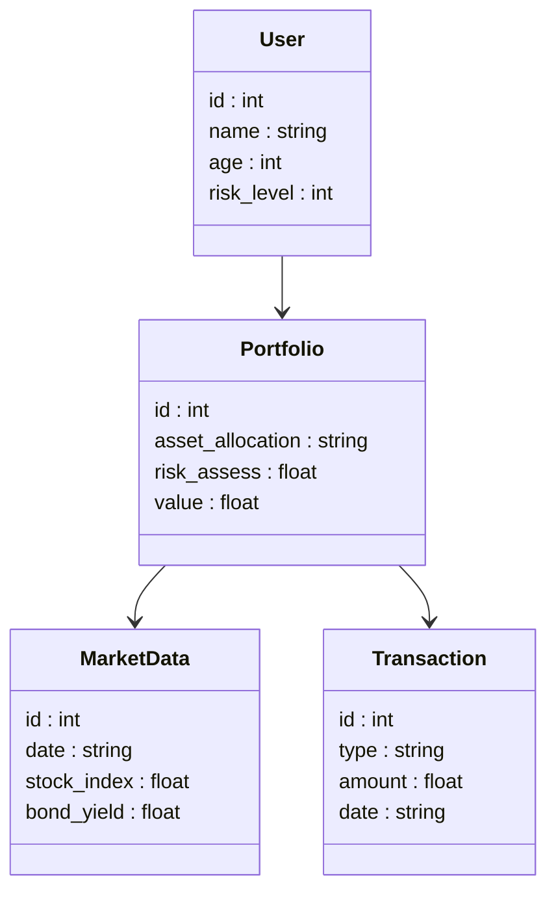

                 


# 构建智能化的个人退休金投资组合动态调整助手

> 关键词：智能化、退休金投资、动态调整、投资组合、人工智能、动态优化

> 摘要：本文探讨如何利用人工智能技术构建一个智能化的个人退休金投资组合动态调整助手，通过分析投资组合的动态调整需求、设计优化模型、实现系统架构，最终达到帮助个人用户实现资产保值增值的目标。

---

## 第一部分: 智能化退休金投资组合动态调整助手的背景与需求

### 第1章: 背景介绍

#### 1.1 问题背景
随着人口老龄化的加剧和退休金制度的变化，个人如何管理退休金投资变得尤为重要。传统的投资方式往往依赖于固定的资产配置策略，难以应对市场波动和个体需求的变化。因此，智能化的投资组合动态调整助手应运而生，它能够根据市场环境和个人财务状况的变化，实时优化投资组合。

#### 1.2 问题描述
退休金投资组合的动态调整需要考虑多个因素，包括市场波动、通货膨胀、个人风险偏好等。传统的方法依赖于定期手动调整，效率低下且难以捕捉市场变化的即时信号。此外，不同投资者的财务状况和风险承受能力各异，个性化的需求使得传统的静态配置策略显得力不从心。

#### 1.3 问题解决
智能化的退休金投资组合动态调整助手通过结合大数据分析、机器学习和优化算法，能够实时监控市场变化和用户需求，自动调整投资组合。这种方法不仅提高了效率，还能更好地应对市场波动，实现资产的保值增值。

#### 1.4 边界与外延
动态调整助手的功能边界包括实时数据采集、风险评估、投资组合优化和用户交互。其外延则涉及与银行系统、税务计算和其他财务工具的集成，形成一个完整的个人财务管理生态系统。

---

## 第二部分: 核心概念与联系

### 第2章: 动态调整助手的核心原理

#### 2.1 核心概念原理
- **资产配置策略**：根据市场环境和个人风险偏好，动态调整各类资产（如股票、债券、黄金等）的配置比例。
- **风险管理模型**：通过风险评估算法，识别潜在风险并制定应对策略。
- **用户行为分析**：基于用户的历史投资行为和财务状况，预测未来行为，提供个性化的投资建议。

#### 2.2 核心概念属性对比表
```markdown
| 概念           | 灵活性 | 风险性 | 收益性 |
|----------------|--------|--------|--------|
| 资产配置       | 高     | 高     | 高     |
| 风险管理       | 中     | 高     | 中     |
| 用户行为分析   | 中     | 中     | 高     |
```

#### 2.3 ER实体关系图
```mermaid
erDiagram
    user {
        id : int
        name : string
        age : int
        risk_level : int
    }
    portfolio {
        id : int
        asset_allocation : string
        risk_assess
    }
    market_data {
        id : int
        stock_index : float
        bond_yield : float
    }
    transaction {
        id : int
        type : string
        amount : float
    }
    user o-|1 portfolio
    portfolio o-|1 market_data
    portfolio o-|1 transaction
```

---

## 第三部分: 算法原理

### 第3章: 优化模型与风险评估

#### 3.1 优化模型
目标是最小化风险（波动率）的同时最大化收益，数学模型如下：
$$ \text{目标函数：} \min \sigma^2 \quad \text{在} \quad \mu \geq \text{目标收益} $$

其中，$\mu$ 是投资组合的期望收益，$\sigma^2$ 是其方差。

#### 3.2 风险评估模型
使用VaR（Value at Risk）模型评估潜在损失：
$$ \text{VaR}_\alpha = \text{最小值} \{ x | P(L \leq x) \geq \alpha \} $$

其中，$\alpha$ 是置信水平，$L$ 是潜在损失。

#### 3.3 Python实现示例
```python
import numpy as np
from scipy.optimize import minimize

def portfolio_optimization(returns, weights):
    # 定义目标函数：最小化方差
    def objective(weights):
        return np.dot(weights.T, np.dot(returns.cov(), weights))
    
    # 约束条件：权重之和为1
    constraints = [{'type': 'eq', 'fun': lambda w: sum(w) - 1}]
    
    result = minimize(objective, weights, constraints=constraints)
    return result.x

# 示例数据
returns = np.array([[0.1, 0.2, 0.15],
                    [0.05, 0.03, 0.07],
                    [0.12, 0.1, 0.08]])
weights_initial = [1/3, 1/3, 1/3]

optimal_weights = portfolio_optimization(returns, weights_initial)
print("Optimal weights:", optimal_weights)
```

---

## 第四部分: 系统分析与架构设计

### 第4章: 系统架构

#### 4.1 领域模型类图


#### 4.2 系统架构图


---

## 第五部分: 项目实战

### 第5章: 实战分析

#### 5.1 环境安装
安装必要的Python库：
```bash
pip install numpy pandas scipy matplotlib
```

#### 5.2 核心功能实现
```python
from sklearn.decomposition import PCA
import pandas as pd

def dynamic_adjustment(portfolio, market_data):
    # 使用PCA提取主要市场因子
    pca = PCA(n_components=3)
    market_factors = pca.fit_transform(market_data)
    
    # 调整投资组合权重
    adjusted_weights = portfolio(weights=portfolio, market_factors=market_factors)
    return adjusted_weights

# 示例数据
market_data = pd.DataFrame({
    'stock': [0.1, 0.05, 0.12],
    'bond': [0.08, 0.03, 0.05],
    'gold': [0.02, 0.04, 0.06]
})

current_portfolio = [0.4, 0.3, 0.3]
adjusted_portfolio = dynamic_adjustment(current_portfolio, market_data)
print("Adjusted weights:", adjusted_portfolio)
```

---

## 第六部分: 总结与注意事项

### 第6章: 总结

智能化的个人退休金投资组合动态调整助手通过实时数据分析和优化算法，显著提升了投资效率和收益。本文详细介绍了其背景、核心原理、算法实现和系统架构，并通过实战案例展示了其实际应用。

### 注意事项
- **数据隐私**：确保用户数据的安全性和隐私性。
- **市场波动**：算法需具备鲁棒性，应对极端市场情况。
- **用户教育**：投资者需理解工具的局限性，避免过度依赖。

---

## 作者

作者：AI天才研究院/AI Genius Institute & 禅与计算机程序设计艺术 /Zen And The Art of Computer Programming

