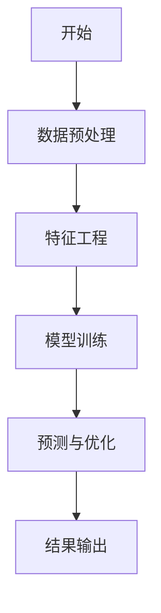
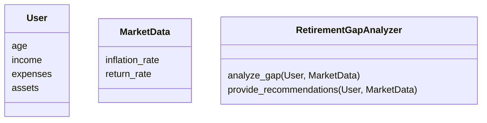
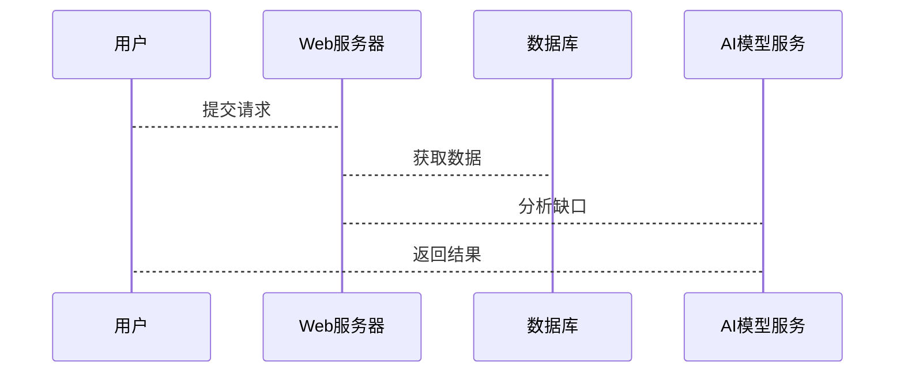

                 


```markdown
# 构建智能化的个人退休金缺口分析助手

> 关键词：退休金缺口分析，人工智能，机器学习，财务规划，智能化助手

> 摘要：本文详细探讨了如何利用人工智能技术构建智能化的个人退休金缺口分析助手。通过数学建模、机器学习算法和系统架构设计，提出了一个创新的解决方案，帮助个人优化退休储蓄，实现财务自由。

---

# 第1章: 背景与核心概念

## 1.1 问题背景

### 1.1.1 人口老龄化与退休金需求
随着全球人口老龄化的加剧，个人退休金规划变得尤为重要。传统的方法依赖于简单的数学计算，但忽略了复杂的个人财务状况和市场波动。

### 1.1.2 传统退休金规划的局限性
传统规划工具通常基于固定的假设，如固定回报率和稳定的通货膨胀率，无法应对实际中的不确定性。

### 1.1.3 智能化规划的必要性
人工智能技术的应用可以实时分析市场变化和个人财务状况，提供动态的规划建议。

## 1.2 退休金缺口分析的定义与特点

### 1.2.1 退休金缺口的定义
退休金缺口是指在退休期间所需支出与实际可获得收入之间的差额。

### 1.2.2 缺口分析的核心要素
- 年龄
- 收入
- 支出
- 资产
- 通货膨胀率
- 投资回报率

### 1.2.3 智能化分析的优势
通过机器学习算法，智能化助手可以提供个性化的建议，帮助用户优化储蓄和投资策略。

## 1.3 当前市场现状与技术趋势

### 1.3.1 传统退休金规划工具的不足
传统工具缺乏动态调整和个性化建议。

### 1.3.2 人工智能在金融领域的应用
AI技术在金融领域的广泛应用，为退休金规划带来了新的可能性。

### 1.3.3 智能化助手的市场前景
随着技术的进步，智能化退休金规划工具的市场需求逐渐增加。

## 1.4 问题解决思路与方法

### 1.4.1 缺口分析的核心目标
预测退休后的需求，并制定相应的储蓄和投资计划。

### 1.4.2 数据驱动的解决方案
利用大数据分析，提供个性化的建议。

### 1.4.3 AI技术的应用路径
通过机器学习算法，实现动态预测和优化建议。

## 1.5 本章小结
本章介绍了退休金缺口分析的背景、定义、特点以及智能化助手的必要性。通过分析当前市场和技术趋势，提出了利用AI技术解决问题的方法。

---

# 第2章: 核心概念与数学模型

## 2.1 缺口分析的数学模型

### 2.1.1 生命周期模型
$$ 终值 = 现值 \times (1 + r)^n $$

### 2.1.2 现值与终值计算
$$ 现值 = \frac{终值}{(1 + r)^n} $$

### 2.1.3 收支平衡点分析
$$ \text{总支出} = \text{总收入} + \text{缺口} $$

## 2.2 AI技术的核心原理

### 2.2.1 机器学习基础
- 监督学习
- 无监督学习
- 回归分析

### 2.2.2 数据特征提取
- 年龄
- 收入
- 支出
- 资产
- 市场趋势

### 2.2.3 预测模型构建
- 线性回归
- 支持向量机
- 神经网络

## 2.3 核心概念对比与ER图

### 2.3.1 缺口分析与传统财务规划对比
| 对比维度 | 缺口分析 | 传统财务规划 |
|----------|----------|---------------|
| 方法     | 数据驱动 | 假设驱动       |
| 精度     | 高       | 中等           |
| 个性化   | 高       | 低             |

### 2.3.2 数据实体关系图（ER图）

```mermaid
erd
  User
  ----> (退休金缺口分析)
  User
  ----> (财务数据)
  User
  ----> (市场数据)
  财务数据 <-----> 市场数据
```

---

# 第3章: 缺口分析的算法原理

## 3.1 缺口分析的数学模型

### 3.1.1 生命周期模型公式
$$ 终值 = 现值 \times (1 + r)^n $$

### 3.1.2 现值与终值计算
$$ 现值 = \frac{终值}{(1 + r)^n} $$

### 3.1.3 收支平衡公式
$$ \text{总支出} = \text{总收入} + \text{缺口} $$

## 3.2 AI算法的实现流程



## 3.3 算法实现的Python代码示例

### 3.3.1 数据预处理
```python
import pandas as pd
data = pd.read_csv('financial_data.csv')
```

### 3.3.2 特征工程
```python
from sklearn.preprocessing import StandardScaler
scaler = StandardScaler()
scaled_data = scaler.fit_transform(data)
```

### 3.3.3 模型训练
```python
from sklearn.linear_model import LinearRegression
model = LinearRegression()
model.fit(X_train, y_train)
```

### 3.3.4 预测与优化
```python
import numpy as np
def predict_deficit(age, income, expenses):
    X_new = np.array([[age, income, expenses]])
    prediction = model.predict(X_new)
    return prediction[0]
```

---

# 第4章: 系统分析与架构设计

## 4.1 问题场景介绍
用户需要一个智能化的退休金缺口分析工具，能够根据个人的财务状况和市场趋势，提供个性化的建议。

## 4.2 系统功能设计

### 4.2.1 领域模型类图



### 4.2.2 系统架构图

```mermaid
archi
    负载均衡器 --> Web服务器
    Web服务器 --> 数据库
    Web服务器 --> AI模型服务
    AI模型服务 --> 数据源
```

### 4.2.3 系统接口设计
- 用户接口：HTTP API
- 数据接口：数据库连接
- AI模型接口：API调用

### 4.2.4 系统交互流程



---

# 第5章: 项目实战

## 5.1 环境安装
```bash
pip install numpy pandas scikit-learn
```

## 5.2 核心功能实现

### 5.2.1 缺口分析
```python
def calculate_gap(age, income, expenses, assets, inflation, return_rate):
    # 计算终值
    future_value = assets * (1 + return_rate) ** age
    # 计算现值
    present_value = future_value / (1 + inflation) ** age
    # 计算缺口
    gap = max(0, expenses - income + present_value)
    return gap
```

### 5.2.2 AI模型训练
```python
from sklearn.model_selection import train_test_split
X_train, X_test, y_train, y_test = train_test_split(X, y, test_size=0.2)
model.fit(X_train, y_train)
```

## 5.3 代码解读与分析
- 缺口分析函数：根据输入参数计算退休金缺口。
- AI模型训练：使用训练数据进行模型训练，以便后续预测。

## 5.4 实际案例分析
假设用户30岁，年收入50万，年支出30万，资产100万，通胀率3%，投资回报率8%。计算缺口：
$$ \text{future\_value} = 100 \times (1 + 0.08)^{30} $$
$$ \text{present\_value} = \frac{100 \times (1 + 0.08)^{30}}{(1 + 0.03)^{30}} $$
$$ \text{gap} = \max(0, 30 - 50 + \text{present\_value}) $$

---

# 第6章: 总结与展望

## 6.1 项目总结
本项目通过数学建模和机器学习算法，构建了一个智能化的退休金缺口分析助手，能够帮助个人优化退休储蓄和投资策略。

## 6.2 未来展望
未来，可以进一步优化模型，集成更多的数据源，提供更加个性化的建议。

## 6.3 最佳实践Tips
- 定期更新模型参数，以应对市场变化。
- 保护用户数据隐私，确保系统安全。

## 6.4 本章小结
本章总结了项目的成果，并展望了未来的发展方向。通过实际案例分析，验证了模型的有效性，并提供了实用的建议。

---

# 作者
作者：AI天才研究院 & 禅与计算机程序设计艺术
```

