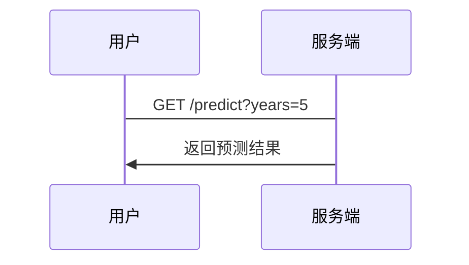

                 


# 《构建智能化的个人退休金缺口动态预测助手》

---

## 关键词：  
- 退休金缺口  
- 动态预测  
- 时间序列分析  
- ARIMA模型  
- 系统架构  

---

## 摘要：  
本文详细介绍了如何构建一个智能化的个人退休金缺口动态预测助手。通过分析退休金缺口预测的背景与问题，阐述了基于时间序列分析的动态预测模型的核心概念与算法原理。结合实际项目需求，设计了系统的功能模块与架构，并通过具体的案例分析展示了如何实现动态预测助手。最后，本文总结了最佳实践与注意事项，为读者提供了一个全面的技术解决方案。

---

# 第一部分: 背景介绍

## 第1章: 个人退休金缺口动态预测的背景与问题

### 1.1 问题背景  
- 人口老龄化导致退休金需求激增。  
- 传统静态退休金计算方法难以应对变化。  
- 动态预测模型的必要性与重要性。  

### 1.2 问题描述  
- 退休金缺口的定义与计算公式。  
- 动态预测的核心目标与边界条件。  
- 预测模型的输入与输出。  

### 1.3 问题解决与技术选型  
- 数据驱动的解决方案。  
- 基于机器学习的时间序列预测技术。  
- 动态预测模型的核心要素与组成。  

---

# 第二部分: 核心概念与联系

## 第2章: 动态预测模型的核心概念  

### 2.1 动态预测模型的原理  
- 时间序列分析的基本概念与特点。  
- 动态预测模型的输入特征与输出结果。  
- 模型训练与优化的关键步骤。  

### 2.2 数据特征与模型性能  
- 数据特征的分类与属性对比。  
- 数据预处理的关键步骤与注意事项。  
- 特征工程对模型性能的影响与优化。  

### 2.3 算法选择与模型构建  
- 常见时间序列预测算法对比。  
- 基于机器学习的动态预测模型。  
- 深度学习模型在时间序列预测中的应用。  

---

# 第三部分: 算法原理与数学模型

## 第3章: 时间序列预测的算法原理  

### 3.1 时间序列预测的基本原理  
- 时间序列的特性分析：趋势、周期性、随机性。  
- 时间序列预测的数学模型：线性回归、ARIMA等。  

### 3.2 ARIMA模型的原理与实现  
- ARIMA模型的组成部分：自回归、差分、移动平均。  
- ARIMA模型的数学公式：  
$$ ARIMA(p, d, q) = y_t = \phi_1 y_{t-1} + \dots + \phi_p y_{t-p} + \theta_1 e_{t-1} + \dots + \theta_q e_{t-q} + e_t $$  
- ARIMA模型的实现步骤：  
  1. 数据预处理与平稳化。  
  2. 确定模型参数p、d、q。  
  3. 模型训练与优化。  
  4. 模型预测与验证。  

### 3.3 ARIMA模型的实现代码  
```python
from statsmodels.tsa.arima_model import ARIMA
import pandas as pd
import matplotlib.pyplot as plt

# 加载数据
data = pd.read_csv('retirement_gap.csv')

# 数据预处理
diff_data = data['gap'].diff().dropna()

# 模型训练
model = ARIMA(diff_data, order=(5, 1, 0))
model_fit = model.fit()

# 模型预测
future_steps = 5
forecast = model_fit.forecast(steps=future_steps)
```

---

# 第四部分: 系统分析与架构设计

## 第4章: 系统架构与功能设计  

### 4.1 问题场景介绍  
- 用户需求：个性化退休金缺口预测。  
- 系统目标：提供动态、准确的退休金缺口预测服务。  

### 4.2 系统功能设计  
- 数据采集：用户信息、经济数据等。  
- 数据处理：数据清洗、特征提取。  
- 模型训练：基于时间序列的动态预测模型。  
- 结果展示：可视化预测结果与建议。  

### 4.3 系统架构设计  
- 数据层：存储用户数据与预测结果。  
- 业务逻辑层：实现数据处理与模型预测。  
- 接口层：提供RESTful API服务。  

### 4.4 系统接口设计  
- RESTful API定义：  
  - GET /predict?years=5  
  - POST /train  
- 接口交互流程图：  


---

# 第五部分: 项目实战

## 第5章: 动态预测助手的实现与案例分析  

### 5.1 环境安装  
- 安装Python与相关库：  
  ```bash
  pip install numpy pandas statsmodels matplotlib
  ```

### 5.2 核心代码实现  
- 数据预处理：  
```python
import pandas as pd

data = pd.read_csv('retirement_gap.csv')
data['gap_diff'] = data['gap'].diff()
```

- 模型训练：  
```python
from statsmodels.tsa.arima_model import ARIMA

model = ARIMA(data['gap_diff'], order=(5, 1, 0))
model_fit = model.fit()
```

- 模型预测：  
```python
forecast, stderr, conf_int = model_fit.forecast(steps=5)
```

### 5.3 案例分析  
- 数据来源：某用户过去10年的收入与支出数据。  
- 预测结果：未来5年的退休金缺口预测。  
- 案例解读：通过可视化展示预测结果与建议。  

### 5.4 项目小结  
- 项目成果：实现了智能化的退休金缺口预测助手。  
- 优化建议：优化模型参数，增加更多特征。  

---

# 第六部分: 最佳实践与小结

## 第6章: 最佳实践与注意事项  

### 6.1 注意事项  
- 数据质量：确保数据的完整性和准确性。  
- 模型调优：选择合适的算法与参数。  
- 系统安全：保护用户数据隐私。  

### 6.2 小结  
- 本文详细介绍了如何构建智能化的退休金缺口动态预测助手。  
- 强调了时间序列分析与机器学习技术的重要性。  
- 展望了未来的研究方向与应用场景。  

---

## 作者：AI天才研究院 & 禅与计算机程序设计艺术

