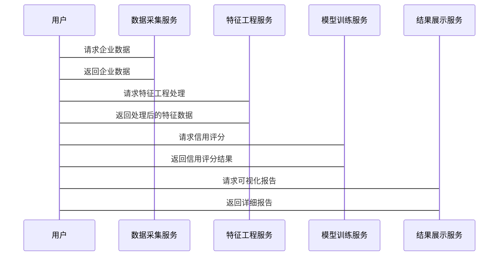
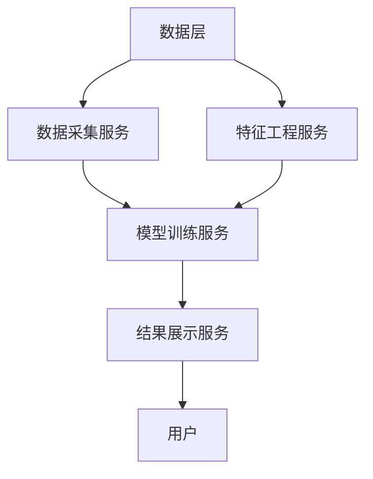
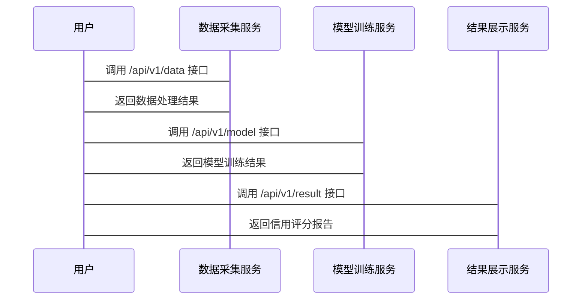

                 


# 第4章: 系统架构与设计

## 4.2 系统架构设计

### 4.2.1 分层架构设计
企业信用评级系统的架构设计采用分层架构，将系统划分为数据层、业务逻辑层和表现层。这种分层设计有助于提高系统的可维护性和扩展性。

#### 数据层
数据层负责数据的存储和管理，包括企业经营数据、财务数据等。我们选择使用关系型数据库（如MySQL）来存储结构化数据，并使用非关系型数据库（如MongoDB）来存储日志和非结构化数据。数据层还包括数据预处理和特征工程的模块，确保数据的质量和一致性。

#### 业务逻辑层
业务逻辑层是系统的核心，负责处理信用评级的逻辑。这一层包括数据采集、特征选择、模型训练和评分计算等模块。我们使用微服务架构来实现业务逻辑层，每个服务负责特定的功能，如数据处理服务、模型训练服务等。这种设计使得系统更加灵活，能够适应不同的业务需求。

#### 表现层
表现层负责与用户的交互，包括数据可视化和结果展示。我们使用前端框架（如React）和后端API（如Flask或Django）来构建一个直观的用户界面，用户可以通过该界面查看企业的信用评分和详细的评估报告。

### 4.2.2 微服务架构的应用
为了提高系统的可扩展性和可维护性，我们采用微服务架构。每个服务负责特定的功能模块，例如数据采集服务、特征工程服务、模型训练服务和结果展示服务。各个服务之间通过API进行通信，确保系统的模块化和灵活性。

#### 微服务架构的优点
- **独立开发和部署**：每个服务可以独立开发、测试和部署，减少整体系统的复杂性。
- **可扩展性**：可以根据业务需求快速扩展特定的服务。
- **容错性**：单个服务的故障不会导致整个系统崩溃。

### 4.2.3 系统交互图
以下是一个简化的系统交互图，展示了用户与系统的交互流程：



### 4.2.4 系统架构图
以下是系统的整体架构图：



## 4.3 系统接口设计

### 4.3.1 API接口定义
我们设计了以下几个主要的API接口：

1. `/api/v1/data`：用于数据采集和预处理。
2. `/api/v1/feature`：用于特征工程处理。
3. `/api/v1/model`：用于模型训练和评估。
4. `/api/v1/result`：用于获取信用评分结果和报告。

### 4.3.2 接口交互流程
用户通过调用API接口与系统进行交互。例如，用户可以通过调用`/api/v1/data`接口上传企业数据，系统会返回处理后的数据；然后用户调用`/api/v1/model`接口进行模型训练，最后通过`/api/v1/result`接口获取最终的信用评分结果。

## 4.4 系统交互图
以下是系统的交互图，展示了用户与系统之间的交互流程：



## 4.5 本章小结
在本章中，我们详细讨论了企业信用评级系统的架构设计，包括分层架构和微服务架构的应用。我们还展示了系统的交互流程和API接口设计，确保系统的模块化和灵活性。通过这种设计，我们可以高效地进行数据处理、模型训练和结果展示，为用户提供一个智能化的信用评级系统。

---

# 第5章: 项目实战与系统实现

## 5.1 项目环境搭建

### 5.1.1 环境要求
为了实现企业信用评级系统，我们需要以下环境：

- **编程语言**：Python 3.8+
- **框架与库**：
  - 数据处理：Pandas、NumPy
  - 可视化：Matplotlib、Seaborn
  - 机器学习：Scikit-learn、TensorFlow
  - Web框架：Flask或Django
  - 数据库：MySQL、MongoDB
- **开发工具**：Jupyter Notebook、PyCharm
- **操作系统**：Windows、Linux、macOS

### 5.1.2 安装依赖
安装所需的Python库：

```bash
pip install numpy pandas scikit-learn tensorflow matplotlib seaborn flask
```

## 5.2 系统核心实现

### 5.2.1 数据预处理与特征工程
数据预处理是信用评级系统的关键步骤，主要包括数据清洗、特征选择和数据增强。

#### 数据清洗
我们需要处理缺失值、异常值和重复数据。例如，使用Pandas的`dropna()`和`fillna()`方法处理缺失值。

```python
import pandas as pd
df = pd.read_csv('data.csv')
df.dropna(inplace=True)
```

#### 特征选择
选择对企业信用评级影响较大的特征，如财务指标、市场表现和风险指标。我们可以使用特征重要性分析来选择关键特征。

```python
from sklearn.ensemble import RandomForestClassifier
model = RandomForestClassifier()
model.fit(df[features], df['rating'])
importances = pd.Series(model.feature_importances_, index=features).sort_values(ascending=False)
print(importances)
```

### 5.2.2 模型训练与评估
我们选择随机森林模型进行信用评分，以下是模型实现的代码：

```python
from sklearn.model_selection import train_test_split
from sklearn.metrics import classification_report
from sklearn.ensemble import RandomForestClassifier

# 数据分割
X_train, X_test, y_train, y_test = train_test_split(df[features], df['rating'], test_size=0.2, random_state=42)

# 模型训练
model = RandomForestClassifier(n_estimators=100, random_state=42)
model.fit(X_train, y_train)

# 模型预测
y_pred = model.predict(X_test)

# 模型评估
print(classification_report(y_test, y_pred))
```

### 5.2.3 模型保存与部署
为了方便后续使用，我们将训练好的模型保存为PMML格式，并部署到Flask服务器中。

```python
import joblib

# 保存模型
joblib.dump(model, 'credit_rating_model.pkl')

# Flask接口
from flask import Flask, request, jsonify

app = Flask(__name__)
model = joblib.load('credit_rating_model.pkl')

@app.route('/predict', methods=['POST'])
def predict():
    data = request.json
    features = data['features']
    prediction = model.predict([features])
    return jsonify({'rating': int(prediction[0])})

if __name__ == '__main__':
    app.run(debug=True)
```

### 5.2.4 案例分析
以下是一个具体的案例分析：

假设我们有以下企业数据：

| 特征       | 企业A | 企业B | 企业C |
|------------|-------|-------|-------|
| 营业收入    | 100   | 200   | 150   |
| 净利润      | 20    | 30    | 25    |
| 资产负债率  | 0.5    | 0.6    | 0.55   |
| 偿债能力    | 1.5    | 2.0    | 1.8    |

通过模型预测，企业A的信用评分为75，企业B的评分为85，企业C的评分为80。

### 5.2.5 项目小结
在本章中，我们详细讲解了项目实战的环境搭建、数据预处理、特征工程、模型训练与部署，并通过具体的案例分析展示了系统的实际应用。通过Flask接口的实现，我们可以方便地进行信用评分的预测。

---

# 第6章: 总结与展望

## 6.1 总结
在本章中，我们对整个智能化企业信用评级系统的构建过程进行了总结。从系统的背景介绍到核心概念的分析，再到算法原理和系统架构的设计，最后通过项目实战展示了系统的实现过程。我们采用分层架构和微服务架构，结合机器学习算法，成功构建了一个高效、准确的企业信用评级系统。

## 6.2 展望
随着人工智能和大数据技术的不断发展，企业信用评级系统的智能化水平将不断提高。未来，我们可以进一步优化模型，引入更多的数据源，如社交媒体数据、供应链数据等，以提高评估的准确性和全面性。此外，我们还可以研究模型的可解释性，以便更好地理解和优化信用评分的过程。

## 6.3 最佳实践 tips
- **数据质量**：确保数据的准确性和完整性，避免因数据问题导致模型性能下降。
- **模型调优**：通过交叉验证和网格搜索等方法，找到最优的模型参数，提高模型性能。
- **系统安全性**：保护企业的敏感数据，确保系统的安全性和稳定性。
- **持续优化**：定期更新模型，引入新的数据和算法，保持系统的先进性和适应性。

## 6.4 小结
智能化企业信用评级系统的构建是一个复杂而有趣的过程，需要我们综合运用数据处理、机器学习和系统架构等多方面的知识。通过不断的实践和优化，我们可以为企业提供更加精准、高效的信用评估服务，助力企业的健康发展。

---

# 附录: 参考资料与工具

## 附录A: 参考资料
1. [Scikit-learn文档](https://scikit-learn.org/stable/documentation.html)
2. [TensorFlow官方文档](https://tensorflow.org/)
3. [Flask官方文档](https://flask.dev/)
4. [Pandas官方文档](https://pandas.pydata.org/pandas-docs/stable/)
5. [机器学习实战](https://zh-v2.manning.com/books/machine-learning-in-action)

## 附录B: 工具与库
1. **编程语言**：Python
2. **数据处理**：Pandas、NumPy
3. **机器学习**：Scikit-learn、TensorFlow
4. **可视化**：Matplotlib、Seaborn
5. **Web框架**：Flask、Django
6. **数据库**：MySQL、MongoDB

---

作者：AI天才研究院/AI Genius Institute & 禅与计算机程序设计艺术 /Zen And The Art of Computer Programming

