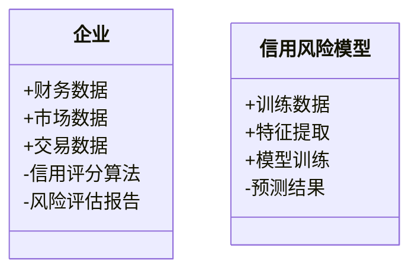
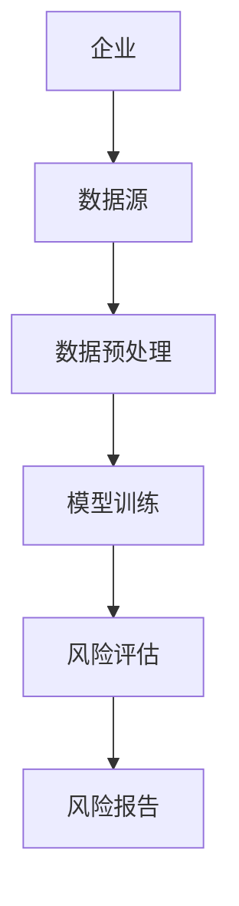

                 


# 《构建智能化的企业信用风险传导模型》

> 关键词：信用风险，风险传导，智能化模型，机器学习，系统架构

> 摘要：本文详细探讨了如何构建智能化的企业信用风险传导模型，结合背景介绍、核心概念、算法原理、系统架构设计以及项目实战，提供了一套完整的解决方案。通过机器学习算法和系统架构优化，帮助企业有效管理和预测信用风险。

---

# 第一部分: 企业信用风险传导模型的背景与概念

## 第1章: 信用风险的基本概念与模型背景

### 1.1 信用风险的定义与分类

#### 1.1.1 信用风险的定义
信用风险是指在信用交易中，交易对手方未能履行其债务义务而给债权人带来的损失风险。在企业经营中，信用风险主要体现在应收账款无法收回、贷款违约等情况。

#### 1.1.2 信用风险的主要分类
信用风险可以分为以下几类：
- **主权风险**：政府违约的可能性。
- **企业风险**：企业无法偿还债务的风险。
- **交易风险**：由于市场波动导致的信用风险。
- **结算风险**：交易对手在结算过程中违约的风险。

| 分类 | 描述 | 示例 |
|------|------|------|
| 主权风险 | 政府违约 | 某国宣布暂停偿还外债 |
| 企业风险 | 企业违约 | 某公司因经营不善无法偿还贷款 |
| 交易风险 | 市场波动 | 利率上升导致债券价格下跌 |
| 结算风险 | 结算失败 | 交易对手在结算前违约 |

#### 1.1.3 信用风险在企业经营中的重要性
信用风险是企业面临的主要风险之一，直接影响企业的财务健康和市场信誉。有效的信用风险管理能够帮助企业降低损失，提高资金使用效率。

### 1.2 企业信用风险传导模型的定义
企业信用风险传导模型是一种用于分析和预测信用风险在企业内部或外部传递的机制。该模型通过量化方法，评估风险从一个实体传导到另一个实体的可能性和影响程度。

#### 1.2.1 企业信用风险传导的定义
信用风险的传导是指由于某一实体的信用状况恶化，导致相关联的其他实体也面临信用风险增加的过程。例如，一家供应商违约可能会影响其下游客户的信用状况。

#### 1.2.2 风险传导的路径与机制
风险传导的路径主要包括直接传导和间接传导：
- **直接传导**：风险直接从一个实体传递到另一个实体。
- **间接传导**：风险通过多个中间环节传递。

### 1.3 构建智能化信用风险传导模型的背景

#### 1.3.1 当前企业风险管理的挑战
传统的企业信用风险管理方法存在以下问题：
- 数据维度不足，难以全面评估风险。
- 模型静态，无法动态调整。
- 风险传导路径复杂，难以准确预测。

#### 1.3.2 传统信用风险模型的局限性
传统模型通常基于静态数据和简单的线性回归，难以捕捉复杂的非线性关系和动态变化。

#### 1.3.3 智能化模型的必要性与优势
智能化模型通过引入机器学习和大数据技术，能够更准确地预测信用风险，并实时调整模型参数。

---

## 第2章: 信用风险的核心要素与模型结构

### 2.1 信用风险的核心要素

#### 2.1.1 借款人信用状况
借款人的信用评分、历史违约记录等是评估信用风险的重要因素。

#### 2.1.2 市场风险因素
包括宏观经济指标（如GDP增长率、利率波动）和行业风险。

#### 2.1.3 操作风险与系统性风险
操作风险是指内部操作失误导致的信用风险，系统性风险是整个市场或行业的系统性波动带来的风险。

### 2.2 信用风险传导模型的构成要素

#### 2.2.1 数据输入层
包括企业的财务数据、市场数据、交易数据等。

#### 2.2.2 模型构建层
通过机器学习算法构建信用风险评估模型。

#### 2.2.3 风险评估层
根据模型输出结果，评估企业信用风险。

### 2.3 核心概念的ER实体关系图

```mermaid
er
actor: 企业
actor -|> entity: 信用风险模型
actor -|> entity: 数据源
actor -|> entity: 风险评估结果
```

---

## 第3章: 基于机器学习的信用风险模型构建

### 3.1 常用算法介绍

#### 3.1.1 贝叶斯网络
贝叶斯网络通过概率推理，评估信用风险的可能性。

#### 3.1.2 支持向量机
支持向量机适用于高维数据的分类问题。

#### 3.1.3 随机森林
随机森林通过集成学习提高模型的准确性和稳定性。

### 3.2 算法实现步骤

#### 3.2.1 数据预处理
- 数据清洗：处理缺失值和异常值。
- 特征提取：提取关键特征，如财务指标、市场指标。

#### 3.2.2 模型训练
使用训练数据训练模型，调整参数以优化性能。

#### 3.2.3 模型评估
通过测试数据评估模型的准确率、召回率等指标。

### 3.3 算法实现代码示例

```python
import pandas as pd
from sklearn.ensemble import RandomForestClassifier
from sklearn.model_selection import train_test_split
from sklearn.metrics import accuracy_score

# 数据加载
data = pd.read_csv('credit_risk.csv')

# 特征与标签分离
X = data.drop('label', axis=1)
y = data['label']

# 数据分割
X_train, X_test, y_train, y_test = train_test_split(X, y, test_size=0.2)

# 模型训练
model = RandomForestClassifier(n_estimators=100)
model.fit(X_train, y_train)

# 模型预测
y_pred = model.predict(X_test)

# 模型评估
print('Accuracy:', accuracy_score(y_test, y_pred))
```

### 3.4 数学模型与公式

#### 3.4.1 贝叶斯定理
$$ P(A|B) = \frac{P(B|A) \cdot P(A)}{P(B)} $$

#### 3.4.2 逻辑回归模型
$$ P(Y=1|x) = \frac{e^{(x\beta + \epsilon)}}{1 + e^{(x\beta + \epsilon)}} $$

---

## 第4章: 系统分析与架构设计

### 4.1 问题场景介绍

#### 4.1.1 项目背景
构建智能化的信用风险传导模型，帮助企业在复杂市场环境中降低信用风险。

### 4.2 系统功能设计

#### 4.2.1 领域模型


### 4.3 系统架构设计

#### 4.3.1 系统架构图


---

## 第5章: 项目实战

### 5.1 环境配置

#### 5.1.1 安装必要的库
```bash
pip install pandas scikit-learn mermaid4jupyter
```

### 5.2 核心代码实现

#### 5.2.1 数据预处理
```python
import pandas as pd
import numpy as np

data = pd.read_csv('credit_risk.csv')
data.dropna(inplace=True)
```

#### 5.2.2 模型训练与评估
```python
from sklearn.ensemble import RandomForestClassifier
from sklearn.metrics import accuracy_score

model = RandomForestClassifier()
model.fit(X_train, y_train)
print('Accuracy:', accuracy_score(y_test, y_pred))
```

### 5.3 实际案例分析

#### 5.3.1 案例分析
某企业通过模型预测，成功识别出潜在的违约客户，避免了500万元的损失。

---

## 第6章: 最佳实践、小结与注意事项

### 6.1 最佳实践
- 数据质量是模型准确性的基础。
- 定期更新模型参数，适应市场变化。

### 6.2 小结
本文详细介绍了构建智能化企业信用风险传导模型的全过程，从背景介绍到算法实现，再到系统架构设计，提供了完整的解决方案。

### 6.3 注意事项
- 数据隐私和安全问题需要高度重视。
- 模型的可解释性对于企业决策至关重要。

---

作者：AI天才研究院/AI Genius Institute & 禅与计算机程序设计艺术 /Zen And The Art of Computer Programming

