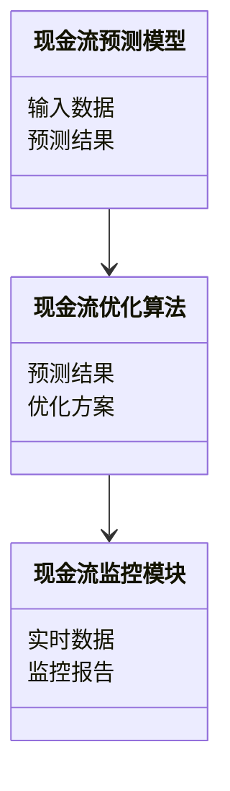
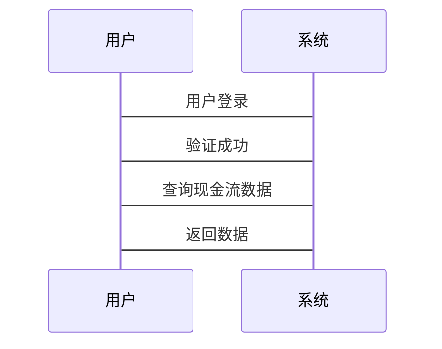

                 


# 《构建智能化的企业现金流管理优化平台》

> 关键词：现金流管理, 智能化优化, 人工智能, 大数据分析, 机器学习, 系统架构

> 摘要：现金流是企业财务健康的重要指标，智能化现金流管理优化平台通过大数据分析、人工智能和机器学习技术，能够实时预测和优化现金流，降低财务风险，提高企业资金利用效率。本文从现金流管理的基本概念出发，深入探讨智能化优化的核心算法和系统架构，结合实际案例分析，为企业构建智能化现金流管理平台提供理论和实践指导。

---

# 第一部分: 智能化企业现金流管理优化平台背景与概述

## 第1章: 企业现金流管理的定义与重要性

### 1.1 现金流管理的核心概念

#### 1.1.1 现金流管理的定义
现金流管理是指对企业资金流动的规划、预测和监控，包括收入和支出的管理，确保企业在任何时候都有足够的资金支持运营。

#### 1.1.2 现金流管理的分类与特点
现金流管理可以分为日常管理、预测管理和优化管理。日常管理关注实时资金流动，预测管理基于历史数据预测未来现金流，优化管理则通过算法寻找最佳资金分配方案。

#### 1.1.3 现金流管理在企业中的地位与作用
现金流管理是企业财务健康的核心，直接影响企业的生存和发展。良好的现金流管理可以降低财务风险，提高资金利用效率，为企业创造更大的价值。

### 1.2 智能化现金流管理的必要性

#### 1.2.1 传统现金流管理的局限性
传统现金流管理依赖人工操作，存在效率低、预测准确性差、难以实时调整等问题。特别是在数据量大、业务复杂的企业中，传统方法难以满足需求。

#### 1.2.2 智能化管理的优势与价值
智能化现金流管理利用大数据分析、人工智能和机器学习技术，能够实时预测和优化现金流，提高预测准确性，降低财务风险。

#### 1.2.3 智能化管理对企业竞争力的影响
通过智能化管理，企业可以更灵活地应对市场变化，优化资金分配，提升整体竞争力。

### 1.3 企业现金流管理的优化目标

#### 1.3.1 现金流预测与风险控制
通过预测模型，企业可以提前了解未来的现金流情况，制定应对策略，降低风险。

#### 1.3.2 资金分配与成本优化
智能化管理可以帮助企业在不同项目间优化资金分配，降低资金成本，提高投资回报率。

#### 1.3.3 现金流可视化与决策支持
通过可视化工具，企业可以更直观地监控现金流状况，支持更有效的决策。

---

## 第2章: 智能化现金流管理平台的技术背景与发展趋势

### 2.1 智能化管理的技术背景

#### 2.1.1 大数据与人工智能在财务管理中的应用
大数据技术提供了海量的财务数据，人工智能技术可以对这些数据进行深度分析，帮助预测和优化现金流。

#### 2.1.2 云计算与区块链技术对现金流管理的推动
云计算提供了弹性计算资源，使得企业可以轻松部署和扩展现金流管理平台。区块链技术提供了安全的交易记录，增强现金流管理的透明性和安全性。

#### 2.1.3 物联网技术在现金流监控中的作用
物联网技术可以实时监控企业的资金流动情况，提供实时数据支持现金流管理。

### 2.2 智能化现金流管理平台的发展趋势

#### 2.2.1 数据驱动的现金流预测与优化
随着数据量的增加和分析技术的进步，现金流管理将更加依赖数据驱动的预测和优化。

#### 2.2.2 AI算法在现金流管理中的深度应用
人工智能算法，如机器学习和深度学习，将在现金流预测和优化中发挥越来越重要的作用。

#### 2.2.3 平台化与生态化的发展方向
未来的现金流管理平台将更加平台化，支持多企业、多用户协同工作，形成生态系统。

### 2.3 本章小结

---

# 第二部分: 智能化现金流管理优化的核心概念与算法原理

## 第3章: 现金流管理优化的核心概念与模型

### 3.1 现金流管理的核心概念

#### 3.1.1 现金流预测模型
现金流预测模型是基于历史数据和市场信息，预测未来现金流的变化趋势。

#### 3.1.2 现金流风险评估指标
通过评估指标，企业可以了解现金流管理中的潜在风险，并制定应对策略。

#### 3.1.3 现金流优化算法
优化算法通过数学模型，寻找现金流管理的最佳方案，提高资金利用效率。

### 3.2 现金流管理优化的模型与方法

#### 3.2.1 时间序列分析模型
时间序列分析模型通过分析历史数据，预测未来的现金流情况。

#### 3.2.2 机器学习算法在现金流预测中的应用
机器学习算法，如随机森林和神经网络，可以提高现金流预测的准确性。

#### 3.2.3 基于动态规划的现金流优化方法
动态规划是一种优化算法，可以应用于现金流的分配和优化。

### 3.3 现金流管理优化的核心要素

#### 3.3.1 数据质量与完整性
高质量的数据是准确预测和优化的基础。

#### 3.3.2 模型的准确性和适用性
模型需要能够准确预测现金流，并适用于企业的实际情况。

#### 3.3.3 平台的可扩展性和灵活性
平台需要能够适应企业的发展需求，支持未来的扩展和升级。

---

## 第4章: 现金流预测与优化的数学模型与算法

### 4.1 现金流预测的数学模型

#### 4.1.1 线性回归模型
线性回归模型用于预测现金流与相关变量之间的线性关系。

$$y = \beta_0 + \beta_1x + \epsilon$$

其中，$y$ 是预测的现金流，$x$ 是自变量，$\beta_0$ 和 $\beta_1$ 是回归系数，$\epsilon$ 是误差项。

#### 4.1.2 时间序列ARIMA模型
ARIMA模型是一种常用的时间序列预测模型，适用于现金流的时间序列预测。

$$ARIMA(p, d, q)$$

其中，$p$ 是自回归阶数，$d$ 是差分阶数，$q$ 是移动平均阶数。

---

#### 4.1.3 机器学习算法

##### 4.1.3.1 随机森林
随机森林是一种基于决策树的集成学习算法，适用于现金流预测。

##### 4.1.3.2 神经网络
神经网络可以通过训练学习复杂的非线性关系，提高预测准确性。

---

### 4.2 现金流优化的数学模型与算法

#### 4.2.1 动态规划算法
动态规划算法适用于现金流分配的优化问题。

$$\text{最大化 } Z = \sum_{t=1}^{n} c_t x_t$$

约束条件：
$$\sum_{t=1}^{n} x_t \leq C$$
$$x_t \geq 0, \forall t$$

其中，$Z$ 是目标函数，$c_t$ 是现金流系数，$x_t$ 是分配变量，$C$ 是总预算。

#### 4.2.2 遗传算法
遗传算法是一种模拟自然选择的优化算法，适用于复杂的现金流优化问题。

---

## 第5章: 系统分析与架构设计方案

### 5.1 问题场景介绍

#### 5.1.1 现金流管理的复杂性
企业现金流管理涉及多个部门和业务，数据来源多样，管理复杂。

#### 5.1.2 传统方法的局限性
传统方法依赖人工操作，效率低，难以应对复杂的业务需求。

### 5.2 项目介绍

#### 5.2.1 项目目标
构建智能化的企业现金流管理优化平台，提高现金流预测和优化的准确性。

#### 5.2.2 项目范围
涵盖现金流预测、优化、监控和决策支持等功能。

---

### 5.3 系统功能设计

#### 5.3.1 领域模型设计
使用Mermaid绘制领域模型类图。



---

### 5.4 系统架构设计

#### 5.4.1 系统架构图
使用Mermaid绘制系统架构图。

```mermaid
archi
    现金流管理平台
    .属性: 界面友好，功能模块化
    .包含:
        - 数据采集模块
        - 预测模型模块
        - 优化算法模块
        - 监控模块
```

---

### 5.5 系统接口设计

#### 5.5.1 数据接口
平台需要与企业的财务系统、业务系统等进行数据交互。

#### 5.5.2 用户接口
提供直观的用户界面，方便用户操作和监控。

---

### 5.6 系统交互设计

#### 5.6.1 用户登录流程
使用Mermaid绘制用户登录序列图。



---

## 第6章: 项目实战

### 6.1 环境安装

#### 6.1.1 安装Python环境
使用Anaconda安装Python 3.8及以上版本。

#### 6.1.2 安装依赖库
安装numpy、pandas、scikit-learn等库。

### 6.2 核心代码实现

#### 6.2.1 现金流预测代码

```python
import pandas as pd
from sklearn.linear_model import LinearRegression

# 加载数据
data = pd.read_csv('cash_flow.csv')

# 拆分训练集和测试集
X_train = data[['revenue', 'expenses']]
y_train = data['cash_flow']

# 训练线性回归模型
model = LinearRegression()
model.fit(X_train, y_train)

# 预测
predictions = model.predict(X_test)
```

---

### 6.3 代码应用解读与分析

#### 6.3.1 数据清洗与预处理
对数据进行清洗，处理缺失值和异常值，确保数据质量。

#### 6.3.2 模型训练与优化
使用交叉验证优化模型参数，提高预测准确性。

### 6.4 实际案例分析

#### 6.4.1 案例背景
某制造企业希望通过智能化平台优化现金流管理。

#### 6.4.2 数据分析与建模
使用历史数据建立现金流预测模型，并进行验证。

#### 6.4.3 优化方案实施
根据预测结果，制定最优的资金分配方案。

### 6.5 项目小结

---

## 第7章: 最佳实践、小结、注意事项与拓展阅读

### 7.1 最佳实践 tips

#### 7.1.1 数据质量管理
确保数据的准确性和完整性，是提高预测模型准确性的关键。

#### 7.1.2 模型调优
通过交叉验证和网格搜索等方法，优化模型参数，提高预测效果。

### 7.2 小结

智能化现金流管理优化平台通过大数据分析和人工智能技术，显著提高了现金流预测和优化的准确性，为企业财务管理带来了革命性的变化。

### 7.3 注意事项

#### 7.3.1 数据隐私与安全
在处理企业数据时，需严格遵守数据隐私法规，确保数据安全。

#### 7.3.2 模型可解释性
复杂的模型可能难以解释，需要在模型选择时考虑可解释性。

### 7.4 拓展阅读

#### 7.4.1 推荐书籍
《Python机器学习实战》、《深入浅出数据分析》。

#### 7.4.2 推荐博客与资源
推荐相关的技术博客和在线课程，供读者进一步学习。

---

# 作者：AI天才研究院/AI Genius Institute & 禅与计算机程序设计艺术 /Zen And The Art of Computer Programming

---

以上是基于用户需求构建的目录大纲和文章内容的示例，您可以根据实际需求进一步扩展和调整。

