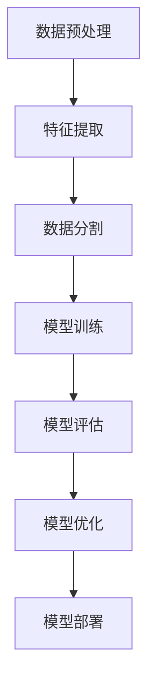
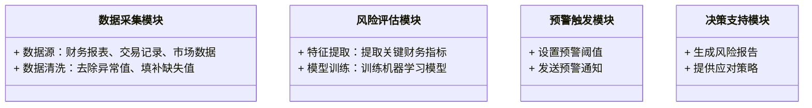
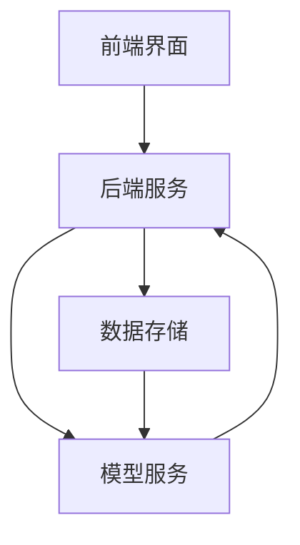

                 


# 《构建智能化的企业财务风险预警系统》

> 关键词：财务风险预警，人工智能，大数据，机器学习，智能化系统

> 摘要：本文详细探讨了如何利用人工智能和大数据技术构建智能化的企业财务风险预警系统。通过分析财务风险的主要类型、关键指标和预警模型，结合具体的算法实现和系统架构设计，本文提供了从理论到实践的全面指导，帮助企业在数字化转型中提升风险管理能力。

---

# 第一部分: 企业财务风险预警系统背景与概述

## 第1章: 问题背景与解决方案

### 1.1 企业财务风险的定义与重要性

#### 1.1.1 什么是企业财务风险
企业财务风险是指企业在经营过程中由于内外部因素导致财务状况恶化，进而影响企业偿债能力和持续经营能力的可能性。常见的财务风险包括流动性风险、负债风险和资产质量风险。

#### 1.1.2 财务风险对企业的影响
财务风险可能对企业造成直接的经济损失，例如无法按时偿还债务、资产贬值等。此外，财务风险还可能引发连锁反应，影响企业的信用评级、投资者信心和市场竞争力。

#### 1.1.3 构建预警系统的重要性
构建智能化的财务风险预警系统可以帮助企业在风险发生前及时发现并采取措施，从而降低损失。通过整合大数据和人工智能技术，预警系统能够提高预测的准确性和及时性，为企业决策提供有力支持。

---

### 1.2 财务风险预警的必要性

#### 1.2.1 传统财务风险管理的局限性
传统财务风险管理主要依赖人工分析，存在效率低、主观性强、覆盖范围有限等问题。人工分析容易受到人为因素的影响，且难以处理海量数据，导致风险识别不够及时和全面。

#### 1.2.2 智能化预警系统的优势
智能化预警系统利用大数据和人工智能技术，能够快速处理海量数据，发现潜在风险。通过机器学习算法，系统可以自动更新模型，提高预测精度。此外，智能化系统还能够实时监控企业财务状况，实现风险的早期预警。

#### 1.2.3 企业智能化转型的必然性
随着数字化转型的推进，企业需要更加高效和精准的管理工具。智能化财务风险预警系统不仅是技术进步的产物，也是企业提升竞争力的必然选择。

---

### 1.3 本章小结

#### 1.3.1 财务风险预警的核心目标
财务风险预警的核心目标是通过技术手段，提前识别和预测企业的财务风险，帮助企业采取有效措施，避免或降低风险带来的损失。

#### 1.3.2 系统构建的总体思路
构建智能化财务风险预警系统需要结合企业的实际需求，采用先进的大数据和人工智能技术，设计合理的系统架构，确保系统的高效性和准确性。

---

## 第2章: 问题描述与边界分析

### 2.1 财务风险的主要类型

#### 2.1.1 流动性风险
流动性风险是指企业无法及时获得足够的资金来偿还债务或满足日常经营需求的风险。这种风险通常与企业的现金流管理和资产流动性有关。

#### 2.1.2 负债风险
负债风险是指企业在偿还债务时可能面临困难的风险。高负债率和复杂的债务结构会增加企业的负债风险。

#### 2.1.3 资产质量风险
资产质量风险是指企业资产贬值或无法有效产生收益的风险。例如，应收账款的回收风险和存货的贬值风险都属于资产质量风险。

---

### 2.2 财务风险预警的关键指标

#### 2.2.1 财务比率分析
财务比率是衡量企业财务健康状况的重要指标。常用的比率包括：
- 流动比率（Current Ratio）
- 速动比率（Quick Ratio）
- 负债比率（Debt Ratio）
- 资产周转率（Asset Turnover）

#### 2.2.2 现金流分析
现金流分析是评估企业短期偿债能力的重要工具。通过分析经营活动、投资活动和筹资活动的现金流，可以判断企业的财务健康状况。

#### 2.2.3 财务报表预测模型
基于财务报表数据，构建预测模型可以帮助企业提前识别潜在的财务风险。常用的模型包括线性回归模型和时间序列分析模型。

---

### 2.3 系统构建的边界与外延

#### 2.3.1 系统功能边界
财务风险预警系统的功能包括数据采集、风险评估、预警触发和决策支持。系统不涉及企业的具体业务操作，仅提供风险预警和分析功能。

#### 2.3.2 数据范围与来源
系统需要整合企业的财务报表、交易数据、市场数据等多源数据。数据来源包括企业的内部财务系统、外部市场数据和第三方征信数据。

#### 2.3.3 用户角色与权限
系统的用户角色包括财务管理人员、决策层和风险分析师。不同角色具有不同的权限，例如财务管理人员可以查看实时数据，决策层可以获取综合分析报告。

---

## 第3章: 核心概念与联系

### 3.1 财务风险预警系统的概念结构

#### 3.1.1 系统组成模块
财务风险预警系统主要包括数据采集模块、风险评估模块、预警触发模块和决策支持模块。

#### 3.1.2 模块之间的关系
- 数据采集模块负责收集企业内外部数据。
- 风险评估模块利用算法对数据进行分析，生成风险评估结果。
- 预警触发模块根据评估结果，向相关人员发送预警信息。
- 决策支持模块提供风险分析报告和应对策略建议。

#### 3.1.3 ER实体关系图
以下是财务风险预警系统的ER实体关系图：

```mermaid
erd
title 财务风险预警系统 ER 图
entity 财务风险预警系统
  has 数据源（外部数据、内部数据）
  has 风险评估模型（机器学习模型、统计模型）
  has 预警触发规则（阈值、时间触发）
  has 决策支持模块（报告生成、策略建议）
```

---

### 3.2 核心概念对比分析

以下是传统财务管理和智能化预警系统的对比分析表：

| **属性**         | **传统财务管理**                     | **智能化预警系统**                     |
|------------------|--------------------------------------|----------------------------------------|
| 数据处理能力     | 依赖人工分析，处理能力有限           | 利用大数据技术，处理能力强大           |
| 风险识别能力     | 主观性强，识别精度低                 | 基于机器学习，识别精度高               |
| 预警及时性       | 及时性较低，依赖定期报告             | 实时监控，预警及时                   |
| 可扩展性         | 扩展性有限，难以应对大规模数据       | 具备高扩展性，能够处理海量数据         |

---

## 第4章: 算法原理讲解

### 4.1 机器学习算法的选择与应用

#### 4.1.1 支持向量机（SVM）
支持向量机是一种常用的分类算法，适用于小样本数据的分类问题。在财务风险预警中，SVM可以用于区分正常企业和存在风险的企业。

#### 4.1.2 随机森林（Random Forest）
随机森林是一种基于树的集成算法，具有较高的鲁棒性和抗过拟合能力。适用于多分类问题，能够处理高维数据。

#### 4.1.3 线性回归（Linear Regression）
线性回归适用于预测连续型变量，如企业的信用评分。在财务风险预警中，线性回归可以用于预测企业的违约概率。

---

### 4.2 算法实现流程

以下是机器学习算法的实现流程图：



---

### 4.3 算法的数学模型

#### 4.3.1 支持向量机
支持向量机的目标是最小化 hinge loss 函数，同时最大化分类间隔。其优化目标为：

$$
\min_{w,b,\xi} \frac{1}{2}||w||^2 + C\sum_{i=1}^{n}\xi_i
$$

$$
s.t. \quad y_i(w\cdot x_i + b) \geq 1 - \xi_i, \quad \xi_i \geq 0
$$

---

## 第5章: 系统分析与架构设计方案

### 5.1 系统功能设计

以下是系统的功能设计类图：



---

### 5.2 系统架构设计

以下是系统的架构设计图：



---

## 第6章: 项目实战

### 6.1 环境安装

以下是项目实战所需的环境配置：

- 操作系统：Linux/Windows/MacOS
- Python版本：3.6+
- 安装依赖：pandas、numpy、scikit-learn、xgboost

---

### 6.2 核心代码实现

以下是财务风险预警系统的核心代码实现：

```python
import pandas as pd
from sklearn.model_selection import train_test_split
from sklearn.ensemble import RandomForestClassifier
from sklearn.metrics import accuracy_score

# 加载数据
data = pd.read_csv('financial_data.csv')

# 数据预处理
data = data.dropna()
X = data.drop('label', axis=1)
y = data['label']

# 数据分割
X_train, X_test, y_train, y_test = train_test_split(X, y, test_size=0.2)

# 模型训练
model = RandomForestClassifier()
model.fit(X_train, y_train)

# 模型评估
y_pred = model.predict(X_test)
print("Accuracy:", accuracy_score(y_test, y_pred))
```

---

### 6.3 案例分析

以下是某企业的财务数据和预警结果：

| **企业名称** | **财务指标** | **模型预测** | **实际结果** |
|--------------|---------------|--------------|--------------|
| 企业A        | 高风险        | 预警触发     | 存在风险     |
| 企业B        | 低风险        | 无预警       | 无风险       |

---

## 第7章: 最佳实践与总结

### 7.1 小结

通过本文的详细讲解，我们了解了如何利用人工智能和大数据技术构建智能化的企业财务风险预警系统。系统的核心在于数据的采集、处理和分析，以及算法的选择和优化。

---

### 7.2 注意事项

- 数据质量和完整性是系统准确性的关键。
- 算法选择需要根据具体场景和数据特点进行调整。
- 系统的可解释性和透明度是用户信任的重要因素。

---

### 7.3 拓展阅读

- 《机器学习实战》
- 《Python数据分析 cookbook》
- 《企业风险管理与控制》

---

作者：AI天才研究院/AI Genius Institute & 禅与计算机程序设计艺术 /Zen And The Art of Computer Programming

