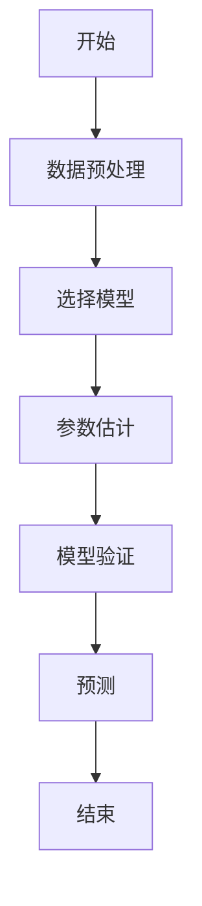
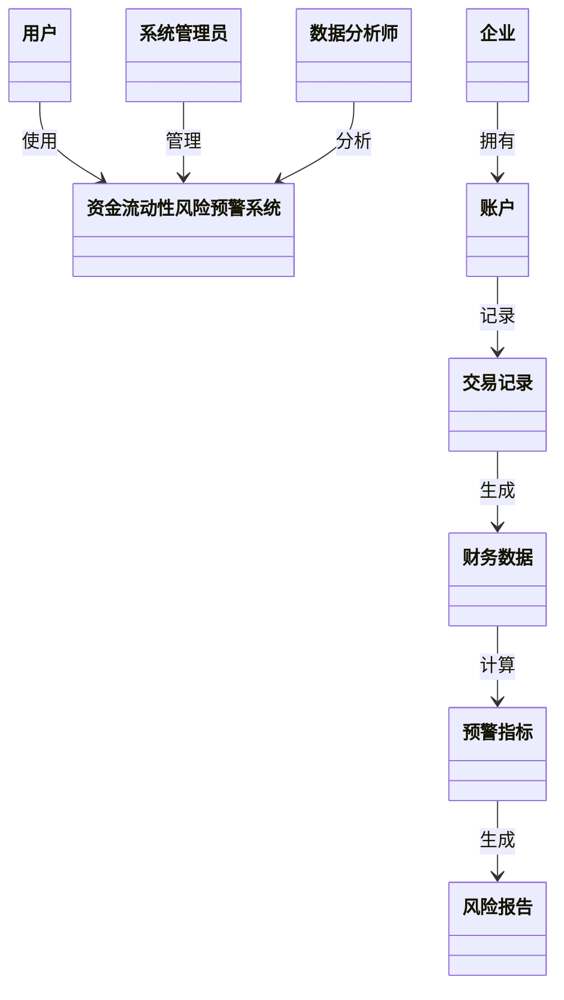
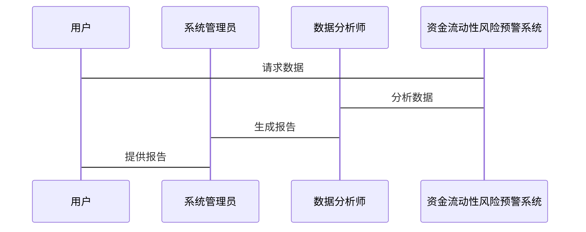

                 


# 构建智能化的企业资金流动性风险预警平台

> 关键词：资金流动性风险、预警平台、机器学习、时间序列分析、系统架构

> 摘要：本文详细探讨了构建智能化的企业资金流动性风险预警平台的各个方面，从问题背景到解决方案，从算法原理到系统架构，再到项目实战，为读者提供了一套完整的构建指南。通过结合时间序列分析和机器学习技术，本文提出了一个高效、准确的预警系统，帮助企业及时识别和应对资金流动性风险，确保企业的财务健康与稳定。

---

## 第一部分：企业资金流动性风险预警平台的背景与核心概念

### 第1章：资金流动性风险的背景与问题描述

#### 1.1 企业资金流动性风险的背景

企业的资金流动性风险是指企业在一定时期内无法及时获得足够资金来应对支付需求的可能性。这种风险在经济波动、市场变化或企业内部管理不当的情况下尤为突出。例如，2008年全球金融危机导致许多企业因资金链断裂而破产，这凸显了资金流动性风险的重要性。

#### 1.2 问题描述

资金流动性风险主要表现在以下几个方面：
- **现金流断裂**：企业无法及时偿还债务或支付运营费用。
- **短期债务压力**：企业面临大量短期债务到期，资金不足。
- **市场波动影响**：经济下行或市场萎缩导致企业收入减少，影响资金流动性。

#### 1.3 解决方法

为了有效管理资金流动性风险，企业需要构建一个智能化的预警平台。该平台通过实时监测企业的财务数据、市场信息和内部运营数据，利用机器学习和时间序列分析等技术，预测资金流动风险并发出预警。

#### 1.4 边界与外延

资金流动性风险预警平台的边界包括企业的财务数据、交易记录和市场数据。外延则涉及企业的上下游供应链、金融市场环境和政策变化。

### 第2章：核心概念与联系

#### 2.1 核心概念原理

资金流动性风险预警的核心在于分析企业的财务数据，特别是流动资产和流动负债的比例关系。常用指标包括流动比率（Current Ratio）、速动比率（Quick Ratio）和现金比率（Cash Ratio）。

#### 2.2 概念属性特征对比

| 概念       | 属性特征                     |
|------------|------------------------------|
| 流动性风险 | 数据来源：财务报表、现金流   |
| 预警指标   | 常用指标：流动比率、速动比率、现金比率 |

#### 2.3 ER实体关系图

```mermaid
er
  entity 企业
  entity 账户
  entity 交易记录
  entity 财务数据
  entity 预警指标
  relationship 企业 -> 账户: 拥有
  relationship 账户 -> 交易记录: 记录
  relationship 交易记录 -> 财务数据: 生成
  relationship 财务数据 -> 预警指标: 计算
```

---

## 第二部分：算法原理

### 第3章：时间序列分析

#### 3.1 时间序列分析的原理

时间序列分析是一种统计技术，用于分析随时间变化的数据。在资金流动性风险预警中，我们通常使用ARIMA模型。

#### 3.2 ARIMA模型

ARIMA模型由自回归（AR）、差分（I）和移动平均（MA）三部分组成。其数学公式为：

$$ ARIMA(p, d, q) $$

其中，p为自回归阶数，d为差分阶数，q为移动平均阶数。

#### 3.3 时间序列分析的流程



### 第4章：机器学习算法

#### 4.1 机器学习在资金流动性风险预警中的应用

机器学习算法（如随机森林和XGBoost）可以用于分类问题，将企业的财务数据分类为“风险”或“无风险”。

#### 4.2 机器学习模型的实现

```python
from sklearn.ensemble import RandomForestClassifier
from sklearn.metrics import accuracy_score

# 数据准备
X = df.drop('label', axis=1)
y = df['label']

# 模型训练
model = RandomForestClassifier()
model.fit(X_train, y_train)

# 模型预测
y_pred = model.predict(X_test)
print("准确率：", accuracy_score(y_test, y_pred))
```

---

## 第三部分：系统分析与架构设计

### 第5章：问题场景介绍

企业资金流动性风险预警平台需要实时监测企业的财务数据，分析市场趋势，并提供预警。

### 第6章：系统功能设计

#### 6.1 领域模型类图



### 第7章：系统架构设计

#### 7.1 系统架构图


### 第8章：接口设计与交互流程

#### 8.1 接口设计

- 数据接口：从企业财务系统获取数据。
- 预警接口：向用户发送预警通知。

#### 8.2 交互流程图



---

## 第四部分：项目实战

### 第9章：环境安装

#### 9.1 安装Python和相关库

```bash
pip install numpy pandas scikit-learn matplotlib
```

### 第10章：系统核心实现

#### 10.1 核心代码实现

```python
import numpy as np
import pandas as pd
from sklearn.ensemble import RandomForestClassifier
from sklearn.metrics import accuracy_score

# 数据加载
data = pd.read_csv('financial_data.csv')

# 数据预处理
X = data.drop('label', axis=1)
y = data['label']

# 划分训练集和测试集
X_train, X_test, y_train, y_test = train_test_split(X, y, test_size=0.2, random_state=42)

# 模型训练
model = RandomForestClassifier()
model.fit(X_train, y_train)

# 预测与评估
y_pred = model.predict(X_test)
print("准确率：", accuracy_score(y_test, y_pred))
```

### 第11章：案例分析与解读

#### 11.1 案例分析

假设某企业财务数据如下：

| 日期    | 流动资产 | 流动负债 |
|---------|----------|----------|
| 2023-01 | 1000     | 1500     |
| 2023-02 | 1200     | 1300     |
| 2023-03 | 1100     | 1400     |

流动比率计算为：

$$ \text{流动比率} = \frac{\text{流动资产}}{\text{流动负债}} $$

对于2023-01，流动比率 = 1000 / 1500 = 0.67，低于警戒线1，系统将发出预警。

---

## 第五部分：最佳实践与总结

### 第12章：小结

构建智能化的企业资金流动性风险预警平台需要结合时间序列分析和机器学习算法，通过实时监测和分析企业财务数据，提供准确的预警信息。

### 第13章：注意事项

- 数据质量和实时性是预警系统的关键。
- 系统需要定期更新模型和规则。
- 需要与企业的实际业务流程结合。

### 第14章：未来趋势与扩展阅读

未来，随着人工智能技术的进步，预警系统将更加智能化和自动化。推荐阅读《时间序列分析》和《机器学习实战》等书籍。

---

## 作者

作者：AI天才研究院/AI Genius Institute & 禅与计算机程序设计艺术 /Zen And The Art of Computer Programming

---

**本文由AI天才研究院原创，转载请注明出处。**

