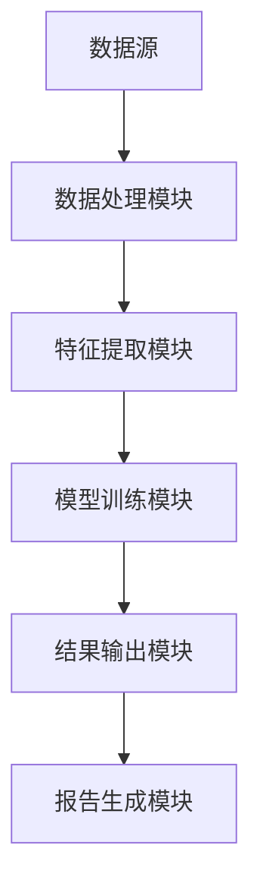
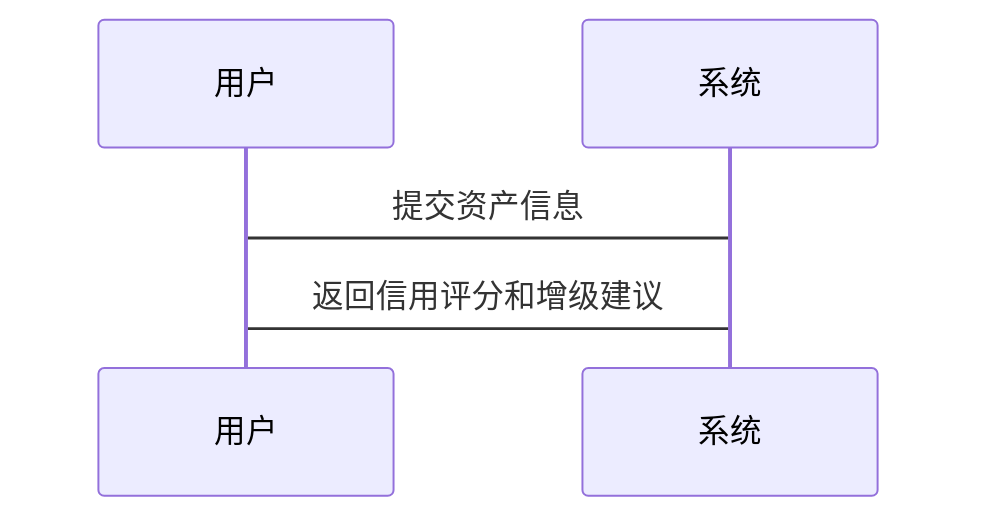

                 


# 构建智能化的资产证券化信用增级优化模型

> 关键词：资产证券化、信用增级、机器学习、风险管理、金融模型

> 摘要：本文详细介绍了如何利用机器学习和深度学习技术构建智能化的资产证券化信用增级优化模型。通过分析资产证券化的基本原理、信用增级的核心概念以及智能化模型的设计与实现，本文为金融领域的风险管理提供了新的思路和方法。

---

# 第1章: 资产证券化与信用增级基础

## 1.1 资产证券化的定义与特点

### 1.1.1 资产证券化的定义
资产证券化（Asset Securitization）是指将缺乏流动性但具有未来现金流的资产（如应收账款、房地产等）转化为可以在金融市场上流通的证券的过程。这一过程通过将资产池中的资产进行组合、包装和信用增级，从而吸引更多的投资者。

### 1.1.2 资产证券化的核心特点
1. **流动性增强**：将原本流动性较低的资产转化为可流通的证券，提高了资产的流动性。
2. **风险分散**：通过资产池的分散化，降低单一资产的风险。
3. **信用增级**：通过结构化设计和外部增级机构，提高证券的信用评级，降低投资者的风险。

### 1.1.3 资产证券化的基本流程
1. **资产选择与收购**：选择适合证券化的资产并将其收购。
2. **资产池的构建**：将多个资产组合成一个池子。
3. **信用增级**：通过结构化设计或外部担保等方式，提高证券的信用评级。
4. **证券发行与销售**：将结构化后的证券发行并销售给投资者。

## 1.2 信用增级的概念与作用

### 1.2.1 信用增级的定义
信用增级是指通过某种方式提高资产池的信用质量，使得发行的证券具有更高的信用评级，从而降低投资者的风险。

### 1.2.2 信用增级在资产证券化中的作用
1. **提高信用评级**：通过信用增级，证券的信用评级得以提高，吸引更多投资者。
2. **降低融资成本**：较高的信用评级通常意味着更低的融资成本。
3. **增强市场流动性**：高信用评级的证券更容易在市场上流通。

### 1.2.3 常见的信用增级方式
1. **过桥融资（Bridge Financing）**：通过引入第三方机构提供担保或备用资金。
2. **超额抵押（Over-collateralization）**：通过提供超过证券面值的抵押资产来降低风险。
3. **信用违约互换（CDS）**：通过购买信用违约互换来转移信用风险。

---

# 第2章: 资产证券化中的信用风险

## 2.1 信用风险的定义与分类

### 2.1.1 信用风险的定义
信用风险是指债务人或交易对手方未能履行其债务义务，导致债权人或投资者遭受损失的风险。

### 2.1.2 信用风险的分类
1. **系统性风险**：由于整个经济系统的影响，导致的信用风险。
2. **非系统性风险**：由于特定资产或交易对手的信用状况变化导致的信用风险。

## 2.2 资产证券化中的信用风险评估

### 2.2.1 信用风险评估的方法
1. **KMV模型**：通过资产的市场价值波动率来估计违约概率。
2. **Merton模型**：基于期权定价理论，估计资产的违约概率。
3. **VaR方法**：通过计算在一定置信水平下的最大损失来衡量风险。

### 2.2.2 资产证券化中的信用风险模型
1. **Merton模型**：用于估计资产池的违约概率。
2. **Cox模型**：用于估计资产池的违约时间。

### 2.2.3 信用风险的量化与分析
1. **违约概率（PD）**：资产池中资产违约的概率。
2. **违约损失率（LGD）**：违约资产的平均损失率。
3. **风险价值（VaR）**：在一定置信水平下的最大损失。

---

# 第3章: 智能化信用增级模型的核心概念

## 3.1 智能化信用增级模型的定义

### 3.1.1 智能化信用增级模型的定义
智能化信用增级模型是一种基于机器学习和人工智能技术的信用评估和增级模型，能够自动学习和优化信用增级策略，提高资产证券化的效率和效果。

## 3.2 智能化信用增级模型的实现原理

### 3.2.1 数据采集与处理
1. **数据来源**：包括资产池的资产信息、市场数据、交易数据等。
2. **数据清洗**：对数据进行去噪和标准化处理。
3. **特征提取**：提取与信用评估相关的特征，如资产的违约概率、损失率等。

### 3.2.2 模型训练与优化
1. **监督学习**：使用标记数据训练模型，如逻辑回归、随机森林等。
2. **无监督学习**：用于异常检测和聚类分析。
3. **深度学习**：使用神经网络模型进行非线性特征学习。

### 3.2.3 结果输出与应用
1. **信用评分**：模型输出资产池的信用评分。
2. **信用增级建议**：根据评分结果提出信用增级策略。

---

# 第4章: 智能化信用增级模型的算法原理

## 4.1 机器学习算法在信用增级中的应用

### 4.1.1 监督学习算法
1. **逻辑回归（Logistic Regression）**：用于分类问题，如违约与非违约分类。
2. **支持向量机（SVM）**：用于小样本分类问题。
3. **随机森林（Random Forest）**：用于特征重要性分析和分类。

### 4.1.2 无监督学习算法
1. **K-means聚类**：用于将资产分成不同的风险类别。
2. **DBSCAN聚类**：用于异常点检测。

### 4.1.3 深度学习算法
1. **神经网络（Neural Networks）**：用于非线性特征学习。
2. **长短期记忆网络（LSTM）**：用于时间序列数据的分析。

## 4.2 常见的信用评估算法

### 4.2.1 logistic回归
逻辑回归是一种常用的分类算法，用于估计资产违约的概率。

$$ P(Y=1|X) = \frac{1}{1 + e^{-\beta X}} $$

### 4.2.2 支持向量机
支持向量机通过构建超平面将数据分为两类，适用于小样本分类问题。

### 4.2.3 随机森林
随机森林通过集成多个决策树模型，提高分类的准确性和鲁棒性。

---

# 第5章: 智能化信用增级模型的数学模型

## 5.1 信用评分模型

### 5.1.1 logistic回归模型
逻辑回归模型用于分类问题，公式如下：

$$ P(Y=1|X) = \frac{e^{\beta X}}{1 + e^{\beta X}} $$

### 5.1.2 信用评分函数
信用评分函数将资产的特征转化为一个综合评分，用于衡量资产的信用风险。

$$ Score(X) = \beta_0 + \beta_1 X_1 + \beta_2 X_2 + ... + \beta_n X_n $$

### 5.1.3 模型的数学推导
通过最大似然估计法，可以求解逻辑回归模型的参数：

$$ \theta = \arg \max_{\theta} \sum_{i=1}^{n} \log P(Y_i|X_i, \theta) $$

## 5.2 风险评估模型

### 5.2.1 风险评分模型
风险评分模型通过综合考虑资产的风险因素，给出风险评分。

$$ Risk Score = \alpha \cdot PD + \beta \cdot LGD $$

### 5.2.2 风险评估函数
风险评估函数用于估计资产池的风险价值。

$$ VaR = \text{分位数}(\text{损失分布}, \alpha) $$

---

# 第6章: 智能化信用增级模型的系统架构设计

## 6.1 系统功能需求

### 6.1.1 数据采集与处理
系统需要采集资产池的资产信息、市场数据等，并进行清洗和特征提取。

### 6.1.2 模型训练与优化
系统需要支持多种机器学习算法，能够进行模型训练和优化。

### 6.1.3 结果输出与应用
系统需要输出信用评分和增级建议，并能够生成报告和可视化界面。

## 6.2 系统架构设计

### 6.2.1 系统架构图


### 6.2.2 系统交互图


---

# 第7章: 项目实战

## 7.1 环境安装

### 7.1.1 安装Python
安装Python 3.8及以上版本。

### 7.1.2 安装必要的库
安装以下Python库：
- `pandas`
- `numpy`
- `scikit-learn`
- `xgboost`

## 7.2 系统核心实现源代码

### 7.2.1 数据处理代码
```python
import pandas as pd
import numpy as np

# 数据加载
data = pd.read_csv('asset_data.csv')

# 数据清洗
data = data.dropna()
data = pd.get_dummies(data)

# 特征提取
X = data.drop(columns=['default'])
y = data['default']
```

### 7.2.2 模型训练代码
```python
from sklearn.ensemble import RandomForestClassifier
from sklearn.metrics import accuracy_score

# 模型训练
model = RandomForestClassifier()
model.fit(X, y)

# 模型预测
y_pred = model.predict(X)
print("Accuracy:", accuracy_score(y, y_pred))
```

## 7.3 实际案例分析
以某资产池为例，通过模型计算信用评分，并提出信用增级建议。

---

# 第8章: 最佳实践与总结

## 8.1 最佳实践

### 8.1.1 数据预处理的重要性
数据预处理是模型准确性的关键，需重视数据清洗和特征提取。

### 8.1.2 模型调优的技巧
通过交叉验证和网格搜索优化模型参数。

### 8.1.3 避免过拟合的建议
使用正则化方法和交叉验证防止过拟合。

## 8.2 项目小结

通过本文的介绍，我们详细探讨了智能化信用增级模型的构建过程，从数据处理、模型选择到系统实现，为资产证券化提供了新的思路和方法。

## 8.3 注意事项

在实际应用中，需注意模型的实时性和可解释性，确保模型的稳定性和可靠性。

## 8.4 拓展阅读

建议阅读以下书籍和论文：
1. 《Python机器学习实战》
2. 《资产证券化与信用风险》

---

作者：AI天才研究院/AI Genius Institute & 禅与计算机程序设计艺术 /Zen And The Art of Computer Programming

