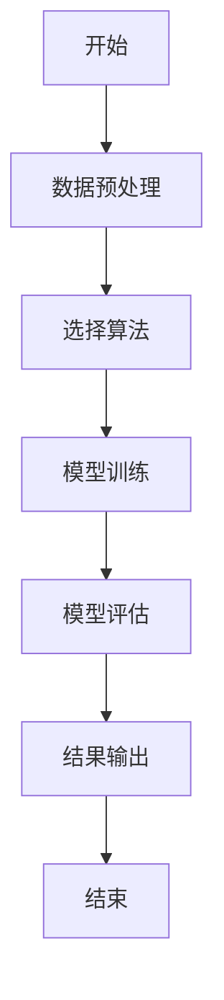

                 


# 构建智能化的资产证券化现金流压力测试模型

**关键词**：资产证券化、现金流压力测试、机器学习、风险管理、金融建模

**摘要**：本文详细探讨了如何利用机器学习和大数据技术构建智能化的资产证券化现金流压力测试模型。通过分析现金流预测的核心算法、压力测试的数学模型以及系统架构设计，本文为金融行业提供了理论支持和实践指导。结合实际案例，文章深入讲解了从数据预处理到模型部署的全过程，并提出了优化建议和未来研究方向。

---

## 第一部分: 资产证券化与现金流压力测试概述

### 第1章: 资产证券化与现金流压力测试概述

#### 1.1 资产证券化的基本概念

资产证券化是一种将资产转化为可流通证券的过程，通过将资产的未来现金流打包成可在市场上交易的金融工具，实现资产的流动性增强和风险分散。其核心在于将资产的现金流转化为可交易的证券，从而为投资者提供多样化的投资选择。

- **资产证券化的定义**：资产证券化是指将缺乏流动性但具有未来现金流的资产（如应收账款、房地产等）转化为可在市场上流通的证券的过程。
- **资产证券化的基本流程**：包括资产选择、SPV（特殊目的载体）设立、信用评级、证券发行和后续管理。
- **资产证券化的主要参与者**：发起人、承销商、评级机构、投资者等。

#### 1.2 现金流在资产证券化中的重要性

现金流是资产证券化的核心，决定了证券的价值和偿付能力。现金流预测的准确性直接影响到证券的定价和投资者的决策。

- **现金流预测的核心作用**：现金流预测是评估资产证券化产品价值的关键，决定了证券的发行价格和投资者的收益预期。
- **现金流与资产证券化的关系**：现金流是资产证券化的基础，决定了证券的偿付能力和市场吸引力。
- **现金流压力测试的意义**：通过对现金流进行压力测试，可以评估资产在极端情况下的表现，确保证券的安全性。

#### 1.3 现金流压力测试的背景与挑战

现金流压力测试是评估资产证券化产品在极端市场条件下的表现的重要手段。随着金融市场的波动加剧，现金流压力测试的需求日益增加。

- **金融危机与压力测试的重要性**：2008年金融危机暴露了金融机构在风险管理中的不足，促使各国加强对资产证券化产品的监管和风险评估。
- **资产证券化中的现金流波动风险**：资产的现金流受经济周期、市场波动等因素的影响，可能导致证券违约风险增加。
- **现金流压力测试的复杂性与技术难点**：现金流压力测试需要综合考虑多种风险因素，模型的复杂性和数据的准确性是主要挑战。

---

### 第2章: 资产证券化现金流压力测试模型的核心概念

#### 2.1 现金流预测模型的基本原理

现金流预测模型通过分析历史数据和市场信息，预测未来现金流的波动情况。常用的方法包括时间序列分析、机器学习模型等。

- **现金流预测的定义**：现金流预测是通过对历史数据和市场信息的分析，预测未来现金流的大小和分布。
- **现金流预测的主要方法**：
  - 时间序列分析：基于历史数据，预测未来的现金流。
  - 机器学习模型：利用特征工程和算法优化，提高预测的准确性。
- **现金流预测的输入与输出**：
  - 输入：历史现金流数据、市场指标（如利率、通胀率）、资产特征等。
  - 输出：预测的未来现金流及其波动情况。

#### 2.2 现金流压力测试的定义与分类

现金流压力测试是对资产在极端市场条件下的现金流表现进行评估的过程。根据测试的目的和方法，可以将其分为多种类型。

- **现金流压力测试的定义**：现金流压力测试是通过模拟极端市场条件，评估资产现金流的承受能力，从而判断证券的风险等级。
- **现金流压力测试的主要分类**：
  - **情景分析**：基于假设的市场情景（如经济衰退、利率上升），评估现金流的表现。
  - **蒙特卡洛模拟**：通过随机抽样和概率分布，模拟现金流的波动情况。
  - **风险价值（VaR）**：评估资产在一定置信水平下的最大损失。

#### 2.3 智能化现金流压力测试模型的核心要素

智能化模型结合了大数据和机器学习技术，提高了现金流预测和压力测试的准确性和效率。

- **数据驱动的特征**：利用大数据技术，整合多源数据，提高预测的准确性。
- **机器学习算法的应用**：采用深度学习、随机森林等算法，优化模型性能。
- **模型的实时性与动态调整能力**：通过实时数据更新和模型自适应，确保模型的准确性和及时性。

---

### 第3章: 现金流压力测试模型的算法原理

#### 3.1 现金流预测的常用算法

现金流预测模型的选择取决于数据特征和预测目标。常见的算法包括时间序列分析、机器学习模型等。

- **时间序列分析**：适用于具有明显趋势和周期性的数据。
  - **ARIMA模型**：通过自回归和移动平均成分，预测未来的现金流。
- **机器学习算法**：
  - **随机森林**：通过特征重要性分析，提取关键影响因素。
  - **神经网络**：利用深度学习模型，捕捉非线性关系。

#### 3.2 现金流压力测试的核心算法

压力测试算法的选择取决于测试的目的和数据特征。常用的算法包括蒙特卡洛模拟和VaR模型。

- **蒙特卡洛模拟**：
  - 通过生成大量随机现金流路径，评估资产在极端情况下的表现。
- **VaR模型**：
  - 通过统计方法，确定资产在一定置信水平下的最大损失。

#### 3.3 智能化模型的算法优化

智能化模型通过算法优化和模型集成，提高预测的准确性和效率。

- **超参数调优**：通过网格搜索或随机搜索，找到最优的模型参数。
- **模型集成**：通过投票、加权等方法，结合多个模型的结果，提高预测的稳定性。

#### 3.4 算法流程图

以下是现金流预测的算法流程图：



---

### 第4章: 现金流压力测试模型的数学模型与公式

#### 4.1 现金流预测的数学模型

现金流预测模型可以通过多种数学方法实现。以下是一些常用的模型及其公式。

- **时间序列模型（ARIMA）**：
  $$ARIMA(p, d, q)$$
  其中，p为自回归阶数，d为差分阶数，q为移动平均阶数。

- **随机森林模型**：
  $$y = \sum_{i=1}^{n} w_i x_i + b$$
  其中，$w_i$为特征$x_i$的权重，$b$为偏置项。

#### 4.2 压力测试的数学模型

压力测试模型通过模拟极端市场条件，评估资产现金流的承受能力。

- **蒙特卡洛模拟**：
  通过随机抽样和概率分布，模拟现金流的波动情况。
  $$P = \sum_{i=1}^{N} p_i x_i$$
  其中，$p_i$为情景$i$的概率，$x_i$为对应的情景下的现金流。

- **风险价值（VaR）模型**：
  $$VaR = \text{分位数}(P, \alpha)$$
  其中，$\alpha$为置信水平，$P$为现金流的概率分布。

---

### 第5章: 智能化现金流压力测试系统的架构与实现

#### 5.1 系统架构设计

智能化现金流压力测试系统由多个模块组成，包括数据处理、模型训练、压力测试和结果展示。

- **数据处理模块**：
  负责数据的清洗、转换和特征提取。
  ```mermaid
  graph TD
  A[数据源] --> B[数据清洗] --> C[特征提取]
  ```

- **模型训练模块**：
  包括算法选择和参数调优。
  ```mermaid
  graph TD
  C[特征提取] --> D[算法选择] --> E[模型训练]
  ```

- **压力测试模块**：
  通过模拟极端市场条件，评估现金流表现。
  ```mermaid
  graph TD
  E[模型训练] --> F[压力测试] --> G[结果输出]
  ```

- **结果展示模块**：
  将测试结果以可视化形式展示。
  ```mermaid
  graph TD
  G[结果输出] --> H[可视化展示]
  ```

#### 5.2 系统实现

以下是现金流预测模型的Python实现示例：

```python
import pandas as pd
from sklearn.ensemble import RandomForestRegressor
from sklearn.model_selection import train_test_split
from sklearn.metrics import mean_squared_error

# 数据加载
data = pd.read_csv('cash_flow.csv')
X = data.drop('target', axis=1)
y = data['target']

# 数据分割
X_train, X_test, y_train, y_test = train_test_split(X, y, test_size=0.2, random_state=42)

# 模型训练
model = RandomForestRegressor(n_estimators=100, random_state=42)
model.fit(X_train, y_train)

# 模型预测
y_pred = model.predict(X_test)

# 模型评估
 mse = mean_squared_error(y_test, y_pred)
 print(f'MSE: {mse}')
```

---

### 第6章: 项目实战与最佳实践

#### 6.1 环境安装

需要安装以下Python库：

```bash
pip install pandas numpy scikit-learn matplotlib
```

#### 6.2 核心实现

以下是现金流压力测试模型的实现步骤：

1. **数据预处理**：清洗数据，提取特征。
2. **算法选择**：选择适合的预测和压力测试算法。
3. **模型训练**：训练模型，调优参数。
4. **压力测试**：模拟极端情景，评估现金流表现。
5. **结果展示**：可视化结果，生成报告。

#### 6.3 案例分析

以某资产证券化产品为例，分析现金流压力测试的结果。

- **数据准备**：加载历史现金流数据和市场指标。
- **模型训练**：训练随机森林模型，预测未来现金流。
- **压力测试**：通过蒙特卡洛模拟，评估资产在极端市场条件下的表现。
- **结果分析**：生成压力测试报告，指导投资决策。

---

### 第7章: 总结与展望

#### 7.1 总结

本文详细探讨了智能化资产证券化现金流压力测试模型的构建方法，从理论到实践，全面分析了模型的设计、实现和应用。通过算法优化和系统架构设计，提高了模型的准确性和效率。

#### 7.2 展望

未来的研究方向包括：

- **模型优化**：进一步优化算法，提高预测的准确性。
- **数据源扩展**：引入更多数据源，丰富模型的输入特征。
- **实时性提升**：实现模型的实时更新和动态调整。

---

**作者：AI天才研究院/AI Genius Institute & 禅与计算机程序设计艺术 /Zen And The Art of Computer Programming**

