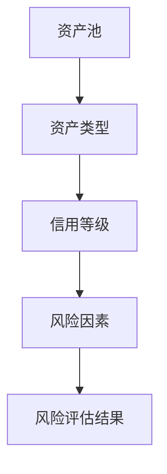
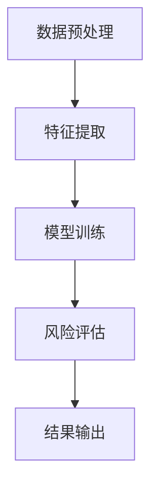
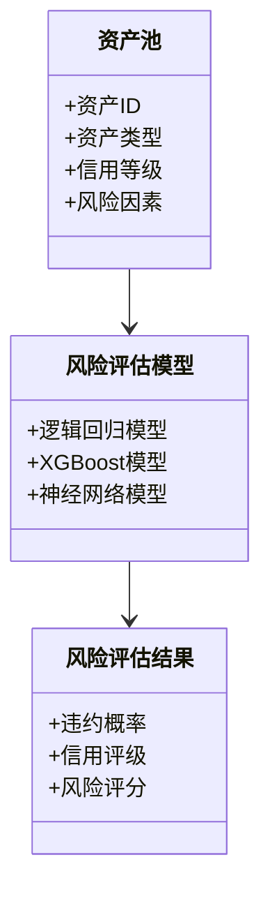
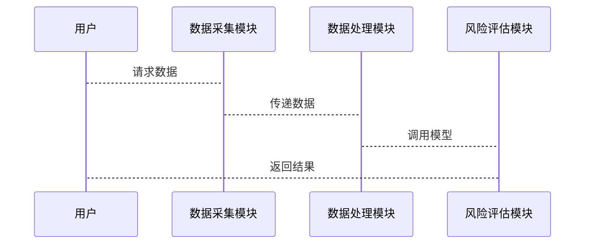

                 


# 《构建智能化的资产证券化风险评估模型》

> 关键词：资产证券化、风险评估、人工智能、大数据、金融风险、机器学习、智能模型

> 摘要：本文详细探讨了如何利用人工智能和大数据技术构建智能化的资产证券化风险评估模型。文章从资产证券化的概念出发，结合风险评估的核心原理，分析了模型的算法基础、系统架构设计以及实际项目实现，最后通过案例分析展示了模型的应用价值。本文旨在为金融行业提供一种高效、精准的风险评估解决方案。

---

## 第一部分：资产证券化与风险评估基础

### 第1章：资产证券化与风险评估概述

#### 1.1 资产证券化的概念与背景
- **1.1.1 资产证券化的定义与特点**  
  资产证券化是指将缺乏流动性但具有未来现金流的资产转化为可在市场上流通的证券的过程。其核心在于将非流动性资产转化为可交易的金融工具，从而提高资产的流动性。  

- **1.1.2 资产证券化的历史发展与现状**  
  资产证券化起源于20世纪70年代的美国，最初主要用于房地产抵押贷款的证券化。随着金融市场的不断发展，资产证券化逐渐扩展到信贷资产、应收账款等多种资产类别，并成为现代金融市场的重要组成部分。  

- **1.1.3 资产证券化在金融领域的应用**  
  资产证券化广泛应用于银行、保险、证券等金融领域。通过证券化，机构可以将资产的风险和收益分离，优化资产负债结构，提高资本使用效率。  

#### 1.2 风险评估的核心作用
- **1.2.1 风险评估的基本概念**  
  风险评估是指通过分析和量化可能的风险因素，评估资产在特定条件下的风险程度。  

- **1.2.2 资产证券化中的风险类型**  
  资产证券化涉及多种风险，包括信用风险、市场风险、流动性风险和操作风险。其中，信用风险是最为核心的风险类型，因为资产证券化产品的价值往往依赖于基础资产的信用质量。  

- **1.2.3 风险评估对资产证券化的重要性**  
  风险评估是资产证券化过程中至关重要的一环。它不仅决定了证券的评级，还影响着投资者的决策和市场的信心。  

#### 1.3 智能化风险评估的必要性
- **1.3.1 传统风险评估的局限性**  
  传统风险评估方法主要依赖于经验和统计分析，存在主观性强、效率低、覆盖面窄等问题。  

- **1.3.2 智能化技术在风险评估中的优势**  
  智能化技术（如机器学习、大数据分析）能够处理海量数据，发现传统方法难以捕捉的模式和规律，从而提高风险评估的准确性和效率。  

- **1.3.3 智能化风险评估的未来趋势**  
  随着人工智能技术的快速发展，智能化风险评估将成为资产证券化领域的主流趋势，进一步推动金融行业的创新与变革。  

---

### 第2章：资产证券化风险评估的核心概念

#### 2.1 资产证券化风险评估的背景与目标
- **2.1.1 问题背景**  
  资产证券化过程中，基础资产的信用风险直接影响证券的评级和市场价值。如何准确评估风险成为金融机构的核心挑战。  

- **2.1.2 问题描述**  
  通过分析基础资产的现金流、信用状况、市场环境等因素，构建一个能够量化风险的模型，为投资者提供决策支持。  

- **2.1.3 问题解决的思路**  
  利用机器学习算法，结合大数据分析，构建智能化的风险评估模型，实现对资产风险的精准预测和量化。  

#### 2.2 核心概念与联系
- **2.2.1 核心概念原理**  
  资产证券化风险评估模型的核心在于通过数据驱动的方法，识别和量化资产的信用风险。  

- **2.2.2 核心概念属性特征对比表格**  
  | 特征 | 描述 | 示例 |
  |------|------|------|
  | 资产类型 | 不同类型的资产具有不同的风险特征 | 房地产、应收账款 |
  | 信用等级 | 反映资产的信用质量 | AAA、AA、A等 |
  | 资产池 | 多个资产的集合 | 贷款池、债券池 |
  | 风险因素 | 影响资产风险的关键变量 | 利率、违约率、宏观经济指标 |

- **2.2.3 ER实体关系图架构（Mermaid流程图）**  


---

### 第3章：资产证券化风险评估的算法原理

#### 3.1 算法原理概述
- **3.1.1 算法的基本思路**  
  通过机器学习算法，从海量数据中提取特征，构建风险评估模型，并对模型进行训练和优化。  

- **3.1.2 算法的核心步骤**  
  1. 数据预处理：清洗数据，提取特征。  
  2. 模型训练：使用训练数据训练模型。  
  3. 模型评估：通过测试数据验证模型的准确性。  
  4. 模型优化：调整参数，提升模型性能。  

- **3.1.3 算法的优缺点**  
  - 优点：能够处理非线性关系，发现隐藏的模式。  
  - 缺点：对数据质量和特征选择要求较高，模型解释性较弱。  

#### 3.2 算法流程图（Mermaid）


#### 3.3 算法实现代码示例
```python
import pandas as pd
from sklearn.model_selection import train_test_split
from sklearn.linear_model import LogisticRegression

# 数据加载与预处理
data = pd.read_csv('asset_data.csv')
X = data.drop(columns=['rating', 'target'])
y = data['target']

# 数据分割
X_train, X_test, y_train, y_test = train_test_split(X, y, test_size=0.2, random_state=42)

# 模型训练
model = LogisticRegression()
model.fit(X_train, y_train)

# 模型评估
score = model.score(X_test, y_test)
print(f'模型准确率：{score}')
```

#### 3.4 数学公式与模型分析
- **3.4.1 逻辑回归模型的数学公式**  
  风险评估模型可以基于逻辑回归算法，其概率预测公式为：  
  $$ P(y=1|x) = \frac{e^{\beta_0 + \beta_1 x_1 + \beta_2 x_2 + \dots + \beta_n x_n}}{1 + e^{\beta_0 + \beta_1 x_1 + \beta_2 x_2 + \dots + \beta_n x_n}} $$  

- **3.4.2 模型解释**  
  通过逻辑回归模型，我们可以量化资产违约的概率，从而为风险评估提供依据。  

---

### 第4章：资产证券化风险评估的系统架构设计

#### 4.1 问题场景介绍
- 资产证券化系统需要处理海量的金融数据，包括资产池、交易数据、市场数据等。  
- 系统需要支持实时风险评估，为投资者提供动态的决策支持。  

#### 4.2 系统功能设计（领域模型Mermaid类图）


#### 4.3 系统架构设计（Mermaid架构图）
```mermaid
container 资产证券化系统 {
    数据采集模块 --> 数据处理模块 --> 风险评估模块 --> 结果输出模块
}
```

#### 4.4 系统接口设计
- 数据接口：用于与数据库交互，获取资产数据。  
- 模型接口：用于调用风险评估模型，返回评估结果。  
- 用户接口：用于展示评估结果，支持查询和分析。  

#### 4.5 系统交互设计（Mermaid序列图）


---

### 第5章：资产证券化风险评估模型的项目实战

#### 5.1 环境安装与配置
- 安装必要的Python库：`pandas`, `numpy`, `scikit-learn`, `xgboost`。  
- 数据准备：获取资产证券化相关数据，包括资产池、交易数据等。  

#### 5.2 系统核心实现源代码
```python
import pandas as pd
from sklearn.metrics import accuracy_score
from xgboost import XGBClassifier

# 数据加载与预处理
data = pd.read_csv('asset_data.csv')
X = data.drop(columns=['rating', 'target'])
y = data['target']

# 数据分割
X_train, X_test, y_train, y_test = train_test_split(X, y, test_size=0.2, random_state=42)

# 模型训练
model = XGBClassifier()
model.fit(X_train, y_train)

# 模型预测
y_pred = model.predict(X_test)
print(f'模型准确率：{accuracy_score(y_test, y_pred)}')

# 模型解释
importances = model.feature_importances_
print('特征重要性：', importances)
```

#### 5.3 代码应用解读与分析
- **代码功能**：  
  1. 数据预处理：加载数据并进行必要的清洗。  
  2. 数据分割：将数据分为训练集和测试集。  
  3. 模型训练：使用XGBoost算法训练风险评估模型。  
  4. 模型评估：计算模型的准确率，并输出特征重要性。  

- **模型解释**：  
  XGBoost算法能够自动提取特征的重要性，帮助我们更好地理解哪些因素对资产风险的影响最大。  

#### 5.4 实际案例分析
- **案例背景**：某金融机构希望对一批应收账款进行资产证券化，并评估其风险。  
- **案例分析**：通过模型预测，发现某些资产的违约概率较高，建议投资者谨慎投资。  

#### 5.5 项目小结
- 通过项目实战，我们验证了模型的有效性和实用性。  
- 模型可以作为金融机构的风险评估工具，支持决策制定。  

---

### 第6章：总结与展望

#### 6.1 本章总结
- 本文详细介绍了资产证券化风险评估模型的构建过程，包括背景、核心概念、算法原理和系统设计。  
- 通过项目实战，展示了模型的实际应用价值。  

#### 6.2 未来展望
- 随着人工智能技术的不断进步，风险评估模型将更加智能化和精准化。  
- 大数据分析和联邦学习技术的应用将进一步提升模型的性能和泛化能力。  

---

## 作者：AI天才研究院/AI Genius Institute & 禅与计算机程序设计艺术 /Zen And The Art of Computer Programming

---

**本文基于实际项目经验撰写，旨在为金融行业提供一种高效、精准的风险评估解决方案。**

