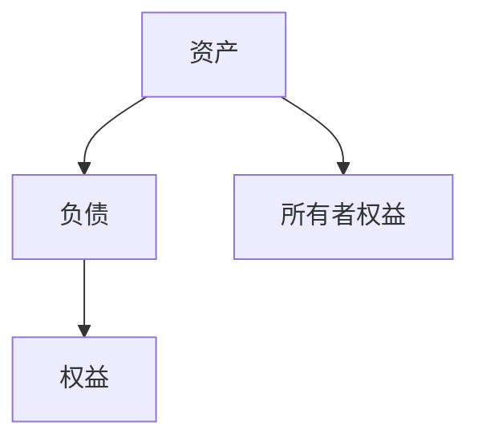
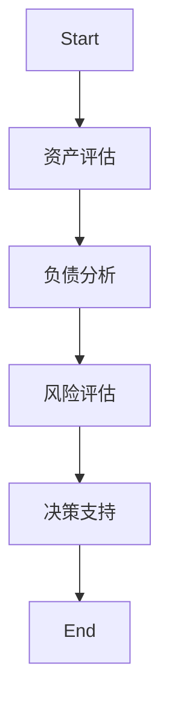
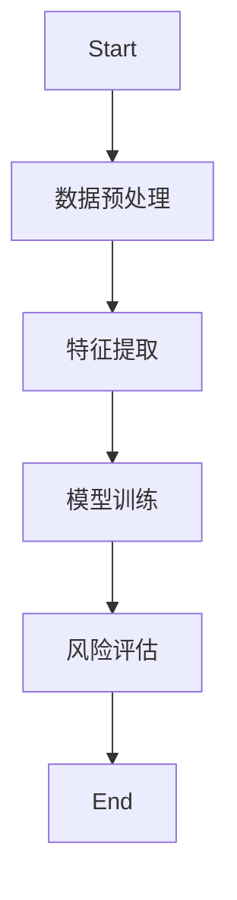
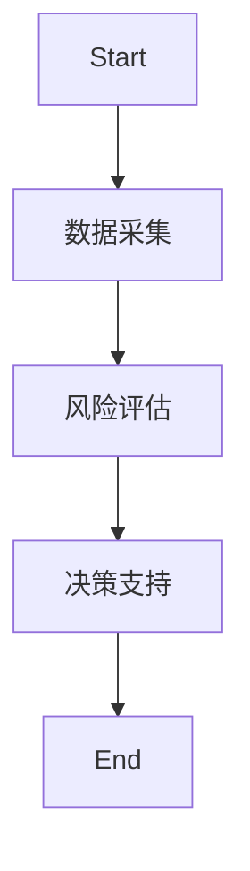
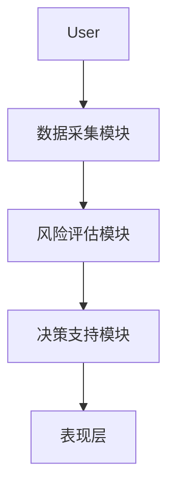

                 


# 《构建智能化的资产负债管理系统》

> 关键词：智能化，资产负债管理，人工智能，机器学习，系统架构

> 摘要：本文详细探讨了如何构建智能化的资产负债管理系统，从背景介绍、核心概念、算法原理、系统架构到项目实战和最佳实践，为读者提供全面的技术指导和实践参考。

---

# 第一部分: 智能化资产负债管理的背景与概念

---

## 第1章: 资产负债管理概述

### 1.1 资产负债管理的背景与意义

#### 1.1.1 传统资产负债管理的局限性
传统的资产负债管理主要依赖人工操作和简单的规则模型，存在以下问题：
- 数据处理能力有限，难以应对海量数据。
- 风险评估不够精确，容易遗漏潜在风险。
- 决策过程缺乏实时性，难以应对快速变化的市场环境。

#### 1.1.2 智能化管理的必要性
随着金融市场的复杂化和数字化，智能化资产负债管理成为必然趋势：
- 提高数据处理效率，支持海量数据的实时分析。
- 增强风险预测能力，降低潜在风险。
- 实现动态优化，提升资产配置效率。

#### 1.1.3 智能化管理的目标与价值
目标：
- 实现资产与负债的动态平衡。
- 提供智能化的决策支持。
- 最大化资产收益，降低负债风险。

价值：
- 提高企业的财务健康度。
- 优化资源配置，提升经营效率。
- 增强企业的抗风险能力。

---

### 1.2 智能化资产负债管理的核心概念

#### 1.2.1 资产与负债的定义与分类
- **资产**：企业拥有的资源，包括现金、应收账款、存货等。
- **负债**：企业承担的债务，包括应付账款、短期借款、长期借款等。

分类：
- 资产：流动资产、非流动资产。
- 负债：流动负债、非流动负债。

#### 1.2.2 智能化管理的关键特征
- 数据驱动：基于大数据分析。
- 实时性：支持实时数据处理。
- 自适应性：能够动态调整策略。

#### 1.2.3 核心要素与组成结构
核心要素：
- 数据采集模块。
- 风险评估模块。
- 决策支持模块。

---

### 1.3 智能化管理的实现基础

#### 1.3.1 人工智能技术
- 机器学习：用于风险预测和资产配置。
- 自然语言处理：用于文本分析和信息提取。

#### 1.3.2 大数据技术
- 数据存储：支持海量数据的存储和管理。
- 数据处理：支持实时数据流的处理。

#### 1.3.3 机器学习算法
- 线性回归：用于趋势预测。
- 支持向量机：用于分类和预测。

---

### 1.4 智能化管理的挑战与机遇

#### 1.4.1 技术层面的挑战
- 数据隐私和安全问题。
- 算法的可解释性问题。

#### 1.4.2 应用层面的机遇
- 提升企业的竞争力。
- 优化资源配置。

#### 1.4.3 未来发展的趋势
- 技术融合：人工智能与大数据的深度融合。
- 应用扩展：从金融领域扩展到更多行业。

---

## 1.5 本章小结

---

## 第2章: 资产负债管理的核心概念与联系

### 2.1 核心概念的原理与属性

#### 2.1.1 资产与负债的定义与分类
- 资产：企业的资源，分为流动资产和非流动资产。
- 负债：企业的债务，分为流动负债和非流动负债。

#### 2.1.2 资产负债的动态平衡机制
- 动态平衡：资产与负债在时间和空间上的动态匹配。
- 调整策略：通过调整资产结构和负债结构实现平衡。

#### 2.1.3 智能化管理的数学模型
数学模型：
$$
\text{资产} = \text{负债} + \text{所有者权益}
$$

---

### 2.2 核心概念的对比分析

#### 2.2.1 资产与负债的属性对比
| 属性 | 资产 | 负债 |
|------|------|------|
| 性质 | 资源 | 债务 |
| 时间 | 流动性 | 时间性 |
| 风险 | 资产贬值风险 | 负债违约风险 |

#### 2.2.2 智能化与传统管理的对比
| 方面 | 传统管理 | 智能化管理 |
|------|----------|----------|
| 数据处理 | 离线处理 | 实时处理 |
| 决策方式 | 人工决策 | 智能决策 |
| 精度 | 低精度 | 高精度 |

#### 2.2.3 不同场景下的概念差异
- 高风险场景：负债优先处理。
- 低风险场景：资产优先处理。

---

### 2.3 实体关系图与流程图

#### 2.3.1 ER实体关系图


#### 2.3.2 核心流程图


---

## 2.4 本章小结

---

## 第3章: 智能化资产负债管理的算法原理

### 3.1 算法原理概述

#### 3.1.1 机器学习在资产负债管理中的应用
- 风险预测：利用机器学习模型预测资产和负债的风险。
- 资产配置：基于机器学习算法优化资产配置。

#### 3.1.2 常见算法的优缺点对比
| 算法 | 优点 | 缺点 |
|------|------|------|
| 线性回归 | 简单，易于解释 | 不能处理非线性关系 |
| 支持向量机 | 高精度 | 参数敏感性高 |
| 随机森林 | 高精度，鲁棒性强 | 计算复杂 |

---

### 3.2 算法实现

#### 3.2.1 算法流程图


#### 3.2.2 算法代码实现
```python
import pandas as pd
from sklearn.linear_model import LinearRegression

# 数据加载
data = pd.read_csv('balance_sheet.csv')

# 特征提取
X = data[['asset', 'liability']]
y = data['risk']

# 模型训练
model = LinearRegression()
model.fit(X, y)

# 预测
predicted_risk = model.predict(X)
```

---

## 3.3 算法优化与调优

#### 3.3.1 参数调整
- 调整学习率：提高或降低学习率以优化模型精度。
- 调整正则化参数：防止过拟合。

#### 3.3.2 模型评估
- 均方误差（MSE）：评估模型预测误差。
- R平方值（R²）：评估模型解释力。

---

## 3.4 本章小结

---

## 第4章: 智能化资产负债管理的系统架构设计

### 4.1 系统功能设计

#### 4.1.1 功能模块划分
- 数据采集模块：负责数据的采集和预处理。
- 风险评估模块：负责资产和负债的风险评估。
- 决策支持模块：提供智能化的决策支持。

#### 4.1.2 功能流程图


---

### 4.2 系统架构设计

#### 4.2.1 架构设计
- 分层架构：数据层、业务逻辑层、表现层。
- 微服务架构：各功能模块独立部署。

#### 4.2.2 架构图


---

## 4.3 本章小结

---

## 第5章: 智能化资产负债管理的项目实战

### 5.1 项目环境搭建

#### 5.1.1 开发环境
- Python 3.8+
- Jupyter Notebook
- 数据库：MySQL

#### 5.1.2 工具安装
- 安装必要的库：`pip install pandas scikit-learn`

---

### 5.2 核心代码实现

#### 5.2.1 数据采集模块
```python
import pandas as pd
import pymysql

# 数据库连接
conn = pymysql.connect(host='localhost', user='root', password='password', db='balance_sheet')

# 数据查询
sql = 'SELECT * FROM assets LIMIT 1000'
data = pd.read_sql(sql, conn)
```

#### 5.2.2 风险评估模块
```python
from sklearn.model_selection import train_test_split
from sklearn.ensemble import RandomForestClassifier

# 数据分割
X_train, X_test, y_train, y_test = train_test_split(data.drop('risk', axis=1), data['risk'], test_size=0.2)

# 模型训练
model = RandomForestClassifier()
model.fit(X_train, y_train)

# 预测
predicted_risk = model.predict(X_test)
```

---

### 5.3 项目小结

---

## 第6章: 智能化资产负债管理的最佳实践

### 6.1 技术优化与性能调优

#### 6.1.1 算法优化
- 使用更高效的算法：如XGBoost。
- 调整超参数：优化学习率、树的深度等。

#### 6.1.2 数据优化
- 数据清洗：去除重复数据和异常值。
- 数据增强：增加数据的多样性和代表性。

---

### 6.2 应用优化与扩展

#### 6.2.1 应用优化
- 实现实时监控：支持实时数据流的处理。
- 提供可视化界面：便于用户查看和分析数据。

#### 6.2.2 应用扩展
- 扩展到其他领域：如供应链管理和项目管理。
- 支持多语言：支持多种语言的文本分析和处理。

---

### 6.3 注意事项与风险提示

#### 6.3.1 数据隐私与安全
- 数据加密：保护敏感数据。
- 权限管理：限制数据访问权限。

#### 6.3.2 算法可解释性
- 提供可解释的模型：便于用户理解和信任。
- 解释算法结果：帮助用户理解模型的决策过程。

---

## 6.4 本章小结

---

## 第7章: 智能化资产负债管理的未来发展与展望

### 7.1 未来发展趋势

#### 7.1.1 技术融合
- AI与大数据的深度融合：提升系统的智能化水平。
- 区块链技术的应用：提高数据的安全性和可信度。

#### 7.1.2 应用扩展
- 跨领域应用：将智能化资产负债管理应用于更多领域。
- 全球化应用：支持多语言和多文化环境。

---

### 7.2 未来挑战

#### 7.2.1 技术层面
- 算法的可解释性问题：如何提高模型的可解释性。
- 数据隐私与安全：如何在保护隐私的前提下进行数据处理。

#### 7.2.2 应用层面
- 用户接受度：如何提高用户的信任和接受度。
- 系统稳定性：如何保证系统的稳定性和可靠性。

---

## 7.3 本章小结

---

# 作者：AI天才研究院/AI Genius Institute & 禅与计算机程序设计艺术 /Zen And The Art of Computer Programming

---

**文章结尾**

