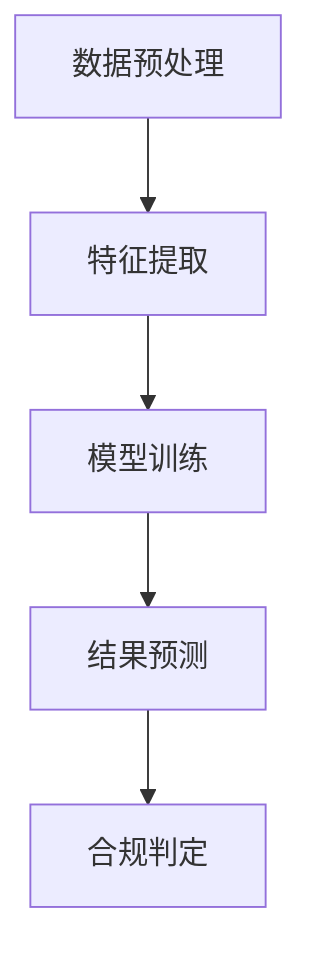
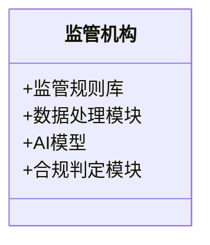
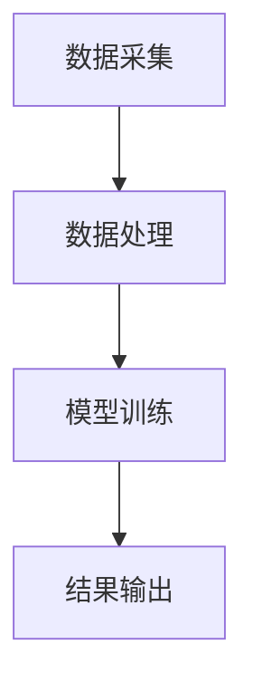

                 


# 构建智能化的金融监管合规系统

> 关键词：金融监管、AI大模型、大数据、系统架构、合规判定、数学公式

> 摘要：本文详细介绍了如何构建智能化的金融监管合规系统，从背景、核心概念、算法原理到系统架构、项目实战和最佳实践进行了全面阐述。通过结合AI大模型和大数据技术，提出了一套完整的解决方案，旨在提升金融监管的效率和准确性。

---

# 第1章: 金融监管合规系统背景介绍

## 1.1 问题背景与问题描述

### 1.1.1 传统金融监管的挑战
传统金融监管主要依赖人工审核和简单的规则匹配，存在效率低、覆盖面窄、难以应对复杂金融产品的缺陷。随着金融市场的快速发展，交易数据量激增，传统方法已难以满足实时性和精准性的要求。

### 1.1.2 智能化监管的需求与目标
智能化金融监管旨在通过AI技术实现对金融交易的实时监控、风险预警和合规判定。目标是提升监管效率，降低合规成本，同时增强监管的全面性和准确性。

### 1.1.3 金融合规监管的核心问题
- **数据多样性**：金融数据类型多样，包括文本、数值、时间序列等。
- **规则复杂性**：合规规则繁多且动态变化。
- **实时性要求**：需要快速响应和处理交易数据。

## 1.2 问题解决与边界定义

### 1.2.1 智能化监管的解决方案
通过引入AI大模型和大数据技术，构建智能化的金融监管合规系统，实现对金融交易的自动化分析和合规判定。

### 1.2.2 系统的边界与外延
- **边界**：系统仅处理金融交易数据，不涉及其他领域。
- **外延**：可扩展至其他类型数据，如社交媒体数据。

### 1.2.3 核心要素与组成结构
- 核心要素：监管规则库、数据处理模块、AI模型、合规判定模块。
- 组成结构：数据采集、数据处理、模型训练、结果输出。

## 1.3 本章小结

---

# 第2章: 智能化金融监管的核心概念与联系

## 2.1 核心概念原理

### 2.1.1 监管规则与数据处理
- 监管规则：包括反洗钱、关联交易、市场操纵等。
- 数据处理：清洗、转换、特征提取。

### 2.1.2 AI模型与合规判定
- AI模型：用于识别异常交易和预测风险。
- 合规判定：基于模型输出结果进行合规性判断。

### 2.1.3 大数据在金融监管中的应用
- 数据量大：处理海量金融交易数据。
- 数据多样性：涵盖结构化和非结构化数据。
- 数据实时性：支持实时监控。

## 2.2 核心概念对比分析

### 2.2.1 监管规则与数据特征对比
| 属性 | 监管规则 | 数据特征 |
|------|----------|----------|
| 类型 | 文本规则 | 数值、文本、时间序列 |

### 2.2.2 AI模型与传统规则的优劣势对比
| 对比维度 | AI模型 | 传统规则 |
|----------|--------|----------|
| 精准性 | 高 | 低 |
| 可解释性 | 低 | 高 |
| 适应性 | 强 | 弱 |

### 2.2.3 数据来源与处理方式的对比
| 数据来源 | 数据处理方式 |
|----------|-------------|
| 交易数据 | 清洗、特征提取 |
| 用户行为 | 行为分析、模式识别 |

## 2.3 ER实体关系图
```mermaid
er
    actor: 监管机构
    actor --> entity: 金融机构
    entity --> entity: 交易数据
    entity --> entity: 合规规则
    actor --> entity: 监管结果
```

## 2.4 本章小结

---

# 第3章: AI大模型在金融监管中的算法原理

## 3.1 算法原理概述

### 3.1.1 大模型的基本原理
AI大模型通过深度学习技术，从海量数据中学习特征，提取规律，用于金融监管中的异常检测和风险预测。

### 3.1.2 金融监管中的大模型应用
- 异常交易检测：识别潜在的洗钱行为。
- 风险预测：预测市场操纵风险。
- 自然语言处理：分析关联交易信息。

## 3.2 算法流程图


## 3.3 数学模型与公式

### 3.3.1 损失函数
$$L = \sum_{i=1}^{n} (y_i - \hat{y}_i)^2$$

### 3.3.2 优化方法
$$\theta = \theta - \eta \frac{\partial L}{\partial \theta}$$

### 3.3.3 模型评估指标
$$Precision = \frac{TP}{TP + FP}$$

## 3.4 本章小结

---

# 第4章: 系统分析与架构设计方案

## 4.1 问题场景介绍

### 4.1.1 系统目标
实现对金融交易的实时监控和合规判定。

### 4.1.2 系统范围
涵盖银行、证券、保险等金融领域的监管需求。

## 4.2 项目介绍

### 4.2.1 项目背景
随着金融市场的复杂化，需要智能化监管系统。

### 4.2.2 项目目标
构建一个高效、准确的金融监管合规系统。

## 4.3 系统功能设计

### 4.3.1 领域模型


## 4.4 系统架构设计

### 4.4.1 系统架构图


### 4.4.2 系统接口设计
- 数据接口：API用于数据采集和输出。
- 模型接口：API用于模型调用和训练。

## 4.5 系统交互流程图

```mermaid
sequenceDiagram
    actor 监管机构
    节点 数据采集模块
    节点 数据处理模块
    节点 AI模型
    节点 合规判定模块
    监管机构 -> 数据采集模块: 请求数据
    数据采集模块 -> 数据处理模块: 提供数据
    数据处理模块 -> AI模型: 训练模型
    AI模型 -> 合规判定模块: 输出结果
    合规判定模块 -> 监管机构: 提供合规判定
```

## 4.6 本章小结

---

# 第5章: 项目实战

## 5.1 环境安装

### 5.1.1 安装Python
```bash
python --version
pip install --upgrade pip
```

### 5.1.2 安装依赖库
```bash
pip install numpy pandas scikit-learn
```

## 5.2 系统核心实现源代码

### 5.2.1 数据预处理代码
```python
import pandas as pd
import numpy as np

def preprocess_data(data):
    # 数据清洗
    data.dropna(inplace=True)
    # 特征提取
    features = data[['amount', 'time', 'user_id']]
    return features
```

### 5.2.2 模型训练代码
```python
from sklearn.model_selection import train_test_split
from sklearn.linear_model import LogisticRegression

X_train, X_test, y_train, y_test = train_test_split(features, labels, test_size=0.2)
model = LogisticRegression().fit(X_train, y_train)
```

## 5.3 实际案例分析

### 5.3.1 案例背景
分析一笔大额交易，判断是否为洗钱行为。

### 5.3.2 数据分析
- 交易金额：100万
- 交易时间：深夜
- 用户ID：高风险用户

### 5.3.3 模型判定
```python
model.predict([[1000000, 23, 'high_risk']])
# 输出：1（异常）
```

## 5.4 项目小结

---

# 第6章: 最佳实践、小结、注意事项和拓展阅读

## 6.1 最佳实践
- 数据质量：确保数据清洗和特征提取的准确性。
- 模型选择：根据具体需求选择合适的模型。
- 可解释性：关注模型的可解释性，便于调整和优化。

## 6.2 小结
智能化金融监管合规系统通过AI技术显著提升了监管效率和准确性。

## 6.3 注意事项
- 数据隐私：确保数据处理符合隐私保护法规。
- 模型更新：定期更新模型，适应新的监管规则。

## 6.4 拓展阅读
推荐阅读相关领域的书籍和论文，如《深度学习》和《金融风险管理》。

---

# 作者：AI天才研究院 & 禅与计算机程序设计艺术

---

**本文为AI天才研究院原创，转载请注明出处。**

