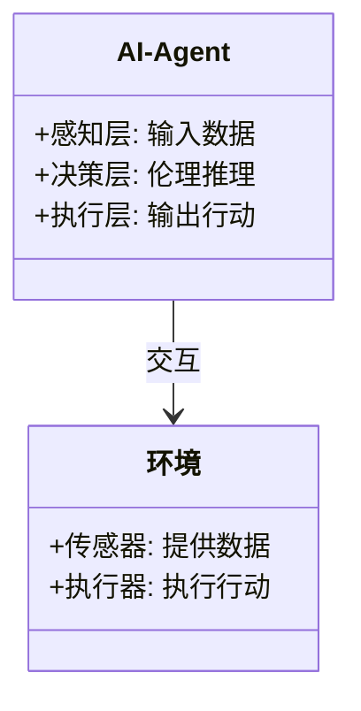
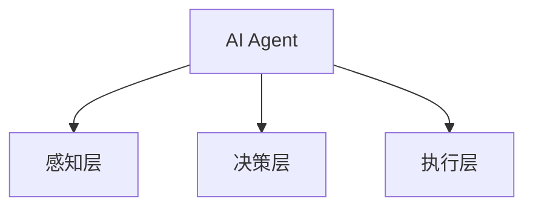
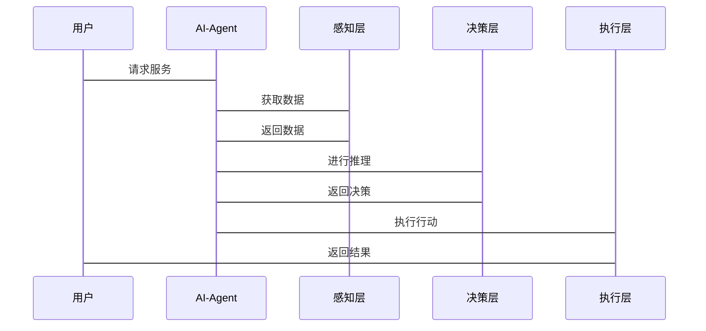

                 


# 《构建符合道德准则的AI Agent》

---

## 关键词：AI Agent、道德准则、伦理框架、算法实现、系统架构

---

## 摘要：  
本文探讨了如何构建符合道德准则的AI Agent，涵盖了从基本概念到算法实现再到系统架构的全过程。通过分析伦理框架、决策算法和系统设计，文章展示了如何将道德准则融入AI Agent的开发中，确保其行为符合人类价值观。结合实际案例，文章还提供了具体的实现步骤和最佳实践建议，为开发者提供了实用的指导。

---

## 第1章：AI Agent的基本概念与伦理问题

### 1.1 AI Agent的定义与核心概念

#### 1.1.1 AI Agent的基本定义  
AI Agent（人工智能代理）是指能够感知环境、自主决策并采取行动的智能实体。它通过传感器获取信息，利用计算模型处理数据，并通过执行器与环境交互。

#### 1.1.2 AI Agent的核心要素与属性  
AI Agent的核心要素包括：  
- **感知能力**：通过传感器获取环境数据。  
- **推理能力**：基于逻辑推理或机器学习模型进行决策。  
- **行动能力**：通过执行器执行决策。  
- **自主性**：能够在没有外部干预的情况下运行。  
- **反应性**：能够根据环境变化动态调整行为。  

#### 1.1.3 AI Agent的分类与应用场景  
AI Agent可以分为以下几类：  
- **简单反射型Agent**：基于预定义规则进行反应。  
- **基于模型的反射型Agent**：利用内部模型进行推理和规划。  
- **目标驱动型Agent**：根据目标进行决策和行动。  
- **效用驱动型Agent**：通过最大化效用函数来优化决策。  

应用场景包括自动驾驶、智能助手、机器人管家等。

---

### 1.2 道德准则在AI Agent中的重要性

#### 1.2.1 道德准则的定义与特征  
道德准则是指指导行为的一系列原则和规范，通常涉及公平性、透明性、隐私保护等。  

#### 1.2.2 AI Agent与人类伦理的关联  
AI Agent的行为直接影响用户和环境，因此必须遵循人类社会的道德规范，避免对人类造成伤害或利益损失。

#### 1.2.3 道德准则在AI Agent中的实现挑战  
- **复杂性**：道德问题往往没有明确的解决方案。  
- **动态性**：环境变化可能导致道德准则的适用性发生变化。  
- **文化差异**：不同文化背景下，道德准则可能有所不同。  

---

### 1.3 当前AI Agent中的伦理问题与挑战

#### 1.3.1 AI Agent的决策透明性问题  
AI Agent的决策过程必须清晰可解释，否则难以获得用户的信任。

#### 1.3.2 AI Agent的公平性与偏见问题  
AI Agent可能因为训练数据中的偏见而导致不公平的决策。

#### 1.3.3 AI Agent的隐私保护问题  
AI Agent需要处理大量数据，如何保护用户隐私是一个重要挑战。

---

## 第2章：AI Agent的伦理框架与法律标准

### 2.1 伦理框架的核心概念

#### 2.1.1 基于规则的伦理框架  
基于规则的伦理框架通过预定义的规则来指导决策。例如，医疗AI Agent可以基于医学伦理准则进行诊断。

#### 2.1.2 基于案例的伦理框架  
基于案例的伦理框架通过分析类似案例来推导决策。这种方法适用于法律领域，AI Agent可以辅助律师进行案例分析。

#### 2.1.3 基于效用的伦理框架  
基于效用的伦理框架通过最大化整体利益来优化决策。例如，在自动驾驶中，AI Agent可能在面临事故时选择伤害最小的行动方案。

---

### 2.2 AI Agent伦理框架的对比分析

#### 2.2.1 不同伦理框架的特征对比  
| 伦理框架      | 基于规则 | 基于案例 | 基于效用 | 基于义务 |
|----------------|----------|----------|----------|----------|
| 决策依据      | 预定义规则 | 类似案例 | 整体利益 | 道德义务 |
| 适用场景      | 医疗、教育 | 法律 | 自动驾驶 | 社会服务 |

#### 2.2.2 伦理框架的选择标准与适用场景  
选择伦理框架时需要考虑：  
- 数据的可获得性。  
- 决策的复杂性。  
- 领域的特殊性。  

---

### 2.3 道德准则的法律与行业标准

#### 2.3.1 AI Agent相关法律框架概述  
主要法律框架包括GDPR（通用数据保护条例）和《AI法案》。

#### 2.3.2 行业标准与最佳实践  
- **透明性**：确保用户了解AI Agent的决策过程。  
- **可解释性**：提供决策的解释。  
- **可追溯性**：记录决策过程以便追溯问题。  

#### 2.3.3 国际与国内伦理准则对比  
国际上，欧盟的《AI法案》强调透明性和可追溯性；国内，中国发布了一系列AI伦理规范。

---

## 第3章：AI Agent的伦理推理与决策算法

### 3.1 伦理推理的基本原理

#### 3.1.1 基于规则的伦理推理  
基于规则的伦理推理通过预定义的规则进行决策，例如在自动驾驶中避免伤害人类。

#### 3.1.2 基于案例的伦理推理  
基于案例的伦理推理通过分析类似案例来推导决策，例如在司法辅助系统中。

#### 3.1.3 基于效用的伦理推理  
基于效用的伦理推理通过计算不同选项的效用值来选择最优决策，例如在自动驾驶中的“电车难题”。

---

### 3.2 伦理决策算法的核心原理

#### 3.2.1 伦理决策的数学模型  
伦理决策可以通过效用函数表示：  
$$ U = \sum_{i=1}^{n} w_i x_i $$  
其中，$w_i$ 是权重，$x_i$ 是特征。

#### 3.2.2 伦理决策的权重分配  
权重分配需要根据具体场景调整，例如在自动驾驶中，保护人类生命的权重可能更高。

#### 3.2.3 伦理决策的冲突解决机制  
冲突解决机制包括优先级排序和随机选择，例如在自动驾驶中优先保护车内乘客。

---

### 3.3 伦理推理算法的实现步骤

#### 3.3.1 数据输入与预处理  
输入包括环境数据和伦理准则。

#### 3.3.2 伦理规则的提取与编码  
将伦理准则转换为可计算的规则，例如将“保护人类生命”编码为权重较高的特征。

#### 3.3.3 决策计算与结果输出  
根据算法计算出最优决策，并输出结果。

---

## 第4章：AI Agent的伦理推理算法实现

### 4.1 基于规则的伦理推理算法

#### 4.1.1 算法原理与实现步骤  
1. 输入环境数据。  
2. 提取相关特征。  
3. 应用预定义规则。  
4. 输出决策结果。  

#### 4.1.2 算法的优缺点对比  
- 优点：简单易实现，决策明确。  
- 缺点：难以应对复杂场景。

---

### 4.2 基于效用的伦理推理算法

#### 4.2.1 算法原理与实现步骤  
1. 定义效用函数。  
2. 计算各选项的效用值。  
3. 选择最优决策。  

#### 4.2.2 算法的优缺点对比  
- 优点：能够处理复杂场景。  
- 缺点：需要大量计算资源。

---

## 第5章：AI Agent的系统分析与架构设计

### 5.1 系统功能设计

#### 5.1.1 领域模型类图  


### 5.2 系统架构设计

#### 5.2.1 系统架构图  


### 5.3 系统接口与交互设计

#### 5.3.1 序列图  


---

## 第6章：AI Agent的项目实战

### 6.1 环境安装

```bash
pip install numpy pandas scikit-learn
```

### 6.2 核心实现

```python
def ethical_reasoning(features, weights):
    utility = sum(w * f for w, f in zip(weights, features))
    return utility

weights = [0.5, 0.3, 0.2]
features = [1, 1, 1]
decision = ethical_reasoning(features, weights)
print(decision)
```

### 6.3 案例分析

#### 6.3.1 自动驾驶的伦理决策  
在自动驾驶中，AI Agent需要在事故不可避免时，选择伤害最小的行动方案。

---

## 第7章：AI Agent的伦理构建最佳实践

### 7.1 小结  
本文详细探讨了AI Agent的道德构建过程，包括理论、算法和系统设计。

### 7.2 注意事项  
在开发过程中，需注意算法的透明性、可解释性和公平性。

### 7.3 拓展阅读  
推荐书籍：《AI的伦理与法律》、《机器学习与伦理》。

---

## 作者  
作者：AI天才研究院 & 禅与计算机程序设计艺术

