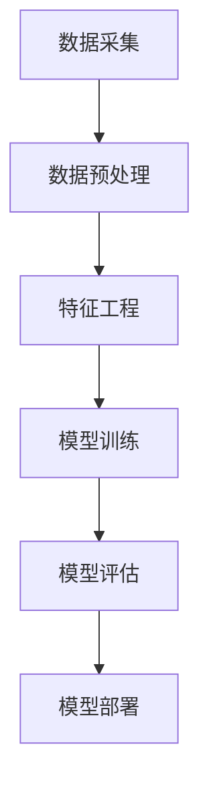
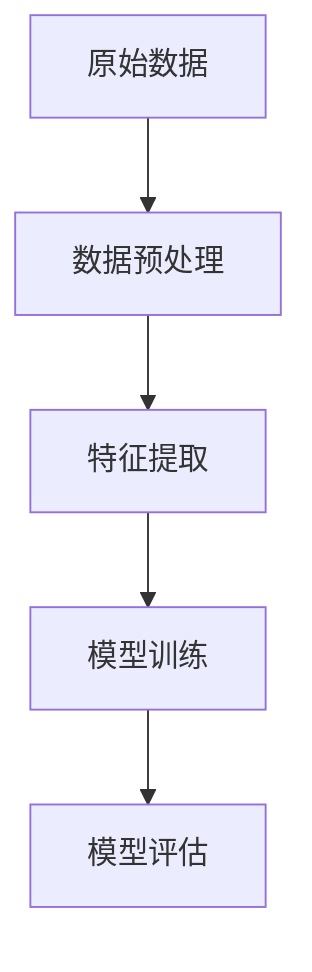

                 


# 构建精准的投资风险评估模型

## 关键词：投资风险评估、机器学习、风险管理、金融建模、数据分析

## 摘要：
投资风险评估是金融领域的重要组成部分，传统的风险评估方法往往依赖于历史数据和专家经验，存在主观性和局限性。随着大数据和人工智能技术的快速发展，构建精准的投资风险评估模型成为可能。本文将从理论基础、算法原理、系统架构到项目实战，全面解析如何利用现代技术手段，构建高效、准确的投资风险评估模型，为投资者提供科学的决策支持。

---

# 第一部分：投资风险评估模型的背景与核心概念

## 第1章：投资风险评估的背景与重要性

### 1.1 投资风险评估的定义与意义
#### 1.1.1 投资风险的定义
投资风险是指在投资过程中，由于市场波动、经济环境变化等因素，导致投资收益低于预期甚至出现损失的可能性。投资风险是投资者在追求收益过程中必须面对的核心问题之一。

#### 1.1.2 投资风险评估的意义
投资风险评估是投资者在决策过程中不可或缺的一部分，它帮助投资者量化潜在风险，优化投资组合，降低损失的可能性。精准的风险评估能够为投资者提供科学依据，帮助其在复杂多变的市场环境中做出明智决策。

#### 1.1.3 投资风险评估的应用场景
投资风险评估广泛应用于股票、债券、基金等多种金融资产的评估中。尤其是在量化投资、风险管理、资产配置等领域，精准的风险评估能够显著提升投资效率和收益。

---

### 1.2 投资风险评估的传统方法
#### 1.2.1 基于历史数据的统计分析
传统的投资风险评估方法主要依赖历史数据的统计分析，例如计算资产的波动率、VaR（Value at Risk）等指标。这种方法简单易行，但在面对非线性关系和复杂市场行为时表现有限。

#### 1.2.2 基于专家经验的定性分析
专家经验在投资风险评估中也起着重要作用，但其主观性较强，难以量化和验证。

#### 1.2.3 传统方法的局限性与改进方向
传统方法在面对复杂市场环境和大数据时代的需求时，往往显得力不从心。例如，传统方法难以捕捉非线性关系，无法有效应对大数据和实时性要求。

---

### 1.3 精准投资风险评估模型的必要性
#### 1.3.1 传统方法的不足
传统投资风险评估方法在数据量大、市场波动剧烈的情况下，难以提供精准的评估结果。

#### 1.3.2 数据驱动的精准评估需求
随着大数据和人工智能技术的发展，利用数据驱动的方法构建精准的投资风险评估模型成为可能。通过分析海量数据，可以发现传统方法难以捕捉的规律，从而提高评估的准确性。

#### 1.3.3 技术进步对精准评估的支撑
现代技术的进步，尤其是机器学习和深度学习算法的引入，为精准投资风险评估提供了强大的工具和方法。

---

## 第2章：投资风险评估的核心概念与理论基础

### 2.1 风险评估的基本概念
#### 2.1.1 风险的分类与特征
风险可以分为市场风险、信用风险、流动性风险等。每种风险都有其独特的特征和表现形式。

#### 2.1.2 投资风险的来源分析
投资风险的来源包括市场波动、经济周期、政策变化、公司基本面变化等多个方面。

#### 2.1.3 风险与收益的权衡关系
投资风险与收益之间存在密切的权衡关系。高风险通常意味着高收益，但同时也伴随着更大的损失可能性。

---

### 2.2 投资组合风险评估的理论基础
#### 2.2.1 马科维茨投资组合理论
马科维茨的投资组合理论是现代投资组合理论的基础，强调通过优化资产配置来最大化收益并最小化风险。

#### 2.2.2 资本资产定价模型（CAPM）
CAPM模型通过将资产的预期收益与系统性风险相关联，为投资风险评估提供了理论依据。

#### 2.2.3 风险中性定价理论
风险中性定价理论假设投资者对风险持中性态度，通过无风险利率和风险溢价来定价资产。

---

### 2.3 数据驱动的精准风险评估方法
#### 2.3.1 机器学习在风险评估中的应用
机器学习算法（如随机森林、梯度提升树）能够通过大数据分析，发现传统方法难以捕捉的非线性关系。

#### 2.3.2 统计学习与深度学习的对比
统计学习方法注重模型的可解释性，而深度学习则在处理复杂数据模式方面具有优势。

#### 2.3.3 精准评估的核心要素
精准投资风险评估的核心要素包括高质量的数据、先进的算法、合理的模型架构以及有效的验证机制。

---

## 第3章：投资风险评估模型的核心算法与数学基础

### 3.1 常见的风险评估算法
#### 3.1.1 线性回归模型
线性回归模型通过拟合线性关系，预测资产的收益与风险之间的关系。

#### 3.1.2 逻辑回归模型
逻辑回归模型适用于二分类问题，常用于评估资产违约风险。

#### 3.1.3 支持向量机（SVM）
支持向量机通过构建超平面，将数据点分为不同类别，适用于分类和回归问题。

#### 3.1.4 随机森林与梯度提升树
随机森林和梯度提升树是基于树结构的集成学习方法，能够有效处理复杂数据模式。

---

### 3.2 算法原理与数学推导
#### 3.2.1 线性回归的最小二乘法推导
线性回归通过最小化残差平方和来估计参数：
$$ \hat{\beta} = (X^T X)^{-1} X^T y $$

#### 3.2.2 逻辑回归的对数似然函数
逻辑回归通过最大化对数似然函数来估计参数：
$$ L(\beta) = -\sum_{i=1}^{n} [y_i \ln p_i + (1 - y_i) \ln (1 - p_i)] $$

#### 3.2.3 支持向量机的拉格朗日对偶
支持向量机通过拉格朗日对偶转换为对偶问题：
$$ \max_{\beta, \rho, \xi} \frac{1}{2} ||\beta||^2 + C \sum_{i=1}^{n} \xi_i $$

---

### 3.3 算法选择与优化策略
#### 3.3.1 基于数据特征的算法选择
根据数据特征（如线性性、分布形态等）选择合适的算法。

#### 3.3.2 超参数调优与交叉验证
通过网格搜索和交叉验证优化模型的超参数，提升模型性能。

#### 3.3.3 模型性能评估指标
常用的模型性能指标包括准确率、召回率、F1分数等。

---

## 第4章：投资风险评估模型的系统架构与数据建模

### 4.1 系统架构设计
#### 4.1.1 系统功能设计
系统功能包括数据采集、预处理、特征工程、模型训练、评估与部署。

#### 4.1.2 系统架构图
使用Mermaid图展示系统架构设计。



---

### 4.2 数据建模与分析
#### 4.2.1 数据特征分析
通过数据分析工具（如Pandas、Matplotlib）进行数据清洗和特征分析。

#### 4.2.2 数据流图
使用Mermaid绘制数据流图，展示数据从采集到建模的流程。



---

## 第5章：投资风险评估模型的项目实战

### 5.1 项目背景与目标
#### 5.1.1 项目背景
本项目旨在构建一个基于机器学习的投资风险评估模型，帮助投资者量化和管理投资风险。

#### 5.1.2 项目目标
实现一个能够预测股票风险的模型，评估其在不同市场环境下的表现。

---

### 5.2 项目核心实现
#### 5.2.1 环境安装与配置
安装Python、Pandas、Scikit-learn、XGBoost等工具。

#### 5.2.2 数据清洗与特征工程
```python
import pandas as pd
import numpy as np

# 数据清洗
data = pd.read_csv('stock_data.csv')
data = data.dropna()
data = pd.get_dummies(data)
```

#### 5.2.3 模型训练与评估
```python
from sklearn.ensemble import RandomForestClassifier
from sklearn.metrics import accuracy_score

model = RandomForestClassifier()
model.fit(X_train, y_train)
y_pred = model.predict(X_test)
print("准确率:", accuracy_score(y_test, y_pred))
```

---

### 5.3 项目总结与优化
#### 5.3.1 项目小结
通过本项目，我们成功构建了一个基于机器学习的投资风险评估模型，验证了其在实际应用中的有效性。

#### 5.3.2 模型优化建议
进一步优化模型性能，例如引入深度学习算法、优化特征选择策略等。

---

## 第6章：投资风险评估模型的扩展与优化

### 6.1 模型的实时性与可解释性
#### 6.1.1 实时性优化
通过流数据处理技术，实现模型的实时更新与预测。

#### 6.1.2 可解释性提升
通过模型解释性工具（如SHAP值）提高模型的可解释性。

---

### 6.2 大数据环境下的投资风险评估
#### 6.2.1 大数据环境的特点
大数据环境下，数据量大、类型多样，对模型的计算能力和存储要求更高。

#### 6.2.2 大数据环境下的优化策略
利用分布式计算框架（如Spark）进行数据处理和模型训练。

---

### 6.3 异构数据的融合与分析
#### 6.3.1 异构数据的定义
异构数据指来自不同来源、格式多样化的数据。

#### 6.3.2 异构数据的融合方法
通过数据转换和特征提取，实现异构数据的融合与分析。

---

## 第7章：总结与展望

### 7.1 总结
本文系统地介绍了投资风险评估模型的构建过程，从理论基础到算法实现，再到系统架构与项目实战，全面展示了如何利用现代技术手段构建精准的投资风险评估模型。

### 7.2 展望
未来，随着人工智能技术的不断发展，投资风险评估模型将更加智能化、个性化。深度学习、强化学习等技术的应用将进一步提升模型的准确性和实用性。

---

## 作者：AI天才研究院/AI Genius Institute & 禅与计算机程序设计艺术 /Zen And The Art of Computer Programming

---

感谢您的耐心阅读！如果对本文内容有任何疑问或建议，请随时与我们联系。

