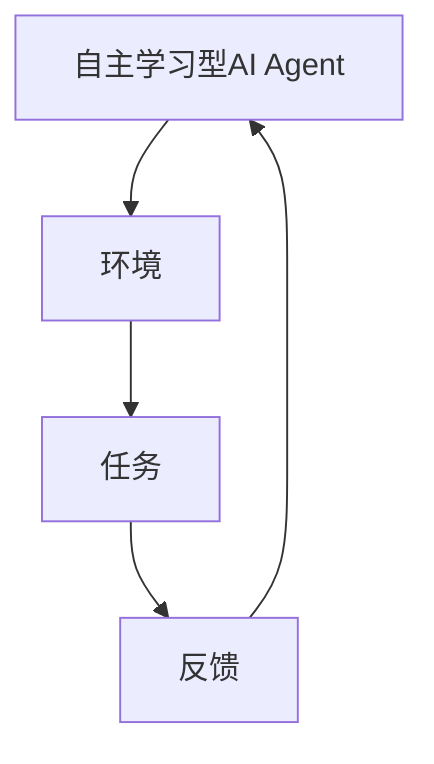
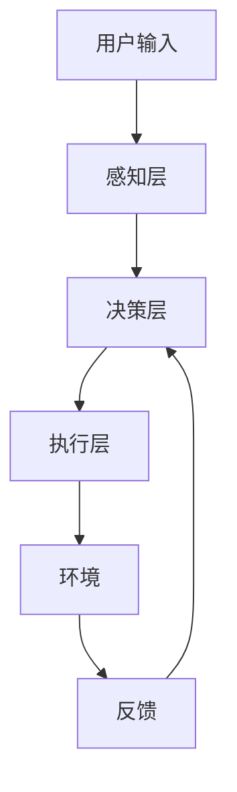

                 


# 构建自主学习型AI Agent

## 关键词：
自主学习、AI Agent、强化学习、深度学习、系统架构

## 摘要：
本文将详细介绍如何构建一个自主学习型AI Agent，从理论基础到实际应用，涵盖核心概念、算法原理、系统架构、项目实战等多个方面。文章首先介绍了自主学习型AI Agent的背景与概念，然后深入分析了其核心机制与算法原理，接着从系统架构的角度探讨了其实现方式，最后通过项目实战展示了如何将理论应用于实践。本文内容详实，结构清晰，适合AI开发者、研究人员以及对自主学习型AI Agent感兴趣的读者阅读。

---

## 第1章: 自主学习型AI Agent的背景与概念

### 1.1 自主学习型AI Agent的定义与特点
自主学习型AI Agent是一种能够在没有外部干预的情况下，通过与环境的交互自主学习和优化自身行为的智能体。与传统的AI系统不同，自主学习型AI Agent能够根据反馈不断改进其决策策略，适应复杂多变的环境。

- **定义**：自主学习型AI Agent是指能够通过与环境的交互，利用反馈信息（如奖励或惩罚）来优化自身行为的智能体。
- **特点**：
  - 自主性：无需外部干预，能够独立决策和学习。
  - 灵活性：能够适应环境的变化，实时调整策略。
  - 持续优化：通过反馈不断改进行为，提高任务完成效率。

### 1.2 自主学习型AI Agent的应用场景
自主学习型AI Agent在多个领域有广泛的应用，如游戏AI、机器人控制、自动驾驶、推荐系统等。

- **问题背景**：在动态变化的环境中，传统AI系统可能无法有效应对不确定性，而自主学习型AI Agent能够通过实时学习快速调整策略。
- **问题描述**：如何设计一个能够自主学习的AI系统，使其能够在复杂环境中完成特定任务。
- **应用优势**：能够适应环境变化，减少人工干预，提高系统的智能化水平。

### 1.3 自主学习型AI Agent的核心要素
自主学习型AI Agent的核心要素包括学习机制、决策模型和环境交互。

- **核心概念**：
  - 学习机制：通过强化学习、监督学习等方法更新策略。
  - 决策模型：基于当前状态和历史经验做出最优决策。
  - 环境交互：与环境进行信息交换，获取反馈以指导学习。

- **组成结构**：
  - **感知层**：接收环境输入，如传感器数据。
  - **决策层**：基于感知信息，通过学习算法生成决策。
  - **执行层**：将决策转化为实际操作，影响环境状态。

## 第2章: 自主学习型AI Agent的核心概念与联系

### 2.1 自主学习的原理与机制
自主学习的原理基于强化学习和无监督学习，通过不断与环境交互，优化决策策略。

- **强化学习**：通过奖励机制，智能体学习如何采取最优动作以最大化累积奖励。
- **无监督学习**：通过探索环境，发现潜在的模式和结构，指导决策过程。

### 2.2 自主学习与外部环境的实体关系图


### 2.3 自主学习的核心概念对比
| 概念 | 特征 |
|------|------|
| 自主学习 | 系统能够自主调整学习策略 |
| 传统AI | 需要人工干预进行调整 |
| 强化学习 | 通过奖励机制进行学习 |
| 监督学习 | 需要标注数据进行训练 |

## 第3章: 自主学习型AI Agent的算法原理

### 3.1 强化学习算法
强化学习是自主学习的核心算法之一，通过与环境交互，智能体通过试错方式优化决策策略。

- **Q-learning算法**：
  ```mermaid
  graph TD
      A[状态] --> B[动作]
      B --> C[奖励]
      C --> D[下一步状态]
      D --> A
  ```

  Q-learning的数学模型如下：
  $$ Q(s, a) = Q(s, a) + \alpha (r + \gamma \max Q(s', a') - Q(s, a)) $$
  其中：
  - \( Q(s, a) \)：状态\( s \)下采取动作\( a \)的Q值。
  - \( \alpha \)：学习率。
  - \( r \)：奖励。
  - \( \gamma \)：折扣因子。
  - \( s' \)：下一步状态。

### 3.2 深度强化学习算法
深度强化学习结合了深度学习和强化学习的优势，能够处理高维状态空间。

- **深度Q网络（DQN）**：
  ```mermaid
  graph TD
      A[状态] --> B[神经网络]
      B --> C[动作]
      C --> D[奖励]
      D --> E[神经网络更新]
      E --> A
  ```

  DQN的数学模型如下：
  $$ Q(s, a) = \theta \cdot \phi(s, a) $$
  其中：
  - \( \theta \)：神经网络参数。
  - \( \phi(s, a) \)：状态-动作对的特征表示。

### 3.3 自主学习算法的数学模型
$$ Q(s, a) = Q(s, a) + \alpha (r + \gamma \max Q(s', a') - Q(s, a)) $$

---

## 第4章: 自主学习型AI Agent的系统分析与架构设计

### 4.1 问题场景介绍
在动态变化的环境中，如何设计一个能够自主学习的AI系统，使其能够在复杂任务中实现目标。

### 4.2 系统功能设计
- **领域模型类图**：
  ```mermaid
  classDiagram
      class 状态空间 {
          状态
      }
      class 动作空间 {
          动作
      }
      class 奖励函数 {
          get_reward(状态, 动作)
      }
      class 决策模型 {
          choose_action(状态)
      }
      class 环境 {
          get_next_state(状态, 动作)
      }
      状态空间 <|-- 状态
      动作空间 <|-- 动作
      奖励函数 <|-- get_reward
      决策模型 <|-- choose_action
      环境 <|-- get_next_state
  ```

- **系统架构图**：
  ```mermaid
  graph TD
      A[用户输入] --> B[感知层]
      B --> C[决策层]
      C --> D[执行层]
      D --> E[环境]
      E --> F[反馈]
      F --> C
  ```

### 4.3 系统接口设计
- **接口描述**：
  - 输入：当前状态、动作。
  - 输出：下一步状态、奖励值。

### 4.4 系统交互流程图


---

## 第5章: 自主学习型AI Agent的项目实战

### 5.1 环境安装
- **安装依赖**：
  ```bash
  pip install gym numpy tensorflow
  ```

### 5.2 核心代码实现
```python
import numpy as np
import gym
import tensorflow as tf

# 定义神经网络
class DQN:
    def __init__(self, state_space, action_space, learning_rate=0.01, gamma=0.99):
        self.state_space = state_space
        self.action_space = action_space
        self.learning_rate = learning_rate
        self.gamma = gamma
        self.model = self._build_model()
    
    def _build_model(self):
        model = tf.keras.Sequential([
            tf.keras.layers.Dense(24, activation='relu', input_dim=self.state_space),
            tf.keras.layers.Dense(24, activation='relu'),
            tf.keras.layers.Dense(self.action_space, activation='linear')
        ])
        model.compile(optimizer=tf.keras.optimizers.Adam(lr=self.learning_rate), loss='mse')
        return model
    
    def remember(self, state, action, reward, next_state):
        # 简单实现，实际可使用经验回放
        pass
    
    def act(self, state):
        q = self.model.predict(np.array([state]))[0]
        return np.argmax(q)
    
    def train(self, state, action, reward, next_state):
        target = self.model.predict(np.array([state]))[0]
        next_q = self.model.predict(np.array([next_state]))[0]
        target[action] = reward + self.gamma * np.max(next_q)
        self.model.fit(np.array([state]), np.array([target]), epochs=1, verbose=0)
```

### 5.3 代码应用解读与分析
- **DQN类**：
  - 初始化：构建神经网络模型，定义学习率和折扣因子。
  - `act`方法：基于当前状态选择动作。
  - `train`方法：通过经验训练模型，更新Q值。

### 5.4 实际案例分析
以OpenAI Gym中的CartPole环境为例，展示如何训练一个自主学习型AI Agent。

### 5.5 项目小结
通过本项目，我们实现了基于DQN的自主学习型AI Agent，验证了其在复杂环境中的适应能力。

---

## 第6章: 自主学习型AI Agent的最佳实践

### 6.1 小结
- 自主学习型AI Agent的核心在于强化学习和深度学习的结合。
- 系统设计需要考虑状态空间、动作空间和反馈机制。

### 6.2 注意事项
- 确保环境的动态性和不确定性。
- 合理设计奖励函数，避免过窄或过宽的奖励。

### 6.3 拓展阅读
- 《Deep Reinforcement Learning》
- 《Reinforcement Learning: Theory and Algorithms》

---

## 作者：AI天才研究院/AI Genius Institute & 禅与计算机程序设计艺术 /Zen And The Art of Computer Programming

