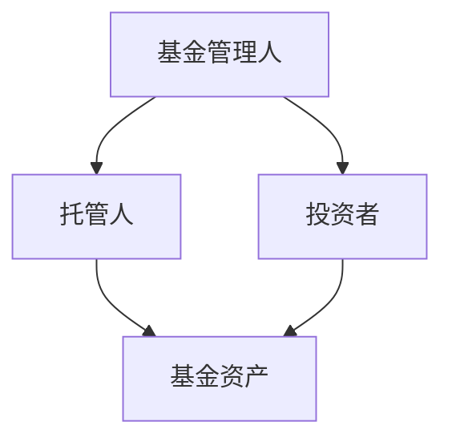
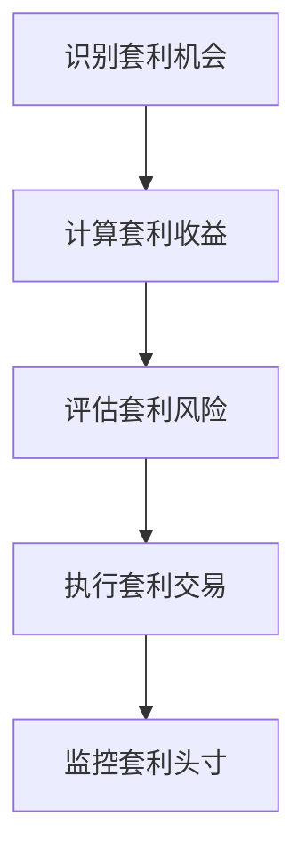
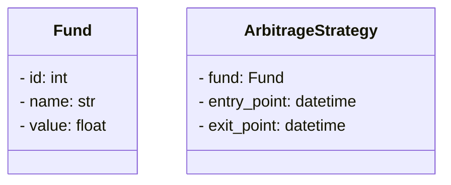
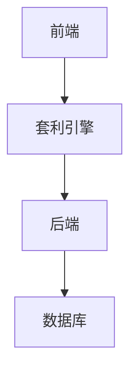
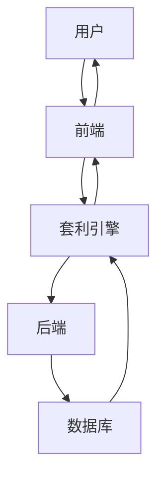

                 


# 查尔斯·布兰德的契约型封闭基金套利

> 关键词：契约型封闭基金、套利、金融数学、系统架构、风险管理、Python算法

> 摘要：本文深入探讨了查尔斯·布兰德的契约型封闭基金套利策略，从核心概念到算法实现，再到系统架构设计，结合实际案例分析，全面解析套利的数学模型、系统实现、风险控制及优化策略。

---

# 第1章 契约型封闭基金套利的背景与概念

## 1.1 契约型封闭基金的基本概念

### 1.1.1 什么是契约型封闭基金
契约型封闭基金是一种通过契约形式设立的基金，其运作依据基金合同，投资者通过购买基金份额成为基金的受益人。与公司型基金不同，契约型基金不具有法人资格，其管理和运作完全依赖于基金管理人和托管人的协议。

### 1.1.2 契约型封闭基金的特点
- **封闭性**：基金份额在存续期内不得赎回，只能在二级市场上交易。
- **契约性**：通过基金合同约定各方权利义务，法律关系相对简单。
- **专业管理**：基金管理人负责基金的投资运作，托管人负责资金保管。

### 1.1.3 契约型封闭基金与传统基金的区别
| 特性                | 契约型封闭基金          | 传统开放式基金        |
|---------------------|-------------------------|-----------------------|
| 基金结构            | 契约形式                | 公司或契约形式        |
| 基金份额            | 封闭，不可赎回          | 开放，可赎回          |
| 投资门槛            | 较低，适合中小投资者    | 较高，适合机构投资者    |

## 1.2 套利的基本概念

### 1.2.1 套利的定义
套利是指利用不同市场或资产之间的价格差异，通过同时买入低价资产和卖出高价资产，以期在价格回归合理时获利的交易策略。

### 1.2.2 套利的分类
- **跨市场套利**：利用不同市场之间的价格差异进行套利。
- **跨期套利**：利用同一资产在不同时间点的价格差异进行套利。
- **统计套利**：基于统计学方法寻找资产价格的偏离，进行套利。

### 1.2.3 套利在金融市场的意义
套利是市场效率的重要推动力，通过套利行为，市场价格趋于合理，市场流动性增强，同时套利也存在一定的风险和成本。

## 1.3 契约型封闭基金套利的背景

### 1.3.1 套利在契约型封闭基金中的应用
契约型封闭基金由于其封闭性和契约性特点，为套利提供了潜在的机会。例如，当市场出现短期波动时，可以通过套利策略在封闭基金的二级市场价格与净值之间获利。

### 1.3.2 套利的法律与合规框架
套利需遵守相关法律法规，确保交易的合法性和合规性。特别是在契约型基金中，需关注基金合同中关于套利的具体条款。

### 1.3.3 套利的风险与收益分析
套利的收益来源于价格差异的消除，但同时也伴随着市场波动、交易成本和法律风险。合理的套利策略需在风险可控的前提下追求收益。

## 1.4 本章小结
本章介绍了契约型封闭基金的基本概念和套利的基本原理，为后续的深入分析奠定了基础。

---

# 第2章 契约型封闭基金套利的核心概念与联系

## 2.1 契约型封闭基金的结构与属性

### 2.1.1 契约型封闭基金的结构


### 2.1.2 套利的核心原理
套利的数学模型可以用以下公式表示：
$$
\text{套利收益} = \text{卖出价格} - \text{买入价格}
$$

### 2.1.3 套利与契约型封闭基金的关系
套利作为一种交易策略，可以应用于契约型封闭基金的二级市场交易，通过价格差异获利。

## 2.2 套利的核心原理

### 2.2.1 套利的数学模型
套利的期望收益可以表示为：
$$
E[R] = \mu - \frac{1}{2}\sigma^2
$$

其中，$\mu$ 是期望收益，$\sigma^2$ 是收益的方差。

### 2.2.2 套利的流程图


### 2.2.3 套利的风险与收益关系
套利的收益与风险呈正相关关系，收益越高，风险通常越大。

## 2.3 本章小结
本章通过分析契约型封闭基金的结构和套利的核心原理，揭示了套利在该基金中的应用潜力和实现路径。

---

# 第3章 套利算法的数学模型

## 3.1 套利算法的数学模型

### 3.1.1 套利的期望收益公式
$$
E[R] = \mu - \frac{1}{2}\sigma^2
$$

### 3.1.2 套利的风险评估公式
$$
R = \sqrt{\text{VaR}^2 + \text{CVaR}^2}
$$

## 3.2 套利算法的实现步骤

### 3.2.1 数据收集与预处理
- 数据来源：金融市场数据API。
- 数据清洗：处理缺失值和异常值。

### 3.2.2 套利机会识别算法
```python
def find_arbitrage_opportunity(prices):
    # 计算价差
    spreads = prices['A'] - prices['B']
    # 识别套利机会
    if spreads.mean() > 0:
        return '买入B，卖出A'
    else:
        return '买入A，卖出B'
```

### 3.2.3 风险控制与收益优化算法
```python
def risk_control(strategy, risk_tolerance=0.05):
    if strategy.risk > risk_tolerance:
        return '调整策略'
    else:
        return '执行策略'
```

## 3.3 本章小结
本章通过数学模型和算法实现，详细阐述了套利的实现过程和风险控制方法。

---

# 第4章 系统分析与架构设计

## 4.1 系统功能设计

### 4.1.1 领域模型


### 4.1.2 系统架构


## 4.2 系统架构设计

### 4.2.1 套利引擎
套利引擎负责识别套利机会、计算收益和风险，并执行交易。

### 4.2.2 数据库设计
数据库用于存储基金数据、交易记录和套利策略。

## 4.3 系统接口设计

### 4.3.1 API接口
- GET /funds：获取所有基金信息。
- POST /arbitrage：提交套利策略。

## 4.4 系统交互流程图



## 4.5 本章小结
本章通过系统架构设计，展示了契约型封闭基金套利的实现框架和交互流程。

---

# 第5章 项目实战

## 5.1 环境安装

### 5.1.1 安装Python环境
```bash
python -m pip install --upgrade pip
pip install numpy pandas matplotlib
```

## 5.2 核心实现源代码

### 5.2.1 数据收集与处理
```python
import pandas as pd
import numpy as np

# 数据收集
def collect_data(tickers):
    return pd.DataFrame({tickers[0]: np.random.randn(100), tickers[1]: np.random.randn(100)})

# 数据处理
def preprocess_data(df):
    return df.dropna()
```

### 5.2.2 套利策略实现
```python
def execute_arbitrage(prices):
    spreads = prices['A'] - prices['B']
    if spreads.mean() > 0:
        return '买入B，卖出A'
    else:
        return '买入A，卖出B'
```

## 5.3 案例分析与解读

### 5.3.1 案例分析
假设市场出现A股价格为10元，B股价格为9.8元，存在套利机会。

### 5.3.2 代码实现
```python
prices = {'A': 10, 'B': 9.8}
print(execute_arbitrage(prices))
```

## 5.4 本章小结
本章通过实际案例，展示了契约型封闭基金套利的实现过程和注意事项。

---

# 第6章 最佳实践与小结

## 6.1 最佳实践

### 6.1.1 风险管理
- 设置止损点
- 分散投资

### 6.1.2 交易策略优化
- 采用统计套利模型
- 定期回顾和优化策略

## 6.2 小结
本文详细探讨了查尔斯·布兰德的契约型封闭基金套利策略，从理论到实践，全面解析了套利的实现过程和风险控制方法。

---

# 附录

## 附录A 常用工具与库

### 附录A.1 Python库
- NumPy
- Pandas
- Matplotlib

## 附录B 术语表
- 套利：利用价格差异进行交易以获利。

## 附录C 扩展阅读
- 《金融风险管理》
- 《Python金融计算》

---

# 作者

作者：AI天才研究院/AI Genius Institute & 禅与计算机程序设计艺术/Zen And The Art of Computer Programming

