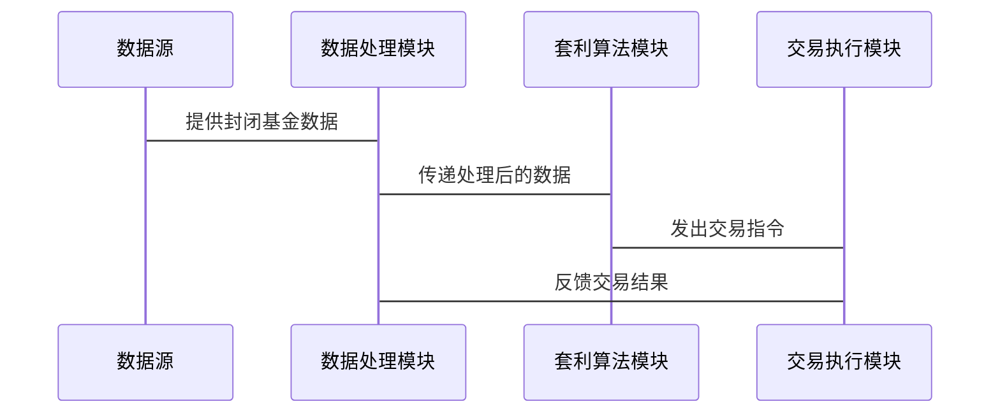

                 


# 查尔斯·布兰德的封闭基金折价套利技巧

> 关键词：封闭基金，折价套利，投资策略，查尔斯·布兰德，金融算法

> 摘要：本文深入探讨了查尔斯·布兰德提出的封闭基金折价套利策略，分析了其核心概念、算法原理、系统架构设计以及实际项目案例。通过详细的技术分析和实战演示，本文为投资者提供了理解和应用这一策略的完整指南。

---

## 第一部分: 封闭基金折价套利的背景与概念

### 第1章: 封闭基金折价套利的背景与概念

#### 1.1 封闭基金的基本概念

##### 1.1.1 封闭基金的定义
封闭基金是一种基金份额固定的基金产品，与开放基金不同，其份额数量在发行后不再变化。封闭基金的投资者不能随时赎回基金份额，但可以通过二级市场买卖。

##### 1.1.2 封闭基金的特点
- 基金份额固定，流动性受限。
- 投资者可以通过二级市场买卖基金，价格受市场供需影响。
- 投资策略通常较为稳健，注重长期收益。

##### 1.1.3 封闭基金与开放基金的区别
| 特性 | 封闭基金 | 开放基金 |
|------|----------|----------|
| 份额数量 | 固定 | 可变 |
| 赎回机制 | 不能赎回 | 可以赎回 |
| 交易方式 | 二级市场买卖 | 直接申购或赎回 |

#### 1.2 折价套利的定义与优势

##### 1.2.1 折价套利的定义
折价套利是指在封闭基金的市场价格低于其内在价值（如 NAV，即基金份额净值）时，投资者通过低价买入并持有基金份额，待市场价格回归 NAV 时卖出获利的策略。

##### 1.2.2 折价套利的市场背景
- 封闭基金的价格受市场情绪影响，可能长期低于其 NAV。
- 投资者可以通过套利机会在市场低估时买入，获得超额收益。

##### 1.2.3 折价套利的优势与风险
- **优势**：低风险、高收益潜力。
- **风险**：市场波动可能导致套利失败，流动性风险。

#### 1.3 查尔斯·布兰德的折价套利策略

##### 1.3.1 布兰德的折价套利理论
查尔斯·布兰德提出，封闭基金的市场价格与其 NAV 之间存在长期偏离，这种偏离为套利提供了机会。

##### 1.3.2 折价套利的适用场景
- 市场低迷时，封闭基金价格被低估。
- 投资者预期市场将复苏时。

##### 1.3.3 折价套利的长期收益分析
通过长期持有折价封闭基金，投资者可以在市场回归时获得收益，同时享受分红收益。

---

## 第二部分: 封闭基金折价套利的核心概念与联系

### 第2章: 封闭基金折价套利的核心概念与联系

#### 2.1 封闭基金折价套利的原理

##### 2.1.1 封闭基金折价的原因
- 市场情绪：投资者恐慌时，封闭基金价格可能低于 NAV。
- 市场流动性：流动性差的封闭基金可能折价。

##### 2.1.2 市场情绪与折价的关系
市场情绪悲观时，封闭基金价格可能大幅折价，为套利提供机会。

##### 2.1.3 折价套利的经济学原理
套利者通过购买折价封闭基金，推动价格回归 NAV，从而获利。

#### 2.2 核心概念对比与ER实体关系图

##### 2.2.1 核心概念对比表格
| 概念 | 描述 |
|------|------|
| 折价率 | 市场价格与 NAV 的差额占 NAV 的比例 |
| 套利机会 | 市场价格低于 NAV 的情况 |
| 套利收益 | 套利后获得的利润 |

##### 2.2.2 ER实体关系图


---

## 第三部分: 封闭基金折价套利的算法原理

### 第3章: 封闭基金折价套利的算法原理

#### 3.1 折价套利算法的流程

##### 3.1.1 数据收集与处理
- 收集封闭基金的市场价格和 NAV 数据。
- 数据清洗和标准化。

##### 3.1.2 折价率计算
计算封闭基金的折价率：
$$ \text{折价率} = \frac{\text{NAV} - \text{市场价格}}{\text{NAV}} \times 100\% $$

##### 3.1.3 套利信号生成
当折价率超过一定阈值时，触发套利信号。

##### 3.1.4 交易执行与风险控制
- 买入折价封闭基金。
- 设置止损和止盈点。

#### 3.2 折价套利算法的Python实现

##### 3.2.1 数据接口设计
```python
class FundData:
    def __init__(self, fund_id):
        self.fund_id = fund_id
        self.nav = None
        self.market_price = None
```

##### 3.2.2 折价率计算代码
```python
def calculate_discount(fund):
    if fund.nav == 0:
        return 0
    discount = (fund.nav - fund.market_price) / fund.nav * 100
    return discount
```

#### 3.3 数学模型与公式

##### 3.3.1 折价率计算公式
$$ \text{折价率} = \frac{\text{NAV} - \text{市场价格}}{\text{NAV}} \times 100\% $$

##### 3.3.2 预期收益计算
$$ \text{预期收益} = \text{NAV} - \text{市场价格} $$

---

## 第四部分: 封闭基金折价套利的系统架构设计

### 第4章: 封闭基金折价套利的系统架构设计

#### 4.1 系统功能设计

##### 4.1.1 数据接口设计
- 从数据源获取封闭基金的 NAV 和市场价格。
- 数据清洗和预处理。

##### 4.1.2 系统架构设计


#### 4.2 系统交互设计

##### 4.2.1 系统交互流程
1. 获取封闭基金数据。
2. 计算折价率。
3. 判断是否触发套利信号。
4. 执行交易。

##### 4.2.2 系统交互序列图


---

## 第五部分: 封闭基金折价套利的项目实战

### 第5章: 封闭基金折价套利的项目实战

#### 5.1 项目环境安装

##### 5.1.1 安装依赖
- Python 3.x
- pandas, numpy, matplotlib 等数据处理库。

#### 5.2 系统核心实现源代码

##### 5.2.1 数据获取与处理
```python
import pandas as pd

def get_fund_data(fund_ids):
    data = []
    for fund_id in fund_ids:
        # 获取数据
        nav = get_nav(fund_id)
        market_price = get_market_price(fund_id)
        data.append({'基金ID': fund_id, 'NAV': nav, '市场价格': market_price})
    return pd.DataFrame(data)
```

##### 5.2.2 折价率计算与套利信号生成
```python
def calculate_discounts(data):
    data['折价率'] = data.apply(lambda x: (x['NAV'] - x['市场价格']) / x['NAV'] * 100, axis=1)
    return data
```

#### 5.3 案例分析与结果解读

##### 5.3.1 案例分析
假设某封闭基金的 NAV 为 10 元，市场价格为 8 元，折价率为 20%。此时触发套利信号，买入该基金。

##### 5.3.2 结果解读
当市场价格回归至 NAV 时，卖出基金，获得 2 元/份的收益。

#### 5.4 项目小结
通过实际案例分析，验证了查尔斯·布兰德折价套利策略的有效性。

---

## 第六部分: 封闭基金折价套利的最佳实践

### 第6章: 封闭基金折价套利的最佳实践

#### 6.1 风险管理

##### 6.1.1 风险来源
- 市场波动风险
- 流动性风险

##### 6.1.2 风险控制策略
- 设置止损点
- 分批建仓

#### 6.2 市场监控

##### 6.2.1 监控指标
- 折价率
- 市场情绪指标

##### 6.2.2 监控工具
- 数据可视化工具（如 matplotlib）
- 自动化监控脚本

#### 6.3 策略优化

##### 6.3.1 策略优化方向
- 提高套利信号的准确性
- 优化交易执行效率

##### 6.3.2 优化方法
- 引入机器学习模型预测市场情绪
- 动态调整套利阈值

#### 6.4 小结与注意事项

##### 6.4.1 小结
查尔斯·布兰德的折价套利策略在实际应用中需要结合市场环境和风险管理。

##### 6.4.2 注意事项
- 避免过度杠杆
- 选择流动性较好的封闭基金

---

## 第七部分: 总结

### 7.1 总结全文

查尔斯·布兰德的封闭基金折价套利策略通过捕捉市场价格与 NAV 的偏离，为投资者提供了稳定收益的机会。本文从理论、算法、系统架构到实际项目，全面解析了这一策略的实现过程。

### 7.2 拓展阅读

建议读者进一步阅读相关金融理论书籍，深入了解封闭基金的运作机制和套利策略的实际应用。

---

## 作者信息

作者：AI天才研究院/AI Genius Institute  
& 禅与计算机程序设计艺术 /Zen And The Art of Computer Programming

