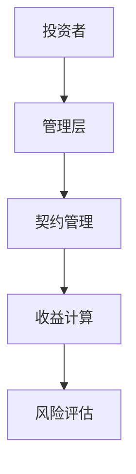
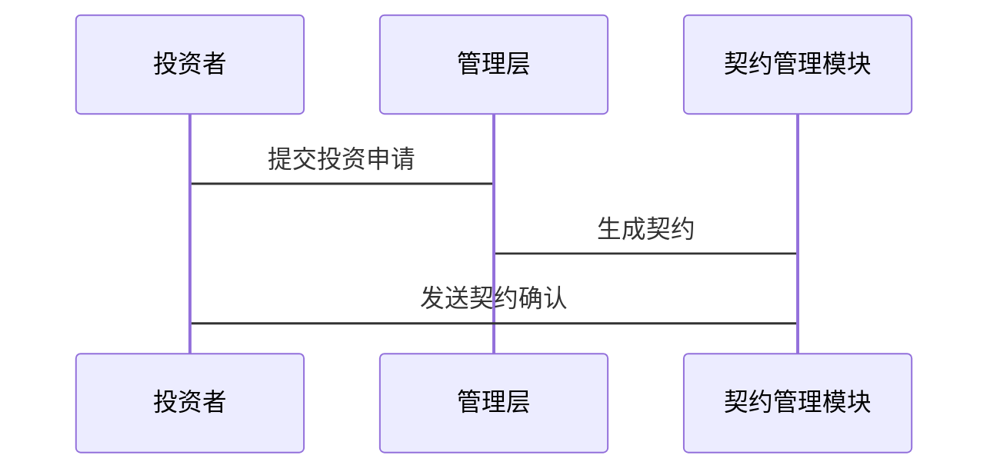

                 


# 查尔斯·布兰登的契约型价值投资：与管理层利益一致

**关键词**：契约型价值投资、利益一致性、投资契约、管理层激励、金融数学模型、系统架构设计

**摘要**：本文深入探讨了查尔斯·布兰登的契约型价值投资理念，分析了其如何通过法律契约确保投资者与管理层的利益一致，从而优化投资回报。文章从契约型价值投资的背景、核心概念、数学模型、系统架构设计、项目实战到最佳实践，全面解析了这一投资策略的各个方面，帮助读者理解其原理和应用。

---

## 第1章: 契约型价值投资的背景与重要性

### 1.1 契约型价值投资的定义与背景
- **1.1.1 投资领域的传统模式**：传统投资模式中，投资者与管理层的利益可能存在冲突，导致资源浪费和效率低下。
- **1.1.2 价值投资的核心理念**：查尔斯·布兰登提出的价值投资强调长期持有优质资产，关注企业的内在价值。
- **1.1.3 契约型投资的起源与发展**：契约型投资通过法律契约明确投资者与管理层的权利和义务，确保双方利益一致。

### 1.2 契约型价值投资的重要性
- **1.2.1 投资者与管理层利益一致的意义**：通过契约消除利益冲突，提升投资效率和回报。
- **1.2.2 契约型投资在现代金融中的地位**：成为机构投资者和高净值客户的重要选择。
- **1.2.3 契约型投资对长期收益的影响**：通过长期稳定的合作关系，实现持续的价值增长。

---

## 第2章: 契约型价值投资的核心概念

### 2.1 契约型价值投资的基本原理
- **2.1.1 投资者与管理层的利益一致性**：通过契约明确双方目标，确保资源优化配置。
- **2.1.2 契约型投资的法律框架**：涉及合同法、公司法等相关法律，确保契约的有效性和可执行性。
- **2.1.3 契约型投资的风险与收益分析**：分析契约型投资的风险来源，如市场风险、信用风险等。

### 2.2 契约型价值投资的关键要素
- **2.2.1 投资契约的结构与内容**：包括投资金额、期限、收益分配、风险承担等。
- **2.2.2 管理层激励机制的设计**：通过股权激励、绩效奖金等方式，确保管理层与投资者利益一致。
- **2.2.3 投资者的权利与义务**：投资者有权监督管理，也有义务遵守契约条款。

### 2.3 契约型价值投资的数学模型与算法

#### 2.3.1 投资收益的计算公式
$$
\text{投资收益} = \text{最终价值} - \text{初始投资}
$$

#### 2.3.2 投资风险的评估模型
$$
\text{风险} = \text{标准差}(\text{收益}) \times \text{投资金额}
$$

#### 2.3.3 利益一致性的数学表达
$$
\text{利益一致性} = \frac{\text{共同收益}}{\text{总收益}}
$$

---

## 第3章: 契约型价值投资的系统架构与设计

### 3.1 系统架构设计
- **3.1.1 系统模块划分**：包括投资者模块、管理层模块、契约管理模块、收益计算模块等。
- **3.1.2 系统功能设计**：支持契约生成、收益计算、风险评估、利益一致性分析等功能。
- **3.1.3 系统架构图（Mermaid图）**


### 3.2 系统接口设计
- **3.2.1 投资者与管理层的交互接口**：包括契约签订、收益查询、风险提示等功能。
- **3.2.2 系统内部接口设计**：契约管理模块与收益计算模块之间的数据交互。
- **3.2.3 接口交互流程图（Mermaid图）**


---

## 第4章: 契约型价值投资的项目实战

### 4.1 项目环境与工具安装
- **4.1.1 开发环境配置**：推荐使用Python、Jupyter Notebook进行开发。
- **4.1.2 必要工具安装**：安装NumPy、Pandas、Matplotlib等数据分析库。
- **4.1.3 项目代码库初始化**：使用Git初始化代码库，管理版本控制。

### 4.2 核心功能实现
- **4.2.1 投资契约的生成与验证**：编写Python脚本，根据输入参数生成契约文本。
- **4.2.2 利益一致性机制的实现**：通过算法计算投资者与管理层的利益分配比例。
- **4.2.3 投资收益与风险的计算**：使用数学模型计算投资收益和风险指标。

### 4.3 代码实现与解读
- **4.3.1 核心算法的Python代码实现**
```python
def calculate_return(initial, final):
    return final - initial

def assess_risk(revenue, std_deviation):
    return std_deviation * revenue
```

- **4.3.2 系统功能模块的代码解读**：详细解读每个模块的功能和实现逻辑。
- **4.3.3 代码运行与测试**：展示代码运行结果，并进行测试验证。

---

## 第5章: 契约型价值投资的最佳实践与总结

### 5.1 最佳实践与注意事项
- **5.1.1 投资契约设计的注意事项**：确保契约条款清晰，避免歧义。
- **5.1.2 系统设计的优化建议**：采用模块化设计，便于后续扩展和维护。
- **5.1.3 投资策略的动态调整**：根据市场变化及时调整投资策略。

### 5.2 项目小结
- 本项目通过契约型价值投资理念，结合数学模型和系统架构设计，实现了投资者与管理层利益一致的目标。
- 通过实际案例分析，验证了契约型投资的有效性和优越性。

### 5.3 未来展望
- 进一步优化数学模型，提高计算效率。
- 探索更多应用场景，如私募基金、股权投资等领域。

---

**作者：AI天才研究院/AI Genius Institute & 禅与计算机程序设计艺术 /Zen And The Art of Computer Programming**

---

通过以上目录结构，文章将详细讲解契约型价值投资的各个方面，帮助读者全面理解其原理和应用。

