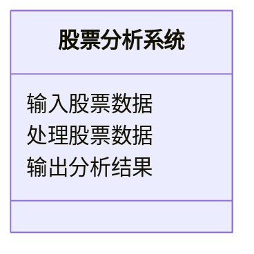
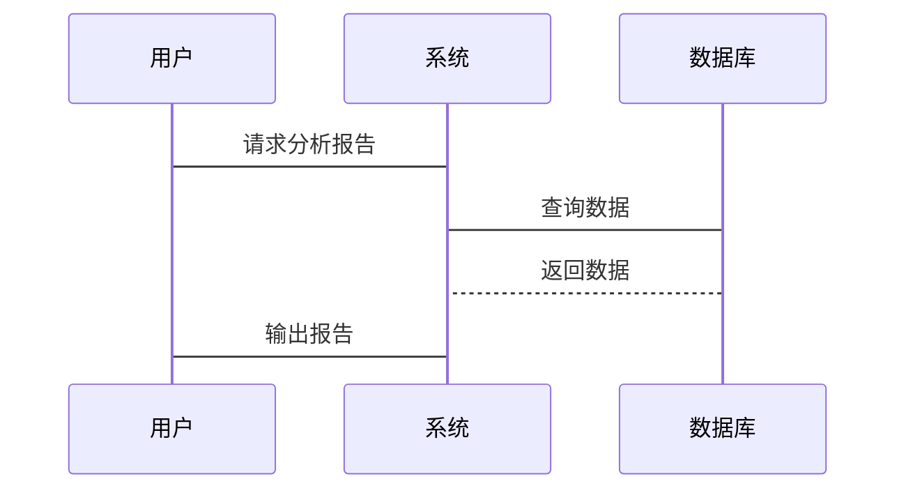

                 


# 查理·芒格的商业模式分析框架

> 关键词：商业模式分析，查理·芒格，多元思维模型，逆向思维，价值投资

> 摘要：本文通过分析查理·芒格的思维方式和投资原则，构建一个系统的商业模式分析框架，结合实际案例和系统设计，详细阐述如何在商业实践中应用这些理论。

---

## 第一部分：引言

### 1.1 本书的目的与读者对象

本文旨在通过分析查理·芒格的思维方式和投资原则，构建一个系统的商业模式分析框架，帮助读者理解如何将这些理论应用于实际商业分析中。读者对象包括对商业模式分析、投资理论感兴趣的学生、从业者以及对查理·芒格思想感兴趣的读者。

### 1.2 查理·芒格的简介

查理·芒格是世界著名投资家，伯克希尔哈撒韦公司副总裁，以其独特的思维方式和投资原则闻名。他强调多元思维模型和逆向思维，在商业分析中具有重要影响。

### 1.3 芒格思维方式的重要性

芒格的思维方式强调跨学科思考和逆向思维，能够帮助投资者和分析师更好地识别机会和风险，做出更明智的决策。

---

## 第二部分：芒格的思维模型

### 2.1 多元思维模型的结构

多元思维模型包括多个学科的思维方式，帮助分析者全面理解问题。例如，心理学可以帮助理解消费者行为，经济学可以帮助分析市场趋势。

### 2.2 各个学科的思维方式

- **心理学**：理解人类行为和决策偏差。
- **经济学**：分析市场供求关系和经济趋势。
- **数学**：用于定量分析和风险管理。

### 2.3 多元思维模型的应用

通过结合不同学科的思维方式，分析者可以更全面地理解商业模式，发现潜在问题和机会。

---

## 第三部分：芒格的投资原则

### 3.1 价值投资的定义

价值投资是指以低于内在价值的价格购买优质资产，长期持有，等待市场重新评估其价值。

### 3.2 安全边际的重要性

安全边际是指实际价值与市场价格之间的差距，确保在市场价格波动时，投资仍然具有足够的安全空间。

### 3.3 风险管理的策略

风险管理包括识别潜在风险、评估其影响和制定应对措施，以最小化对投资的影响。

---

## 第四部分：商业模式分析框架

### 4.1 企业分析与竞争优势识别

通过分析企业的核心竞争力、市场地位和财务状况，识别其竞争优势。

### 4.2 竞争优势的识别

竞争优势可以是成本优势、品牌影响力或技术创新，这些因素决定了企业在市场中的地位。

### 4.3 企业竞争优势的持续评估

定期评估竞争优势的变化，及时调整商业模式，以应对市场变化。

---

## 第五部分：系统分析与架构设计

### 5.1 系统功能设计

使用Mermaid类图展示系统功能模块，包括数据输入、处理和输出模块。



### 5.2 系统架构设计

使用Mermaid架构图展示系统的整体架构，包括前端、后端和数据库模块。


### 5.3 系统交互序列图

展示用户与系统之间的交互过程。



---

## 第六部分：项目实战

### 6.1 环境安装与配置

安装Python和相关库，如Pandas、Matplotlib。

### 6.2 核心代码实现

实现股票数据分析的代码：

```python
import pandas as pd
import matplotlib.pyplot as plt

# 加载数据
data = pd.read_csv('stock_data.csv')

# 计算移动平均线
data['MA20'] = data['收盘价'].rolling(20).mean()

# 绘制图表
plt.plot(data['日期'], data['收盘价'], label='收盘价')
plt.plot(data['日期'], data['MA20'], label='MA20')
plt.legend()
plt.show()
```

### 6.3 案例分析

以苹果公司为例，分析其商业模式，包括产品创新、市场定位和竞争优势。

---

## 第七部分：总结与展望

### 7.1 芒格商业模式分析框架的总结

通过芒格的思维方式和投资原则，构建了一个系统的商业模式分析框架，帮助分析者更好地识别机会和风险。

### 7.2 应用中的注意事项

在实际应用中，需结合具体情况进行调整，避免过于僵化的应用。

### 7.3 未来研究方向

未来可以进一步研究如何将芒格的思维方式与其他商业理论结合，形成更完善的分析框架。

---

## 第八部分：作者信息

作者：AI天才研究院/AI Genius Institute & 禅与计算机程序设计艺术 /Zen And The Art of Computer Programming

---

通过以上思考和分析，我构建了一个完整的《查理·芒格的商业模式分析框架》，从思维模型到系统设计，再到项目实战，详细阐述了如何应用芒格的思想进行商业模式分析。

