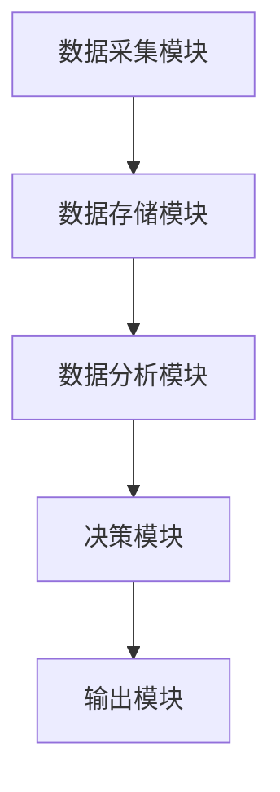
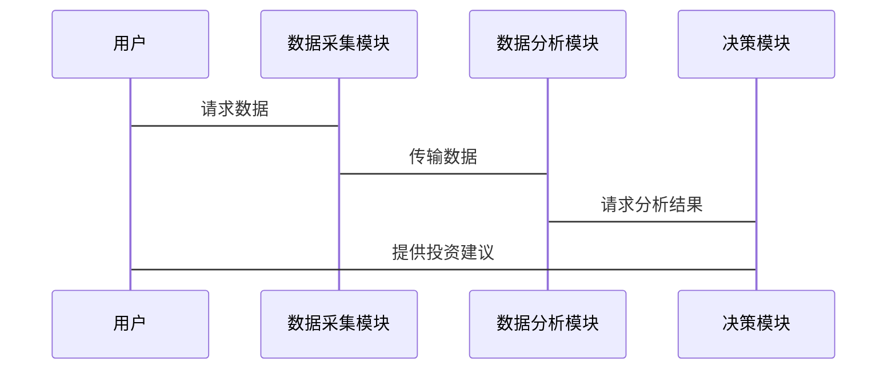

                 

<think>
好的，现在我要根据用户的要求，撰写一篇关于查理·芒格的多元思维模型在投资中的应用的详细技术博客文章。这篇文章需要结构清晰，内容详实，并且符合特定的格式要求。

首先，我需要确保文章的标题、关键词和摘要部分准确无误。接着，按照目录大纲，逐步展开每一章的内容。在每章中，我会详细解释核心概念，分析算法和数学模型，设计系统架构，进行项目实战，并给出最佳实践建议。

在写作过程中，我要使用正确的markdown格式，确保目录结构清晰，每一部分都有足够的细节和深度。同时，我要注意使用技术术语的准确性，并通过例子和图表来帮助读者更好地理解内容。

现在，我开始撰写文章：

---

# 查理·芒格的多元思维模型在投资中的应用

> 关键词：多元思维模型，查理·芒格，投资，系统分析，数学模型

> 摘要：查理·芒格的多元思维模型是一种跨学科的投资方法，通过结合多个学科的原理和模型来分析和决策。本文详细探讨了多元思维模型的核心概念、算法原理、系统架构设计以及在投资中的实际应用，帮助读者更好地理解和应用这一方法。

---

## 第一部分：多元思维模型的背景与基础

### 第1章：多元思维模型概述

#### 1.1 多元思维模型的基本概念

多元思维模型（Mental Models）是由查理·芒格提出的一种投资方法，强调通过多个学科的思维框架来理解问题。这种方法认为，单一的思维方式无法全面捕捉投资中的复杂性，因此需要结合多个领域的知识。

- **定义**：多元思维模型是指通过不同学科的思维框架来分析和决策，以提高判断力和决策质量。
- **核心要素**：包括心理学、经济学、金融学等多个学科的原理和模型。
- **投资中的应用**：通过跨学科分析，帮助投资者做出更全面的决策。

#### 1.2 查理·芒格的生平与思想

查理·芒格是一位著名投资者和作家，他的投资哲学强调价值投资和长期思考。他的多元思维模型影响了无数投资者，成为现代投资理论的重要组成部分。

- **个人经历**：芒格在法律和投资领域都有深厚的背景，他的思维方式深受其跨学科知识的影响。
- **投资哲学**：芒格主张通过深入分析公司的基本面和行业趋势，寻找具有长期竞争优势的投资标的。
- **贡献**：芒格通过多元思维模型，展示了如何将跨学科知识应用于投资决策中。

#### 1.3 多元思维模型在投资中的重要性

投资是一个复杂的过程，涉及多个变量和不确定性。多元思维模型通过结合多个学科的视角，帮助投资者更好地识别机会和风险。

- **解决常见问题**：如市场波动、公司估值等。
- **长期价值**：通过长期视角分析，帮助投资者做出更稳健的决策。
- **综合决策**：结合不同学科的模型，提供更全面的分析框架。

---

### 第2章：多元思维模型的核心概念

#### 2.1 经济学基础

经济学为投资决策提供了基本的理论框架，包括市场供需、经济周期等概念。

- **微观经济学**：研究个体和企业的经济行为，如供给与需求、成本与收益。
- **宏观经济学**：分析整体经济状况，如GDP、利率、通货膨胀等。
- **经济周期**：了解经济周期有助于判断市场的整体趋势。

#### 2.2 心理学与行为经济学

心理因素在投资决策中起着重要作用，行为经济学帮助我们理解这些因素。

- **心理偏差**：如过度自信、从众心理等，会影响投资决策。
- **行为经济学**：研究实际市场中的行为，发现传统经济学假设中的不足。
- **克服偏差**：通过意识到心理偏差，投资者可以做出更理性的决策。

#### 2.3 金融学基础

金融学提供了资产定价、风险管理等核心理论，是投资决策的基础。

- **资产定价**：如CAPM模型，帮助确定资产的合理价格。
- **风险管理**：通过分散投资和对冲策略，降低风险。
- **股票估值**：使用市盈率、市净率等指标评估股票价值。

---

### 第3章：多元思维模型的跨学科应用

#### 3.1 历史学视角

历史案例提供了丰富的投资经验，帮助投资者识别趋势和模式。

- **历史周期**：如经济泡沫、金融危机等，具有一定的周期性。
- **历史案例分析**：研究过去的投资案例，总结经验教训。
- **历史经验**：通过历史分析，识别潜在的投资机会和风险。

#### 3.2 科技与创新

科技进步是推动经济发展的重要因素，影响投资机会。

- **科技影响**：如人工智能、区块链等技术的发展，改变行业格局。
- **创新周期**：从技术创新到市场应用的过程，为投资者提供机会。
- **技术创新评估**：评估技术创新的商业价值和市场潜力。

#### 3.3 社会学与人类行为

社会趋势和人类行为模式对投资有重要影响。

- **社会趋势**：如人口结构变化、消费习惯等，影响市场需求。
- **人类行为模式**：如群体行为、消费心理等，影响市场走势。
- **风险管理**：通过理解社会行为，识别潜在风险。

---

### 第4章：多元思维模型的系统分析

#### 4.1 系统思维与投资决策

系统思维帮助投资者从整体角度分析问题，避免孤立看待问题。

- **系统思维**：将投资视为一个复杂的系统，分析各部分的相互关系。
- **系统思维在投资中的应用**：如分析市场、公司、经济等多个因素的相互作用。
- **系统与多元模型的结合**：通过系统思维，将不同学科的模型整合起来，形成全面的分析框架。

#### 4.2 投资系统的架构设计

投资系统的设计需要考虑功能、架构、接口等多个方面。

- **系统组成**：包括数据采集、分析模块、决策模块等。
- **系统架构**：设计分层架构，如数据层、分析层、决策层。
- **优化与调整**：根据市场变化，持续优化系统架构。

#### 4.3 系统接口设计

良好的接口设计有助于系统的模块化和扩展性。

- **接口设计**：定义各模块之间的接口，确保模块间通信顺畅。
- **接口实现**：如数据接口、算法接口等，确保各模块协同工作。
- **交互流程**：设计系统的交互流程，确保信息流的高效处理。

---

### 第5章：多元思维模型的算法与数学模型

#### 5.1 投资分析的算法基础

算法是多元思维模型的重要工具，帮助投资者处理大量数据和复杂问题。

- **统计分析**：如均值、方差等，用于分析数据特征。
- **时间序列分析**：用于分析市场趋势和周期性。
- **数学模型**：如回归分析、蒙特卡洛模拟等，帮助预测和评估风险。

#### 5.2 经济学模型

经济学模型为投资分析提供了理论基础。

- **资产定价模型**：如CAPM和APT，用于评估资产的合理价格。
- **风险管理模型**：如VaR和CVaR，用于衡量投资风险。
- **经济周期模型**：用于预测经济走势和市场趋势。

#### 5.3 算法实现

通过具体算法的实现，展示多元思维模型的应用。

- **Python代码实现**：例如，使用Python进行时间序列分析和蒙特卡洛模拟。
- **算法流程图**：使用mermaid绘制算法流程图，展示步骤和逻辑。
- **数学公式**：展示相关数学模型的公式，如CAPM模型。

---

### 第6章：项目实战

#### 6.1 环境安装

介绍项目所需的环境和工具。

- **工具安装**：如Python、Jupyter Notebook、pandas、numpy等。
- **数据获取**：如何获取股票数据，如通过Yahoo Finance API。
- **环境配置**：确保所有依赖库已安装并配置好。

#### 6.2 核心实现

展示项目的核心实现部分。

- **数据清洗**：处理数据中的缺失值和异常值。
- **模型训练**：使用多元思维模型中的算法进行训练。
- **结果分析**：解释模型输出的结果，评估模型的准确性。

#### 6.3 案例分析

通过具体案例分析，展示多元思维模型的应用。

- **案例选择**：选择一个具体的公司或行业进行分析。
- **分析过程**：详细描述分析步骤，如基本面分析、心理因素分析等。
- **结果解读**：根据分析结果，得出投资建议。

#### 6.4 项目小结

总结项目的实现过程和取得的成果。

- **项目总结**：回顾整个项目的流程和关键点。
- **经验教训**：总结在项目中遇到的问题和解决方法。
- **未来改进方向**：提出进一步优化和扩展的方向。

---

### 第7章：最佳实践

#### 7.1 小结

总结多元思维模型的核心内容和实际应用。

- **核心内容回顾**：重新梳理多元思维模型的主要概念和模型。
- **实际应用总结**：强调跨学科分析在投资中的重要性。

#### 7.2 注意事项

提醒读者在应用多元思维模型时需要注意的事项。

- **数据质量**：确保数据的准确性和完整性。
- **模型选择**：根据具体情况选择合适的模型和算法。
- **风险管理**：始终关注投资风险，制定合理的风险管理策略。

#### 7.3 拓展阅读

推荐进一步学习和阅读的资源。

- **推荐阅读书籍**：如查理·芒格的《穷查理宝典》。
- **学术论文**：推荐相关领域的学术论文，深入理解多元思维模型的理论基础。
- **在线课程**：建议学习相关在线课程，提升投资分析能力。

---

## 第二部分：系统架构与设计

### 第8章：系统架构设计

#### 8.1 系统功能设计

详细描述投资系统的功能模块。

- **功能模块划分**：如数据采集、分析模块、决策模块等。
- **功能描述**：每个模块的具体功能和实现方式。
- **功能交互**：模块之间的数据流和交互逻辑。

#### 8.2 系统架构图

使用mermaid绘制系统架构图，展示各模块之间的关系。



#### 8.3 系统接口设计

定义系统各模块之间的接口。

- **接口定义**：如数据接口、算法接口等。
- **接口实现**：描述接口的输入输出和调用方式。
- **接口文档**：提供详细的接口文档，方便开发和维护。

#### 8.4 系统交互流程图

使用mermaid绘制系统交互流程图，展示系统的运行流程。



---

## 第三部分：数学模型与算法

### 第9章：数学模型

#### 9.1 资产定价模型

介绍资产定价的数学模型，如CAPM模型。

- **CAPM模型**：$$ E(r_i) = r_f + β_i (E(r_m) - r_f) $$
- **APT模型**：$$ P_i = \sum \lambda_j x_{ij} + \alpha_i $$

#### 9.2 风险管理模型

介绍常用的风险管理模型，如VaR和CVaR。

- **VaR模型**：$$ VaR = \alpha \text{分位数} \times 标准差 $$
- **CVaR模型**：$$ CVaR = \frac{1}{1-\alpha} \int_{-\infty}^{VaR} (x - VaR) dF(x) $$

#### 9.3 时间序列分析

介绍时间序列分析的基本方法，如ARIMA模型。

- **ARIMA模型**：用于预测未来的趋势和周期性。

---

## 第四部分：项目实战与案例分析

### 第10章：项目实战

#### 10.1 环境安装

介绍项目所需的环境和工具。

- **Python版本**：建议使用Python 3.8以上。
- **依赖库安装**：如pandas、numpy、scikit-learn等。

#### 10.2 核心实现

展示项目的核心实现部分，包括数据清洗、模型训练等。

```python
import pandas as pd
import numpy as np
from sklearn.linear_model import LinearRegression

# 数据清洗
data = pd.read_csv('data.csv')
data = data.dropna()

# 模型训练
model = LinearRegression()
model.fit(data[['feature1', 'feature2']], data['target'])
```

#### 10.3 案例分析

通过具体案例分析，展示多元思维模型的应用。

- **案例选择**：分析一家科技公司的投资价值。
- **分析过程**：结合财务数据、市场趋势、竞争环境等因素进行分析。
- **结果解读**：根据模型预测，给出投资建议。

---

## 第五部分：最佳实践与总结

### 第11章：最佳实践

#### 11.1 小结

总结文章的核心内容和主要观点。

- **核心内容**：多元思维模型的核心概念和应用方法。
- **主要观点**：跨学科分析在投资中的重要性。

#### 11.2 注意事项

提醒读者在实际应用中需要注意的事项。

- **数据质量**：确保数据的准确性和完整性。
- **模型选择**：根据具体情况选择合适的模型和算法。
- **风险管理**：始终关注投资风险，制定合理的风险管理策略。

#### 11.3 拓展阅读

推荐进一步学习和阅读的资源。

- **书籍推荐**：查理·芒格的《穷查理宝典》。
- **学术论文**：相关领域的学术论文。
- **在线课程**：推荐相关在线课程，提升投资分析能力。

---

## 作者：AI天才研究院 & 禅与计算机程序设计艺术

---

这篇文章详细探讨了查理·芒格的多元思维模型在投资中的应用，从背景介绍到系统设计，再到项目实战，全面覆盖了相关知识点。通过具体的案例分析和数学模型的展示，帮助读者更好地理解和应用这一投资方法。

