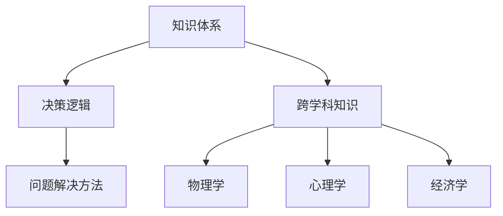
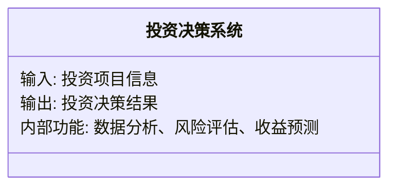
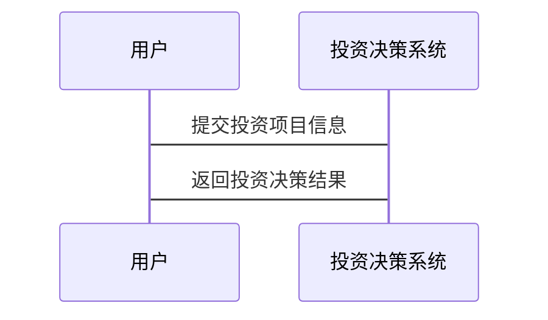
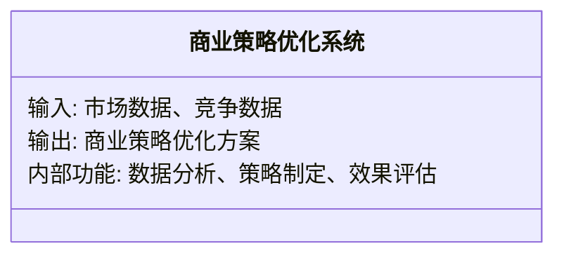
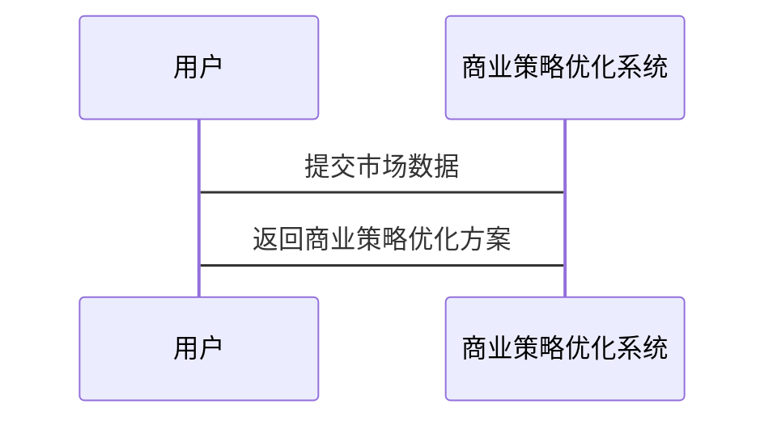

                 


# 查理·芒格的多元思维模型实际案例分析

## 关键词：查理·芒格，多元思维模型，投资决策，商业策略，系统架构，算法原理

## 摘要：  
查理·芒格的多元思维模型是一种结合多种思维框架和决策方法的综合性模型，旨在帮助人们更好地理解和解决复杂问题。本文将从多元思维模型的背景、核心概念、算法原理、系统架构以及实际案例分析等方面进行深入探讨。通过对投资决策和商业策略优化的实际案例分析，展示多元思维模型在实际应用中的巨大价值。

---

## 第一部分：查理·芒格的多元思维模型概述

### 第1章：多元思维模型的背景与核心概念

#### 1.1 多元思维模型的起源与发展

查理·芒格的多元思维模型起源于他对人类认知和决策过程的深刻理解。芒格认为，人类的决策过程往往受到情绪、偏见和知识局限的影响，而多元思维模型通过整合多个学科和领域的知识，帮助我们更全面地看待问题。

##### 1.1.1 从第一性原理到多元思维的演变

芒格的多元思维模型是一种基于第一性原理的思维方式。第一性原理是指从最根本的原理出发，逐步推导出问题的解决方案。与之相比，多元思维模型强调从多个角度和学科出发，综合分析问题。

##### 1.1.2 查理·芒格对多元思维模型的贡献

芒格通过《穷查理宝典》等著作，将多元思维模型的概念系统化，并将其应用于投资、管理和决策领域。他提出的核心思想是：通过整合物理学、心理学、经济学等多个学科的原理，形成一个完整的知识体系，从而做出更明智的决策。

##### 1.1.3 多元思维模型的核心理念与哲学基础

多元思维模型的核心理念是“知识的综合与融会”。芒格认为，单一的思维方式容易导致决策偏差，而通过整合多个学科的原理，可以更好地理解和解决复杂问题。其哲学基础在于“万物皆有联系”，强调跨学科的综合思维。

#### 1.2 多元思维模型的定义与特点

##### 1.2.1 多元思维模型的定义

多元思维模型是一种通过整合多个学科和领域的知识，形成一个完整的知识体系，并将其应用于实际问题解决的思维方式。

##### 1.2.2 多元思维模型的核心特点

- **跨学科性**：整合物理学、心理学、经济学等多个学科的原理。
- **系统性**：强调从系统整体的角度看待问题。
- **动态性**：能够根据实际情况调整思维方式。
- **实用性**：能够应用于投资、管理和决策等多个领域。

##### 1.2.3 多元思维模型与其他思维模型的对比

以下是多元思维模型与其他思维模型的对比表格：

| 思维模型        | 强调点               | 优点                           | 缺点                           |
|-----------------|--------------------|--------------------------------|--------------------------------|
| 单一学科思维    | 专注于单一学科知识   | 深度专业性                     | 容易忽略其他学科的关联性     |
| 多元思维模型    | 整合多个学科知识     | 综合性、系统性                   | 需要广泛的知识储备             |
| 投资决策模型    | 专注于投资决策逻辑   | 针对性、实用性                   | 可能缺乏跨领域视角             |

#### 1.3 多元思维模型的核心要素与组成

##### 1.3.1 核心概念的结构化分析

以下是多元思维模型的核心要素：

- **知识体系**：包括物理学、心理学、经济学等学科的原理。
- **决策逻辑**：基于知识体系的逻辑推理。
- **问题解决方法**：通过综合分析解决问题。

##### 1.3.2 多元思维模型的属性特征对比表格

| 属性        | 特征描述               |
|-------------|------------------------|
| 跨学科性     | 整合多个学科的知识     |
| 系统性       | 从系统整体的角度分析问题 |
| 动态性       | 根据实际情况调整思维方式 |
| 实用性       | 应用于多个实际领域     |

##### 1.3.3 ER实体关系图架构（使用Mermaid流程图）



---

## 第二部分：多元思维模型的数学基础与算法原理

### 第2章：多元思维模型的算法原理

#### 2.1 多元思维模型的决策树算法

##### 2.1.1 决策树的构建过程

决策树是一种用于分类和回归的机器学习算法。其构建过程如下：

1. **选择根节点**：选择具有最大信息增益的特征作为根节点。
2. **分裂节点**：根据特征值分裂节点，直到达到叶子节点。
3. **剪枝**：为了防止过拟合，对决策树进行剪枝。

##### 2.1.2 决策树的数学模型与公式

决策树的数学模型基于信息论中的信息增益公式：

$$ \text{信息增益}(A, B) = H(B) - H(A|B) $$

其中，\( H(B) \) 是目标变量的熵，\( H(A|B) \) 是在给定目标变量下特征变量的条件熵。

##### 2.1.3 决策树的优缺点分析

- **优点**：直观易懂，易于实现。
- **缺点**：容易过拟合，计算复杂度高。

#### 2.2 多元思维模型的概率计算

##### 2.2.1 贝叶斯定理在多元思维模型中的应用

贝叶斯定理是一种用于计算条件概率的公式，其公式为：

$$ P(A|B) = \frac{P(B|A) \cdot P(A)}{P(B)} $$

其中，\( P(A|B) \) 是在已知 \( B \) 的条件下 \( A \) 的概率。

##### 2.2.2 贝叶斯定理的数学公式与推导

通过贝叶斯定理，我们可以根据先验概率和条件概率计算后验概率。例如，在投资决策中，我们可以利用贝叶斯定理来计算某个投资项目的成功概率。

##### 2.2.3 贝叶斯网络的构建与应用

贝叶斯网络是一种基于贝叶斯定理的概率网络，能够帮助我们进行概率推理和决策分析。

---

## 第三部分：多元思维模型的实际应用与案例分析

### 第3章：多元思维模型在投资决策中的应用

#### 3.1 投资决策的场景介绍

##### 3.1.1 投资决策的核心问题与挑战

投资决策的核心问题是如何选择具有高回报率和低风险的投资项目。其挑战在于如何综合考虑市场、经济、技术和管理等多个因素。

##### 3.1.2 多元思维模型在投资中的优势

通过整合多个学科的知识，多元思维模型能够帮助投资者更全面地分析投资项目的可行性。

#### 3.2 投资决策的系统实现

##### 3.2.1 系统功能设计（使用Mermaid类图）



##### 3.2.2 系统架构设计（使用Mermaid架构图）

```mermaid
container 多元思维模型 {
    component 数据采集模块 {
        输入: 投资项目信息
    }
    component 数据分析模块 {
        数据分析: 数据处理、特征提取
    }
    component 决策模块 {
        决策逻辑: 风险评估、收益预测
    }
}
```

##### 3.2.3 系统接口设计与交互流程（使用Mermaid序列图）



#### 3.3 投资决策的实际案例分析

##### 3.3.1 案例背景与目标

某公司计划投资于一个新的科技项目。通过多元思维模型，我们需要分析该项目的市场前景、技术可行性、管理能力和财务状况。

##### 3.3.2 多元思维模型的应用过程

1. **数据采集**：收集项目相关的市场、技术和财务数据。
2. **数据分析**：使用决策树和贝叶斯网络对数据进行分析。
3. **风险评估**：评估项目的潜在风险。
4. **收益预测**：预测项目的收益情况。

##### 3.3.3 案例结果与分析

通过多元思维模型的分析，我们得出该项目具有较高的市场潜力和较低的管理风险，建议进行投资。

### 第4章：多元思维模型在商业策略优化中的应用

#### 4.1 商业策略优化的场景介绍

##### 4.1.1 商业策略优化的核心问题与挑战

商业策略优化的核心问题是如何在复杂的市场环境中制定有效的商业策略。其挑战在于如何综合考虑市场、竞争、客户和内部管理等多个因素。

##### 4.1.2 多元思维模型在商业策略中的优势

通过整合多个学科的知识，多元思维模型能够帮助企业在制定商业策略时，更加全面地考虑各种因素。

#### 4.2 商业策略优化的系统实现

##### 4.2.1 系统功能设计（使用Mermaid类图）



##### 4.2.2 系统架构设计（使用Mermaid架构图）

```mermaid
container 多元思维模型 {
    component 数据采集模块 {
        输入: 市场数据、竞争数据
    }
    component 数据分析模块 {
        数据分析: 数据处理、特征提取
    }
    component 策略制定模块 {
        策略逻辑: 市场分析、竞争分析
    }
}
```

##### 4.2.3 系统接口设计与交互流程（使用Mermaid序列图）



#### 4.3 商业策略优化的实际案例分析

##### 4.3.1 案例背景与目标

某企业希望优化其市场进入策略。通过多元思维模型，我们需要分析目标市场的竞争环境、客户需求和内部资源。

##### 4.3.2 多元思维模型的应用过程

1. **数据采集**：收集目标市场的竞争数据和客户数据。
2. **数据分析**：使用决策树和贝叶斯网络对数据进行分析。
3. **策略制定**：制定市场进入策略。
4. **效果评估**：评估策略的实施效果。

##### 4.3.3 案例结果与分析

通过多元思维模型的分析，我们得出最佳的市场进入策略，并帮助企业成功进入新市场。

---

## 第四部分：总结与展望

### 第5章：总结与展望

#### 5.1 总结

通过本文的分析，我们可以看出，查理·芒格的多元思维模型在投资决策和商业策略优化中具有重要的应用价值。通过整合多个学科的知识，多元思维模型能够帮助我们更全面地分析问题，并做出更明智的决策。

#### 5.2 展望

未来，随着人工智能和大数据技术的发展，多元思维模型将具有更广泛的应用前景。我们期待更多的人能够认识到多元思维模型的价值，并将其应用于更多的实际场景中。

---

## 作者：AI天才研究院/AI Genius Institute & 禅与计算机程序设计艺术 /Zen And The Art of Computer Programming

