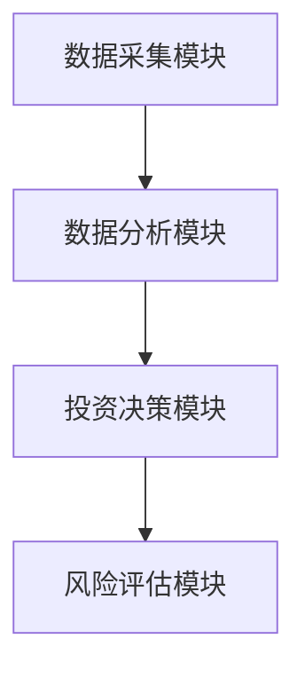

                 


# 查理·芒格的跨学科思维在投资中的应用

> 关键词：查理·芒格，跨学科思维，多元思维模型，投资策略，心理学，经济学，物理学

> 摘要：查理·芒格的多元思维模型是一种将多个学科知识整合起来进行决策的方法，这种方法在投资领域具有重要的应用价值。本文将详细探讨芒格的跨学科思维的核心概念、算法原理、系统架构，以及在实际投资中的应用案例，并总结最佳实践和注意事项。

---

# 第1章: 查理·芒格与多元思维模型

## 1.1 查理·芒格的生平与思想

### 1.1.1 查理·芒格的早年经历
查理·芒格（Charlie Munger）是美国著名投资家，沃伦·巴菲特的长期合作伙伴。他出生于1924年，曾在哈佛大学学习法律，并在之后的职业生涯中积累了丰富的投资经验。芒格的哲学思想深受叔本华、尼采等哲学家的影响，这为他后来提出的多元思维模型奠定了基础。

### 1.1.2 芒格的哲学与投资理念
芒格的投资理念强调价值投资和长期持有的策略。他认为，投资的本质是寻找具有持续竞争优势的企业，并以合理的价格买入。芒格的哲学思想贯穿了他的投资策略，他主张投资者应该具备广泛的知识储备，并能够跨学科地思考问题。

### 1.1.3 芒格思想的核心观点
芒格的核心观点是，投资者应该构建一个多元思维模型，将各个学科的知识整合起来，以更好地理解市场、企业和经济的整体运作。他认为，单一学科的视角是不够的，必须通过跨学科的思考来捕捉市场的复杂性。

---

## 1.2 多元思维模型的定义与特点

### 1.2.1 多元思维模型的定义
多元思维模型（Mental Models）是指将多个学科的理论和方法整合到一起，形成一个全面的思考框架。这种模型能够帮助投资者更好地理解市场的动态，并做出更明智的决策。

### 1.2.2 多元思维模型的核心特点
- **多样性**：涵盖多个学科的知识，如心理学、经济学、物理学等。
- **关联性**：各学科知识之间相互关联，形成一个有机的整体。
- **实用性**：能够直接应用于投资决策中。

### 1.2.3 多元思维模型与传统投资方法的区别
传统的投资方法往往依赖于单一学科的理论，如技术分析或基本面分析。而多元思维模型则强调跨学科的综合应用，能够更全面地分析市场的复杂性。

---

## 1.3 多元思维模型在投资中的应用前景

### 1.3.1 多元思维模型的潜在应用领域
多元思维模型在投资中的应用领域包括股票分析、风险管理、资产配置等。

### 1.3.2 投资者采用多元思维模型的优势
- **全面性**：能够从多个角度分析问题，避免单一视角的局限性。
- **准确性**：通过跨学科的分析，提高决策的准确性。
- **适应性**：能够更好地应对市场变化。

### 1.3.3 多元思维模型应用的挑战与机遇
- **挑战**：需要投资者具备广泛的知识储备，并能够有效地整合不同学科的理论。
- **机遇**：通过跨学科的思考，投资者能够发现更多的投资机会，并更好地管理风险。

---

## 1.4 本章小结
本章介绍了查理·芒格的生平与思想，以及多元思维模型的定义、特点和应用前景。通过芒格的哲学思想和投资理念，我们可以看到，多元思维模型在投资中的重要性。

---

# 第2章: 跨学科思维的核心概念

## 2.1 背景介绍

### 2.1.1 跨学科思维的背景
随着市场的复杂化，单一学科的分析方法已经难以满足投资者的需求。因此，跨学科思维的应用变得越来越重要。

### 2.1.2 跨学科思维的核心概念
跨学科思维是指将不同学科的知识整合起来，以解决复杂问题的一种思维方式。

### 2.1.3 跨学科思维的边界与外延
跨学科思维的边界在于不同学科之间的关联性，而外延则包括如何将这些知识应用于实际问题中。

---

## 2.2 核心概念与联系

### 2.2.1 跨学科思维的原理
跨学科思维的原理在于通过不同学科的交叉融合，形成一个更全面的分析框架。

### 2.2.2 跨学科思维的核心要素组成
- **知识储备**：投资者需要具备广泛的知识储备。
- **关联能力**：能够将不同学科的知识联系起来。
- **应用能力**：能够将跨学科的思考应用于实际投资决策中。

### 2.2.3 跨学科思维与投资的关系
跨学科思维能够帮助投资者更好地理解市场、企业和经济的整体运作，从而做出更明智的投资决策。

---

## 2.3 核心概念对比表格

| 概念                | 跨学科思维               | 单一学科思维            |
|---------------------|--------------------------|--------------------------|
| 定义                | 跨越多个学科的知识整合   | 依赖单一学科的知识      |
| 优点                | 分析全面，避免片面        | 分析单一，可能遗漏重要信息|
| 应用场景            | 复杂市场环境              | 简单市场环境              |

---

## 2.4 本章小结
本章详细探讨了跨学科思维的核心概念、原理和应用。通过对比分析，我们可以看到，跨学科思维在投资中的优势明显，能够帮助投资者更好地应对复杂的市场环境。

---

# 第3章: 跨学科思维的算法原理

## 3.1 背景介绍

### 3.1.1 跨学科思维的算法背景
为了将跨学科思维应用于投资决策中，我们需要将其转化为具体的算法模型。

### 3.1.2 跨学科思维的算法目标
算法的目标是通过整合不同学科的知识，帮助投资者做出更明智的投资决策。

### 3.1.3 跨学科思维的算法应用场景
算法可以应用于股票筛选、风险管理、资产配置等投资领域。

---

## 3.2 背景与目标

### 3.2.1 背景介绍
算法的背景在于市场的复杂性和投资者对高效决策的需求。

### 3.2.2 算法目标
算法的目标是通过整合不同学科的知识，提高投资决策的准确性和效率。

### 3.2.3 应用场景
算法可以应用于股票分析、市场预测、风险评估等领域。

---

## 3.3 核心算法流程

### 3.3.1 算法输入
- 投资者的资金规模
- 市场数据（股票价格、财务报表等）
- 风险偏好

### 3.3.2 算法处理步骤
1. **数据收集**：收集相关股票的市场数据和公司财务报表。
2. **数据分析**：运用经济学、心理学等学科的理论进行分析。
3. **决策制定**：根据分析结果，制定投资策略。

### 3.3.3 算法输出
- 投资建议（如买入、卖出、持有）
- 风险评估报告

---

## 3.4 算法的数学模型

### 3.4.1 算法的数学表达式
假设我们有N只股票，每只股票的收益率为R_i，风险为σ_i。我们的目标是找到最优的投资组合，使得期望收益最大，风险最小。

数学模型如下：
$$
\text{最大化} \quad \sum_{i=1}^{N} w_i R_i \\
\text{约束} \quad \sum_{i=1}^{N} w_i = 1 \\
\text{且} \quad \sum_{i=1}^{N} w_i^2 \sigma_i^2 \text{最小化}
$$

其中，w_i 是第i只股票的投资比例。

### 3.4.2 算法的数学推导
通过拉格朗日乘数法，我们可以求解上述优化问题，得到最优的投资组合。

### 3.4.3 算法的数学验证
通过历史数据验证算法的有效性，比较算法预测的收益率与实际收益率的差异。

---

## 3.5 算法的实现代码

### 3.5.1 环境安装
需要安装Python和相关库，如NumPy和Pandas。

### 3.5.2 核心代码实现

```python
import numpy as np
import pandas as pd

# 假设我们有N只股票，收益率为R，风险为sigma
N = 10
R = np.random.rand(N)
sigma = np.random.rand(N)

# 定义优化目标函数
def objective(w):
    return -np.sum(w * R)  # 最小化负的期望收益

# 定义约束条件
def constraint(w):
    return np.sum(w) - 1  # 投资比例之和为1

# 使用scipy.optimize进行优化
from scipy.optimize import minimize

# 初始猜测
w0 = np.ones(N) / N

# 进行优化
result = minimize(objective, w0, constraints=[{'type': 'eq', 'fun': constraint}])

# 输出结果
print("最优投资比例:", result.x)
```

### 3.5.3 代码解读与分析
上述代码通过优化算法，求解出最优的投资组合，使得在给定风险下，期望收益最大化。

---

## 3.6 本章小结
本章详细介绍了跨学科思维的算法原理，包括算法背景、目标、流程、数学模型和实现代码。通过具体的代码实现，我们可以更好地理解跨学科思维在投资中的应用。

---

# 第4章: 跨学科思维的系统架构

## 4.1 背景介绍

### 4.1.1 系统背景
为了将跨学科思维应用于投资决策中，我们需要构建一个完整的系统架构。

### 4.1.2 系统目标
系统的目标是帮助投资者通过跨学科的分析，做出更明智的投资决策。

### 4.1.3 系统应用场景
系统可以应用于股票筛选、市场预测、风险评估等领域。

---

## 4.2 系统功能设计

### 4.2.1 系统功能模块划分
- 数据采集模块
- 数据分析模块
- 投资决策模块
- 风险评估模块

### 4.2.2 系统功能模块描述
- 数据采集模块：负责收集市场数据和公司财务报表。
- 数据分析模块：运用经济学、心理学等学科的理论进行分析。
- 投资决策模块：根据分析结果，制定投资策略。
- 风险评估模块：评估投资组合的风险，并提出风险管理建议。

### 4.2.3 系统功能模块之间的关系
各模块之间相互依赖，形成一个完整的投资决策系统。

---

## 4.3 系统架构设计

### 4.3.1 系统架构图


### 4.3.2 系统模块之间的接口设计
- 数据采集模块向数据分析模块提供市场数据。
- 数据分析模块向投资决策模块提供分析结果。
- 投资决策模块向风险评估模块提供投资策略。

### 4.3.3 系统模块之间的交互流程
1. 数据采集模块收集市场数据。
2. 数据分析模块对数据进行分析。
3. 投资决策模块根据分析结果制定投资策略。
4. 风险评估模块评估投资组合的风险。

---

## 4.4 本章小结
本章详细探讨了跨学科思维的系统架构，包括功能模块划分、架构设计和模块之间的交互流程。通过系统架构的设计，我们可以更好地理解跨学科思维在投资中的应用。

---

# 第5章: 跨学科思维的项目实战

## 5.1 项目背景

### 5.1.1 项目目标
通过跨学科思维，帮助投资者制定一个高效的投资策略。

### 5.1.2 项目需求
项目需要实现股票筛选、市场预测、风险评估等功能。

### 5.1.3 项目应用场景
项目可以应用于股票投资、资产配置、风险管理等领域。

---

## 5.2 项目核心实现

### 5.2.1 环境安装
需要安装Python和相关库，如NumPy、Pandas和Scikit-learn。

### 5.2.2 核心代码实现

```python
import numpy as np
import pandas as pd
from sklearn import linear_model

# 假设我们有N只股票，收益率为R，风险为sigma
N = 10
R = np.random.rand(N)
sigma = np.random.rand(N)

# 数据分析模块
def analyze_data(data):
    # 这里可以应用经济学、心理学等学科的理论进行分析
    pass

# 投资决策模块
def make_investment_decision(data):
    # 这里可以应用优化算法进行投资决策
    pass

# 风险评估模块
def assess_risk(data):
    # 这里可以应用风险管理模型进行风险评估
    pass

# 主函数
def main():
    data = pd.DataFrame({
        '收益率': R,
        '风险': sigma
    })
    analyze_data(data)
    make_investment_decision(data)
    assess_risk(data)

if __name__ == "__main__":
    main()
```

### 5.2.3 代码解读与分析
上述代码通过数据分析模块、投资决策模块和风险评估模块，实现了跨学科思维在投资中的应用。

---

## 5.3 实际案例分析

### 5.3.1 案例背景
假设我们有10只股票，收益率和风险数据如上所述。

### 5.3.2 案例分析
通过数据分析模块，我们分析每只股票的收益率和风险，然后根据分析结果制定投资策略，最后评估投资组合的风险。

### 5.3.3 案例总结
通过跨学科思维的应用，我们能够更好地理解市场动态，并制定更明智的投资决策。

---

## 5.4 本章小结
本章通过项目实战，详细介绍了跨学科思维在投资中的具体应用。通过实际案例分析，我们可以看到，跨学科思维能够帮助投资者更好地应对复杂的市场环境。

---

# 第6章: 跨学科思维的最佳实践

## 6.1 背景介绍

### 6.1.1 背景
跨学科思维在投资中的应用已经得到了广泛的认可。

### 6.1.2 目标
本文的目标是总结跨学科思维在投资中的最佳实践。

### 6.1.3 应用场景
跨学科思维可以应用于股票分析、市场预测、风险管理等领域。

---

## 6.2 核心概念与联系

### 6.2.1 背景介绍
跨学科思维的核心在于通过不同学科的交叉融合，形成一个全面的分析框架。

### 6.2.2 核心概念与联系
跨学科思维的核心概念包括知识储备、关联能力和应用能力。

### 6.2.3 核心概念对比表格
| 概念                | 跨学科思维               | 单一学科思维            |
|---------------------|--------------------------|--------------------------|
| 定义                | 跨越多个学科的知识整合   | 依赖单一学科的知识      |
| 优点                | 分析全面，避免片面        | 分析单一，可能遗漏重要信息|
| 应用场景            | 复杂市场环境              | 简单市场环境              |

---

## 6.3 算法原理讲解

### 6.3.1 背景介绍
为了将跨学科思维应用于投资决策中，我们需要将其转化为具体的算法模型。

### 6.3.2 核心算法流程
1. **数据收集**：收集相关股票的市场数据和公司财务报表。
2. **数据分析**：运用经济学、心理学等学科的理论进行分析。
3. **决策制定**：根据分析结果，制定投资策略。

---

## 6.4 系统分析与架构设计方案

### 6.4.1 背景介绍
为了将跨学科思维应用于投资决策中，我们需要构建一个完整的系统架构。

### 6.4.2 系统功能设计
- 数据采集模块
- 数据分析模块
- 投资决策模块
- 风险评估模块

### 6.4.3 系统架构设计


### 6.4.4 系统接口设计
- 数据采集模块向数据分析模块提供市场数据。
- 数据分析模块向投资决策模块提供分析结果。
- 投资决策模块向风险评估模块提供投资策略。

---

## 6.5 项目实战

### 6.5.1 环境安装
需要安装Python和相关库，如NumPy和Pandas。

### 6.5.2 核心代码实现
```python
import numpy as np
import pandas as pd

# 假设我们有N只股票，收益率为R，风险为sigma
N = 10
R = np.random.rand(N)
sigma = np.random.rand(N)

# 数据分析模块
def analyze_data(data):
    pass

# 投资决策模块
def make_investment_decision(data):
    pass

# 风险评估模块
def assess_risk(data):
    pass

# 主函数
def main():
    data = pd.DataFrame({
        '收益率': R,
        '风险': sigma
    })
    analyze_data(data)
    make_investment_decision(data)
    assess_risk(data)

if __name__ == "__main__":
    main()
```

### 6.5.3 代码解读与分析
上述代码通过数据分析模块、投资决策模块和风险评估模块，实现了跨学科思维在投资中的应用。

---

## 6.6 本章小结
本章总结了跨学科思维在投资中的最佳实践，包括核心概念、算法原理和系统架构设计。通过实际案例分析，我们可以看到，跨学科思维能够帮助投资者更好地应对复杂的市场环境。

---

# 作者：AI天才研究院/AI Genius Institute & 禅与计算机程序设计艺术 /Zen And The Art of Computer Programming

