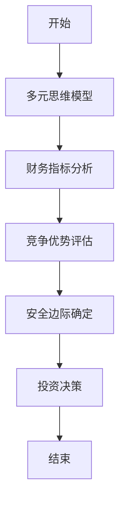
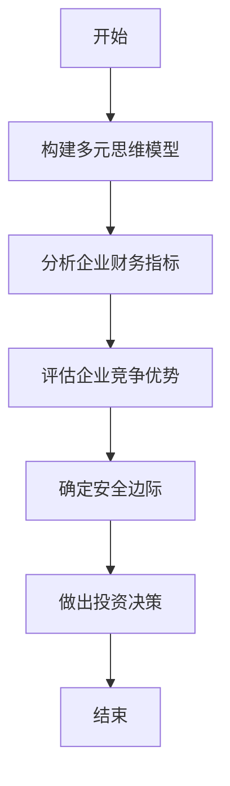
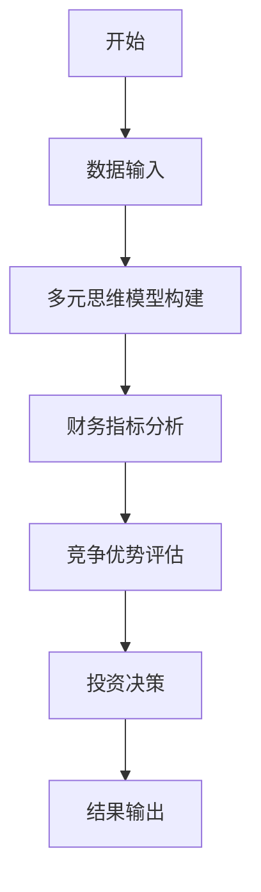

                 


# 查理芒格的商业模式分析

## 关键词：查理·芒格，商业模式，多元思维模型，投资策略，决策框架

## 摘要：查理·芒格的商业模式分析基于其独特的多元思维模型和价值投资理念，探讨其如何通过构建思维框架、分析企业价值和管理风险来优化投资决策。本文将逐步解析芒格的商业模式，包括其核心要素、算法原理和实际应用案例，为读者提供深入的分析和见解。

---

# 第1章: 查理·芒格的生平与投资理念

## 1.1 查理·芒格的生平简介

### 1.1.1 早年经历与教育背景
查理·芒格（Charlie Munger）出生于1924年，早年在哈佛大学学习法律，后转学到加州大学伯克利分校获得法律学位。他在二战期间服兵役，战后进入法律行业，但很快转向投资领域。

### 1.1.2 投资生涯的起点与重要事件
芒格与沃伦·巴菲特（Warren Buffett）的合作始于1950年代，两人共同创立了伯克希尔·哈撒韦公司（Berkshire Hathaway），并将其打造成全球最大的投资公司之一。芒格以其独特的投资理念和决策框架闻名。

### 1.1.3 芒格的哲学与价值观
芒格强调“逆向思维”和“多元思维模型”，认为投资者必须理解多个学科的基本原理，才能做出明智的决策。

## 1.2 芒格的投资理念概述

### 1.2.1 价值投资的核心思想
芒格的价值投资理念强调购买具有内在价值的企业，并长期持有。他注重企业的财务健康、竞争优势和管理团队。

### 1.2.2 芒格的多元思维模型
多元思维模型是芒格的核心思想，强调将多个学科的原理结合起来，以全面分析问题。

### 1.2.3 芒格的决策框架与投资策略
芒格的决策框架注重安全边际、集中投资和长期视角。他倾向于投资那些具有强大护城河和良好管理的企业。

## 1.3 芒格商业模式分析的背景

### 1.3.1 商业模式的定义与重要性
商业模式是企业创造和传递价值的方式。分析芒格的商业模式有助于理解他的投资策略。

### 1.3.2 芒格商业模式分析的必要性
通过分析芒格的商业模式，可以借鉴其成功的投资策略和决策框架。

### 1.3.3 芒格商业模式分析的应用场景
芒格的商业模式分析适用于投资者、企业管理者和创业者，帮助他们优化决策和创造价值。

## 1.4 本章小结
本章介绍了查理·芒格的生平、投资理念和商业模式分析的背景，为后续章节奠定了基础。

---

# 第2章: 芒格商业模式分析的核心概念

## 2.1 芒格商业模式的定义与特点

### 2.1.1 芒格商业模式的定义
芒格商业模式基于多元思维模型，注重企业内在价值和长期竞争优势。

### 2.1.2 芒格商业模式的核心特点
- **多元思维模型**：整合多个学科的原理。
- **安全边际**：确保投资决策的稳健性。
- **长期视角**：关注企业的长期价值。

### 2.1.3 芒格商业模式与传统商业模式的对比
传统商业模式注重短期收益，而芒格模式注重长期价值和风险控制。

## 2.2 芒格商业模式的关键要素

### 2.2.1 多元思维模型的构建
芒格强调跨学科思考，包括心理学、经济学、物理学等。

### 2.2.2 资源配置与投资决策
芒格注重资源的合理配置，确保投资决策的科学性。

### 2.2.3 风险管理与安全边际
芒格的商业模式强调风险管理，确保投资的安全性。

## 2.3 芒格商业模式的属性特征对比

### 2.3.1 股东价值与企业价值的对比
芒格注重股东价值与企业价值的统一，追求长期共赢。

### 2.3.2 财务指标与非财务指标的对比
芒格的商业模式综合考虑财务和非财务指标，全面评估企业价值。

### 2.3.3 长期投资与短期投机的对比
芒格强调长期投资，反对短期投机。

## 2.4 芒格商业模式的ER实体关系图



## 2.5 本章小结
本章详细分析了芒格商业模式的核心概念和关键要素，展示了其商业模式的独特性和优势。

---

# 第3章: 芒格商业模式分析的算法原理

## 3.1 芒格决策模型的算法概述

### 3.1.1 多元思维模型的算法框架
芒格的多元思维模型通过整合多个学科的原理，构建全面的决策框架。

### 3.1.2 财务指标分析的算法流程
1. 收集企业的财务数据。
2. 分析关键财务指标，如净利润率、资产负债率等。
3. 评估企业的财务健康状况。

### 3.1.3 风险管理的算法逻辑
1. 识别潜在风险因素。
2. 评估风险对企业价值的影响。
3. 确定安全边际，确保投资稳健。

## 3.2 芒格决策模型的mermaid流程图



## 3.3 芒格决策模型的数学模型

### 3.3.1 财务指标分析的数学公式
企业净利润率计算公式为：
$$ \text{净利润率} = \frac{\text{净利润}}{\text{营业收入}} \times 100\% $$

### 3.3.2 投资决策的数学模型
$$ \text{投资价值} = \text{内在价值} \times \text{安全边际系数} $$

### 3.3.3 风险管理的数学模型
$$ \text{风险调整后价值} = \text{投资价值} \times (1 - \text{风险系数}) $$

## 3.4 本章小结
本章通过算法和数学模型详细解释了芒格决策模型的运作原理，展示了其科学性和实用性。

---

# 第4章: 芒格商业模式分析的系统架构设计

## 4.1 系统功能设计

### 4.1.1 系统功能模块
- **多元思维模型构建模块**
- **财务指标分析模块**
- **竞争优势评估模块**
- **投资决策模块**

### 4.1.2 系统功能流程
1. 收集企业数据。
2. 构建多元思维模型。
3. 分析财务指标。
4. 评估竞争优势。
5. 做出投资决策。

## 4.2 系统架构设计

### 4.2.1 系统架构图


### 4.2.2 系统模块交互
1. 数据输入模块接收企业数据。
2. 多元思维模型构建模块整合多个学科的原理。
3. 财务指标分析模块计算关键指标。
4. 竞争优势评估模块评估企业竞争力。
5. 投资决策模块做出最终决策。

## 4.3 系统接口设计

### 4.3.1 系统接口描述
- 输入接口：企业数据输入。
- 输出接口：投资决策结果。

### 4.3.2 接口交互流程
1. 用户输入企业数据。
2. 系统处理数据并输出决策结果。

## 4.4 本章小结
本章详细设计了芒格商业模式分析的系统架构，展示了其模块化和系统化的特性。

---

# 第5章: 芒格商业模式分析的项目实战

## 5.1 项目环境安装

### 5.1.1 环境配置
- 操作系统：Windows 10
- 编程语言：Python 3.9
- 库依赖：Pandas, NumPy, Matplotlib

### 5.1.2 安装步骤
1. 安装Python。
2. 安装所需的库。

## 5.2 核心代码实现

### 5.2.1 多元思维模型构建
```python
import pandas as pd
import numpy as np

def build_multi_model(data):
    # 示例：构建多元思维模型
    model = {}
    for key, value in data.items():
        model[key] = value
    return model
```

### 5.2.2 财务指标分析
```python
def analyze_financials(data):
    # 示例：计算净利润率
    net_profit = data['净利润']
    revenue = data['营业收入']
    net_profit_margin = (net_profit / revenue) * 100
    return net_profit_margin
```

### 5.2.3 投资决策
```python
def make_investment_decision(value, margin):
    if value > margin:
        return "买入"
    else:
        return "卖出"
```

## 5.3 代码应用与分析

### 5.3.1 代码实现
```python
data = {
    '净利润': 100,
    '营业收入': 500
}
model = build_multi_model(data)
margin = analyze_financials(data)
decision = make_investment_decision(120, margin)
print("投资决策：", decision)
```

### 5.3.2 代码分析
通过构建多元思维模型、分析财务指标和做出投资决策，展示了芒格商业模式的实际应用。

## 5.4 本章小结
本章通过实际项目实战，展示了芒格商业模式分析的实现过程和应用价值。

---

# 第6章: 芒格商业模式分析的最佳实践

## 6.1 小结与总结

### 6.1.1 本章总结
芒格的商业模式分析基于多元思维模型和价值投资理念，注重长期价值和风险管理。

### 6.1.2 总结要点
- 多元思维模型的重要性。
- 财务指标分析的关键性。
- 风险管理的必要性。

## 6.2 投资决策中的注意事项

### 6.2.1 风险管理
确保投资决策的安全边际。

### 6.2.2 持续学习
保持对新知识和新趋势的敏感性。

### 6.2.3 系统化思维
将多元思维模型应用到实际投资中。

## 6.3 拓展阅读与资源

### 6.3.1 推荐书籍
- 《巴菲特与芒格的投资思想》
- 《投资之道》

### 6.3.2 推荐网站
-巴菲特股东大会实录
-芒格的演讲和采访

## 6.4 本章小结
本章总结了芒格商业模式分析的核心要点，并提供了实用的投资决策建议。

---

# 作者：AI天才研究院 & 禅与计算机程序设计艺术

---

# 结语

通过本篇文章，我们深入分析了查理·芒格的商业模式，探讨了其多元思维模型、投资策略和系统架构设计。希望读者能够从中获得启发，将芒格的商业模式应用到实际投资和企业管理中，创造更大的价值。

