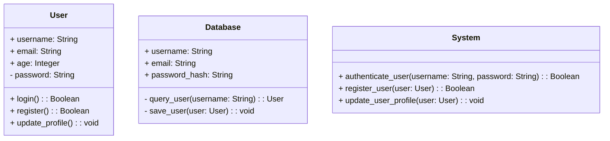

                 


# 查理芒格的多元思维模型

> 关键词：查理·芒格、多元思维模型、概率论、逆向思维、复利效应、决策树、系统性思维

> 摘要：查理·芒格的多元思维模型是一种基于跨学科思考和系统性分析的决策方法。本文将从其核心概念、数学模型、算法原理、系统架构到项目实战，全面解析这一模型，并通过具体案例分析，展示其在实际应用中的强大优势。

---

## 第一部分: 多元思维模型的背景与核心概念

### 第1章: 多元思维模型的背景与核心概念

#### 1.1 查理·芒格的生平简介
查理·芒格是美国著名投资家、伯克希尔·哈撒韦公司副董事长，以其独特的投资理念和多元思维模型闻名。他的思想不仅影响了投资领域，还在个人成长和企业管理等领域产生了深远影响。

#### 1.2 多元思维模型的提出背景
在传统决策过程中，人们往往局限于单一学科或思维方式，导致决策的片面性和短视性。芒格提出多元思维模型，旨在通过跨学科的视角，构建一个完整的知识框架，帮助人们更全面地理解和解决问题。

#### 1.3 多元思维模型的核心理念
多元思维模型强调通过多个学科的交叉应用，构建一个完整的知识体系。通过将不同领域的原理、规律和方法结合起来，形成一个立体的思维框架，从而做出更科学、更合理的决策。

---

### 第2章: 多元思维模型的基本特征

#### 2.1 跨学科性
多元思维模型的核心在于跨学科思考。通过将物理学、心理学、经济学等多个学科的原理结合起来，形成一个完整的知识网络。

#### 2.2 系统性
多元思维模型强调系统的整体性。通过分析系统中各个组成部分之间的相互关系，理解系统的运行规律，从而做出更全面的决策。

#### 2.3 实用性
多元思维模型注重实际应用。通过将理论知识与实际问题结合起来，找到解决问题的最佳方案。

---

## 第二部分: 多元思维模型的核心概念与联系

### 第3章: 多元思维模型的核心概念

#### 3.1 概率论与决策树
##### 3.1.1 概率论的基本原理
概率论是多元思维模型的重要组成部分。通过计算事件发生的概率，我们可以更科学地做出决策。

##### 3.1.2 决策树的构建与分析
决策树是一种常见的概率分析工具。通过构建决策树，我们可以清晰地看到不同决策路径的可能结果及其概率。

##### 3.1.3 概率在决策中的应用
例如，在投资决策中，我们可以通过概率论计算某项投资的成功概率，从而决定是否投资。

#### 3.2 逆向思维与反向推理
##### 3.2.1 逆向思维的定义与特点
逆向思维是一种从反方向思考问题的方法。通过考虑问题的对立面，我们可以找到更有效的解决方案。

##### 3.2.2 反向推理的步骤与方法
反向推理是通过从结果推导原因的一种方法。这种方法在解决复杂问题时尤其有效。

##### 3.2.3 逆向思维在问题解决中的应用
例如，在企业战略制定中，通过逆向思维，我们可以从目标出发，反推实现目标所需的条件。

#### 3.3 复利效应与时间价值
##### 3.3.1 复利效应的数学模型
复利效应是时间价值的核心体现。通过复利公式，我们可以计算出投资的未来价值。

##### 3.3.2 时间价值的计算公式
例如，投资的未来价值可以通过以下公式计算：
$$ A = P(1 + r)^n $$

##### 3.3.3 复利效应在投资中的应用
通过复利效应，我们可以预测投资的长期收益，从而做出更合理的投资决策。

#### 3.4 贝叶斯定理与条件概率
##### 3.4.1 贝叶斯定理的定义
贝叶斯定理是一种条件概率公式，用于计算在已知某些条件下，某一事件发生的概率。

##### 3.4.2 条件概率的计算公式
例如，计算在事件B发生的条件下，事件A发生的概率：
$$ P(A|B) = \frac{P(B|A)P(A)}{P(B)} $$

##### 3.4.3 贝叶斯定理在决策中的应用
例如，在医疗诊断中，通过贝叶斯定理，我们可以计算在患者出现某种症状的情况下，患某种疾病的概率。

---

## 第三部分: 多元思维模型的算法原理与系统架构

### 第4章: 多元思维模型的算法原理

#### 4.1 概率论的算法实现
##### 4.1.1 概率计算的Python代码实现
```python
import random

def calculate_probability(n, success):
    trials = 1000
    count = 0
    for _ in range(trials):
        outcome = random.choices([0, 1], weights=[1 - success, success])[0]
        if outcome == 1:
            count += 1
    probability = count / trials
    return probability

probability = calculate_probability(10, 0.3)
print(f"概率为: {probability}")
```

#### 4.2 贝叶斯定理的算法实现
##### 4.2.1 贝叶斯分类器的Python代码实现
```python
from sklearn.naive_bayes import BernoulliNB

# 假设我们有一个简单的二分类问题
X = [[1, 0], [0, 1], [1, 1], [0, 0]]
y = [0, 1, 1, 0]

model = BernoulliNB()
model.fit(X, y)

# 预测新样本
new_sample = [[1, 0]]
prediction = model.predict(new_sample)
print(f"预测结果: {prediction}")
```

---

### 第5章: 多元思维模型的系统架构

#### 5.1 系统功能设计
##### 5.1.1 领域模型（Mermaid 类图）


#### 5.2 系统架构设计（Mermaid 架构图）
```mermaid
container 数据库 {
    数据库服务器
    数据库表
}
container 服务层 {
    用户服务
    认证服务
}
container 表现层 {
    用户界面
}
container 应用层 {
    应用服务器
}
```

---

## 第四部分: 多元思维模型的项目实战

### 第6章: 项目实战

#### 6.1 环境安装
##### 6.1.1 安装Python
```bash
python --version
pip install --upgrade pip
```

#### 6.2 核心代码实现
##### 6.2.1 概率计算代码
```python
import random

def calculate_probability(n, success):
    trials = 1000
    count = 0
    for _ in range(trials):
        outcome = random.choices([0, 1], weights=[1 - success, success])[0]
        if outcome == 1:
            count += 1
    probability = count / trials
    return probability

probability = calculate_probability(10, 0.3)
print(f"概率为: {probability}")
```

##### 6.2.2 贝叶斯分类器代码
```python
from sklearn.naive_bayes import BernoulliNB

# 假设我们有一个简单的二分类问题
X = [[1, 0], [0, 1], [1, 1], [0, 0]]
y = [0, 1, 1, 0]

model = BernoulliNB()
model.fit(X, y)

# 预测新样本
new_sample = [[1, 0]]
prediction = model.predict(new_sample)
print(f"预测结果: {prediction}")
```

#### 6.3 案例分析与代码解读
##### 6.3.1 案例分析
例如，在投资决策中，我们可以通过概率论计算某项投资的成功概率，从而决定是否投资。

##### 6.3.2 代码解读
通过上述代码，我们可以计算出投资成功的概率，并根据概率大小做出投资决策。

#### 6.4 项目小结
通过本项目的实战，我们学会了如何将多元思维模型应用于实际问题中，掌握了概率论和贝叶斯定理的算法实现方法。

---

## 第五部分: 最佳实践与拓展阅读

### 第7章: 最佳实践

#### 7.1 小结
多元思维模型是一种基于跨学科思考和系统性分析的决策方法。通过将不同学科的原理和方法结合起来，我们可以更全面地理解和解决问题。

#### 7.2 注意事项
在实际应用中，需要注意以下几点：
1. 多元思维模型是一种工具，而不是万能钥匙。
2. 需要不断学习和更新知识，保持知识体系的完整性。
3. 在实际决策中，需要结合具体情况，灵活运用。

#### 7.3 拓展阅读
建议进一步阅读以下书籍和文章：
- 《穷查理宝典》
- 《思考，快与慢》
- 《贝叶斯统计学》

---

## 作者信息

作者：AI天才研究院/AI Genius Institute & 禅与计算机程序设计艺术 /Zen And The Art of Computer Programming

