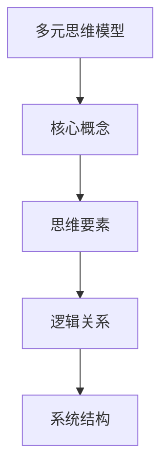
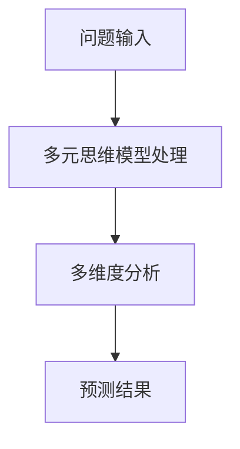

                 


# 查理·芒格的多元思维模型：价值投资的跨学科应用

> 关键词：查理·芒格，多元思维模型，价值投资，跨学科应用，决策框架，系统思维，数学模型

> 摘要：本文深入探讨查理·芒格的多元思维模型，分析其在价值投资中的跨学科应用。通过系统分析和实际案例，揭示多元思维模型的核心原理、算法流程和数学基础，结合项目实战，为读者提供实用的决策框架和系统思维方法。

---

## 第一部分: 查理·芒格的多元思维模型概述

### 第1章: 多元思维模型的背景与核心概念

#### 1.1 多元思维模型的定义与背景
查理·芒格的多元思维模型是一种跨学科的思维方式，强调通过多个学科的视角来理解和解决问题。传统单学科思维往往受限于单一领域的视角，而多元思维模型通过整合不同学科的知识，提供更全面的分析框架。

- **1.1.1 传统单学科思维的局限性**
  传统思维模式依赖于单一学科的框架，容易忽视问题的复杂性和多面性。例如，在投资决策中，仅关注财务数据而忽略市场趋势和消费者行为可能导致错误判断。

- **1.1.2 多元思维模型的提出与发展**
  芒格提出多元思维模型的初衷是克服传统思维的局限性。他提倡通过学习多个学科的基本原理，构建一个知识框架，从而更全面地分析问题。

- **1.1.3 查理·芒格对多元思维模型的贡献**
  芒格通过实践和理论结合，将多元思维模型应用于投资决策，提出“ inversion”方法，强调逆向思维的重要性。

#### 1.2 多元思维模型的核心要素
多元思维模型由多个核心要素构成，每个要素代表一个学科的基本原理。

- **1.2.1 多元思维模型的构成要素**
  包括心理学、经济学、物理学、生物学等学科的基本原理。

- **1.2.2 各要素之间的关系与互动**
  各要素之间相互作用，形成一个复杂的系统。例如，心理学中的认知偏差影响投资决策，经济学中的供需关系影响市场价格。

- **1.2.3 多元思维模型的边界与外延**
  多元思维模型的边界在于其应用范围，外延则涉及模型的扩展和优化。

#### 1.3 多元思维模型的哲学基础
多元思维模型的哲学基础包括唯物辩证法和东西方哲学的影响。

- **1.3.1 唯物辩证法与多元思维模型的联系**
  唯物辩证法强调事物之间的联系和变化，与多元思维模型的系统性特征相吻合。

- **1.3.2 东方哲学对多元思维模型的影响**
  东方哲学如儒家和道家的思想，强调整体性和平衡，为多元思维模型提供了思想基础。

- **1.3.3 西方哲学对多元思维模型的启示**
  西方哲学中的理性思维和逻辑分析方法，为多元思维模型提供了方法论支持。

### 第2章: 多元思维模型的核心概念与联系

#### 2.1 多元思维模型的原理
多元思维模型的原理包括数学基础、逻辑结构和系统性特征。

- **2.1.1 多元思维模型的数学基础**
  多元思维模型的数学基础涉及概率论和统计学，用于分析和预测复杂系统的动态变化。

- **2.1.2 多元思维模型的逻辑结构**
  多元思维模型的逻辑结构强调因果关系和条件判断，用于构建系统的分析框架。

- **2.1.3 多元思维模型的系统性特征**
  多元思维模型具有系统性特征，能够整合不同学科的知识，形成一个完整的知识体系。

#### 2.2 多元思维模型与传统思维模型的对比
多元思维模型与传统思维模型在多个方面存在显著差异。

- **2.2.1 传统单学科思维的局限性**
  传统单学科思维往往局限于单一领域的视角，容易忽视问题的复杂性和多面性。

- **2.2.2 多元思维模型的优势与特点**
  多元思维模型的优势在于其跨学科的视角和系统性分析方法，能够更全面地理解问题的本质。

- **2.2.3 多元思维模型与系统思维的联系与区别**
  多元思维模型与系统思维的联系在于它们都强调系统的整体性和相互关系。区别在于，多元思维模型更注重跨学科的视角，而系统思维更注重系统的内部结构和功能。

#### 2.3 多元思维模型的ER实体关系图
以下是一个简单的多元思维模型的ER实体关系图：



### 第3章: 多元思维模型的算法原理

#### 3.1 多元思维模型的算法流程
多元思维模型的算法流程包括输入、处理和输出三个阶段。

- **3.1.1 算法输入**
  算法输入包括问题描述、相关数据和约束条件。例如，在投资决策中，输入可能包括财务数据、市场趋势和行业分析。

- **3.1.2 算法处理**
  算法处理包括数据预处理、模型构建和预测分析。例如，通过多元回归模型分析各个因素对投资回报的影响。

- **3.1.3 算法输出**
  算法输出包括预测结果、决策建议和优化方案。例如，预测某公司的股票价格走势，并提供建议的投资策略。

#### 3.2 多元思维模型的数学模型
多元思维模型的数学模型包括线性回归、概率论和决策树分析。

- **3.2.1 数学模型的构建**
  例如，构建一个多元线性回归模型，用于分析多个自变量对因变量的影响。

- **3.2.2 数学模型的验证**
  通过统计检验和交叉验证，验证模型的准确性和可靠性。

- **3.2.3 数学模型的优化**
  通过调整模型参数和优化算法，提高模型的预测能力和解释力。

#### 3.3 多元思维模型的mermaid流程图
以下是一个多元思维模型的mermaid流程图：



### 第4章: 多元思维模型的系统分析与架构设计

#### 4.1 系统分析
系统分析包括问题场景介绍、系统功能设计和系统架构设计。

- **4.1.1 问题场景介绍**
  例如，在投资决策中，系统需要分析多个因素，包括财务数据、市场趋势和行业分析。

- **4.1.2 系统功能设计**
  系统功能设计包括数据采集、数据分析和决策支持。例如，通过数据挖掘技术提取有用的信息，为投资决策提供支持。

- **4.1.3 系统架构设计**
  系统架构设计包括模块划分和接口设计。例如，系统分为数据采集模块、数据分析模块和决策支持模块，各模块之间通过接口进行数据交换。

#### 4.2 系统架构设计
系统架构设计包括模块划分、接口设计和系统交互设计。

- **4.2.1 模块划分**
  例如，系统分为数据采集模块、数据分析模块和决策支持模块。

- **4.2.2 接口设计**
  例如，数据采集模块与数据分析模块之间通过API进行数据交换。

- **4.2.3 系统交互设计**
  例如，用户通过用户界面提交投资问题，系统通过分析模块处理数据并返回结果。

#### 4.3 系统交互设计
系统交互设计包括用户界面设计和交互流程设计。

- **4.3.1 用户界面设计**
  用户界面设计需要简洁直观，方便用户输入问题和查看结果。

- **4.3.2 交互流程设计**
  例如，用户提交投资问题，系统通过分析模块处理数据并返回结果。

### 第5章: 多元思维模型的项目实战

#### 5.1 环境安装
项目实战需要安装必要的工具和库，例如Python、NumPy、Pandas和Scikit-learn。

- **5.1.1 安装Python**
  使用Anaconda安装Python和相关库。

- **5.1.2 安装NumPy和Pandas**
  使用pip安装NumPy和Pandas库。

- **5.1.3 安装Scikit-learn**
  使用pip安装Scikit-learn库。

#### 5.2 系统核心实现源代码
以下是多元思维模型的核心实现源代码：

```python
import numpy as np
import pandas as pd
from sklearn.linear_model import LinearRegression

# 数据预处理
data = pd.read_csv('data.csv')
X = data[['feature1', 'feature2']]
y = data['target']

# 模型训练
model = LinearRegression()
model.fit(X, y)

# 预测
predictions = model.predict(X)
```

#### 5.3 代码应用解读与分析
代码解读与分析：

- **数据预处理**
  使用Pandas读取数据并进行清洗和转换，确保数据适合模型训练。

- **模型训练**
  使用Scikit-learn中的线性回归模型进行训练，构建多元回归模型。

- **预测与评估**
  使用训练好的模型进行预测，并评估模型的准确性和可靠性。

#### 5.4 实际案例分析
以股票投资为例，分析多元思维模型的应用。

- **案例背景**
  分析某公司的财务数据、市场趋势和行业分析。

- **数据采集**
  从多个来源获取相关数据，包括财务报表、市场报告和行业分析。

- **数据分析**
  使用多元回归模型分析各个因素对股票价格的影响。

- **决策支持**
  根据分析结果，提供建议的投资策略。

#### 5.5 项目小结
项目小结包括项目总结和经验教训。

- **项目总结**
  多元思维模型在投资决策中的应用能够提供更全面的分析和更准确的预测。

- **经验教训**
  数据质量和模型选择对结果的影响至关重要，需要在项目中加以重视。

### 第6章: 多元思维模型的最佳实践与小结

#### 6.1 最佳实践 tips
- **持续学习**
  不断学习新知识，扩展知识面，提升跨学科分析能力。

- **系统思维**
  强调系统思维，从整体角度分析问题，避免陷入局部优化的误区。

- **实践应用**
  将多元思维模型应用于实际问题中，不断优化和调整模型。

#### 6.2 小结
本文深入探讨了查理·芒格的多元思维模型，分析了其在价值投资中的跨学科应用。通过系统分析和实际案例，揭示了多元思维模型的核心原理、算法流程和数学基础，结合项目实战，为读者提供实用的决策框架和系统思维方法。

#### 6.3 注意事项
- **数据质量**
  数据质量对模型的准确性和可靠性有重要影响，需要确保数据的完整性和准确性。

- **模型选择**
  根据问题的具体情况选择合适的模型和算法，避免盲目使用流行的方法。

- **风险控制**
  在实际应用中，需要注意模型的局限性和潜在风险，采取适当的风险控制措施。

#### 6.4 拓展阅读
- **推荐书籍**
  推荐阅读《穷查理宝典》和《投资学原理》等书籍，深入了解多元思维模型的应用和投资学的基本原理。

- **相关研究**
  关注最新的研究成果和实践应用，保持对多元思维模型的深入了解和应用。

---

## 作者：AI天才研究院/AI Genius Institute & 禅与计算机程序设计艺术 /Zen And The Art of Computer Programming

---

以上是文章的完整内容，希望对您有所帮助！

