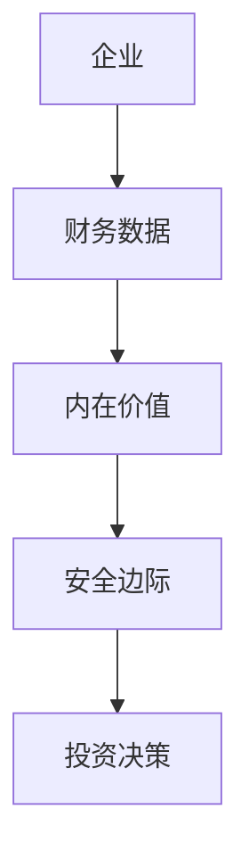
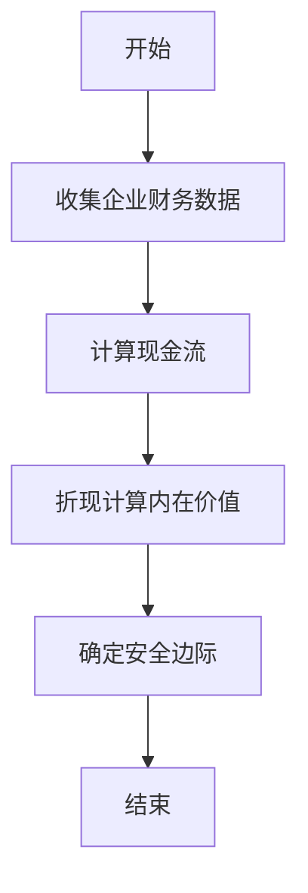
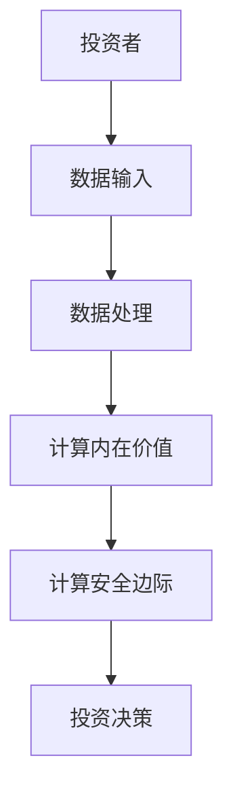

                 


# 格雷厄姆·多德的安全性分析在现代投资中的应用

## 关键词：格雷厄姆·多德，安全性分析，价值投资，内在价值，安全边际

## 摘要：本文系统地探讨了格雷厄姆·多德的安全性分析理论及其在现代投资环境中的应用。通过分析安全性分析的核心概念、算法原理和系统设计，结合实际案例，展示了如何在当前复杂的市场环境中应用这一理论。文章深入浅出，既涵盖了理论基础，又提供了实践指导，为投资者提供了有价值的参考。

---

## 第一章: 格雷厄姆·多德的安全性分析的背景与核心概念

### 1.1 安全性分析的定义与背景

#### 1.1.1 投资的基本概念与问题背景
投资是将资金投入到能够产生收益的资产中，以实现财富增值的过程。然而，投资行为伴随着风险，市场的不确定性和波动性使得投资决策变得复杂。格雷厄姆·多德的安全性分析正是在这种背景下提出的一种投资方法，旨在通过深入分析企业的内在价值，寻找被市场低估的投资机会。

#### 1.1.2 格雷厄姆·多德投资理论的起源
本杰明·格雷厄姆和戴维·多德是20世纪初著名的投资理论家，他们的价值投资理念奠定了现代投资学的基础。格雷厄姆在《证券分析》一书中首次系统地提出了安全性分析的概念，强调投资者应基于企业的基本面进行投资，而不是盲目跟从市场的波动。

#### 1.1.3 安全性分析的核心目标与边界
安全性分析的核心目标是通过评估企业的内在价值，确定其市场价格是否低于其真实价值，从而为投资者提供安全边际。其边界包括：仅适用于上市公司，依赖于财务数据的可获得性，以及对市场短期波动的免疫。

### 1.2 格雷厄姆·多德的安全性分析框架

#### 1.2.1 安全边际的概念与计算
安全边际是市场价格与内在价值之间的差额，是投资的安全垫。计算公式为：
$$ \text{安全边际} = \text{市场价格} - \text{内在价值} $$

#### 1.2.2 内在价值的定义与评估
内在价值是基于企业未来现金流的折现值，计算公式为：
$$ V = \sum_{t=1}^{n} \frac{CF_t}{(1+r)^t} $$
其中，\( V \) 表示内在价值，\( CF_t \) 表示第 \( t \) 年的现金流，\( r \) 表示折现率。

#### 1.2.3 市场先生理论与投资者行为
格雷厄姆提出了“市场先生”理论，认为市场波动是投资者的敌人，投资者应避免被市场的短期波动所左右，而是专注于企业的长期价值。

---

## 第二章: 格雷厄姆·多德分析的核心要素与联系

### 2.1 核心概念的原理与特征

#### 2.1.1 安全边际的数学模型
安全边际的计算需要考虑企业的财务状况、行业地位和市场环境。公式为：
$$ \text{安全边际} = \text{市场价格} \times (1 - \text{折价率}) $$

#### 2.1.2 内在价值的计算公式
内在价值的计算需要结合企业的盈利能力、成长性和财务健康状况，公式为：
$$ V = \frac{E}{r} $$
其中，\( E \) 表示企业的预期收益，\( r \) 表示期望收益率。

#### 2.1.3 核心概念的对比表
| 概念       | 定义                               | 计算公式                          |
|------------|------------------------------------|-----------------------------------|
| 安全边际   | 市场价格与内在价值的差额           | \( \text{安全边际} = P - V \)    |
| 内在价值   | 企业的未来现金流的现值             | \( V = \sum \frac{CF_t}{(1+r)^t} \) |
| 市场价格   | 市场对资产的估值                     | \( P \)                            |

### 2.2 核心概念的ER实体关系图


---

## 第三章: 格雷厄姆·多德分析的算法原理

### 3.1 内在价值计算的算法流程



### 3.2 内在价值计算的数学模型

$$ V = \sum_{t=1}^{n} \frac{CF_t}{(1+r)^t} $$

---

## 第四章: 现代投资中的安全性分析应用

### 4.1 现代市场环境的变化与应对

#### 4.1.1 现代市场波动性分析
现代市场波动性更强，投资者需要更加注重风险控制。

#### 4.1.2 现代企业财务指标的变化
现代企业更多依赖于技术创新和无形资产，需要调整内在价值的计算方法。

#### 4.1.3 现代投资者行为分析
投资者行为更加理性化，注重长期价值。

### 4.2 格雷厄姆·多德分析在现代投资中的应用

#### 4.2.1 现代安全性分析的改进
引入更多因素，如企业治理和行业趋势。

#### 4.2.2 现代市场中的安全边际计算
考虑市场整体波动，调整安全边际的计算公式。

#### 4.2.3 现代投资组合的构建策略
基于安全性分析，构建分散化的投资组合。

---

## 第五章: 格雷厄姆·多德分析的系统设计与实现

### 5.1 系统分析与架构设计

#### 5.1.1 系统功能模块划分
- 数据采集模块
- 内在价值计算模块
- 安全边际计算模块
- 投资决策模块

#### 5.1.2 系统架构图


---

## 第六章: 格雷厄姆·多德分析的项目实战

### 6.1 项目环境安装

#### 6.1.1 环境要求
- Python 3.8+
- Pandas, NumPy

### 6.2 核心代码实现

#### 6.2.1 计算内在价值的代码示例
```python
import pandas as pd
import numpy as np

def calculate_intrinsic_value(fcf, discount_rate):
    n = len(fcf)
    iv = 0
    for t in range(n):
        iv += fcf[t] / (1 + discount_rate) ** t
    return iv

# 示例数据
cf = [100, 120, 150, 200]
r = 0.08
iv = calculate_intrinsic_value(cf, r)
print(f"内在价值为: {iv:.2f}")
```

---

## 第七章: 格雷厄姆·多德分析的最佳实践与小结

### 7.1 最佳实践 tips
- 定期更新财务数据
- 保持长期视角
- 多元化投资组合

### 7.2 小结
格雷厄姆·多德的安全性分析在现代投资中依然具有重要的指导意义，但需要结合新的市场环境和企业特点进行调整。

### 7.3 注意事项
- 避免过度简化模型
- 考虑市场波动性
- 定期重新评估

### 7.4 拓展阅读
- 《证券分析》
- 现代投资组合理论

---

## 作者：AI天才研究院/AI Genius Institute & 禅与计算机程序设计艺术 /Zen And The Art of Computer Programming

