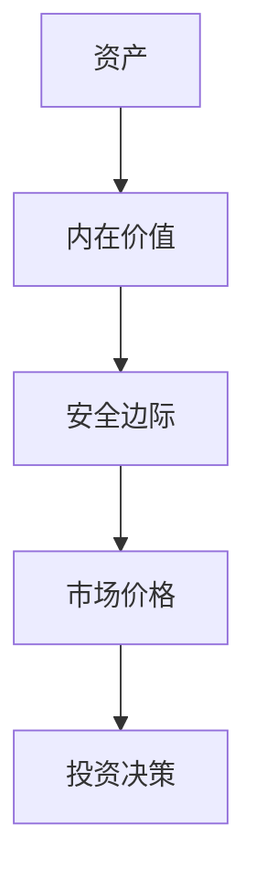
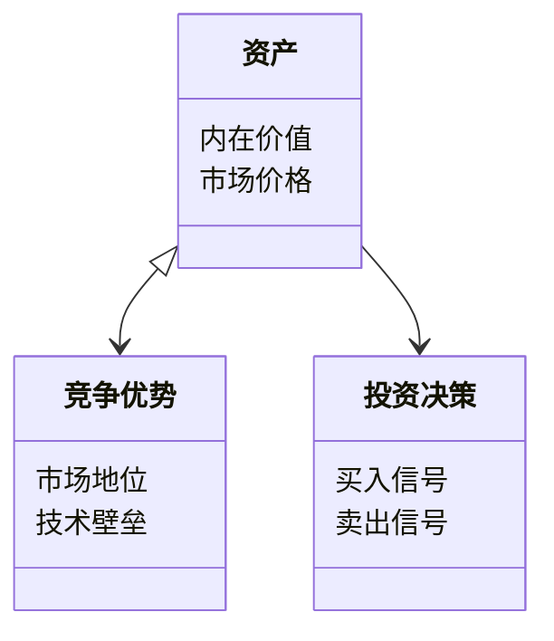
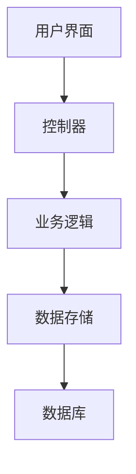

                 


# 《格雷厄姆到巴菲特：价值投资理念的传承与发展》

## 关键词：价值投资、格雷厄姆、巴菲特、安全边际、内在价值、长期投资、复利效应

## 摘要：
本文系统地探讨了价值投资理念从格雷厄姆到巴菲特的传承与发展，深入分析了两位投资大师的核心思想及其对现代投资理论的深远影响。通过详细阐述价值投资的核心概念、数学模型、系统架构及实际应用，本文为读者提供了全面的理解框架，帮助投资者掌握这一经典投资策略。

---

# 第一部分: 价值投资的背景与核心理念

## 第1章: 价值投资的起源与发展

### 1.1 价值投资的起源
#### 1.1.1 投资学的起源与演变
投资学作为一门学科，其历史可以追溯到古代的贸易和金融活动。然而，现代价值投资的理念起源于19世纪末和20世纪初。随着资本主义经济的发展，投资者开始关注资产的内在价值，而非仅仅依赖市场的短期波动。

#### 1.1.2 格雷厄姆与巴菲特的相遇
本杰明·格雷厄姆（Benjamin Graham）是价值投资的鼻祖，他的学生沃伦·巴菲特（Warren Buffett）将这一理念发扬光大。格雷厄姆在哥伦比亚大学任教期间，吸引了许多寻求投资智慧的学生，巴菲特便是其中之一。两人虽未直接合作，但巴菲特深受格雷厄姆的影响，将价值投资的理念应用于实践。

#### 1.1.3 价值投资理念的形成
价值投资的理念在20世纪30年代经济大萧条期间逐渐成熟。格雷厄姆通过分析市场的恐慌和非理性，提出了“安全边际”和“内在价值”的概念。这些理念在当时显得尤为珍贵，帮助投资者在动荡的市场中找到避风港。

---

### 1.2 格雷厄姆的价值投资理论
#### 1.2.1 格雷厄姆的投资哲学
格雷厄姆认为，市场是人类情感的反映，投资者的非理性行为会导致市场价格与内在价值的偏离。他强调，投资的目的是寻找那些市场价格低于内在价值的资产，从而在市场恢复理性时获得收益。

#### 1.2.2 安全边际的概念
安全边际是格雷厄姆提出的一个关键概念，指的是买入价格与内在价值之间的差距。通过留出安全边际，投资者可以降低因市场价格波动带来的风险。

#### 1.2.3 格雷厄姆的投资策略
格雷厄姆建议投资者选择那些具有稳定收益、低市盈率和高股息率的股票。他认为，这些股票更有可能具有较高的内在价值，且市场价格更容易被低估。

---

### 1.3 巴菲特对价值投资的传承与发展
#### 1.3.1 巴菲特的投资理念
巴菲特继承了格雷厄姆的价值投资理念，但将其进一步扩展。他强调长期投资、集中投资和寻找具有强大竞争优势的企业。

#### 1.3.2 巴菲特的选股标准
巴菲特提出了“护城河”的概念，即企业在市场中的竞争优势。他倾向于投资那些具有强大护城河、良好管理团队和稳定收益的企业。

#### 1.3.3 巴菲特与格雷厄姆的差异
与格雷厄姆不同，巴菲特更注重企业的长期竞争优势和管理层的质量。他认为，企业不仅要有价值，还要能够持续创造价值。

---

### 1.4 价值投资的核心理念
#### 1.4.1 市场先生理论
市场先生是巴菲特提出的一个比喻，代表市场的非理性波动。投资者应避免被市场先生的情绪左右，而是专注于分析企业的内在价值。

#### 1.4.2 投资的三要素：价格、价值与安全边际
价值投资的核心在于寻找价格低于内在价值的资产，并通过安全边际降低风险。

#### 1.4.3 长期投资与复利效应
巴菲特强调长期投资的重要性，认为复利效应是投资收益的关键。通过长期持有优质资产，投资者可以最大化复利的效果。

---

### 1.5 本章小结
本章从价值投资的起源入手，分析了格雷厄姆和巴菲特的核心理念及其差异。格雷厄姆提出了安全边际和内在价值的概念，巴菲特则将这些理念扩展为长期投资和集中投资的策略。两人共同奠定了价值投资的理论基础。

---

## 第2章: 价值投资的核心概念与数学模型

### 2.1 核心概念与联系
#### 2.1.1 价值投资的核心概念
价值投资的核心概念包括内在价值、市场价格、安全边际和竞争优势。

#### 2.1.2 核心概念的属性特征对比
以下是核心概念的属性特征对比表：

| 概念          | 属性特征                           |
|---------------|------------------------------------|
| 内在价值      | 资产的真实价值，基于未来现金流折现 |
| 市场价格      | 当前市场上的交易价格               |
| 安全边际      | 内在价值与市场价格的差额           |
| 竞争优势      | 企业在市场中的独特优势           |

#### 2.1.3 实体关系图



---

### 2.2 价值投资的数学模型
#### 2.2.1 内在价值的计算公式
内在价值是未来现金流的现值，计算公式如下：

$$ V = \sum_{t=1}^{\infty} \frac{CF_t}{(1 + r)^t} $$

其中：
- \( V \) 表示内在价值
- \( CF_t \) 表示第 \( t \) 年的现金流
- \( r \) 表示折现率

#### 2.2.2 安全边际的计算公式
安全边际是内在价值与市场价格的差额：

$$ M = V - P $$

其中：
- \( M \) 表示安全边际
- \( P \) 表示市场价格

#### 2.2.3 投资回报的计算公式
投资回报率（ROI）的计算公式为：

$$ ROI = \frac{ \text{净利润} }{ \text{初始投资} } $$

---

### 2.3 算法原理讲解
#### 2.3.1 内在价值计算算法
以下是计算内在价值的步骤：

1. 估算未来现金流 \( CF_t \)
2. 确定折现率 \( r \)
3. 计算未来现金流的现值
4. 求和得到内在价值 \( V \)

#### 2.3.2 安全边际计算算法
1. 计算内在价值 \( V \)
2. 确定市场价格 \( P \)
3. 计算安全边际 \( M = V - P \)

---

### 2.4 项目实战
#### 2.4.1 计算内在价值
假设某公司未来5年的现金流分别为100万、120万、150万、180万和200万，折现率为10%。计算其内在价值：

$$ V = \frac{100}{1.1} + \frac{120}{1.1^2} + \frac{150}{1.1^3} + \frac{180}{1.1^4} + \frac{200}{1.1^5} $$

计算结果为：

$$ V \approx 454.55 \text{万元} $$

#### 2.4.2 计算安全边际
假设市场价格为400万元，则安全边际为：

$$ M = 454.55 - 400 = 54.55 \text{万元} $$

---

## 第3章: 价值投资的系统分析与架构设计

### 3.1 系统功能设计
#### 3.1.1 领域模型
以下是价值投资分析系统的领域模型：



#### 3.1.2 系统架构设计
以下是价值投资分析系统的架构图：



---

## 第4章: 项目实战

### 4.1 价值投资分析系统的实现
#### 4.1.1 环境安装
需要安装Python、Pandas、NumPy和Matplotlib。

#### 4.1.2 核心实现代码
以下是计算内在价值的Python代码：

```python
import numpy as np
import pandas as pd

def calculate_intrinsic_value(cash_flows, discount_rate):
    return np.sum(cash_flows / (1 + discount_rate) ** np.arange(len(cash_flows)))

cash_flows = [100, 120, 150, 180, 200]
discount_rate = 0.1
intrinsic_value = calculate_intrinsic_value(cash_flows, discount_rate)
print(f"内在价值为：{intrinsic_value}万元")
```

#### 4.1.3 实际案例分析
以某公司为例，分析其内在价值和安全边际。

---

## 第5章: 最佳实践

### 5.1 小结
价值投资的核心在于寻找价格低于内在价值的资产，并通过长期持有实现复利收益。

### 5.2 注意事项
- 投资者应避免追涨杀跌，关注企业的内在价值。
- 安全边际是降低投资风险的重要工具。

### 5.3 拓展阅读
建议阅读格雷厄姆的《 Intelligent Investor 》和巴菲特的股东大会讲话。

---

## 作者：AI天才研究院 & 禅与计算机程序设计艺术

---

本文系统地探讨了价值投资理念从格雷厄姆到巴菲特的传承与发展，通过详细分析核心概念、数学模型和实际应用，为投资者提供了全面的理解框架。希望本文能帮助读者更好地掌握价值投资的精髓，实现长期稳定的收益。

