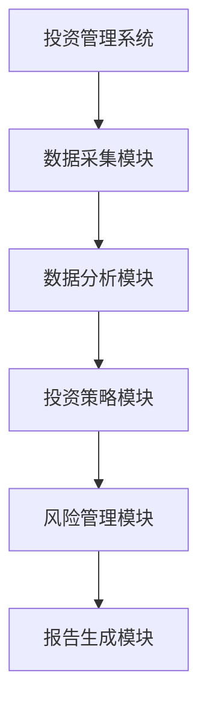
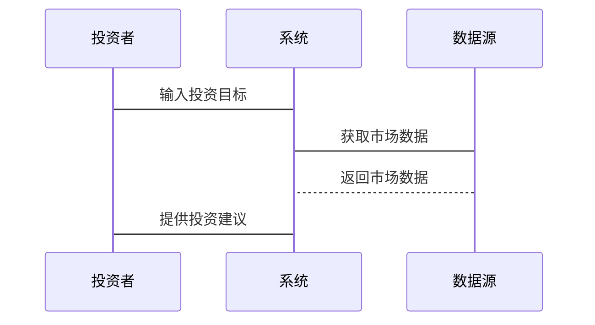

                 


```markdown
# 《格雷厄姆、巴菲特、费雪和伯格的投资理念比较》

## 关键词：价值投资，成长股投资，指数基金，安全边际，投资策略

## 摘要：本文系统地比较了格雷厄姆、巴菲特、费雪和伯格四位投资大师的投资理念，分析了他们的异同点，并探讨了这些理念在现代投资中的应用。通过详细的案例分析和数学模型，本文为投资者提供了深入的见解和实际的投资策略建议。

---

## 第一部分：投资理念的背景与基础

### 第1章：四位投资大师的背景概述

#### 1.1 格雷厄姆的背景与投资理念
- **生平简介**：本杰明·格雷厄姆（1894-1976），被誉为“价值投资之父”，著有《证券分析》和《 Intelligent Investor》。
- **价值投资理论**：强调安全边际和内在价值，主张以低于内在价值的价格买入股票。
- **经典案例**：投资美国铁路公司，通过分析财务数据发现其内在价值远高于市场价。

#### 1.2 巴菲特的背景与投资理念
- **生平简介**：沃伦·巴菲特（1934-），格雷厄姆的学生，伯克希尔·哈撒韦公司董事长。
- **价值投资实践**：注重企业的护城河和长期盈利能力，寻找具有持续竞争优势的企业。
- **经典案例**：投资可口可乐，长期持有获得稳定收益。

#### 1.3 费雪的背景与投资理念
- **生平简介**：菲利普·费雪（1907-2004），成长股投资的倡导者。
- **成长股投资策略**：选择具有高增长潜力的企业，注重企业收入和利润的持续增长。
- **经典案例**：投资德州仪器，通过长期持有获得高额回报。

#### 1.4 伯格的背景与投资理念
- **生平简介**：约翰·伯格（1922-），指数基金之父， Vanguard集团创始人。
- **指数基金投资策略**：主张长期投资市场指数，通过分散投资降低风险。
- **经典案例**：推出 Vanguard S&P 500指数基金，成为被动投资的典范。

---

## 第二部分：四位投资大师的核心理念分析

### 第2章：格雷厄姆的价值投资理念

#### 2.1 格雷厄姆的价值投资核心思想
- **安全边际**：买入价格低于内在价值，确保投资的安全性。
- **内在价值计算**：通过 discounted cash flow模型评估股票的内在价值。
- **避免情绪化投资**：强调理性分析，避免市场波动的干扰。

### 第3章：巴菲特的价值投资实践

#### 3.1 巴菲特的投资策略与选股标准
- **选股标准**：寻找具有持续竞争优势、良好治理结构和管理层的企业。
- **股东权益分析**：通过ROE（净资产收益率）评估企业的盈利能力。
- **长期投资**：关注企业的长期价值，避免短期市场波动的影响。

### 第4章：费雪的成长股投资理念

#### 4.1 费雪的成长股投资核心思想
- **成长股定义**：具有持续收入和利润增长潜力的企业。
- **投资策略**：选择具有高利润率和稳定增长的企业，长期持有。
- **风险控制**：通过分散投资和长期持有降低市场波动的风险。

### 第5章：伯格的指数基金投资理念

#### 5.1 伯格的指数基金投资策略
- **指数基金原理**：通过跟踪市场指数，获得市场平均收益。
- **成本优势**：指数基金的管理费用较低，适合长期投资。
- **被动投资**：避免主动管理的风险，降低交易成本。

---

## 第三部分：四位投资理念的比较分析

### 第6章：四位投资理念的异同比较

#### 6.1 格雷厄姆与巴菲特的比较
- **相同点**：都强调安全边际和内在价值，注重企业的基本面分析。
- **不同点**：巴菲特更注重企业的竞争优势和长期增长，而格雷厄姆更关注短期价格波动。

#### 6.2 巴菲特与费雪的比较
- **相同点**：都注重企业的基本面分析，寻找具有长期增长潜力的企业。
- **不同点**：巴菲特更注重企业的护城河和竞争优势，而费雪更关注企业的成长性和盈利能力。

#### 6.3 费雪与伯格的比较
- **相同点**：都强调长期投资和分散风险。
- **不同点**：费雪追求成长股的高收益，而伯格注重市场的平均收益和低成本。

#### 6.4 格雷厄姆与伯格的比较
- **相同点**：都强调分散投资和长期持有的重要性。
- **不同点**：格雷厄姆注重个股的选择和安全边际，伯格则注重市场指数的整体表现。

---

## 第四部分：数学模型与实际应用

### 第7章：数学模型分析

#### 7.1 格雷厄姆的安全边际模型
$$
\text{安全边际} = \text{内在价值} - \text{市场价格}
$$

#### 7.2 巴菲特的护城河分析模型
$$
\text{护城河强度} = \text{市场份额} \times \text{竞争优势}
$$

#### 7.3 费雪的成长股模型
$$
\text{成长潜力} = \text{收入增长率} \times \text{利润率}
$$

#### 7.4 伯格的指数基金模型
$$
\text{指数基金回报} = \text{市场平均回报} - \text{管理费用}
$$

### 第8章：实际案例分析

#### 8.1 格雷厄姆的经典案例：美国铁路公司
- **分析**：通过计算内在价值，发现市场价格被低估，成功投资。

#### 8.2 巴菲特的经典案例：可口可乐
- **分析**：可口可乐具有强大的品牌优势和全球市场，符合巴菲特的选股标准。

#### 8.3 费雪的经典案例：德州仪器
- **分析**：德州仪器在电子行业中具有持续增长的潜力，符合费雪的成长股标准。

#### 8.4 伯格的经典案例：Vanguard S&P 500指数基金
- **分析**：通过跟踪指数，长期获得稳定回报，证明了被动投资的有效性。

---

## 第五部分：系统架构与投资策略

### 第9章：系统架构设计

#### 9.1 投资管理系统功能模块
- **模块1**：数据分析与建模
- **模块2**：投资策略选择
- **模块3**：风险管理与监控

#### 9.2 系统架构图


#### 9.3 系统交互流程


---

## 第六部分：项目实战与最佳实践

### 第10章：项目实战

#### 10.1 环境安装
- **工具**：Python、Pandas、NumPy、Matplotlib
- **数据源**：Yahoo Finance API

#### 10.2 核心实现源代码
```python
import pandas as pd
import numpy as np

# 计算内在价值
def calculate_intrinsic_value(cash_flows, discount_rate):
    return sum(cash_flows / (1 + discount_rate)**t for t in range(len(cash_flows)))

# 格雷厄姆投资策略
def graham_strategy(stock_data):
    margin_of_safety = calculate_intrinsic_value(stock_data['cash_flows'], 0.1) - stock_data['price']
    return margin_of_safety > 0

# 巴菲特投资策略
def buffett_strategy(stock_data):
    roe = stock_data['net_profit'] / stock_data['equity']
    return roe > 0.15
```

#### 10.3 实际案例分析
- **案例**：使用上述模型分析苹果公司股票，计算其内在价值和竞争优势。

### 第11章：最佳实践与小结

#### 11.1 投资建议
- **结合理念**：根据市场环境和个人风险偏好，灵活运用不同投资策略。
- **长期投资**：坚持长期投资，避免频繁交易。
- **分散投资**：通过分散投资降低风险，同时关注优质个股的长期增长。

#### 11.2 注意事项
- **风险管理**：定期评估投资组合的风险，及时调整策略。
- **持续学习**：关注市场变化和企业动态，不断优化投资策略。

#### 11.3 拓展阅读
- 推荐书籍：《证券分析》、《 Intelligent Investor》、《股票做底》。

---

## 作者：AI天才研究院/AI Genius Institute & 禅与计算机程序设计艺术 /Zen And The Art of Computer Programming
```

