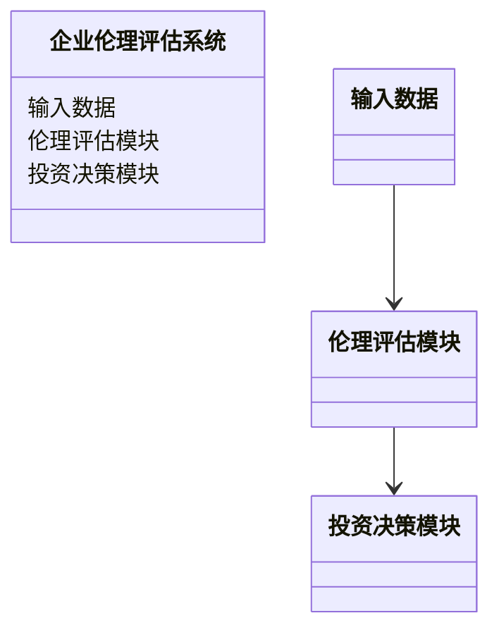

                 


# 格雷厄姆特价股票策略在人工智能伦理产业的应用挑战

> 关键词：格雷厄姆策略，人工智能伦理，投资策略，价值投资，算法伦理

> 摘要：本文探讨格雷厄姆特价股票策略在人工智能伦理产业中的应用挑战。通过分析价值投资的理论基础、人工智能伦理的核心问题以及两者结合的必要性，提出一种结合定量分析与伦理评估的投资策略，以期为投资者和伦理学家提供新的视角。

---

# 第一章: 格雷厄姆特价股票策略与人工智能伦理产业的背景

## 1.1 格雷厄姆投资理论的核心理念

### 1.1.1 格雷厄姆策略的定义与特点

格雷厄姆的价值投资策略强调购买被市场低估的股票，重点关注公司的基本面，如市盈率、市净率和股息率。这种策略的核心在于寻找“烟蒂股”，即那些市场价格远低于其内在价值的股票。

### 1.1.2 格雷厄姆策略的理论基础

格雷厄姆在《证券分析》中提出，股票的价值应基于其未来的现金流折现值。公式表示为：

$$ \text{内在价值} = \sum_{t=1}^{n} \frac{\text{现金流}_t}{(1 + r)^t} $$

其中，\( r \) 是折现率，\( \text{现金流}_t \) 是第 \( t \) 年的现金流。

## 1.2 人工智能伦理产业的定义与特点

### 1.2.1 人工智能伦理的核心问题

人工智能伦理关注算法偏见、数据隐私和透明度等问题。例如，算法偏见可能导致不公平的结果，而数据隐私问题则威胁用户隐私。

### 1.2.2 人工智能伦理产业的发展现状

随着AI技术的广泛应用，伦理问题日益突出。企业需要在技术创新与伦理合规之间找到平衡点。

## 1.3 格雷厄姆策略与人工智能伦理产业的结合

### 1.3.1 两者的结合背景

人工智能伦理产业需要资本支持，而投资者需要评估其伦理风险和潜在价值。格雷厄姆策略可以帮助投资者识别具有长期价值的伦理合规企业。

### 1.3.2 结合的必要性与可能性

通过价值投资，投资者可以推动企业遵守伦理规范，同时获得长期收益。AI伦理企业也因合规而更具竞争力。

---

# 第二章: 核心概念的理论基础

## 2.1 格雷厄姆策略的核心原理

### 2.1.1 格雷厄姆策略的数学模型

格雷厄姆的内在价值公式：

$$ \text{内在价值} = \frac{\text{收益} \times \text{增长率}}{\text{折现率}} $$

### 2.1.2 格雷厄姆策略的算法流程

1. 收集公司财务数据。
2. 计算关键指标，如市盈率、市净率。
3. 比较市场价格与内在价值，寻找低估股票。

## 2.2 人工智能伦理的核心原理

### 2.2.1 人工智能伦理的理论基础

伦理评估需考虑数据来源、算法透明度和用户隐私。例如，数据隐私可通过加密技术保护。

### 2.2.2 人工智能伦理的算法实现

算法需避免偏见，确保透明度。例如，公平分配资源的算法设计。

## 2.3 核心概念的对比分析

### 2.3.1 格雷厄姆策略与人工智能伦理的异同点

| 特性       | 格雷厄姆策略             | 人工智能伦理         |
|------------|--------------------------|----------------------|
| 核心目标   | 发掘低估股票             | 确保技术合规         |
| 关注点     | 财务指标                 | 数据隐私、算法偏见   |

### 2.3.2 核心概念的联系与区别

格雷厄姆策略关注经济价值，而人工智能伦理关注社会影响。两者的结合需平衡商业利益与社会责任。

---

# 第三章: 算法原理与数学模型

## 3.1 格雷厄姆策略的算法原理

### 3.1.1 格雷厄姆策略的数学模型

$$ \text{内在价值} = \frac{\text{收益} \times \text{增长率}}{\text{折现率}} $$

### 3.1.2 格雷厄姆策略的算法流程

1. 收集数据：公司财务报表。
2. 计算指标：市盈率、市净率。
3. 比较价格与价值，寻找低估股票。

## 3.2 人工智能伦理产业的算法挑战

### 3.2.1 人工智能伦理的数学模型

$$ \text{伦理风险} = f(\text{数据隐私}, \text{算法透明度}, \text{用户权益}) $$

### 3.2.2 算法挑战的解决方案

1. 使用加密技术保护数据隐私。
2. 设计透明算法减少偏见。

---

# 第四章: 系统分析与架构设计方案

## 4.1 问题场景介绍

投资者希望评估人工智能企业的伦理风险，寻找合规的长期投资目标。

## 4.2 系统功能设计

### 4.2.1 领域模型



## 4.3 系统架构设计


## 4.4 系统接口设计

1. 数据接口：连接公司数据库。
2. 用户界面：显示评估结果。

## 4.5 系统交互流程

1. 用户输入企业数据。
2. 系统评估伦理风险。
3. 提供投资建议。

---

# 第五章: 项目实战

## 5.1 环境配置

使用Python和相关库（pandas、numpy）进行数据处理。

## 5.2 核心代码实现

```python
import pandas as pd

def calculate_intrinsic_value(revenue, growth_rate, discount_rate):
    return revenue * growth_rate / discount_rate

# 示例数据
revenue = 1000000
growth_rate = 0.1
discount_rate = 0.05

intrinsic_value = calculate_intrinsic_value(revenue, growth_rate, discount_rate)
print(f"内在价值：{intrinsic_value}")
```

## 5.3 案例分析

选择一家AI公司，分析其财务数据和伦理风险，评估其投资价值。

---

# 第六章: 总结与展望

## 6.1 总结

结合格雷厄姆策略和人工智能伦理，投资者可以识别具有长期价值的企业，推动产业健康发展。

## 6.2 展望

未来，随着技术进步，价值投资与伦理评估的结合将更加紧密，推动可持续投资的发展。

---

作者：AI天才研究院 & 禅与计算机程序设计艺术

---

这篇文章系统地分析了格雷厄姆策略在人工智能伦理产业中的应用，从理论到实践，为投资者和伦理学家提供了新的视角。希望对您有所帮助！

