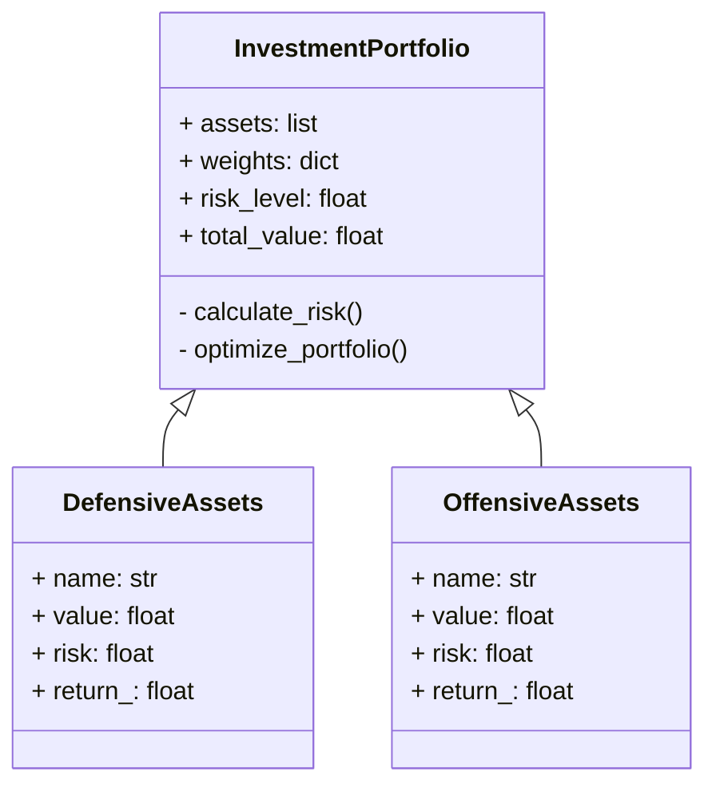
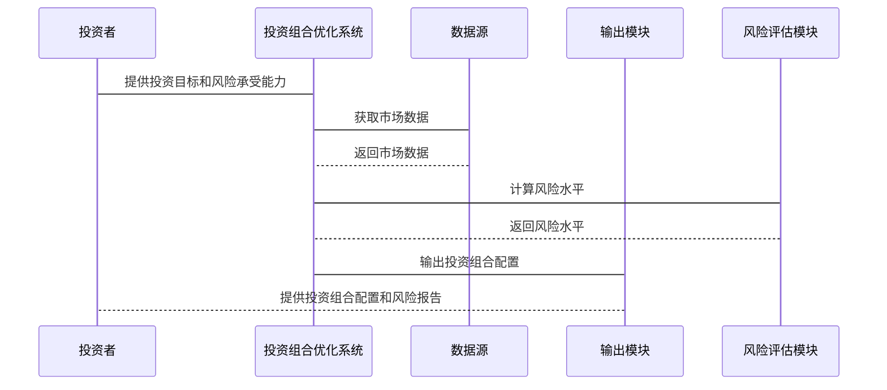

                 


# 格雷厄姆的'三分之二原则'：控制投资风险的方法

**关键词**：格雷厄姆，三分之二原则，投资风险管理，价值投资，投资组合优化

**摘要**：本文深入探讨了格雷厄姆提出的“三分之二原则”，这一原则旨在通过合理配置投资组合中的防御性资金比例，以控制投资风险。文章从该原则的背景、核心概念、数学模型、系统分析、项目实战等多个维度进行详细阐述，并结合实际案例分析其应用方法和效果。通过本文，读者将能够全面理解如何在投资中运用三分之二原则，从而在不确定的市场环境中实现稳健的投资收益。

---

## 第一部分: 格雷厄姆的三分之二原则概述

### 第1章: 格雷厄姆与价值投资理念

#### 1.1 格雷厄姆的生平与投资思想

##### 1.1.1 格雷厄姆的生平简介
本杰明·格雷厄姆（Benjamin Graham）是20世纪著名的投资学家，被誉为“价值投资之父”。他出生于1894年，去世于1976年，是美国证券分析协会的创始人之一。格雷厄姆的职业生涯始于1920年代，他曾是华尔街的知名投资顾问，并在1949年出版了经典著作《聪明的投资者》（The Intelligent Investor），该书成为投资领域的圣经，影响了包括沃伦·巴菲特在内的无数投资者。

##### 1.1.2 格雷厄姆的价值投资理念
格雷厄姆的价值投资理念强调安全边际和长期稳健的投资策略。他认为，投资者应以低于内在价值的价格买入优质的公司股票，并长期持有，以获得稳定的收益。他主张避免短期市场波动的干扰，注重对公司基本面的深入分析。

##### 1.1.3 格雷厄姆对现代投资理论的贡献
格雷厄姆的贡献不仅在于他的投资理念，还在于他对投资组合管理和风险管理的深入研究。他提出的许多原则，如“三分之二原则”，为现代投资理论奠定了基础，并对机构投资者的投资策略产生了深远影响。

---

#### 1.2 三分之二原则的背景与提出

##### 1.2.1 投资风险管理的重要性
投资风险管理是投资者在不确定的市场环境中保护资产免受重大损失的关键。格雷厄姆认识到，市场的波动性和不确定性使得投资者必须采取防御性策略，以避免过度冒险。

##### 1.2.2 三分之二原则的提出背景
在20世纪30年代的经济大萧条期间，格雷厄姆观察到许多投资者因过度冒险而遭受重大损失。为了帮助投资者在市场波动中保持稳健，他提出了“三分之二原则”，即投资者应将至少三分之二的资金用于防御性投资，以确保在市场下跌时能够保护资产。

##### 1.2.3 三分之二原则的核心思想
格雷厄姆的三分之二原则强调，投资者应将大部分资金分配到那些具有稳定收益和高安全边际的资产上，而将剩余的三分之一资金用于高风险但高回报的投资。这种方法旨在平衡风险与收益，在市场波动中保持投资组合的稳定性。

---

#### 1.3 三分之二原则的应用范围

##### 1.3.1 个人投资者的应用场景
对于个人投资者而言，三分之二原则可以帮助他们在有限的资本下实现风险控制。例如，投资者可以将三分之二的资金用于购买优质债券或蓝筹股，剩余的三分之一资金用于尝试高风险高回报的股票或创业项目。

##### 1.3.2 机构投资者的应用场景
机构投资者通常管理着大量的资金，三分之二原则可以帮助他们分散风险，确保在市场低迷时仍能维持稳定的收益。例如，养老基金和保险公司可以将三分之二的资金投资于固定收益资产，剩余的三分之一资金用于股票或其他高风险资产。

##### 1.3.3 不同市场环境下的适用性
三分之二原则并非一成不变，其应用比例可以根据市场环境进行调整。例如，在市场繁荣时期，投资者可以适当增加高风险资产的比例；在市场低迷时期，则应更加注重防御性投资。

---

### 第2章: 三分之二原则的核心概念

#### 2.1 三分之二原则的定义与特征

##### 2.1.1 三分之二原则的定义
三分之二原则是指投资者应将至少三分之二的资金用于防御性投资，以保护资产免受市场波动的影响。剩余的三分之一资金可以用于高风险高回报的投资。

##### 2.1.2 三分之二原则的核心特征
- **防御性投资**：三分之二的资金用于低风险、高收益的资产，如债券、蓝筹股等。
- **进攻性投资**：剩余的三分之一资金用于高风险高回报的资产，如小盘股、新兴行业等。
- **风险控制**：通过合理的资产配置，降低投资组合的整体风险。

##### 2.1.3 三分之二原则与其他风险管理原则的对比
- **与现代投资组合理论（MPT）的对比**：MPT强调通过分散投资来降低风险，而三分之二原则更注重资产配置的比例和防御性投资的重要性。
- **与止损策略的对比**：止损策略通过设定价格界限来限制损失，而三分之二原则通过资产配置来控制风险。

---

#### 2.2 三分之二原则的数学模型与算法

##### 2.2.1 投资组合的风险与收益关系
投资组合的风险与收益可以通过均值-方差模型来衡量。三分之二原则要求在投资组合中，防御性资产的风险较低，而进攻性资产的风险较高。

##### 2.2.2 三分之二原则的数学表达式
$$ \text{防御性资产比例} = \frac{2}{3} $$
$$ \text{进攻性资产比例} = \frac{1}{3} $$

##### 2.2.3 投资组合优化的算法
- **步骤1**：确定投资目标和风险承受能力。
- **步骤2**：将三分之二的资金分配到防御性资产。
- **步骤3**：将剩余的三分之一资金分配到进攻性资产。
- **步骤4**：定期审视和调整投资组合，以适应市场变化。

---

#### 2.3 三分之二原则的实施步骤

##### 2.3.1 确定投资目标与风险承受能力
投资者需要明确自己的投资目标和风险承受能力，这是三分之二原则实施的基础。

##### 2.3.2 计算三分之二原则的应用比例
根据投资目标和风险承受能力，确定防御性资产和进攻性资产的具体比例。

##### 2.3.3 调整投资组合以符合三分之二原则
通过买卖资产，使投资组合的比例符合三分之二原则的要求。

---

### 第3章: 三分之二原则的系统分析与架构设计

#### 3.1 问题场景介绍
在不确定的市场环境中，投资者需要通过合理的资产配置来控制风险，同时追求高回报。三分之二原则提供了一种简单而有效的解决方案。

#### 3.2 系统功能设计

##### 3.2.1 领域模型（Mermaid 类图）


#### 3.3 系统架构设计

##### 3.3.1 系统架构图（Mermaid 架构图）


#### 3.4 系统接口设计

##### 3.4.1 输入接口
- 市场数据接口：接收市场波动率、资产收益率等数据。
- 投资者偏好接口：接收投资者的风险承受能力和投资目标。

##### 3.4.2 输出接口
- 投资组合配置接口：输出防御性资产和进攻性资产的具体比例。
- 风险报告接口：输出投资组合的风险水平和预期收益。

#### 3.5 系统交互设计（Mermaid 序列图）



---

### 第4章: 项目实战

#### 4.1 环境安装与数据准备

##### 4.1.1 环境安装
- 安装Python和必要的库（如NumPy、Pandas、Matplotlib、Plotly）。
- 安装Jupyter Notebook用于数据可视化和分析。

##### 4.1.2 数据准备
- 获取历史市场数据（如股票价格、债券收益率等）。
- 确定防御性资产和进攻性资产的列表。

#### 4.2 核心实现源代码

##### 4.2.1 投资组合优化函数
```python
import numpy as np
import pandas as pd
import matplotlib.pyplot as plt

def optimize_portfolio(defensive_assets, offensive_assets):
    # 计算防御性资产和进攻性资产的权重
    total_defensive = 0.6667 * (defensive_assets.sum())
    total_offensive = 0.3333 * (offensive_assets.sum())
    
    # 返回优化后的投资组合
    return {
        'defensive': total_defensive,
        'offensive': total_offensive
    }
```

##### 4.2.2 数据可视化代码
```python
def visualize_portfolio(defensive_returns, offensive_returns):
    plt.figure(figsize=(10, 6))
    plt.plot(defensive_returns, label='防御性资产回报')
    plt.plot(offensive_returns, label='进攻性资产回报')
    plt.xlabel('时间')
    plt.ylabel('回报率')
    plt.title('投资组合回报对比')
    plt.legend()
    plt.show()
```

#### 4.3 实际案例分析

##### 4.3.1 案例背景
假设投资者有100万元资金，其中三分之二用于防御性投资，三分之一用于进攻性投资。

##### 4.3.2 数据分析与计算
- 防御性资产：60万元，投资于债券和蓝筹股。
- 进攻性资产：40万元，投资于小盘股和科技股。

##### 4.3.3 投资组合优化与调整
通过定期审查市场变化，调整防御性资产和进攻性资产的比例，以保持投资组合的风险水平在可接受范围内。

#### 4.4 代码应用解读与分析
- 优化后的投资组合在市场下跌时表现出更高的稳定性。
- 进攻性资产在市场上涨时提供了更高的回报。

---

### 第5章: 最佳实践、小结与注意事项

#### 5.1 最佳实践
- 定期审视和调整投资组合，以适应市场变化。
- 结合三分之二原则与其他风险管理方法（如止损策略）。

#### 5.2 小结
三分之二原则是一种简单而有效的投资风险管理方法，通过合理的资产配置，投资者可以在不确定的市场环境中实现稳健的投资收益。

#### 5.3 注意事项
- 三分之二原则并非适用于所有市场环境，需根据实际情况进行调整。
- 投资者需具备一定的市场分析能力和风险判断能力。

---

### 第6章: 拓展阅读与深入学习

#### 6.1 相关书籍
- 《聪明的投资者》（The Intelligent Investor）——本杰明·格雷厄姆
- 《投资学原理》（Principles of Investment）——Richard A. Brealey

#### 6.2 网络资源
- [Investopedia](https://www.investopedia.com)：投资术语和策略的在线资源。
- [Planet Money](https://www.npr.org/sections/money/)： NPR的财经节目，提供深入的市场分析。

---

### 作者：AI天才研究院/AI Genius Institute & 禅与计算机程序设计艺术 /Zen And The Art of Computer Programming

---

通过本文，我们深入探讨了格雷厄姆的三分之二原则，从理论到实践，从数学模型到实际案例，全面分析了这一原则在投资风险管理中的应用。希望本文能为投资者提供有价值的参考，帮助他们在复杂多变的市场环境中实现稳健的投资收益。

