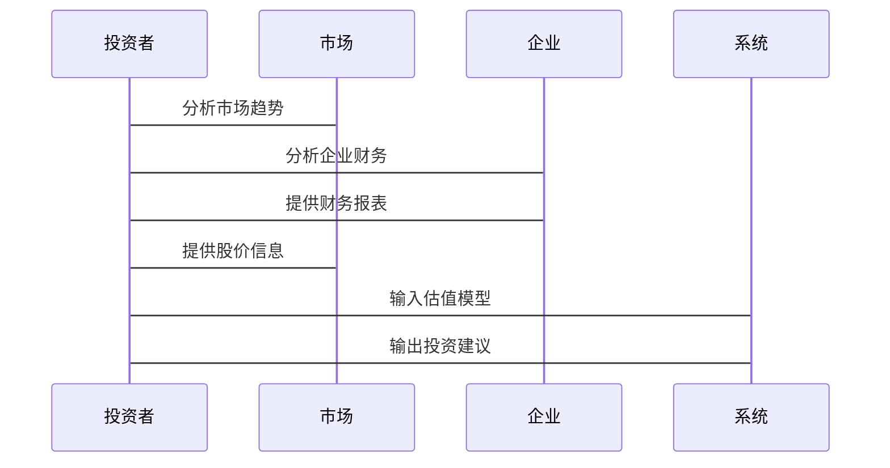

                 


# 格雷厄姆的“聪明的投资者”：价值投资圣经的现代解读

> 关键词：价值投资，格雷厄姆，安全边际，内在价值，现代投资理论

> 摘要：本文深入分析了本杰明·格雷厄姆的《聪明的投资者》的核心理念，并将其与现代投资理论相结合，探讨了价值投资在当今金融环境中的应用。文章从价值投资的背景、核心概念、数学模型、系统架构、项目实战等多个维度进行详细解读，旨在为投资者提供清晰的思路和实用的指导。

---

# 第一部分：价值投资的背景与核心概念

## 第1章：价值投资的定义与背景

### 1.1 投资的本质与目标
- 投资的本质：资产配置与财富增值
- 投资的目标：实现资产的长期稳健增长
- 投资的误区：短期波动与市场炒作

### 1.2 价值投资的起源与发展
- 格雷厄姆的学术背景与投资实践
- 《聪明的投资者》的出版与影响
- 价值投资从经典到现代的演变

### 1.3 格雷厄姆投资理念的核心思想
- 独特的思维方式：寻找安全边际
- 风险控制的优先性
- 长期投资与价值发现

## 第2章：价值投资的核心理念

### 2.1 安全边际的概念与重要性
- 安全边际的定义
- 安全边际的数学模型
- 安全边际在投资决策中的作用

### 2.2 内在价值的定义与计算
- 内在价值的多角度分析
- 格雷厄姆的估值公式
- 内在价值与市场价值的对比

### 2.3 市场先生与投资者心理
- 市场情绪的波动性
- 投资者心理与市场周期
- 理性决策与非理性行为的平衡

---

# 第二部分：价值投资的核心概念与联系

## 第3章：核心概念原理

### 3.1 核心概念的数学模型
- 安全边际的计算公式
$$ \text{安全边际} = \text{内在价值} - \text{市场价格} $$
- 内在价值的评估公式
$$ \text{内在价值} = \frac{\text{每股收益} \times (1 + \text{增长率})}{\text{折现率}} $$

### 3.2 核心概念的属性对比表格
| 概念         | 定义与计算公式                     | 特性与作用                         |
|--------------|----------------------------------|----------------------------------|
| 安全边际     | $ \text{安全边际} = \text{内在价值} - \text{市场价格} $ | 风险控制的核心工具                 |
| 内在价值     | $ \text{内在价值} = \frac{\text{每股收益} \times (1 + \text{增长率})}{\text{折现率}} $ | 估值的基础，指导投资决策           |

### 3.3 ER实体关系图
```mermaid
er
actor 投资者 {
  扮演者：投资者
}
actor 企业 {
  扮演者：企业
}
actor 市场 {
  扮演者：市场
}
关联：
投资者 --> 企业: 持股
企业 --> 市场: 上市
投资者 --> 市场: 交易
```

---

## 第4章：价值投资的数学模型与公式

### 4.1 股票估值的数学模型
- 现金流折现模型（DCF）
$$ \text{DCF} = \sum_{t=1}^{n} \frac{\text{现金流}}{(1 + r)^t} $$
- 市盈率与市净率的对比
$$ \text{市盈率} = \frac{\text{股价}}{\text{每股收益}} $$
$$ \text{市净率} = \frac{\text{股价}}{\text{每股净资产}} $$

### 4.2 财务指标分析
- 资产负债表分析
- 利润表分析
- 现金流量表分析

---

# 第三部分：价值投资的系统架构与实战

## 第5章：系统分析与架构设计

### 5.1 系统架构设计
- 价值投资系统的模块划分
- 数据流与信息处理流程
- 系统交互的序列图



### 5.2 项目实战

#### 5.2.1 环境安装
- 数据分析工具：Python、Pandas、NumPy
- 可视化工具：Matplotlib、Seaborn
- 估值模型：DCF模型

#### 5.2.2 核心实现源代码
```python
import pandas as pd
import numpy as np

def calculate_intrinsic_value(eps, growth_rate, discount_rate):
    return eps * (1 + growth_rate) / discount_rate

# 示例数据
eps = 5
growth_rate = 0.1
discount_rate = 0.08

intrinsic_value = calculate_intrinsic_value(eps, growth_rate, discount_rate)
print(f"内在价值: {intrinsic_value}")
```

#### 5.2.3 案例分析与解读
- 某公司的财务数据与估值分析
- 投资决策的过程与结果
- 风险评估与应对策略

---

## 第6章：最佳实践与小结

### 6.1 最佳实践 tips
- 长期投资与分散投资的重要性
- 定期复盘与调整策略
- 风险控制的具体措施

### 6.2 小结
- 价值投资的核心理念总结
- 现代应用中的注意事项
- 未来投资环境的展望

---

作者：AI天才研究院/AI Genius Institute & 禅与计算机程序设计艺术/Zen And The Art of Computer Programming

