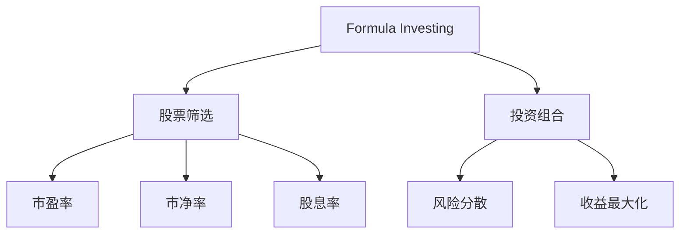
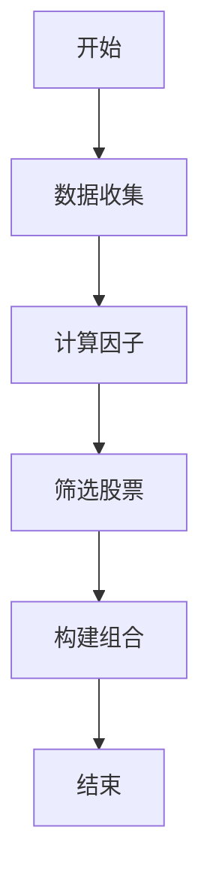
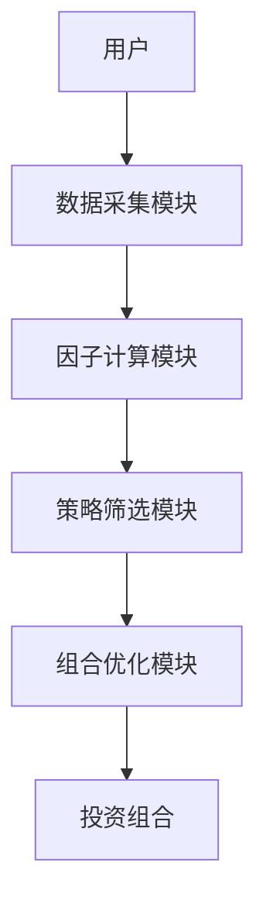
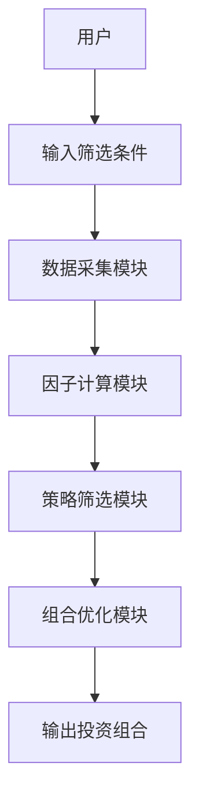

                 


# 格雷厄姆的Formula Investing：系统化投资方法

> 关键词：系统化投资，格雷厄姆，价值投资，多因子模型，量化分析

> 摘要：本文深入探讨了格雷厄姆的Formula Investing方法，系统地介绍了其背景、核心概念、算法原理、系统架构及实战应用，旨在为读者提供从理论到实践的全面指导。

---

## 第一部分：Formula Investing的背景与基础

### 第1章：Formula Investing的起源与理论基础

#### 1.1 格雷厄姆与价值投资的起源

- **1.1.1 格雷厄姆的生平与投资理念**
  - 本杰明·格雷厄姆（Benjamin Graham）是20世纪著名的投资家和价值投资理论的创始人。
  - 他强调安全边际和长期投资，认为市场波动是投资机会的来源。
  - 他的思想在《 Intelligent Investor》中得到了详细阐述。

- **1.1.2 价值投资的核心思想**
  - 价值投资：寻找市场定价低于内在价值的股票。
  - 安全边际：以低于内在价值的价格买入，降低风险。
  - 长期持有：避免频繁交易，降低成本。

- **1.1.3 格雷厄姆的投资哲学**
  - 股票价格波动，但价值是长期的。
  - 真正的投资是基于内在价值，而非市场情绪。

- **1.1.4 格雷厄姆的Formula Investing方法**
  - 将价值投资系统化，通过量化指标筛选低估股票。
  - 结合多因子模型，综合评估股票的投资价值。

#### 1.2 Formula Investing的定义与特点

- **1.2.1 Formula Investing的定义**
  - Formula Investing是一种系统化、量化驱动的价值投资方法。
  - 通过数学公式筛选股票，降低主观判断的影响。

- **1.2.2 与传统投资方法的区别**
  - 传统投资：依赖主观判断和市场情绪。
  - Formula Investing：基于量化指标和系统筛选。

- **1.2.3 系统化投资的意义**
  - 提高投资决策的科学性。
  - 减少人为情绪干扰，降低风险。
  - 便于复制和优化投资策略。

#### 1.3 系统化投资方法的背景与意义

- **1.3.1 现代投资理论的发展**
  - 从基本面分析到量化投资，投资方法日益多样化。
  - 技术进步推动了系统化投资的发展。

- **1.3.2 系统化投资在当今市场中的优势**
  - 高效性：快速筛选股票，节省时间。
  - 客观性：减少人为判断误差。
  - 可复制性：便于团队协作和策略优化。

---

### 第2章：系统化投资的核心概念与联系

#### 2.1 核心概念与原理

- **2.1.1 格雷厄姆的选股公式**
  - 格雷厄姆提出了一个简单的选股公式，用于筛选低估股票。
  - 公式基于市盈率、市净率等指标，计算股票的内在价值。

- **2.1.2 多因子模型的原理**
  - 多因子模型结合多个财务指标，全面评估股票价值。
  - 常用因子包括市盈率（P/E）、市净率（P/B）、股息率（Dividend Yield）等。

- **2.1.3 量化分析与基本面分析的结合**
  - 量化分析：利用数学模型筛选股票。
  - 基本面分析：评估公司的财务状况和行业地位。
  - 结合两者，提高投资决策的准确性。

#### 2.2 核心概念的属性对比

- **2.2.1 比较表格：多因子与单因子模型**
| 因子类型 | 优点 | 缺点 |
|----------|------|------|
| 单因子   | 简单易懂 | 易受市场波动影响 |
| 多因子   | 更加全面 | 计算复杂 |

- **2.2.2 比较表格：量化分析与基本面分析**
| 分析类型 | 优点 | 缺点 |
|----------|------|------|
| 量化分析 | 客观性强 | 忽略行业特殊性 |
| 基本面分析 | 考虑行业因素 | 主观性强 |

#### 2.3 实体关系图



---

### 第3章：Formula Investing的算法原理

#### 3.1 算法流程



- **3.1.1 数据收集**
  - 获取股票的历史数据，包括价格、收益、股息等。

- **3.1.2 计算因子**
  - 计算市盈率（P/E）、市净率（P/B）等指标。

- **3.1.3 筛选股票**
  - 根据设定的阈值，筛选出符合条件的股票。

- **3.1.4 构建组合**
  - 将筛选出的股票按权重分配，构建投资组合。

#### 3.2 Python代码实现

```python
import pandas as pd

# 数据收集
data = pd.read_csv('stock_data.csv')

# 计算因子
data['PE'] = data['Price'] / data['Earnings']
data['PB'] = data['Price'] / data['Book Value']
data['Dividend Yield'] = data['Dividend'] / data['Price']

# 筛选股票
selected = data[(data['PE'] < 15) & (data['PB'] < 2) & (data['Dividend Yield'] > 2)]
```

#### 3.3 数学模型与公式

- **3.3.1 市盈率（P/E）**
  \[
  P/E = \frac{\text{Price}}{\text{Earnings}}
  \]

- **3.3.2 市净率（P/B）**
  \[
  P/B = \frac{\text{Price}}{\text{Book Value}}
  \]

- **3.3.3 股息率**
  \[
  \text{Dividend Yield} = \frac{\text{Dividend}}{\text{Price}}
  \]

---

## 第四部分：系统分析与架构设计

### 第4章：系统化投资的系统架构

#### 4.1 问题场景介绍

- 系统目标：构建一个基于格雷厄姆Formula Investing的选股系统。
- 使用场景：投资者通过系统筛选低估股票，构建投资组合。

#### 4.2 系统功能设计

- **4.2.1 数据采集模块**
  - 从数据库或API获取股票数据。
- **4.2.2 因子计算模块**
  - 计算各项量化指标。
- **4.2.3 策略筛选模块**
  - 根据筛选条件选出股票。
- **4.2.4 组合优化模块**
  - 优化投资组合，分散风险。

#### 4.3 系统架构设计



#### 4.4 系统交互设计



---

## 第五部分：项目实战

### 第5章：Formula Investing的实战应用

#### 5.1 环境安装

- **5.1.1 Python安装**
  - 安装Python 3.x
- **5.1.2 库安装**
  - `pip install pandas numpy matplotlib`

#### 5.2 核心代码实现

```python
import pandas as pd
import numpy as np
import matplotlib.pyplot as plt

# 数据加载
data = pd.read_csv('stock_data.csv')

# 因子计算
data['PE'] = data['Price'] / data['Earnings']
data['PB'] = data['Price'] / data['Book Value']
data['Dividend Yield'] = data['Dividend'] / data['Price']

# 筛选股票
selected_stocks = data[(data['PE'] < 15) & (data['PB'] < 2) & (data['Dividend Yield'] > 2)]

# 可视化
selected_stocks[['PE', 'PB', 'Dividend Yield']].hist(bins=10, figsize=(10,6))
plt.show()
```

#### 5.3 案例分析

- **案例：2023年市场**
  - 筛选出PE < 15，PB < 2，股息率 > 2%的股票。
  - 构建投资组合，定期再平衡。

---

## 第六部分：总结与展望

### 第6章：最佳实践与注意事项

#### 6.1 总结

- Formula Investing通过系统化的方法，帮助投资者找到低估股票。
- 结合量化分析与基本面分析，提高投资决策的准确性。

#### 6.2 注意事项

- 数据质量：确保数据准确，避免错误决策。
- 策略优化：定期调整筛选条件，适应市场变化。
- 风险管理：控制仓位，分散投资风险。

#### 6.3 扩展阅读

- 《Intelligent Investor》：格雷厄姆的经典著作。
- 《量化交易入门》：系统学习量化投资方法。

---

## 附录

### 附录A：数学公式汇总

- 市盈率：\( P/E = \frac{\text{Price}}{\text{Earnings}} \)
- 市净率：\( P/B = \frac{\text{Price}}{\text{Book Value}} \)
- 股息率：\( \text{Dividend Yield} = \frac{\text{Dividend}}{\text{Price}} \)

### 附录B：术语表

- **市盈率（P/E）**：股价除以每股收益的比率。
- **市净率（P/B）**：股价除以每股净资产的比率。
- **股息率**：股息与股价的比率。

### 附录C：参考文献

- 格雷厄姆，本杰明.《 Intelligent Investor》. McGraw-Hill, 1972.

---

作者：AI天才研究院  
（完）

