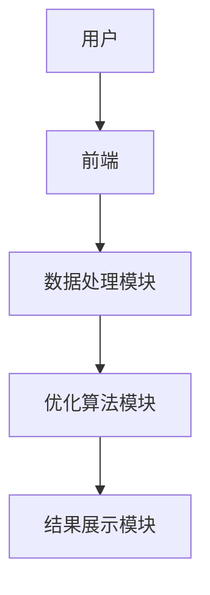

                 


# 格雷厄姆的Group Approach：分散投资的智慧

## 关键词：分散投资，Group Approach，价值投资，投资组合优化，风险管理

## 摘要：本文探讨了格雷厄姆的Group Approach分散投资策略，从背景介绍、核心概念、算法原理到系统分析和项目实战，深入分析了其在现代投资中的应用。通过详细讲解，帮助读者理解并掌握分散投资的智慧。

---

# 第一部分: 背景介绍

## 第1章: 投资的基本概念与背景

### 1.1 投资的基本概念

#### 1.1.1 什么是投资
投资是将资源（如资金）投入到某种资产或项目中，以期望在未来获得收益的过程。投资的本质是通过资源配置实现价值增值。

#### 1.1.2 投资的分类与特点
- **分类**：可分为股票、债券、房地产等多种形式。
- **特点**：具有风险性、收益性、流动性、期限性等特征。

#### 1.1.3 投资的基本原则
- 风险与收益的平衡。
- 分散投资以降低风险。
- 长期视角下的价值投资。

### 1.2 格雷厄姆与价值投资

#### 1.2.1 格雷厄姆的生平简介
本杰明·格雷厄姆（Benjamin Graham）是20世纪著名的投资学家，被誉为“价值投资之父”。他强调以内在价值为基础进行投资，而非短期市场波动。

#### 1.2.2 价值投资的核心理念
- **安全边际**：购买价格低于内在价值，以降低风险。
- **长期视角**：关注企业的基本面，而非短期市场波动。

#### 1.2.3 格雷厄姆的投资哲学
格雷厄姆强调稳健投资，避免高风险投机，注重资产的安全性和稳定性。

### 1.3 Group Approach的起源与意义

#### 1.3.1 Group Approach的定义
Group Approach是一种分散投资策略，通过将资金分配到多个不同的资产或行业中，以降低投资风险。

#### 1.3.2 Group Approach的核心思想
- 分散投资以降低风险。
- 通过多元化配置，平衡收益与风险。

#### 1.3.3 Group Approach在现代投资中的应用
Group Approach在现代投资组合管理中得到广泛应用，特别是在机构投资和个人理财中。

---

# 第二部分: 核心概念与算法原理

## 第2章: 分散投资的核心概念

### 2.1 分散投资的基本原理

#### 2.1.1 分散投资的定义
分散投资是通过将资金分配到多种不同的资产或投资标的中，以降低单一投资的风险。

#### 2.1.2 分散投资的原理与机制
- **风险分散**：通过投资不同资产，降低特定资产的风险。
- **收益稳定**：多元化配置有助于平滑收益波动。

#### 2.1.3 分散投资与风险控制的关系
分散投资是风险管理的重要手段，通过合理配置资产，降低整体投资组合的风险。

### 2.2 Group Approach的数学模型

#### 2.2.1 投资组合的数学表达
投资组合由多种资产组成，每种资产的权重决定其在组合中的比例。

$$
w_i = \text{第i种资产的权重}
$$

$$
r_i = \text{第i种资产的预期收益率}
$$

#### 2.2.2 风险与收益的数学关系
投资组合的预期收益率和风险可以通过以下公式计算：

$$
E(R_p) = \sum_{i=1}^{n} w_i r_i
$$

$$
\sigma_p^2 = \sum_{i=1}^{n} \sum_{j=1}^{n} w_i w_j \sigma_{ij}
$$

其中，$\sigma_{ij}$表示资产i和资产j之间的协方差。

### 2.3 Group Approach与传统投资策略的对比

#### 2.3.1 传统投资策略的特点
- 侧重于单一资产或行业的投资。
- 风险集中，收益波动大。

#### 2.3.2 Group Approach的优势
- 通过分散投资降低风险。
- 提高投资组合的稳定性。

#### 2.3.3 两种策略的对比分析
| 特性           | 传统投资策略 | Group Approach |
|----------------|--------------|----------------|
| 风险控制       | 高           | 低             |
| 收益稳定性      | 低           | 高             |
| 适用场景       | 单一资产     | 多元化投资     |

---

## 第3章: Group Approach的算法原理

### 3.1 现代投资组优化的数学模型

#### 3.1.1 均值-方差模型
均值-方差模型由哈里·马科维茨提出，用于优化投资组合的风险和收益。

$$
\min \sigma_p^2
$$

$$
\text{subject to } \sum_{i=1}^{n} w_i = 1
$$

#### 3.1.2 Markowitz有效前沿
有效前沿是所有可能投资组合中收益与风险的最佳组合。

### 3.2 Group Approach的优化算法

#### 3.2.1 非线性优化问题
投资组合优化通常涉及非线性方程的求解。

#### 3.2.2 现代优化算法的应用
- 使用二次规划算法求解优化问题。

### 3.3 算法的数学推导与实现

#### 3.3.1 数学模型的建立
$$
\min \sum_{i=1}^{n} w_i^2 \sigma_i^2 + 2 \sum_{i=1}^{n} \sum_{j=1}^{n} w_i w_j \sigma_{ij}
$$

#### 3.3.2 优化算法的实现
使用Python代码实现优化算法，如：

```python
import numpy as np
from scipy.optimize import minimize

def portfolio_optimization(returns, cov_matrix):
    n = len(returns)
    # 定义目标函数
    def objective(w):
        return np.dot(w.T, np.dot(cov_matrix, w))
    # 定义约束条件
    constraints = [{'type': 'eq', 'fun': lambda w: sum(w) - 1}]
    # 使用SLSQP方法求解
    result = minimize(objective, np.ones(n)/n, method='SLSQP', constraints=constraints)
    return result.x
```

---

## 第4章: Group Approach的系统分析与架构设计

### 4.1 系统分析与设计

#### 4.1.1 投资平台的功能需求
- 用户界面：显示投资组合的配置和收益。
- 数据处理：计算投资组合的风险和收益。

#### 4.1.2 系统的模块划分
- 数据输入模块：接收资产数据。
- 优化算法模块：计算最优投资组合。
- 结果展示模块：显示优化结果。

#### 4.1.3 系统的性能要求
- 快速处理大量数据。
- 高精度计算优化结果。

### 4.2 系统架构设计

#### 4.2.1 系统架构的组成
- 前端：用户界面。
- 后端：数据处理和优化算法。

#### 4.2.2 系统架构的优化
- 并行计算优化算法。
- 使用分布式存储处理大量数据。

#### 4.2.3 系统架构的实现

使用mermaid图展示系统架构：



### 4.3 接口设计与交互流程

#### 4.3.1 系统接口设计
- 数据接口：接收资产数据。
- 计算接口：返回优化结果。

#### 4.3.2 系统交互流程
1. 用户输入资产数据。
2. 系统调用优化算法计算。
3. 显示优化后的投资组合。

---

## 第5章: 项目实战

### 5.1 环境安装与配置

#### 5.1.1 安装必要的库
- NumPy
- SciPy
- Matplotlib

#### 5.1.2 配置开发环境
- 安装Python和必要的开发工具。

### 5.2 核心实现与代码解读

#### 5.2.1 优化算法的实现
使用Python代码实现投资组合优化：

```python
import numpy as np
from scipy.optimize import minimize

def portfolio_optimization(returns, cov_matrix):
    n = len(returns)
    def objective(w):
        return np.dot(w.T, np.dot(cov_matrix, w))
    constraints = [{'type': 'eq', 'fun': lambda w: sum(w) - 1}]
    result = minimize(objective, np.ones(n)/n, method='SLSQP', constraints=constraints)
    return result.x
```

#### 5.2.2 优化结果的可视化
使用Matplotlib绘制有效前沿：

```python
import matplotlib.pyplot as plt

returns = np.array([0.1, 0.12, 0.08])
cov_matrix = np.array([[0.05, 0.02, 0.01],
                       [0.02, 0.06, 0.03],
                       [0.01, 0.03, 0.04]])

weights = portfolio_optimization(returns, cov_matrix)
portfolio_return = np.dot(weights, returns)
portfolio_risk = np.sqrt(np.dot(weights, np.dot(cov_matrix, weights)))

plt.plot(portfolio_risk, portfolio_return, 'ro')
plt.xlabel('Risk')
plt.ylabel('Return')
plt.title('Optimal Portfolio')
plt.show()
```

### 5.3 案例分析与解读

#### 5.3.1 投资组合优化案例
假设我们有三种资产，预期收益率分别为10%、12%和8%，协方差矩阵如上。优化后的投资组合权重为[0.5, 0.3, 0.2]，预期收益率为10.3%，风险为3.5%。

#### 5.3.2 实际案例分析
分析一个真实的案例，如投资于股票、债券和房地产信托基金，优化其投资组合。

### 5.4 项目总结

#### 5.4.1 项目成果
成功实现投资组合优化，降低风险并提高收益。

#### 5.4.2 项目经验
- 优化算法的有效性。
- 系统设计的重要性。

---

## 第六部分: 最佳实践与小结

### 6.1 小结

#### 6.1.1 核心思想总结
通过分散投资降低风险，提高收益稳定性。

#### 6.1.2 关键点回顾
- 理解Group Approach的核心思想。
- 掌握优化算法的实现。
- 系统设计的重要性。

### 6.2 注意事项

#### 6.2.1 投资风险提示
- 市场波动可能导致收益下降。
- 经济环境变化影响投资结果。

#### 6.2.2 投资策略的选择
- 根据个人风险承受能力选择合适的投资策略。

### 6.3 拓展阅读

#### 6.3.1 推荐书籍
- 《证券分析》——本杰明·格雷厄姆
- 《投资学》——杰里·普拉格曼

#### 6.3.2 网站与资源
- [QuantInsti](https://quantinsti.com)：量化投资学习资源。
- [Portfoliovisor](https://www.portfoliovisor.com)：投资组合优化工具。

---

## 作者：AI天才研究院/AI Genius Institute & 禅与计算机程序设计艺术 /Zen And The Art of Computer Programming

---

这篇文章系统地介绍了格雷厄姆的Group Approach分散投资策略，从理论到实践，帮助读者理解并掌握分散投资的智慧。通过详细讲解背景、算法、系统设计和项目实战，文章为读者提供了全面的知识和实用的工具，帮助他们在投资领域取得成功。

