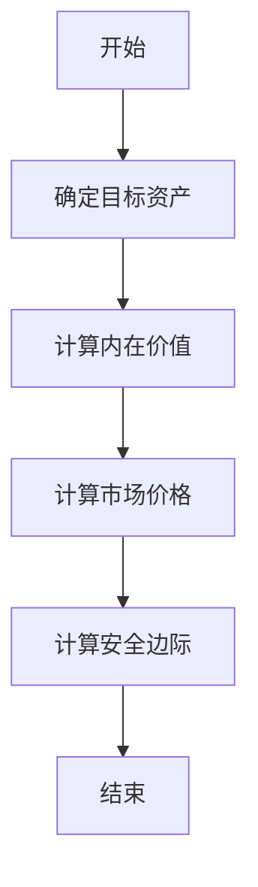
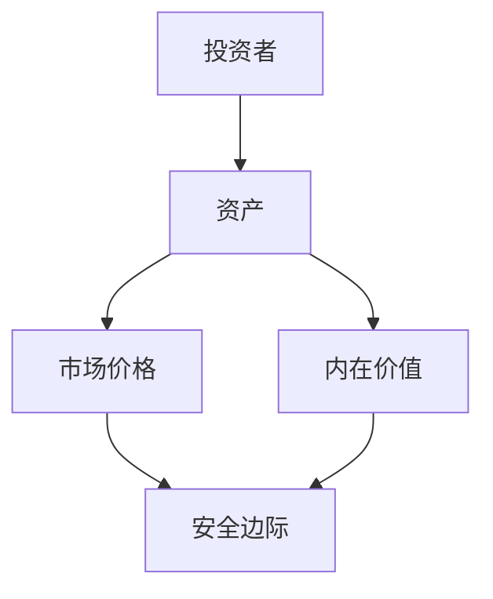
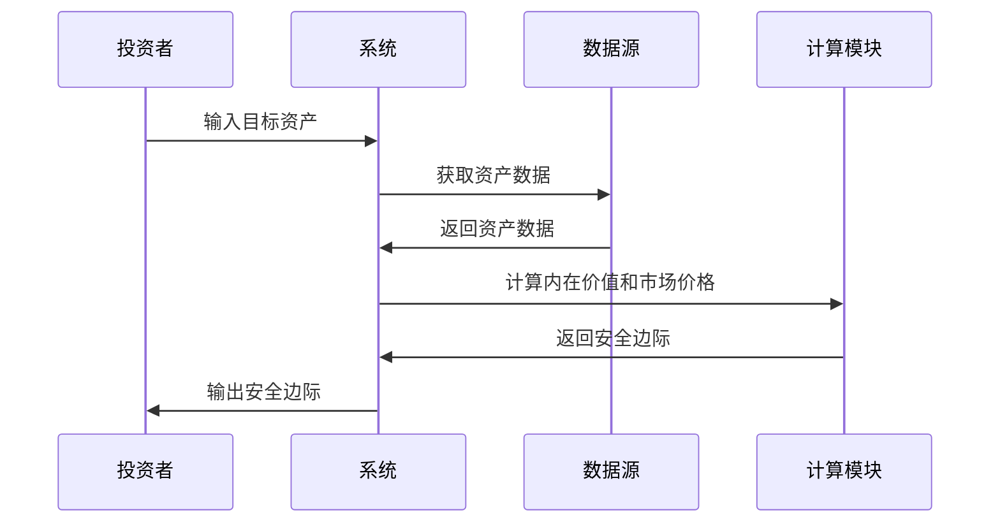

                 


# 格雷厄姆的Margin of Safety：投资的首要原则

> 关键词：格雷厄姆，安全边际，价值投资，Margin of Safety，投资原则，风险管理，价值评估

> 摘要：格雷厄姆的Margin of Safety（安全边际）是价值投资的核心原则之一，它通过在资产价格与内在价值之间建立一个保护性的缓冲区，帮助投资者降低投资风险并提高投资回报。本文将从格雷厄姆的安全边际理论出发，逐步分析其核心概念、算法原理、系统设计以及实际应用，为投资者提供一套基于Margin of Safety的投资策略。

---

# 第一部分: 格雷厄姆的Margin of Safety概述

## 第1章: 格雷厄姆的Margin of Safety起源

### 1.1 格雷厄姆的生平简介
本杰明·格雷厄姆（Benjamin Graham）是20世纪最著名的投资思想家之一，被誉为“价值投资之父”。他出生于1894年，曾在纽约证券交易所工作，后来成为哥伦比亚大学的教授，教授证券分析课程。他的学生包括沃伦·巴菲特（Warren Buffett）等投资大师。

### 1.2 格雷厄姆的投资理念
格雷厄姆的投资理念以“安全边际”为核心，主张以低于内在价值的价格买入优质资产。他认为，市场波动和投资者情绪会影响资产价格，但内在价值是资产的真正价值，可以通过基本面分析来确定。

### 1.3 格雷厄姆与巴菲特的师徒关系
格雷厄姆的学生沃伦·巴菲特继承并发展了他的投资理念，将安全边际的概念推广到全球投资领域。巴菲特曾说：“我从格雷厄姆那里学到的最重要的东西就是安全边际。”

---

## 第2章: 格雷厄姆的安全边际理论体系

### 2.1 安全边际的定义
安全边际（Margin of Safety）是指资产的市场价格与其内在价值之间的差额。具体来说，安全边际 = 内在价值 - 市场价格。当市场价格低于内在价值时，存在安全边际，这为投资提供了保护，避免因市场波动而造成损失。

### 2.2 安全边际的哲学基础
格雷厄姆的安全边际理论基于以下几点：
- 市场价格波动性：市场情绪和短期因素可能导致资产价格偏离其真实价值。
- 投资者的认知局限：投资者无法完全预测未来，安全边际为决策提供了容错空间。
- 风险厌恶：投资者通过安全边际降低风险，确保投资回报的稳定性。

### 2.3 安全边际与投资风险的关系
安全边际越大，投资的风险越低。当安全边际为正时，投资者能够以较低的价格买入资产，即使市场波动导致价格下跌，也能避免损失。同时，安全边际为正的资产具有更大的上涨潜力。

---

## 第3章: 格雷厄姆的Margin of Safety与现代投资理论

### 3.1 现代投资组合理论的对比
现代投资组合理论（MPT）强调分散投资和风险与收益的均衡，而格雷厄姆的安全边际理论更注重资产的内在价值和价格折扣。两者在风险控制上有相似之处，但侧重点不同。

### 3.2 格雷厄姆思想对机构投资的影响
机构投资者通过引入安全边际的概念，能够更好地控制投资组合的风险。例如，机构投资者通常会评估资产的内在价值，并寻找市场价格低于内在价值的投资机会。

### 3.3 格雷厄姆的安全边际在个人投资中的应用
个人投资者可以通过分析资产的内在价值，选择市场价格低于内在价值的资产进行投资。这种方法特别适合长期投资者，因为它强调的是长期价值而非短期波动。

---

# 第二部分: 安全边际的算法原理

## 第4章: 安全边际的计算方法

### 4.1 市盈率法
市盈率（P/E）是市场价格与每股收益的比率。通过比较资产的市盈率与行业平均水平或历史平均水平，可以判断资产的市场价格是否合理。

### 4.2 市净率法
市净率（P/B）是市场价格与每股净资产的比率。如果市场价格低于行业平均水平，说明资产可能存在安全边际。

### 4.3 内在价值法
内在价值是基于资产的现金流、盈利能力和其他基本面因素计算出的理论价值。通过比较市场价格与内在价值，可以确定是否存在安全边际。

---

## 第5章: 安全边际的数学模型

### 5.1 市盈率模型
$$ P = \frac{E}{P/E} $$
其中，P为市场价格，E为每股收益，P/E为市盈率。

### 5.2 市净率模型
$$ P = \frac{B}{P/B} $$
其中，P为市场价格，B为每股净资产，P/B为市净率。

### 5.3 内在价值模型
$$ V = \sum_{t=1}^{\infty} \frac{CF_t}{(1+r)^t} $$
其中，V为内在价值，CF_t为第t年的现金流，r为折现率。

---

## 第6章: 安全边际的算法流程图



---

# 第三部分: 基于安全边际的投资系统设计

## 第7章: 投资系统设计

### 7.1 系统架构图


### 7.2 系统交互序列图


---

## 第8章: 项目实战

### 8.1 环境安装
需要安装Python和相关数据处理库（如Pandas、NumPy）。

### 8.2 核心代码实现
```python
def calculate_margin_of_safety(intrinsic_value, market_price):
    return intrinsic_value - market_price

# 示例
iv = 100
mp = 80
mos = calculate_margin_of_safety(iv, mp)
print(f"安全边际为: {mos}")
```

### 8.3 案例分析
假设某资产的内在价值为100，市场价格为80，则安全边际为20。这意味着资产的市场价格低于内在价值，存在投资机会。

---

## 第9章: 总结与最佳实践

### 9.1 总结
格雷厄姆的安全边际理论为投资者提供了一种降低风险、提高收益的投资方法。通过计算安全边际，投资者可以更好地判断资产的价值，并做出明智的投资决策。

### 9.2 投资建议
- 始终关注资产的内在价值，而非市场价格。
- 选择市场价格低于内在价值的资产进行投资。
- 定期评估投资组合的安全边际，及时调整投资策略。

### 9.3 风险管理
- 设定止损点，避免因市场波动导致的重大损失。
- 分散投资，降低单一资产的风险。

### 9.4 小结
格雷厄姆的Margin of Safety是投资的首要原则，它不仅帮助投资者降低风险，还为投资决策提供了科学的依据。通过理解和应用这一理论，投资者可以在复杂多变的市场中找到稳定的收益。

---

# 作者：AI天才研究院/AI Genius Institute & 禅与计算机程序设计艺术 /Zen And The Art of Computer Programming

