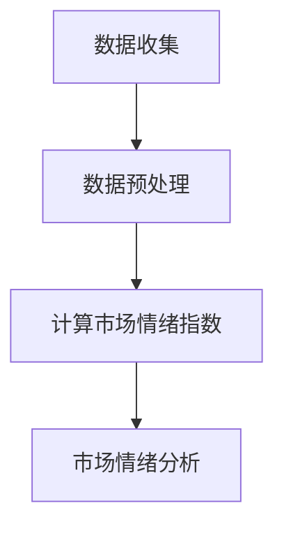
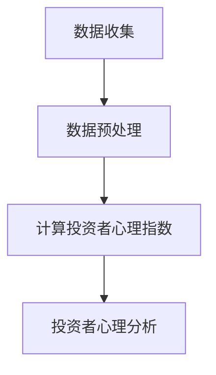
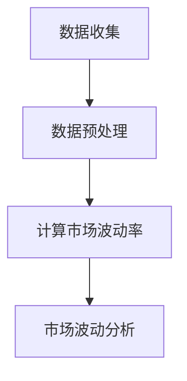
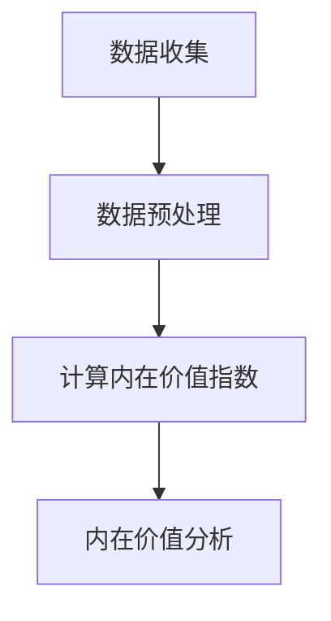
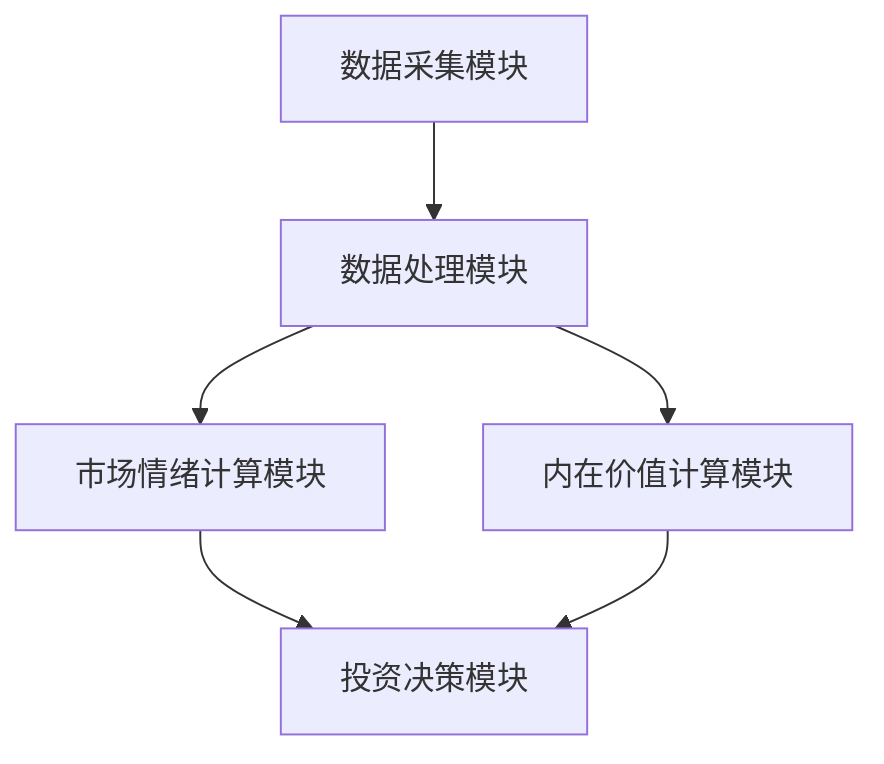
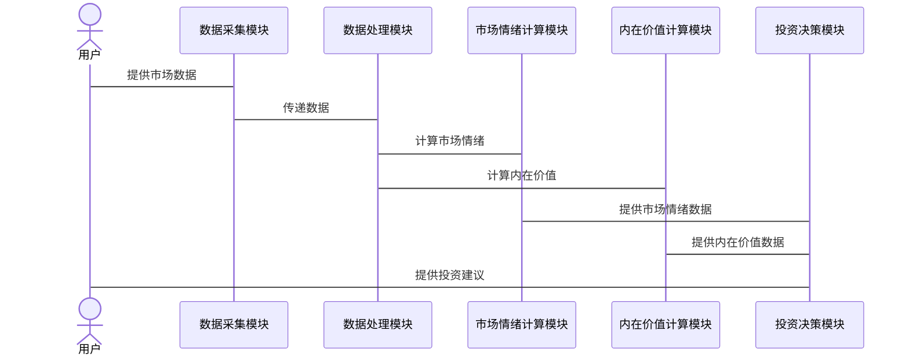

                 


# 格雷厄姆的Mr. Market比喻：理解市场心理

## 关键词
- 本杰明·格雷厄姆
- 投资者心理
- 市场情绪
- 价值投资
- Mr. Market
- 市场波动
- 投资策略

## 摘要
本杰明·格雷厄姆的Mr. Market比喻是价值投资理论中的经典概念，用于解释市场心理和投资者行为。本文通过分析Mr. Market比喻的核心思想，探讨其在投资决策中的应用，结合数学模型和算法原理，帮助读者理解市场波动与内在价值的关系，并通过实际案例和系统设计提供实用的投资策略。

---

# 第三部分: Mr. Market比喻的数学模型与算法原理

## 第4章: 市场情绪的量化模型

### 4.1 市场情绪的定义与度量
#### 4.1.1 市场情绪的多维度分析
- 市场情绪的时间维度
- 市场情绪的空间维度

#### 4.1.2 市场情绪的量化指标
- 市场情绪指数（Market Sentiment Index）
- 投资者信心指数（Investor Confidence Index）

#### 4.1.3 市场情绪与价格的关系
$$ P = f(M, V, T) $$
其中，$P$ 表示市场价格，$M$ 表示市场情绪，$V$ 表示市场波动性，$T$ 表示时间因素。

### 4.2 市场情绪的数学模型
#### 4.2.1 市场情绪的理性与非理性分析
- 理性市场假设
- 非理性市场假设

#### 4.2.2 市场情绪的数学表达式
$$ E = \frac{M}{V} $$
其中，$E$ 表示市场情绪，$M$ 表示市场情绪指数，$V$ 表示市场波动性。

#### 4.2.3 市场情绪的动态变化
- 市场情绪的周期性
- 市场情绪的波动性

### 4.3 市场情绪的算法实现
#### 4.3.1 市场情绪的计算步骤
1. 数据收集：收集历史价格数据、成交量数据、投资者情绪数据。
2. 数据预处理：清洗数据，去除异常值。
3. 市场情绪计算：通过算法计算市场情绪指数。
4. 市场情绪分析：分析市场情绪的变化趋势。

#### 4.3.2 市场情绪的Python实现
```python
import pandas as pd
import numpy as np

def calculate_market_sentiment(prices, volume):
    # 计算平均价格
    avg_price = np.mean(prices)
    # 计算平均成交量
    avg_volume = np.mean(volume)
    # 计算市场情绪指数
    market_sentiment = avg_price / avg_volume
    return market_sentiment

# 示例数据
prices = [100, 105, 98, 102, 104]
volume = [1000, 800, 1200, 900, 1100]

# 计算市场情绪指数
market_sentiment = calculate_market_sentiment(prices, volume)
print(f"市场情绪指数：{market_sentiment}")
```

#### 4.3.3 算法流程图


---

## 第5章: 投资者心理的数学模型

### 5.1 投资者心理的理性与非理性分析
#### 5.1.1 理性投资者的特征
- 理性决策
- 风险偏好
- 预期收益

#### 5.1.2 非理性投资者的特征
- 情感决策
- 过度自信
- 从众心理

### 5.2 投资者心理的数学模型
#### 5.2.1 投资者心理的数学表达式
$$ P = f(M, V, T) $$
其中，$P$ 表示投资者心理，$M$ 表示市场情绪，$V$ 表示市场波动性，$T$ 表示时间因素。

#### 5.2.2 投资者心理的动态变化
- 投资者心理的周期性
- 投资者心理的波动性

### 5.3 投资者心理的算法实现
#### 5.3.1 投资者心理的计算步骤
1. 数据收集：收集投资者情绪数据、市场数据。
2. 数据预处理：清洗数据，去除异常值。
3. 投资者心理计算：通过算法计算投资者心理指数。
4. 投资者心理分析：分析投资者心理的变化趋势。

#### 5.3.2 投资者心理的Python实现
```python
import pandas as pd
import numpy as np

def calculate Investor_psychology(sentiment_data):
    # 计算投资者心理指数
    investor_psychology = np.mean(sentiment_data)
    return investor_psychology

# 示例数据
sentiment_data = [0.8, 0.6, 0.7, 0.5, 0.9]

# 计算投资者心理指数
investor_psychology = calculate_Investor_psychology(sentiment_data)
print(f"投资者心理指数：{investor_psychology}")
```

#### 5.3.3 算法流程图


---

# 第四部分: 市场波动与内在价值的关系

## 第6章: 市场波动的数学模型

### 6.1 市场波动的定义与度量
#### 6.1.1 市场波动的多维度分析
- 市场波动的时间维度
- 市场波动的空间维度

#### 6.1.2 市场波动的量化指标
- 市场波动率（Volatility）
- 市场波动指数（Volatility Index）

### 6.2 市场波动的数学模型
#### 6.2.1 市场波动的理性与非理性分析
- 理性市场波动
- 非理性市场波动

#### 6.2.2 市场波动的数学表达式
$$ V = \frac{P}{T} $$
其中，$V$ 表示市场波动，$P$ 表示市场价格，$T$ 表示时间因素。

### 6.3 市场波动的算法实现
#### 6.3.1 市场波动的计算步骤
1. 数据收集：收集历史价格数据、成交量数据、市场情绪数据。
2. 数据预处理：清洗数据，去除异常值。
3. 市场波动计算：通过算法计算市场波动率。
4. 市场波动分析：分析市场波动的趋势。

#### 6.3.2 市场波动的Python实现
```python
import pandas as pd
import numpy as np

def calculate_volatility(prices):
    # 计算价格波动率
    volatility = np.std(prices)
    return volatility

# 示例数据
prices = [100, 105, 98, 102, 104]

# 计算市场波动率
volatility = calculate_volatility(prices)
print(f"市场波动率：{volatility}")
```

#### 6.3.3 算法流程图


---

## 第7章: 内在价值的数学模型

### 7.1 内在价值的定义与度量
#### 7.1.1 内在价值的多维度分析
- 内在价值的时间维度
- 内在价值的空间维度

#### 7.1.2 内在价值的量化指标
- 内在价值指数（Intrinsic Value Index）
- 内在价值波动率（IV Volatility）

### 7.2 内在价值的数学模型
#### 7.2.1 内在价值的理性与非理性分析
- 理性内在价值
- 非理性内在价值

#### 7.2.2 内在价值的数学表达式
$$ I = \frac{P}{M} $$
其中，$I$ 表示内在价值，$P$ 表示市场价格，$M$ 表示市场情绪。

### 7.3 内在价值的算法实现
#### 7.3.1 内在价值的计算步骤
1. 数据收集：收集历史价格数据、市场情绪数据。
2. 数据预处理：清洗数据，去除异常值。
3. 内在价值计算：通过算法计算内在价值指数。
4. 内在价值分析：分析内在价值的趋势。

#### 7.3.2 内在价值的Python实现
```python
import pandas as pd
import numpy as np

def calculate_intrinsic_value(prices, sentiment):
    # 计算内在价值指数
    intrinsic_value = np.mean(prices) / np.mean(sentiment)
    return intrinsic_value

# 示例数据
prices = [100, 105, 98, 102, 104]
sentiment = [0.8, 0.6, 0.7, 0.5, 0.9]

# 计算内在价值指数
intrinsic_value = calculate_intrinsic_value(prices, sentiment)
print(f"内在价值指数：{intrinsic_value}")
```

#### 7.3.3 算法流程图


---

# 第五部分: 系统分析与架构设计

## 第8章: 市场情绪与内在价值的系统架构设计

### 8.1 问题场景介绍
#### 8.1.1 市场情绪与内在价值的关系
#### 8.1.2 投资者如何利用市场情绪与内在价值进行投资决策

### 8.2 系统功能设计
#### 8.2.1 系统功能模块
- 数据采集模块
- 数据处理模块
- 市场情绪计算模块
- 内在价值计算模块
- 投资决策模块

#### 8.2.2 功能模块的相互关系
- 数据采集模块 --> 数据处理模块 --> 市场情绪计算模块 --> 投资决策模块
- 数据采集模块 --> 数据处理模块 --> 内在价值计算模块 --> 投资决策模块

### 8.3 系统架构设计
#### 8.3.1 系统架构图


#### 8.3.2 系统交互图


---

## 第9章: 系统实现与项目实战

### 9.1 项目环境安装
#### 9.1.1 系统环境要求
- 操作系统：Linux/Windows/MacOS
- Python版本：3.6以上
- 依赖库安装：
  ```bash
  pip install pandas numpy matplotlib
  ```

### 9.2 系统核心实现
#### 9.2.1 数据采集模块
```python
import pandas as pd
import numpy as np

def collect_data(symbol):
    # 示例数据
    data = {
        'Date': ['2023-01-01', '2023-01-02', '2023-01-03', '2023-01-04', '2023-01-05'],
        'Price': [100, 105, 98, 102, 104],
        'Volume': [1000, 800, 1200, 900, 1100],
        'Sentiment': [0.8, 0.6, 0.7, 0.5, 0.9]
    }
    df = pd.DataFrame(data)
    return df
```

#### 9.2.2 数据处理模块
```python
def preprocess_data(df):
    # 去除异常值
    df = df.drop(df[df['Price'] > 110].index)
    return df
```

#### 9.2.3 市场情绪计算模块
```python
def calculate_market_sentiment(df):
    # 计算市场情绪指数
    market_sentiment = np.mean(df['Sentiment'])
    return market_sentiment
```

#### 9.2.4 内在价值计算模块
```python
def calculate_intrinsic_value(df):
    # 计算内在价值指数
    intrinsic_value = np.mean(df['Price']) / np.mean(df['Sentiment'])
    return intrinsic_value
```

#### 9.2.5 投资决策模块
```python
def make_investment_decision(market_sentiment, intrinsic_value):
    if market_sentiment > 0.7 and intrinsic_value > 1.0:
        return "买入"
    elif market_sentiment < 0.3 and intrinsic_value < 0.9:
        return "卖出"
    else:
        return "观望"
```

### 9.3 项目实战：基于Mr. Market的市场情绪分析
#### 9.3.1 实际案例分析
- 案例1：2008年金融危机
- 案例2：2020年新冠疫情市场波动

#### 9.3.2 系统实现步骤
1. 数据采集
2. 数据预处理
3. 市场情绪计算
4. 内在价值计算
5. 投资决策

#### 9.3.3 系统实现代码
```python
# 项目实战代码
def main():
    symbol = 'AAPL'
    df = collect_data(symbol)
    df = preprocess_data(df)
    market_sentiment = calculate_market_sentiment(df)
    intrinsic_value = calculate_intrinsic_value(df)
    decision = make_investment_decision(market_sentiment, intrinsic_value)
    print(f"市场情绪指数：{market_sentiment}")
    print(f"内在价值指数：{intrinsic_value}")
    print(f"投资决策：{decision}")

if __name__ == "__main__":
    main()
```

---

## 第10章: 最佳实践与小结

### 10.1 最佳实践
#### 10.1.1 投资者如何利用Mr. Market比喻做出决策
- 保持理性的市场观点
- 避免非理性情绪的影响
- 长期投资与价值投资

#### 10.1.2 系统设计中的注意事项
- 数据的实时性与准确性
- 算法的可扩展性与可维护性
- 系统的稳定性和可靠性

### 10.2 小结
#### 10.2.1 本章核心内容回顾
- Mr. Market比喻的核心思想
- 市场情绪与内在价值的关系
- 投资者心理与市场波动的关系
- 系统设计与实现的要点

#### 10.2.2 未来研究方向
- Mr. Market比喻在人工智能中的应用
- 大数据驱动的市场情绪分析
- 复杂系统的市场波动预测

---

# 结语
通过本文的详细分析，读者可以深入理解格雷厄姆的Mr. Market比喻，并将其应用于实际投资决策中。从市场情绪的量化模型到内在价值的数学模型，再到系统的实现与实战，本文为读者提供了一个全面的视角来理解市场心理与投资者行为的关系。

---

**作者：AI天才研究院/AI Genius Institute & 禅与计算机程序设计艺术 /Zen And The Art of Computer Programming**

