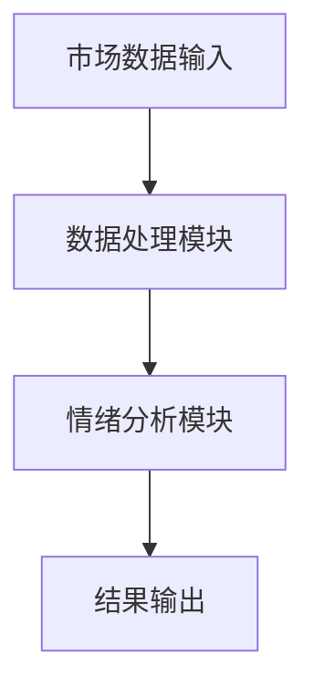
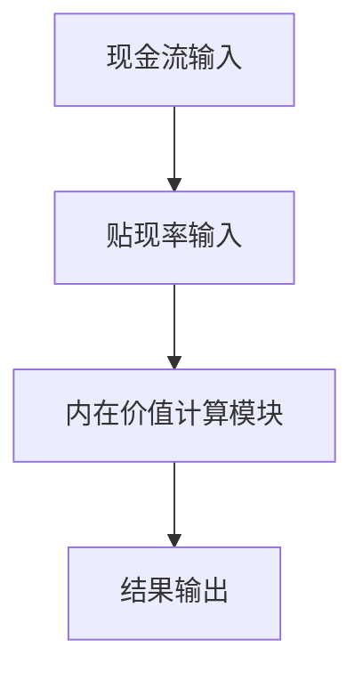

                 


# 格雷厄姆的Mr. Market理论

## 关键词：  
- 本杰明·格雷厄姆  
- Mr. Market理论  
- 投资者情绪  
- 价值投资  
- 市场波动  

## 摘要：  
本文深入探讨了本杰明·格雷厄姆提出的Mr. Market理论，分析了其在投资决策中的应用。通过从理论背景到系统设计的全面分析，结合技术语言和实际案例，帮助读者理解如何利用市场波动和投资者情绪做出明智的投资决策。  

---

# 第1章: 格雷厄姆与Mr. Market理论概述  

## 1.1 本杰明·格雷厄姆的生平简介  

### 1.1.1 格雷厄姆的职业背景  
- 格雷厄姆是20世纪著名的投资学家，被誉为“价值投资之父”。  
- 他是哥伦比亚大学的教授，培养了许多知名投资者，如沃伦·巴菲特。  

### 1.1.2 格雷厄姆的投资哲学  
- 强调安全边际和内在价值。  
- 认为市场波动是投资机会的来源。  

## 1.2 Mr. Market理论的提出背景  

### 1.2.1 20世纪的投资环境  
- 20世纪30年代的大萧条时期，市场波动剧烈，投资者情绪低落。  
- 格雷厄姆通过观察市场行为，提出了Mr. Market理论。  

### 1.2.2 理论的核心思想  
- 市场波动反映了投资者情绪的变化，而非真实的价值评估。  
- 投资者应利用市场的非理性波动，寻找低估或高估的资产。  

## 1.3 Mr. Market理论的核心概念  

### 1.3.1 Mr. Market的定义与特征  
- Mr. Market代表市场情绪，情绪波动会影响资产价格。  
- 市场情绪可以分为乐观和悲观两种状态。  

### 1.3.2 投资者情绪的波动性  
- 情绪波动遵循周期性规律，可以通过图表分析。  

## 1.4 理论的应用范围  

### 1.4.1 个股投资中的应用  
- 通过市场波动寻找价值低估的股票。  

### 1.4.2 投资组合管理中的应用  
- 分散投资以降低风险。  

### 1.4.3 机构投资者的实践  
- 利用Mr. Market理论进行资产配置。  

---

# 第2章: Mr. Market理论的核心原理  

## 2.1 投资者情绪的周期性  

### 2.1.1 情绪波动周期  
- 市场情绪从乐观到悲观，再回归理性，形成周期性波动。  

### 2.1.2 情绪与市场定价的关系  
- 投资者情绪影响资产定价，而非内在价值。  

### 2.1.3 情绪分析工具  
- 使用图表和指标分析市场情绪。  

## 2.2 市场先生的理性与非理性  

### 2.2.1 理性市场假设的局限性  
- 市场并不总是理性的。  

### 2.2.2 非理性行为的表现  
- 过度乐观或悲观导致资产价格偏离内在价值。  

## 2.3 市场波动与投资决策的关系  

### 2.3.1 市场波动对决策的影响  
- 波动性是投资机会的来源。  

### 2.3.2 如何利用波动获利  
- 逆向投资策略：在市场恐慌时买入，在乐观时卖出。  

## 2.4 数学模型与公式  

### 2.4.1 投资者情绪指数的构建  
$$ \text{情绪指数} = \frac{\text{市场价}}{\text{内在价值}} $$  

### 2.4.2 市场波动的量化分析  
$$ \text{波动率} = \sigma \times \text{资产价格} $$  

---

# 第3章: 投资者情绪分析系统  

## 3.1 系统需求分析  

### 3.1.1 系统目标  
- 分析市场情绪，评估资产定价。  

### 3.1.2 功能需求  
- 情绪数据收集、处理和分析。  

## 3.2 系统架构设计  

### 3.2.1 模块划分  
- 数据输入、处理、分析和输出模块。  

### 3.2.2 系统流程图  



---

# 第4章: 价值投资与内在价值  

## 4.1 价值投资的核心理念  

### 4.1.1 安全边际的概念  
- 安全边际 = 内在价值 - 市场价。  

### 4.1.2 内在价值的计算  
$$ \text{内在价值} = \sum \frac{\text{现金流}}{(1+r)^t} $$  

## 4.2 投资决策系统设计  

### 4.2.1 系统功能  
- 计算内在价值，评估安全边际。  

### 4.2.2 系统架构图  



---

# 第5章: 项目实战  

## 5.1 环境配置  

### 5.1.1 工具安装  
- 安装Python和相关库（如numpy、pandas）。  

## 5.2 核心代码实现  

### 5.2.1 情绪分析代码  

```python
import numpy as np
import pandas as pd

def calculate_sentiment(data):
    # 示例情绪计算代码
    return data.mean()
```

### 5.2.2 投资决策系统代码  

```python
def investment_decision(value, price):
    margin_of_safety = value - price
    if margin_of_safety > 0:
        return "买入"
    else:
        return "卖出"
```

---

# 第6章: 总结与建议  

## 6.1 本章总结  

### 6.1.1 核心理论回顾  
- Mr. Market理论强调市场波动和投资者情绪。  

### 6.1.2 实际应用价值  
- 通过分析市场情绪，制定投资策略。  

## 6.2 投资建议  

### 6.2.1 长期投资的重要性  
- 长期持有优质资产，避免短期波动干扰。  

### 6.2.2 分散投资的必要性  
- 降低单一资产的风险。  

---

# 作者：AI天才研究院/AI Genius Institute & 禅与计算机程序设计艺术 /Zen And The Art of Computer Programming

