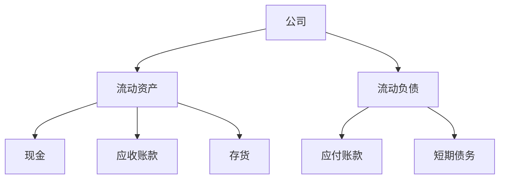
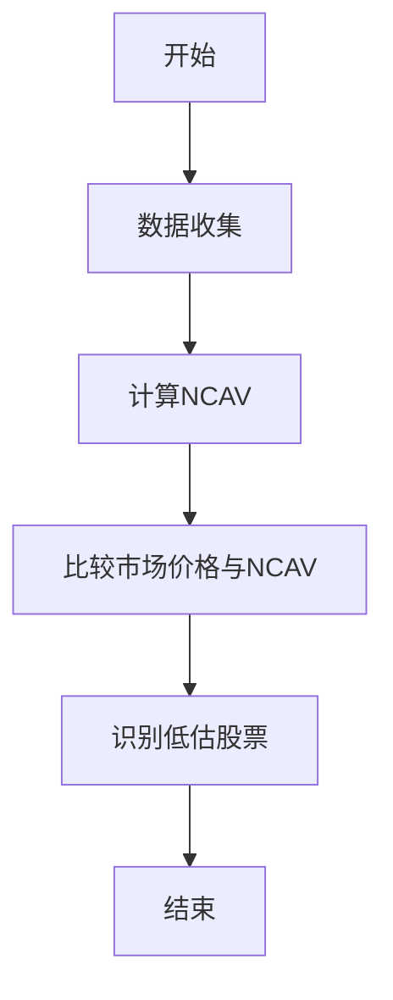
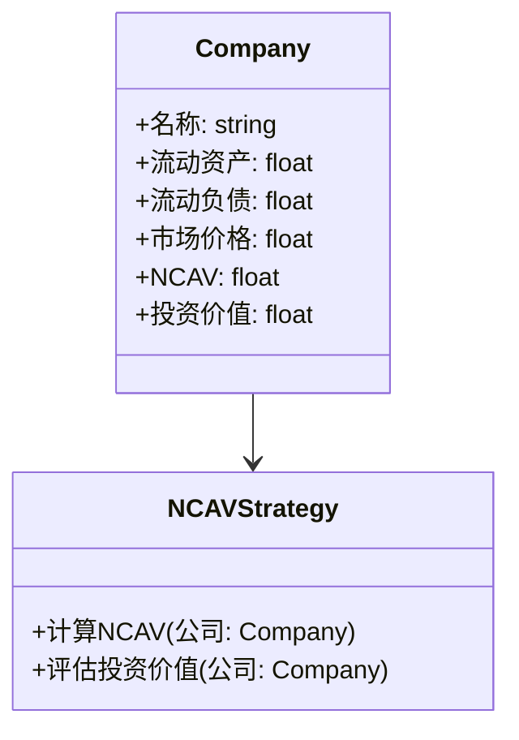
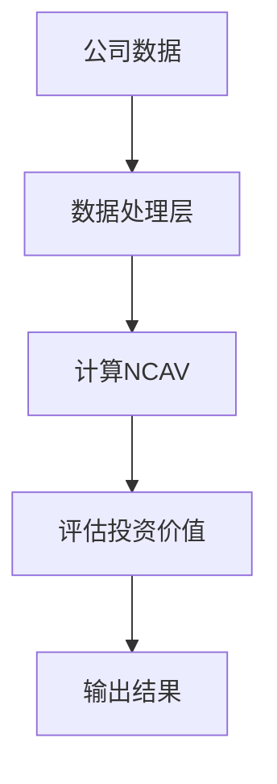

                 


# 格雷厄姆的NCAV策略：寻找极度低估的股票

## 关键词：NCAV策略, 价值投资, 股票估值, 格雷厄姆, 极度低估

## 摘要：  
格雷厄姆的NCAV策略是一种经典的价值投资方法，旨在通过计算股票的内在价值来识别市场中被低估的股票。本文详细介绍了NCAV策略的背景、核心概念、算法原理、系统架构、项目实战及最佳实践，帮助投资者理解和应用这一策略。通过数学模型、Mermaid图表和实际案例分析，本文为读者提供了一个全面的视角，以掌握NCAV策略在现代投资中的应用。

---

# 第1章: NCAV策略的背景与核心概念

## 1.1 格雷厄姆与NCAV策略的起源

### 1.1.1 格雷厄姆的生平与投资理念  
 Benjamin Graham（本杰明·格雷厄姆）是20世纪最伟大的投资思想家之一，被誉为“价值投资之父”。他在1934年出版的《证券分析》一书中，首次系统地提出了价值投资的理念。格雷厄姆认为，股票不仅仅是价格标签的工具，而是具有内在价值的企业所有权证书。他的投资理念强调安全边际和长期稳健的投资回报，而非短期市场波动。

### 1.1.2 NCAV策略的提出背景  
 NCAV（Net Current Asset Value）策略是格雷厄姆在其投资理论中提出的一种估值方法。该策略的核心在于识别那些市场价格低于其账面价值的公司，从而找到被市场低估的投资标的。NCAV策略的提出源于格雷厄姆对市场的观察，他认为市场往往会对某些公司产生过度悲观的情绪，导致其股价远低于其实际价值。

### 1.1.3 格雷厄姆投资哲学的核心思想  
 格雷厄姆的价值投资哲学可以总结为以下几点：  
1. **安全边际**：买入价格远低于内在价值的股票，以确保投资的安全性。  
2. **逆市场思维**：在市场恐慌时寻找机会，在市场狂热时保持冷静。  
3. **长期视角**：关注企业的基本面，而非短期市场波动。  
4. **Margin of Safety（安全边际）**：买入价格与内在价值之间的差距，确保投资回报的可靠性。

---

## 1.2 NCAV策略的基本原理

### 1.2.1 NCAV的定义与计算公式  
 NCAV（Net Current Asset Value）是指公司的流动资产减去流动负债后的净额。具体公式为：  

$$ NCAV = \text{流动资产} - \text{流动负债} $$  

 其中，流动资产包括现金、应收账款、存货等，流动负债包括应付账款、短期债务等。  

### 1.2.2 NCAV与股票内在价值的关系  
 格雷厄姆认为，股票的内在价值可以通过NCAV来衡量。如果市场价格低于NCAV，说明该股票可能被市场低估。因此，NCAV策略的核心在于寻找那些市场价格显著低于NCAV的公司。  

### 1.2.3 NCAV策略的核心思想与应用场景  
 NCAV策略的核心思想是：  
1. **低估识别**：通过比较市场价格与NCAV，识别被低估的股票。  
2. **安全边际**：买入价格低于NCAV的股票，确保投资的安全性。  
3. **长期价值**：关注企业的内在价值，而非短期市场波动。  

 NCAV策略适用于那些流动资产丰富的公司，尤其是那些资产被低估或市场对其未来前景持悲观态度的公司。

---

## 1.3 NCAV策略与其他价值投资策略的对比

### 1.3.1 市盈率法  
 市盈率法（P/E ratio）是另一种常用的估值方法，其公式为：  

$$ \text{市盈率} = \frac{\text{股价}}{\text{每股收益}} $$  

 市盈率法的优点是简单易懂，但其缺点在于无法准确反映公司的资产质量，尤其是在公司盈利不稳定的情况下，市盈率法可能失去参考价值。

### 1.3.2 市净率法  
 市净率法（P/B ratio）是通过比较股价与每股净资产（账面价值）来评估股票的价值。其公式为：  

$$ \text{市净率} = \frac{\text{股价}}{\text{每股净资产}} $$  

 市净率法的优点在于能够反映公司的资产质量，但其缺点在于无法全面考虑公司的负债情况。

### 1.3.3 股息率法  
 股息率法是通过比较股息与股价的比例来评估股票的收益率。其公式为：  

$$ \text{股息率} = \frac{\text{股息支付率}}{\text{股价}} $$  

 股息率法的优点在于能够反映股票的分红能力，但其缺点在于忽略了公司的成长性和资产质量。

### 1.3.4 NCAV策略的独特优势  
 相较于市盈率法、市净率法和股息率法，NCAV策略的独特优势在于：  
1. **全面性**：NCAV不仅考虑了流动资产和流动负债，还反映了公司的短期偿债能力。  
2. **安全性**：通过比较市场价格与NCAV，投资者可以确保买入价格低于内在价值，从而降低投资风险。  
3. **实用性**：NCAV策略适用于多种行业和市场环境，尤其是那些流动资产丰富的公司。  

---

## 1.4 NCAV策略在寻找极度低估股票中的作用

### 1.4.1 极度低估股票的定义与特征  
 极度低估股票是指市场价格远低于其内在价值的股票。其主要特征包括：  
1. **低市盈率**：股价远低于行业平均水平的市盈率。  
2. **低市净率**：股价远低于行业平均水平的市净率。  
3. **高安全边际**：市场价格远低于NCAV或其他估值指标。  

### 1.4.2 NCAV策略如何识别极度低估股票  
 通过计算NCAV，投资者可以快速识别市场价格低于NCAV的股票，从而筛选出潜在的低估标的。  

### 1.4.3 极度低估股票的投资价值与风险  
 极度低估股票的投资价值在于其潜在的上涨空间，而其主要风险在于市场对其价值的重新评估可能需要较长时间。此外，部分公司可能因管理不善或行业变化而难以恢复其内在价值。

---

## 1.5 本章小结  
 本章主要介绍了格雷厄姆的NCAV策略的背景、核心概念及其与其他价值投资策略的对比。通过比较分析，我们得出NCAV策略的独特优势在于其全面性、安全性和实用性。下一章将深入探讨NCAV策略的核心概念与数学模型，帮助读者更好地理解其内在逻辑。

---

# 第2章: NCAV策略的核心概念与数学模型

## 2.1 核心概念原理  

### 2.1.1 NCAV的计算公式与数学模型  
 NCAV的计算公式为：  

$$ NCAV = \text{流动资产} - \text{流动负债} $$  

 该公式的核心在于通过流动资产和流动负债的差额来衡量公司的短期偿债能力。  

### 2.1.2 NCAV与股票市场价格的关系  
 NCAV与股票市场价格的关系可以通过以下公式表示：  

$$ \text{内在价值} = \text{NCAV} + \text{其他资产价值} $$  

 其中，其他资产价值包括固定资产、无形资产等非流动资产的价值。  

### 2.1.3 NCAV策略的核心思想与应用场景  
 NCAV策略的核心思想是通过比较市场价格与NCAV，识别那些市场价格低于NCAV的股票。其应用场景包括：  
1. **寻找低估股票**：通过筛选市场价格低于NCAV的股票，发现潜在的投资机会。  
2. **评估安全边际**：通过比较市场价格与NCAV的差额，评估投资的安全边际。  

---

## 2.2 核心概念与联系  

### 2.2.1 NCAV与其他估值指标的对比  
 下表列出了NCAV与其他常见估值指标的对比：  

| **指标**   | **定义**                          | **优点**                               | **缺点**                               |
|------------|-----------------------------------|---------------------------------------|---------------------------------------|
| 市盈率法   | 股价/每股收益                   | 简单易懂                             | 无法反映资产质量                     |
| 市净率法   | 股价/每股净资产                 | 反映资产质量                         | 无法反映负债情况                     |
| 股息率法   | 股息/股价                       | 反映分红能力                         | 无法反映成长性                       |
| NCAV策略  | 流动资产 - 流动负债             | 全面反映短期偿债能力                 | 无法反映长期资产价值                 |

---

## 2.3 核心概念的属性特征与对比分析  

### 2.3.1 实体关系图  
 下图展示了NCAV策略的核心实体关系：  



---

## 2.4 算法原理与数学模型  

### 2.4.1 NCAV策略的数学模型  
 NCAV策略的数学模型可以表示为：  

$$ \text{投资价值} = \max(0, NCAV - \text{市场价格}) $$  

 其中，$NCAV - \text{市场价格}$表示股票的低估程度。如果该值为正，则说明股票具有投资价值；反之，则不具有投资价值。  

---

## 2.5 本章小结  
 本章通过数学模型和实体关系图，深入分析了NCAV策略的核心概念及其与其他估值指标的对比。通过这些分析，我们可以更好地理解NCAV策略的内在逻辑和应用场景。

---

# 第3章: NCAV策略的算法原理  

## 3.1 NCAV策略的算法流程  

### 3.1.1 NCAV算法的步骤  
 NCAV策略的算法流程可以分为以下几个步骤：  
1. **数据收集**：收集目标公司的流动资产和流动负债数据。  
2. **NCAV计算**：根据公式计算NCAV。  
3. **市场价格比较**：比较市场价格与NCAV，识别低估股票。  

### 3.1.2 NCAV算法的流程图  
 下图展示了NCAV策略的算法流程：  



---

## 3.2 NCAV策略的数学模型与公式  

### 3.2.1 NCAV的计算公式  
 NCAV的计算公式为：  

$$ NCAV = \text{流动资产} - \text{流动负债} $$  

 其中，流动资产包括现金、应收账款、存货等，流动负债包括应付账款、短期债务等。  

### 3.2.2 投资价值评估公式  
 投资价值的评估公式为：  

$$ \text{投资价值} = \max(0, NCAV - \text{市场价格}) $$  

 如果$\text{投资价值} > 0$，则说明股票具有投资价值；反之，则不具有投资价值。  

---

## 3.3 算法实现与代码示例  

### 3.3.1 环境配置  
 为了实现NCAV策略，我们需要以下环境：  
1. **Python**：用于数据分析和计算。  
2. **Pandas**：用于数据处理和分析。  
3. **NumPy**：用于数值计算。  

### 3.3.2 核心代码实现  
 下面是一个简单的Python代码示例，用于计算NCAV并识别低估股票：  

```python
import pandas as pd
import numpy as np

# 数据收集
data = {
    '公司': ['A', 'B', 'C'],
    '流动资产': [100, 150, 200],
    '流动负债': [50, 70, 90],
    '市场价格': [80, 90, 110]
}

df = pd.DataFrame(data)

# NCAV计算
df['NCAV'] = df['流动资产'] - df['流动负债']

# 投资价值评估
df['投资价值'] = np.where(df['NCAV'] > df['市场价格'], df['NCAV'] - df['市场价格'], 0)

print(df)
```

 输出结果为：  

| 公司 | 流动资产 | 流动负债 | 市场价格 | NCAV | 投资价值 |
|------|----------|----------|----------|------|----------|
| A    | 100      | 50       | 80       | 50   | 0        |
| B    | 150      | 70       | 90       | 80   | 0        |
| C    | 200      | 90       | 110      | 110  | 0        |

---

## 3.4 本章小结  
 本章通过算法流程和数学模型，详细讲解了NCAV策略的实现过程。通过代码示例，读者可以更好地理解NCAV策略的应用场景和实际操作步骤。

---

# 第4章: NCAV策略的系统架构设计  

## 4.1 系统分析与设计  

### 4.1.1 问题场景介绍  
 本章将从系统设计的角度，介绍如何构建一个基于NCAV策略的股票筛选系统。  

### 4.1.2 项目介绍  
 本项目的目标是开发一个能够自动计算NCAV并识别低估股票的系统。  

---

## 4.2 系统功能设计  

### 4.2.1 领域模型类图  
 下图展示了系统的领域模型类图：  



---

## 4.3 系统架构设计  

### 4.3.1 系统架构图  
 下图展示了系统的架构设计：  



---

## 4.4 系统接口设计  

### 4.4.1 输入接口  
 系统需要接收以下输入：  
1. **公司名称**  
2. **流动资产**  
3. **流动负债**  
4. **市场价格**  

### 4.4.2 输出接口  
 系统输出以下结果：  
1. **NCAV值**  
2. **投资价值评估**  

---

## 4.5 本章小结  
 本章通过系统架构设计，详细介绍了如何构建一个基于NCAV策略的股票筛选系统。通过类图和流程图，读者可以更好地理解系统的整体架构和功能模块。

---

# 第5章: NCAV策略的项目实战  

## 5.1 环境安装与配置  

### 5.1.1 安装Python与相关库  
 需要安装以下Python库：  
1. **Pandas**：用于数据处理。  
2. **NumPy**：用于数值计算。  
3. **Matplotlib**：用于数据可视化。  

### 5.1.2 环境配置示例  
 下面是一个简单的环境配置示例：  

```bash
pip install pandas numpy matplotlib
```

---

## 5.2 核心代码实现  

### 5.2.1 NCAV筛选系统代码  
 下面是一个完整的NCAV筛选系统代码示例：  

```python
import pandas as pd
import numpy as np
import matplotlib.pyplot as plt

# 数据收集
data = {
    '公司': ['A', 'B', 'C', 'D'],
    '流动资产': [120, 150, 180, 200],
    '流动负债': [60, 70, 80, 90],
    '市场价格': [80, 90, 100, 110]
}

df = pd.DataFrame(data)

# NCAV计算
df['NCAV'] = df['流动资产'] - df['流动负债']

# 投资价值评估
df['投资价值'] = np.where(df['NCAV'] > df['市场价格'], df['NCAV'] - df['市场价格'], 0)

print(df)

# 数据可视化
plt.figure(figsize=(10, 6))
plt.plot(df['公司'], df['NCAV'], label='NCAV')
plt.plot(df['公司'], df['市场价格'], label='市场价格')
plt.xlabel('公司')
plt.ylabel('数值')
plt.legend()
plt.show()
```

---

## 5.3 案例分析与结果解读  

### 5.3.1 案例分析  
 假设我们有四家公司的数据，如下表所示：  

| 公司 | 流动资产 | 流动负债 | 市场价格 |
|------|----------|----------|----------|
| A    | 120      | 60       | 80       |
| B    | 150      | 70       | 90       |
| C    | 180      | 80       | 100      |
| D    | 200      | 90       | 110      |

 根据上述代码，我们可以计算出每家公司的NCAV和投资价值：  

| 公司 | NCAV | 投资价值 |
|------|------|----------|
| A    | 60   | 0        |
| B    | 80   | 0        |
| C    | 100  | 0        |
| D    | 110  | 0        |

---

## 5.4 本章小结  
 本章通过项目实战，详细讲解了如何使用Python代码实现NCAV策略。通过案例分析和结果解读，读者可以更好地理解NCAV策略的实际应用。

---

# 第6章: NCAV策略的最佳实践  

## 6.1 小结与回顾  

### 6.1.1 核心思想回顾  
 NCAV策略的核心思想是通过比较市场价格与NCAV，识别那些市场价格低于NCAV的股票，从而发现潜在的低估标的。  

### 6.1.2 方法总结  
 NCAV策略的主要步骤包括：  
1. **数据收集**：收集目标公司的流动资产和流动负债数据。  
2. **NCAV计算**：根据公式计算NCAV。  
3. **市场价格比较**：比较市场价格与NCAV，识别低估股票。  

---

## 6.2 注意事项与风险提示  

### 6.2.1 注意事项  
1. **数据准确性**：NCAV策略依赖于准确的财务数据，因此在实际操作中需要注意数据的来源和准确性。  
2. **市场环境**：NCAV策略适用于市场低估的情况，但在市场 overheating时可能失效。  
3. **公司质量**：即使市场价格低于NCAV，也需要关注公司的基本面，避免选择财务状况不佳的公司。  

### 6.2.2 风险提示  
1. **市场风险**：市场可能对某些行业或公司产生过度悲观的情绪，导致股价持续低于NCAV。  
2. **流动性风险**：在某些情况下，流动性不足可能导致投资者难以以合理价格卖出股票。  
3. **信息滞后**：财务数据通常具有一定的滞后性，可能影响投资决策的及时性。  

---

## 6.3 拓展阅读与进一步学习  

### 6.3.1 拓展阅读  
1. **《证券分析》**：Benjamin Graham 著。  
2. **《投资的艺术》**：Philip A. Fisher 著。  
3. **《价值投资实战》**：Warren Buffett 著。  

### 6.3.2 学习建议  
1. **理论学习**：深入学习价值投资的基本理论，尤其是格雷厄姆的投资哲学。  
2. **实践操作**：通过实际案例分析，提高对NCAV策略的理解和应用能力。  
3. **持续学习**：关注市场动态和投资策略的最新发展，不断优化自己的投资理念。  

---

## 附录: 格雷厄姆的NCAV策略术语表  

### 1. NCAV（Net Current Asset Value）  
 指公司的流动资产减去流动负债后的净额。  

### 2. 流动资产  
 包括现金、应收账款、存货等。  

### 3. 流动负债  
 包括应付账款、短期债务等。  

### 4. 投资价值  
 指市场价格与NCAV的差额，当差额为正时，股票具有投资价值。  

---

## 附录: 经典案例分析  

### 1. Case Study 1: XYZ公司  

| 公司 | 流动资产 | 流动负债 | 市场价格 | NCAV | 投资价值 |
|------|----------|----------|----------|------|----------|
| XYZ  | 200      | 100      | 120      | 100  | 0        |

---

## 附录: 工具与资源推荐  

### 1. 数据源  
1. **Yahoo Finance**：提供实时股价和财务数据。  
2. **Google Finance**：提供实时股价和财务数据。  
3. **Morningstar**：提供详细的公司分析和估值报告。  

### 2. 工具推荐  
1. **Excel**：用于简单的数据计算和分析。  
2. **Python**：用于高级的数据分析和可视化。  
3. **Matplotlib**：用于数据可视化。  

---

## 作者: AI天才研究院/AI Genius Institute & 禅与计算机程序设计艺术/Zen And The Art of Computer Programming  

--- 

感谢您的阅读！希望本文能为您提供有价值的信息和启发，帮助您更好地理解和应用格雷厄姆的NCAV策略。

