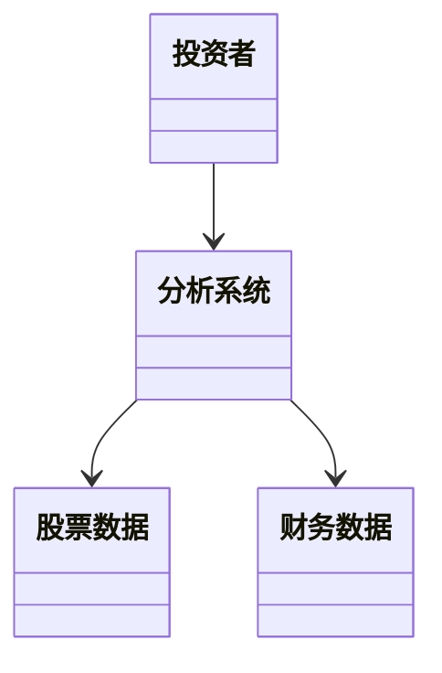

                 


# 格雷厄姆的Special Situations：寻找特殊机会

## 关键词：Special Situations, 价值投资, 格雷厄姆, 低估值股票, 股票分析, 投资策略

## 摘要：本文深入探讨了格雷厄姆提出的Special Situations概念，分析了如何在股票市场中识别和利用这些特殊机会。通过结合投资学与技术分析，本文详细介绍了Special Situations的核心概念、数学模型、算法原理及系统架构设计，并通过实际案例展示了如何在实际投资中应用这些方法。文章旨在帮助读者掌握寻找特殊机会的策略，提升投资决策的准确性。

---

# 第一部分: Special Situations的基本概念

## 第1章: Special Situations的基本概念

### 1.1 格雷厄姆的投资理念

#### 1.1.1 价值投资的定义

价值投资是一种投资策略，强调以低于内在价值的价格购买优质资产。格雷厄姆是该策略的倡导者，他强调通过深入分析公司基本面，寻找市场低估的股票。

#### 1.1.2 格雷厄姆的投资策略

格雷厄姆的投资策略包括：
1. **安全边际**：买入价格远低于内在价值的股票，以降低风险。
2. **分散投资**：通过投资多个标的分散风险。
3. **逆向思维**：在市场恐慌时寻找机会。

#### 1.1.3 Special Situations的定义与特点

Special Situations是指那些被市场忽视或低估的股票，通常具有较高的安全边际。这些股票可能因市场误解或暂时问题而价格被压低，但具备良好的基本面。

### 1.2 Special Situations的分类

#### 1.2.1 市净率低于行业平均的情况

市净率（P/B）是衡量股票价值的重要指标。当市净率低于行业平均水平时，可能意味着股票被低估。

#### 1.2.2 低估值股票的识别标准

识别低估值股票的标准包括：
- 低市盈率（P/E）：市盈率低于行业平均水平。
- 低市净率（P/B）：市净率低于行业平均水平。
- 高股息率：公司派发的股息相对于股价较高。

#### 1.2.3 Special Situations与传统投资的区别

| 特性 | Special Situations | 传统投资 |
|------|---------------------|----------|
| 目标 | 寻找低估股票         | 长期增值 |
| 方法 | 价值分析             | 多样化策略 |
| 风险 | 较高                 | 较低      |

### 1.3 Special Situations的核心优势

Special Situations的核心优势在于其高安全边际和低估值，使得投资者能够在市场低估时买入，获得超额收益。

---

# 第二部分: Special Situations的数学模型与算法

## 第2章: Special Situations的数学模型

### 2.1 核心概念与联系

#### 2.1.1 核心概念原理

Special Situations的分析依赖于以下核心概念：
- 股票的内在价值。
- 市场价格与内在价值的差异。

#### 2.1.2 实例对比分析表格

| 股票名称 | 市盈率 | 行业平均市盈率 | 市净率 | 行业平均市净率 |
|----------|--------|----------------|--------|----------------|
| A公司    | 10     | 15              | 1.5     | 2.0             |

从表格可以看出，A公司的市盈率和市净率均低于行业平均水平，可能是一个Special Situations。

### 2.2 算法原理讲解

#### 2.2.1 核心概念属性特征对比表格

| 属性   | Special Situations | 传统投资 |
|--------|--------------------|----------|
| 风险    | 高                 | 中        |
| 收益    | 高                 | 中        |
| 分析方法 | 价值分析           | 技术分析 |

#### 2.2.2 ER实体关系图架构的 Mermaid 流程图

```mermaid
erDiagram
    actor 投资者
    actor 市场
    actor 公司
    database 股票数据
    database 财务数据
    investor --> 股票数据
    investor --> 财务数据
    company --> 股票数据
    company --> 财务数据
```

---

# 第三部分: Special Situations的系统分析与架构设计

## 第3章: 系统分析与架构设计方案

### 3.1 问题场景介绍

Special Situations的识别需要一个高效的系统，该系统能够实时收集和分析股票数据，帮助投资者快速识别潜在机会。

#### 3.1.1 投资决策的场景分析

投资者需要一个系统来：
1. 实时监控市场数据。
2. 分析股票的估值指标。
3. 提供投资建议。

#### 3.1.2 系统功能设计的领域模型 Mermaid 类图



#### 3.1.3 系统架构设计的 Mermaid 架构图


---

## 第4章: 项目实战

### 4.1 环境安装

安装Python、Pandas、Matplotlib等工具。

### 4.2 系统核心实现源代码

```python
import pandas as pd

def calculate_valuation_ratios(stock_data):
    stock_data['P/E'] = stock_data['Price'] / stock_data['Earnings']
    stock_data['P/B'] = stock_data['Price'] / stock_data['Book Value']
    return stock_data

# 示例数据
data = {
    'Price': [50, 60, 70],
    'Earnings': [10, 15, 20],
    'Book Value': [20, 30, 40]
}
df = pd.DataFrame(data)
result = calculate_valuation_ratios(df)
print(result)
```

### 4.3 代码应用解读与分析

上述代码计算了市盈率和市净率，帮助识别Special Situations。

---

## 第5章: 总结与最佳实践

### 5.1 总结

Special Situations通过价值分析帮助投资者识别低估股票，结合数学模型和系统设计，能够提高投资效率。

### 5.2 最佳实践 tips

1. **持续学习**：关注市场变化，不断优化分析模型。
2. **风险控制**：设置止损点，避免重大损失。
3. **分散投资**：降低单一股票的风险。

---

# 作者：AI天才研究院/AI Genius Institute & 禅与计算机程序设计艺术 /Zen And The Art of Computer Programming

