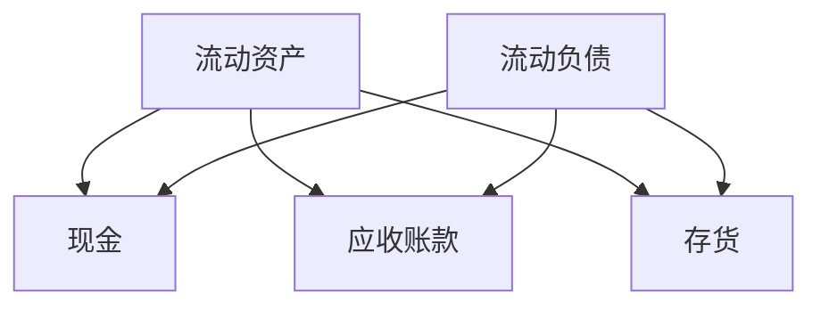
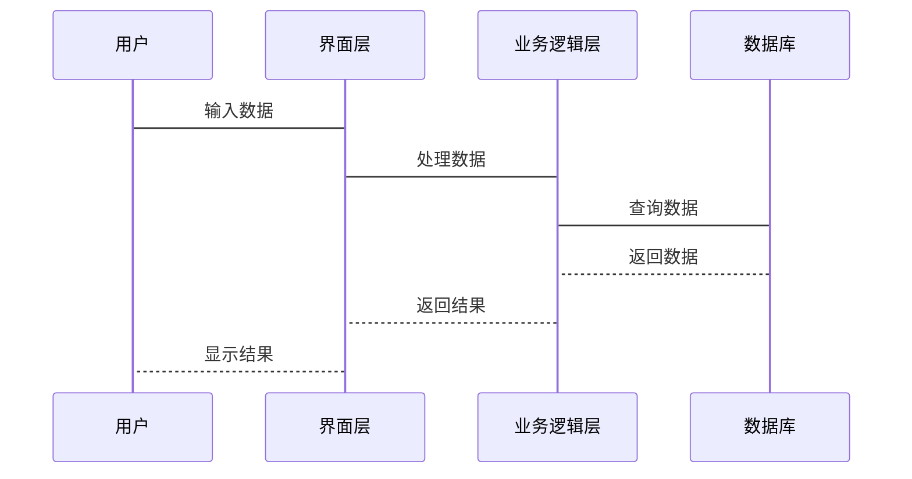

                 


# 格雷厄姆的Working Capital管理：运营效率的重要性

> 关键词：Working Capital，流动资产，流动负债，资金流动性，资金周转率，资金结构优化

> 摘要：本文深入探讨了格雷厄姆的Working Capital管理理论，分析了流动资产和流动负债的管理策略，以及如何通过优化资金流动性、周转率和结构来提升企业运营效率。文章结合实际案例，详细讲解了Working Capital管理的核心概念、算法原理和系统架构设计，并给出了最佳实践建议。

---

## 第一部分：Working Capital管理基础

### 第1章：Working Capital管理概述

#### 1.1 Working Capital的基本概念
##### 1.1.1 Working Capital的定义与组成
Working Capital（营运资本）是指企业在日常经营活动中使用的流动资产与流动负债的差额，反映了企业短期偿债能力和运营效率。其公式为：
$$\text{Working Capital} = \text{流动资产} - \text{流动负债}$$

流动资产包括现金、应收账款、存货等，流动负债包括应付账款、短期借款、应计费用等。

##### 1.1.2 Working Capital在企业运营中的重要性
Working Capital是企业维持日常运营的核心资金，直接关系到企业的偿债能力、资金周转效率和经营稳定性。如果Working Capital管理不当，可能导致企业面临短期债务危机，影响整体运营效率。

##### 1.1.3 Working Capital管理的目标与边界
Working Capital管理的目标是在保证企业偿债能力的同时，最大化资金周转效率，降低资金闲置成本。其边界在于短期经营活动中流动资产和流动负债的管理。

#### 1.2 流动资产与流动负债
##### 1.2.1 流动资产的分类与管理
流动资产主要包括现金、应收账款、存货等。现金管理需要平衡流动性与收益性；应收账款管理需要优化信用政策；存货管理需要控制库存成本与周转效率。

##### 1.2.2 流动负债的分类与管理
流动负债主要包括应付账款、短期借款、应计费用等。流动负债管理需要注重偿债顺序和期限匹配，避免短期债务压力过大。

##### 1.2.3 流动资产与流动负债的平衡
流动资产与流动负债的平衡是Working Capital管理的核心，需要通过流动性分析和周转率分析来优化资金结构。

#### 1.3 Working Capital管理的核心要素
##### 1.3.1 资金流动性分析
资金流动性是指流动资产转化为现金的能力，直接影响企业的偿债能力和运营效率。

##### 1.3.2 资金周转效率
资金周转效率是衡量资金使用效果的重要指标，包括流动资产周转率和流动负债周转率。

##### 1.3.3 资金风险控制
资金风险控制是通过合理配置流动资产和流动负债，降低资金链断裂的风险。

---

### 第2章：Working Capital管理的核心概念与联系

#### 2.1 Working Capital管理的原理
##### 2.1.1 流动性与收益性的平衡
流动性越高，收益性可能越低，反之亦然。需要通过优化资金结构来实现两者的平衡。

##### 2.1.2 资金链管理的关键环节
包括现金管理、应收账款管理、存货管理等，每个环节都直接影响整体资金流动性。

##### 2.1.3 资金结构优化的策略
通过调整流动资产与流动负债的比例，优化资金结构，降低资金成本。

#### 2.2 核心概念对比分析
##### 2.2.1 流动资产与非流动资产的对比
流动资产易于变现，非流动资产难以快速变现，影响企业的短期偿债能力。

##### 2.2.2 流动负债与非流动负债的对比
流动负债需要在一年内偿还，非流动负债期限较长，影响企业的长期偿债能力。

##### 2.2.3 资金流动性与资金周转率的对比
资金流动性关注资产变现能力，资金周转率关注资产使用效率，两者共同影响企业的资金管理效率。

#### 2.3 Working Capital管理的ER实体关系图


---

### 第3章：Working Capital管理的算法原理

#### 3.1 流动比率分析
##### 3.1.1 流动比率的定义
流动比率是衡量企业短期偿债能力的重要指标，公式为：
$$\text{流动比率} = \frac{\text{流动资产}}{\text{流动负债}}$$

##### 3.1.2 流动比率的计算公式
$$\text{流动比率} = \frac{\text{现金} + \text{应收账款} + \text{存货}}{\text{应付账款} + \text{短期借款} + \text{应计费用}}$$

##### 3.1.3 实际案例分析
假设某企业流动资产为500万元，流动负债为300万元，流动比率为：
$$\text{流动比率} = \frac{500}{300} = 1.67$$
说明企业短期偿债能力较强。

#### 3.2 速动比率分析
速动比率是流动比率的进一步细化，公式为：
$$\text{速动比率} = \frac{\text{流动资产} - \text{存货}}{\text{流动负债}}$$

#### 3.3 实际案例分析
假设某企业流动资产为500万元，存货为200万元，流动负债为300万元，速动比率为：
$$\text{速动比率} = \frac{500 - 200}{300} = 1.0$$
说明企业在扣除存货后的流动资产能够覆盖流动负债。

---

## 第四部分：系统分析与架构设计方案

### 第4章：系统架构与功能设计

#### 4.1 问题场景介绍
企业需要实时监控Working Capital的变动，优化资金流动性，提高资金周转效率。

#### 4.2 系统功能设计
##### 4.2.1 数据录入与管理
包括流动资产和流动负债的录入、修改和删除。

##### 4.2.2 流动比率分析
包括流动比率、速动比率等指标的计算和可视化。

##### 4.2.3 资金结构优化
基于分析结果，提供资金结构调整建议。

#### 4.3 系统架构设计
##### 4.3.1 分层架构
```
+-------------------+
|       用户层       |
+-------------------+
|       业务层       |
+-------------------+
|       数据层       |
+-------------------+
```

##### 4.3.2 系统交互流程


---

## 第五部分：项目实战

### 第5章：项目实战与案例分析

#### 5.1 环境安装
需要安装Python、数据库和开发工具。

#### 5.2 核心代码实现
```python
def calculate_working_capital流动资产, 流动负债):
    return 流动资产 - 流动负债

def calculate流动比率(流动资产, 流动负债):
    return流动资产 / 流动负债

# 示例数据
流动资产 = 500  # 单位：万元
流动负债 = 300  # 单位：万元

working_capital = calculate_working_capital(流动资产, 流动负债)
流动比率 = calculate流动比率(流动资产, 流动负债)

print(f"Working Capital: {working_capital}")
print(f"流动比率: {流动比率}")
```

#### 5.3 案例分析
假设某企业流动资产为500万元，流动负债为300万元，计算得出Working Capital为200万元，流动比率为1.67，说明企业短期偿债能力较强。

---

## 第六部分：最佳实践与小结

### 第6章：最佳实践与小结

#### 6.1 最佳实践
##### 6.1.1 定期监控流动资产和流动负债的变化
##### 6.1.2 优化资金结构，降低短期债务风险
##### 6.1.3 提高存货周转率，降低库存成本

#### 6.2 小结
Working Capital管理是企业运营效率的核心，通过优化流动资产和流动负债的管理，可以显著提升企业的资金流动性、周转率和偿债能力。

#### 6.3 注意事项
避免过度依赖短期负债，关注流动资产的周转效率，定期进行财务分析和优化。

#### 6.4 拓展阅读
推荐阅读《财务报表分析》和《企业财务风险管理》等书籍，深入理解Working Capital管理的理论与实践。

---

## 作者简介

作者：AI天才研究院/AI Genius Institute & 禅与计算机程序设计艺术 /Zen And The Art of Computer Programming

---

通过以上内容，我们可以清晰地看到，Working Capital管理是企业运营效率的重要组成部分。格雷厄姆的理论为我们提供了丰富的管理工具和方法，结合实际案例和系统设计，可以帮助企业更好地优化资金管理，提升运营效率。

