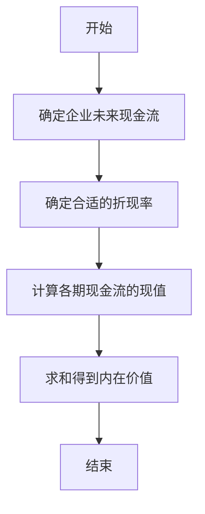
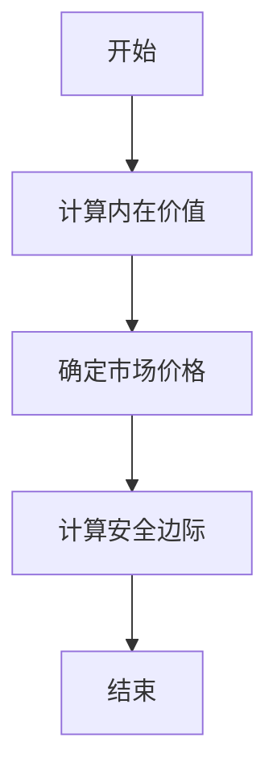
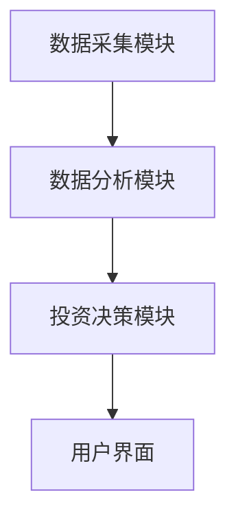

                 


# 格雷厄姆的价值投资传承

## 关键词：
- 价值投资
- 格雷厄姆
- 内在价值
- 安全边际
- 投资系统
- Python代码

## 摘要：
本文深入探讨了格雷厄姆的价值投资理念，分析其核心概念和数学模型，并结合实际案例展示如何利用现代技术传承和应用这些投资原则。文章从价值投资的起源开始，逐步解析内在价值的计算方法、安全边际的数学模型，最后通过系统架构和Python代码实现，展示其在现代投资中的应用。

---

# 第一部分: 价值投资的起源与核心理念

## 第1章: 价值投资的起源与核心概念

### 1.1 格雷厄姆的生平简介
本杰明·格雷厄姆（Benjamin Graham）是20世纪最伟大的投资思想家之一，被誉为“价值投资之父”。他于1894年出生在美国纽约，曾在哥伦比亚大学任教，并培养出包括沃伦·巴菲特在内的众多投资大师。

### 1.2 价值投资的核心理念
格雷厄姆的价值投资理念建立在“安全边际”和“内在价值”两大核心概念之上。他认为，市场先生是不可预测的，投资者应该关注企业的内在价值，而非市场的波动。

#### 1.2.1 内在价值的定义与计算
内在价值是企业未来现金流的现值。计算公式如下：
$$
\text{内在价值} = \sum_{t=1}^{n} \frac{\text{现金流}}{(1 + r)^t}
$$
其中，r是折现率，n是预测的现金流期限。

#### 1.2.2 安全边际的概念与作用
安全边际是市场价格与内在价值之间的差距，旨在降低投资风险。格雷厄姆建议投资者以低于内在价值的价格购买股票。

### 1.3 价值投资的哲学与心理
格雷厄姆强调长期投资和风险管理的重要性。他认为，投资者应避免情绪化决策，保持理性和耐心。

---

# 第二部分: 价值投资的核心原理与数学模型

## 第2章: 价值投资的核心原理

### 2.1 内在价值的计算方法
#### 2.1.1 现金流折现法的原理
现金流折现法是计算内在价值的核心方法。以下是计算步骤的流程图：



#### 2.1.2 格雷厄姆公式
格雷厄姆提出了以下公式来计算内在价值：
$$
\text{内在价值} = \frac{\text{可预测的盈利} \times 4}{\text{长期国债利率} + \text{市场风险溢价}}
$$

### 2.2 安全边际的数学模型
安全边际的计算公式为：
$$
\text{安全边际} = \text{内在价值} - \text{市场价格}
$$
以下是安全边际的计算流程图：



---

# 第三部分: 价值投资的系统分析与架构设计

## 第3章: 价值投资的系统分析

### 3.1 投资系统的需求分析
#### 3.1.1 投资目标的确定
投资者需要明确自己的投资目标，例如追求长期资本增值或稳定的股息收入。

#### 3.1.2 风险承受能力的评估
通过评估投资者的风险承受能力，确定投资组合的构成。

### 3.2 投资系统的功能设计
#### 3.2.1 数据采集模块
负责收集企业的财务数据、行业信息等。

#### 3.2.2 数据分析模块
利用Python对数据进行处理和分析，计算内在价值和安全边际。

#### 3.2.3 投资决策模块
根据分析结果生成投资建议。

### 3.3 投资系统的架构设计
以下是系统的架构图：



---

# 第四部分: 价值投资的项目实战

## 第4章: 价值投资的实战案例

### 4.1 实战环境的安装与配置
#### 4.1.1 数据获取工具的安装
安装Python和Pandas库：
```bash
pip install pandas
```

#### 4.1.2 数据分析工具的配置
安装并配置Jupyter Notebook。

### 4.2 核心算法的实现
#### 4.2.1 内在价值计算的Python代码
```python
import pandas as pd

def calculate_intrinsic_value(cash_flows, discount_rate):
    return sum(cash_flow / (1 + discount_rate)**t for t, cash_flow in enumerate(cash_flows))
```

#### 4.2.2 安全边际计算的Python代码
```python
def calculate_margin_of_safety(intrinsic_value, market_price):
    return intrinsic_value - market_price
```

### 4.3 实战案例分析
以某公司为例，计算其内在价值和安全边际，评估是否值得投资。

---

# 第五部分: 最佳实践与总结

## 第5章: 最佳实践与总结

### 5.1 投资理念的传承
格雷厄姆的价值投资理念至今仍被广泛应用于投资实践中。以下是几点建议：
1. **长期思维**：避免短期市场波动的干扰。
2. **风险管理**：始终关注安全边际。
3. **持续学习**：不断更新投资知识和技能。

### 5.2 小结
格雷厄姆的价值投资理念为现代投资提供了宝贵的遗产。通过数学模型和系统设计，我们可以更好地理解和应用这些理念。

---

# 作者：AI天才研究院/AI Genius Institute & 禅与计算机程序设计艺术 /Zen And The Art of Computer Programming

