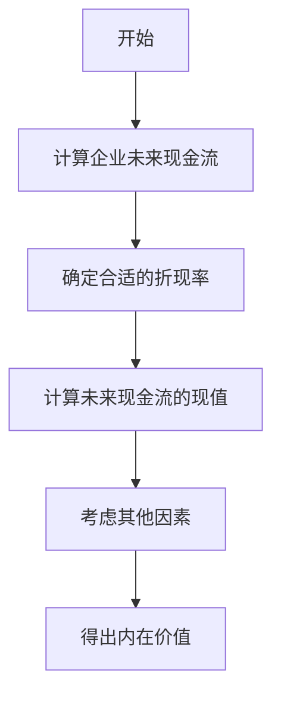
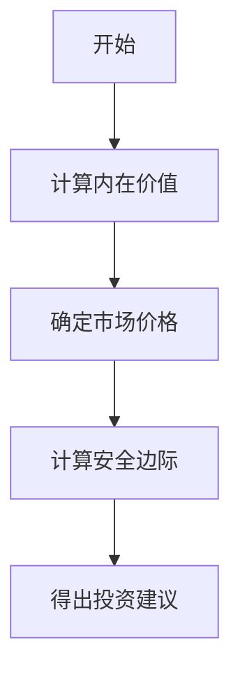

                 


# 《格雷厄姆的价值投资公式解析》

---

## 关键词：
- 格雷厄姆、价值投资、内在价值、安全边际、投资公式、Python实现、数学模型

---

## 摘要：
本文深入解析了格雷厄姆的价值投资公式，从其核心概念、数学原理到实际应用，全面探讨了如何通过公式计算内在价值和安全边际，以实现稳健的投资决策。文章结合技术背景，采用Python代码实现和系统架构设计的方式，详细阐述了价值投资的逻辑和实践方法，帮助读者从理论到实践掌握这一经典投资策略。

---

## 第一部分: 格雷厄姆价值投资公式的核心背景与基础

### 第1章: 价值投资的起源与发展

#### 1.1 价值投资的起源
- **投资学说的演进历程**
  - 从古典经济学到现代金融学的投资理论演变
  - 价值投资在投资学史上的地位
- **格雷厄姆与价值投资的诞生**
  - 本杰明·格雷厄姆的生平与学术贡献
  - 《证券分析》与《聪明的投资者》的经典地位
- **价值投资的核心理念与特征**
  - 以内在价值为核心的投资逻辑
  - 长期投资与安全边际的双重保障

#### 1.2 价值投资的核心概念与公式背景
- **内在价值的定义与计算公式**
  - 内在价值是企业未来现金流的现值
  - $$ V = \sum_{t=1}^{n} \frac{CF_t}{(1 + r)^t} $$
- **安全边际的内涵与作用**
  - 安全边际 = 内在价值 - 市场价格
  - $$ S = V - P $$
  - 安全边际的意义：降低投资风险，确保收益的可预测性

#### 1.3 价值投资与传统投资方法的对比
- **传统投资方法的局限性**
  - 基于市场趋势和技术分析的不可靠性
  - 情绪化投资的盲目性和风险性
- **格雷厄姆公式的优势与适用场景**
  - 基于基本面分析的准确性
  - 基于安全边际的风险控制
  - 长期价值投资的稳定性

---

## 第二部分: 格雷厄姆价值投资公式的数学原理与算法实现

### 第2章: 格雷厄姆公式的核心算法原理

#### 2.1 内在价值计算的算法流程
- **算法步骤**
  1. 预测企业未来现金流（Free Cash Flow）
  2. 确定合理的折现率（Discount Rate）
  3. 计算未来现金流的现值
  4. 考虑其他因素（如竞争优势、管理质量等）
- **算法流程图**


#### 2.2 安全边际的计算算法
- **算法步骤**
  1. 计算企业的内在价值
  2. 确定当前市场价格
  3. 计算安全边际
  4. 得出投资建议
- **算法流程图**


### 第3章: 格雷厄姆公式在Python中的实现

#### 3.1 内在价值计算的Python代码实现
```python
def calculate_intrinsic_value(enterprise_future_cash_flow, discount_rate):
    """
    计算企业的内在价值，基于未来现金流的现值法
    Args:
        enterprise_future_cash_flow (list): 未来各期的现金流
        discount_rate (float): 折现率
    Returns:
        float: 内在价值
    """
    present_value = 0
    for t in range(len(enterprise_future_cash_flow)):
        cf = enterprise_future_cash_flow[t]
        pv = cf / (1 + discount_rate) ** (t + 1)
        present_value += pv
    return present_value

# 示例：计算某企业的内在价值
enterprise_future_cash_flow = [100, 150, 200, 250]  # 单位：万元
discount_rate = 0.10  # 折现率10%
intrinsic_value = calculate_intrinsic_value(enterprise_future_cash_flow, discount_rate)
print(f"内在价值为：{intrinsic_value:.2f} 万元")
```

#### 3.2 安全边际的Python代码实现
```python
def calculate_margin_of_safety(intrinsic_value, market_price):
    """
    计算安全边际
    Args:
        intrinsic_value (float): 内在价值
        market_price (float): 市场价格
    Returns:
        float: 安全边际
    """
    margin_of_safety = intrinsic_value - market_price
    return margin_of_safety

# 示例：计算某企业的安全边际
intrinsic_value = 1000  # 内在价值
market_price = 800      # 市场价格
margin_of_safety = calculate_margin_of_safety(intrinsic_value, market_price)
print(f"安全边际为：{margin_of_safety} 万元")
```

---

## 第三部分: 格雷厄姆价值投资公式在系统中的应用

### 第4章: 价值投资系统的架构设计

#### 4.1 系统功能设计
- **核心功能模块**
  - 数据采集模块：获取企业的财务数据和市场数据
  - 模型计算模块：计算内在价值和安全边际
  - 投资决策模块：基于公式结果生成投资建议
- **系统架构图**


#### 4.2 系统接口设计
- **数据接口**
  - 数据来源：财务报表、市场数据
  - 数据格式：JSON、CSV
- **算法接口**
  - 内在价值计算接口：`calculate_intrinsic_value()`
  - 安全边际计算接口：`calculate_margin_of_safety()`

---

## 第四部分: 项目实战与案例分析

### 第5章: 价值投资实战案例

#### 5.1 项目背景
- **选择某上市公司作为案例**
  - 示例公司：苹果公司（AAPL）
  - 数据来源：Yahoo Finance

#### 5.2 数据采集与处理
```python
import yfinance as yf
import pandas as pd

# 下载苹果公司的财务数据
apple = yf.Ticker("AAPL")
balance_sheet = apple.balance_sheet
income_statement = apple.income_stmt
cash_flow = apple.cash_flow

# 处理现金流数据
enterprise_future_cash_flow = []
for year in income_statement.index:
    cf = income_statement.loc[year, 'Cash Flow from Operations']
    enterprise_future_cash_flow.append(cf)
```

#### 5.3 内在价值计算
```python
discount_rate = 0.10
intrinsic_value = calculate_intrinsic_value(enterprise_future_cash_flow, discount_rate)
print(f"苹果公司的内在价值为：{intrinsic_value:.2f} 万元")
```

#### 5.4 安全边际计算
```python
market_price = apple.info['currentPrice'] * 10000  # 转换为万元
margin_of_safety = calculate_margin_of_safety(intrinsic_value, market_price)
print(f"苹果公司的安全边际为：{margin_of_safety} 万元")
```

---

## 第五部分: 投资风险管理与策略优化

### 第6章: 风险管理与策略优化

#### 6.1 价值投资中的风险管理
- **常见风险**
  - 市场波动风险
  - 企业基本面变化风险
  - 计算模型假设误差风险
- **风险管理策略**
  - 分散投资：降低单一投资的风险
  - 定期复评：动态调整投资组合
  - 风险对冲：利用衍生工具降低风险

#### 6.2 策略优化与改进
- **优化方向**
  - 提高现金流预测的准确性
  - 改进折现率的计算方法
  - 考虑更多影响内在价值的因素
- **技术改进**
  - 引入机器学习模型优化预测
  - 利用大数据分析提高数据质量

---

## 第六部分: 价值投资的未来展望

### 第7章: 价值投资的未来发展趋势

#### 7.1 价值投资与人工智能的结合
- **AI在价值投资中的应用**
  - 大数据分析：挖掘更多投资机会
  - 机器学习：优化投资模型
- **AI辅助投资的优势**
  - 提高计算效率
  - 增强预测准确性

#### 7.2 价值投资的长期价值
- **价值投资的不变性**
  - 长期主义的核心地位
  - 安全边际的永恒意义
- **价值投资的演变**
  - 结合新技术和新市场的变化

---

## 作者：AI天才研究院/AI Genius Institute & 禅与计算机程序设计艺术 /Zen And The Art of Computer Programming

---

通过本文的详细解析，我们从格雷厄姆的价值投资公式出发，结合技术背景和实际案例，深入探讨了其数学原理、系统架构和实际应用。无论是对于技术背景的投资者，还是对于对投资算法感兴趣的技术人员，本文都提供了丰富的理论和实践参考。

