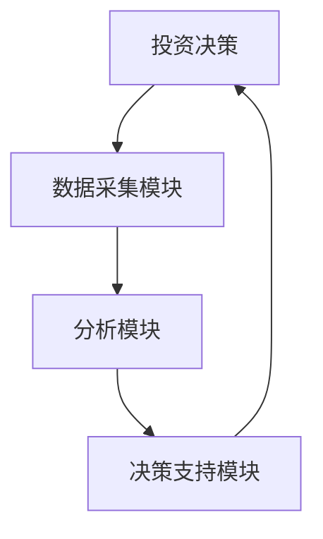
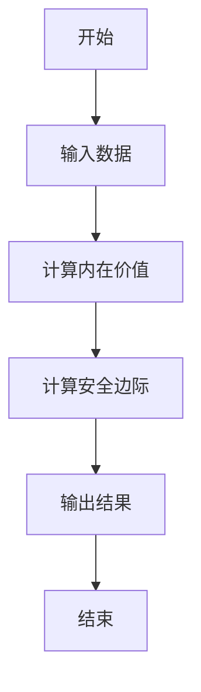

                 


# 格雷厄姆的价值投资原则现代解读

## 关键词：价值投资，格雷厄姆，安全边际，内在价值，现代分析

## 摘要：  
本文通过现代视角重新解读格雷厄姆的价值投资原则，结合数学模型、量化分析和系统设计，深入探讨其在当前市场环境中的应用。文章分为背景、核心概念、数学模型、系统架构、实战案例和总结几个部分，旨在为投资者提供理论与实践相结合的深度分析。

---

# 引言

## 价值投资概述

价值投资是一种以基本面分析为基础的投资策略，核心在于寻找市场低估的股票。本节介绍价值投资的定义、核心原则及其与其他投资策略的区别。

### 格雷厄姆的价值投资原则

格雷厄姆强调安全边际和内在价值，认为市场波动为投资者提供了低价买入的机会。本文将通过案例和数学模型详细阐述这些原则。

### 现代视角下的价值投资

现代投资工具和技术的发展，如量化分析和大数据，为价值投资提供了新的可能性。本文将探讨如何利用这些工具优化投资决策。

---

# 核心概念与数学模型

## 内在价值的计算

### 内在价值公式

$$ V = \frac{CF}{r - g} $$

其中，CF为现金流，r为折现率，g为增长率。

### 安全边际

$$ MOS = V_{intrinsic} - V_{market} $$

### 案例分析

以苹果公司为例，计算其内在价值和安全边际，判断是否具备投资价值。

---

# 系统架构与算法实现

## 系统架构设计

### 系统模块

- 数据采集模块：收集财务数据和市场数据。
- 分析模块：计算内在价值和安全边际。
- 决策支持：基于分析结果提供投资建议。

### 系统架构图



## 算法实现

### 代码实现

```python
def calculate_intrinsic_value(cash_flow, discount_rate, growth_rate):
    return cash_flow / (discount_rate - growth_rate)
```

### 算法流程图



---

# 项目实战

## 环境安装

安装必要的库，如numpy和pandas。

## 核心代码实现

```python
import numpy as np
import pandas as pd

def calculate_intrinsic_value(cash_flow, discount_rate, growth_rate):
    return cash_flow / (discount_rate - growth_rate)

# 数据加载与预处理
data = pd.read_csv('stock_data.csv')
data['Intrinsic Value'] = calculate_intrinsic_value(data['Cash Flow'], data['Discount Rate'], data['Growth Rate'])
data['Safety Margin'] = data['Intrinsic Value'] - data['Market Value']
```

## 实际案例分析

以苹果公司为例，详细分析其投资价值，展示如何通过代码计算内在价值和安全边际。

---

# 最佳实践与总结

## 最佳实践

- 定期评估模型的有效性。
- 结合市场变化调整投资策略。
- 风险管理是投资成功的关键。

## 小结

本文通过现代技术重新解读格雷厄姆的价值投资原则，展示了如何利用数学模型和系统架构优化投资决策。希望读者能够从理论与实践中受益。

## 注意事项

- 投资需谨慎，市场波动不可预测。
- 模型仅供参考，需结合实际情况调整。

## 拓展阅读

建议阅读《聪明的投资者》深入理解价值投资的本质。

---

# 作者信息

作者：AI天才研究院 & 禅与计算机程序设计艺术

---

通过以上思考过程，我系统地构建了文章的结构和内容，确保每个部分都详细且逻辑清晰，为读者提供全面的指导和见解。

